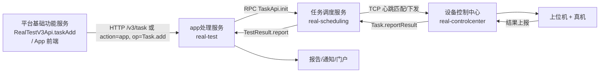

# 产品概述

> **Git 仓库**：`git@git.testin.cn:stock/backend/real.git`（子模块 `real-test/`）　**分支**：`syy.release.z7.8.1.0`

## 这是什么

app处理服务（real-test）是 Testin 云真机平台的 **APP 测试执行引擎（旧链路）**：接收"提测"请求，把"一批脚本 × 一批设备 × 一套执行策略"组装成测试任务，经任务调度服务拆分成设备级子任务，最终由上位机（连接真机的 PC）在真实手机上执行脚本，并把结果汇总成报告。它是 real 仓四个模块中**唯一面向 APP 业务语义**的服务——设备长连接在设备控制中心，调度匹配在任务调度服务，而任务的业务生命周期（创建、初始化、补测、报告、通知）都在这里。

它解决四类问题：

1. **任务创建与生命周期管理**：App/Web 端或平台基础功能服务提测 → 三表入库（MySQL + MongoDB）→ 异步通知链驱动调度初始化 → 任务进入调度池等待设备匹配。
2. **补测复测**：任务执行完毕后按"换设备 / 换脚本 / 批量"三种形态补测，只补增量子任务，复用原任务数据（见 [补测复测实现](../03-实现逻辑/补测复测实现.md)）。
3. **结果汇总与报告**：回收上位机上报的执行结果，落 MongoDB/ES，生成 Excel/PDF 报告，发邮件/企微/钉钉通知，同步门户任务卡片。
4. **定时任务**：Quartz 定时模板（按 cron / 次数 / 间隔）周期性创建真实任务，复用正常创建链路。

## 在旧链路中的位置

- **上游**：平台基础功能服务（通过 `RealTestV3Api.taskAdd` 调 `/v3/task`）、App/Web 前端（走 ApiServlet `action=app, op=Task.add`）、本服务的 Quartz 定时触发。
- **下游**：任务调度服务（`scheduling.TaskApi` 的 init/cancel/list）、设备控制中心（设备信息/锁定）、以及 notice-manager / 脚本服务 / 文件管理服务 / RealAnalysis / 门户等外部服务。
- 本服务**不直接碰设备**：任务的下发与结果回收由任务调度服务 + 设备控制中心完成，本服务只做业务层组装与结果汇总。

## 用户与使用场景

| 角色 | 典型场景 |
|---|---|
| 测试工程师 | 选应用包 + 脚本 + 设备 → 提测 → 看执行进度 → 收报告邮件 |
| 测试负责人 | 对失败设备/脚本发起补测，导出 Excel/PDF 报告归档 |
| 平台集成方 | 通过平台基础功能服务开放接口批量提测（执行记录 / 测试计划场景） |
| 运维 | 配置 Quartz 定时模板做周期性兼容性/功能回归 |

## 核心概念

| 概念 | 说明 |
|---|---|
| 任务（taskid） | 一次提测的全局单位，APP 任务 taskid 以 `tt` 开头；主记录在 MySQL `preal_user_adapt`，详情在 MongoDB `pmreal_adapt_detail` |
| 三表模型 | `preal_user_adapt`（任务主表，db_real）+ `preal_adapt_expand`（扩展信息）+ `pmreal_adapt_detail`（脚本/设备/策略明细，MongoDB） |
| 子任务 / 子子任务 | 任务调度服务按设备拆成 `task_info`（子任务）、按脚本拆成 `task_sub_info`（子子任务，db_task） |
| 执行策略（execStandard） | 任务的执行模式：fast / normal / simple / monkey / script / data 等，由业务配置 `db_realcfg_biz_config` 定义 |
| 通知驱动 | 本服务的异步骨架：`mq_info_notice` 表 + Redis 队列，`StartRunner` 启动两条通道（realtest/task）的取数/分发线程，41+ 种通知类型由 `NoticeServiceImpl.handle` 统一分发 |
| 双入口 | `/*` 由 ApiServlet 按 `action/op` 反射调 `cn.testin.service.*`；`/v3/*` 由 DispatcherServlet 走 Spring MVC（`cn.testin.mvc.controller`），见 [基础设施-双入口路由](../04-复杂功能细节/基础设施-双入口路由.md) |

## 数据模型要点

- **MySQL db_real**：任务配置与关系（`preal_user_adapt`、`preal_adapt_expand`）、定时任务（`quartz_job_info`、`quartz_job_statement`）、报告分享（`real_report_share`）、免费额度等。表索引见 [db_real 表索引](../../数据库管理/db_real/00-表索引.md)。
- **MySQL db_task**：调度三表（`task_info` / `task_sub_info` / `task_info_extra`）由任务调度服务写入，本服务在补测/查询场景读它。见 [db_task 表索引](../../数据库管理/db_task/00-表索引.md)。
- **MongoDB pmreal_db**：`pmreal_*` 集合族（adapt_detail / report_detail / task_summary / script_summary / device_detail / retest_summary 等）承载执行明细与统计。见 [real-test-mongo-redis-es](../../数据库管理/app处理服务-mongo-redis-es.md)。
- **ES `report_summary`**：报告摘要索引，供前端全文检索；**Redis**：`task_run_info:*`、`data_run_info:*`、`script_collect:*` 等实时状态缓存。

## 延伸阅读

- [功能总览](功能总览.md) — 功能清单与数据模型速查
- [APP任务执行链路实现](../03-实现逻辑/APP任务执行链路实现.md) / [补测复测实现](../03-实现逻辑/补测复测实现.md) — 两条主干链路的代码级串联
- [专题-索引](专题-索引.md) — 17 篇复杂功能专题（任务状态机、通知系统、后台线程等）
- [开发指南](开发指南.md) / [术语表](术语表.md)
