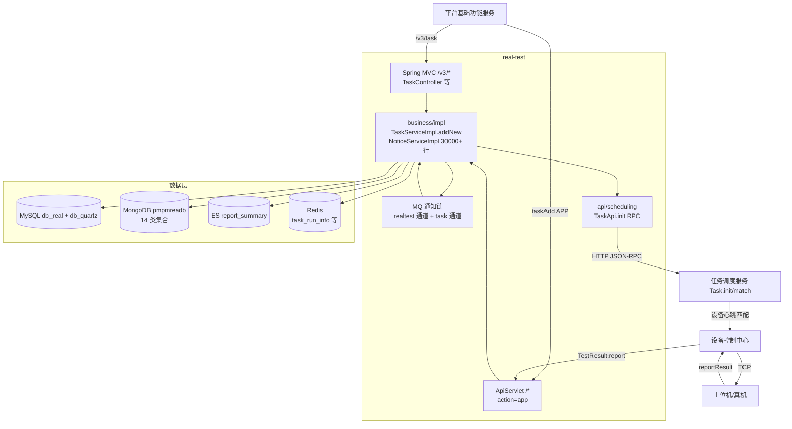

# 总体架构

## 平台定位

app处理服务（real-test）是 Testin 云真机平台**旧链路的 App 端执行入口**，负责 App 测试任务的创建、通知链驱动的异步初始化、依赖任务调度服务的设备匹配，以及最终的结果回收与报告生成。它是 real 仓（云真机大仓）的四个子模块之一，与任务调度服务、设备控制中心、平台配置共享 real-common 公共库。

**新链路对比**：CASE（用例）类任务已迁移到任务管理服务（real-task，自管管道）。app处理服务 + 任务调度服务这条旧链路仍承载 APP/Web/PC（脚本类）任务。

## 系统上下文

## 核心架构决策

### 1. 通知链驱动的异步初始化

这是 app处理服务独有的骨架：任务创建（taskAdd 返回时）并**不直接调调度接口**，而是插 `mq_info_notice` 表，由两条 MQ 通道（realtest 通道 30+ 种通知、task 通道 6 种）异步消费驱动。创建到调度初始化的链路：`TASK_CREATE` → 脚本分派 + 设备分组 → `TASKINIT` → 调 `TaskApi.init`。详见 [APP任务执行链路实现](../03-实现逻辑/APP任务执行链路实现.md)。

### 2. 双入口（V1 + V3）

与平台基础功能服务类似的双入口架构。老入口 `action=app, op=Task.add` 走 ApiServlet 反射，新入口 `POST /v3/task` 走 Spring MVC。两条路径最终都落三表（`pmreal_adapt_detail` → `preal_adapt_expand` → `preal_user_adapt`）并通过通知链驱动后续。

### 3. MongoDB 分片存储（14 类集合）

任务执行的核心数据（任务详情、报告、脚本运行记录、设备运行记录等）都在 MongoDB `pmpmreadb` 库，MySQL `db_real` 仅存适配任务主表（`preal_user_adapt` / `preal_adapt_expand`）。ES `report_summary` 用于前端全文检索报告摘要。

### 4. 通知链失败重试与降级

`NoticeServiceImpl.handle` 按结果码更新 `mq_info_notice` 状态，失败重试超 10 次且超 1 小时置 INVALID 放弃。两条 MQ 通道线程池隔离（task 通道 30 线程、realtest 通道 100 线程），TASKINIT 阻塞不会拖垮报告类通知。

## 代码工程一览

| 工程 | 技术栈 | 产物 | 说明 |
|---|---|---|---|
| `real`（大仓） | Java 1.8 / Spring Boot 2.x / Undertow / MyBatis / MongoDB / ES | jar（按模块分目录） | 4 个子模块共享 real-common，按包路径隔离 |

## 延伸阅读

- [存储总览](00-存储总览.md) — 8 个 MySQL 库 + MongoDB + ES + Redis
- [APP任务执行链路实现](../03-实现逻辑/APP任务执行链路实现.md)
- [real 云真机公共总览](../04-复杂功能细节/公共-real仓总览.md)
- [跨模块：测试计划执行](../../跨模块链路/端到端-测试计划执行.md)
