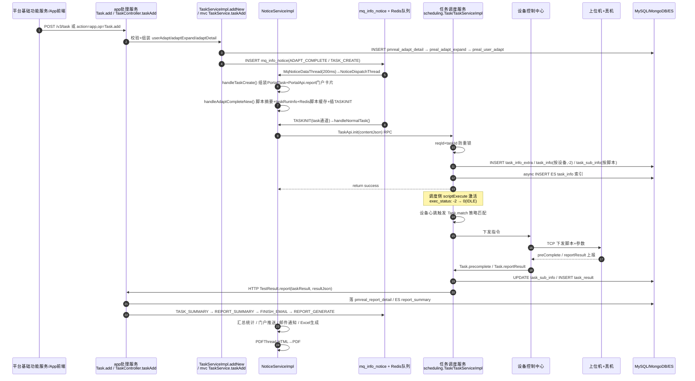

# APP任务执行链路实现

> 本文串联 app处理服务（real-test）最核心的主干：taskAdd 建任务 → 通知链驱动 Task.init → 调度匹配 → 上位机执行 → 结果回收报告。每一步只写主干代码依据，**状态机、通知系统、匹配下发等细节一律链接到 04 专题**，不重复展开。

## 一句话链路

提测请求（双入口）→ 三表入库（`pmreal_adapt_detail` / `preal_adapt_expand` / `preal_user_adapt`）→ `ADAPT_COMPLETE` + `TASK_CREATE` 通知 → `handleTaskCreate` 上报门户卡片 / `handleAdaptCompleteNew` 生成脚本执行计划写 Redis 并插 `TASKINIT` 通知 → `handleNormalTask` 调任务调度服务 `TaskApi.init` → `task_info/task_sub_info` 拆分入库（exec_status=-2）→ 调度侧 `scriptExecute` 激活（-2→0）→ 设备心跳触发 `Task.match` → 设备控制中心 TCP 下发 → 上位机执行 → 结果经 `Task.reportResult` 回传 → `TestResult.report` 落 MongoDB/ES → `TASK_SUMMARY` / `REPORT_SUMMARY` / `FINISH_EMAIL` / `REPORT_GENERATE` 通知收尾。

## 全链路时序图

## 主干分段

### 1. 创建入口（双入口，殊途同归）

| 入口 | 位置 | 说明 |
|---|---|---|
| ApiServlet `op=Task.add` | `real-test/src/main/java/cn/testin/service/app/Task.java` | 老入口，`verifyParams` 校验 eid/projectid/userid/bizCode/devices/execStandard，组装三表对象后调 `itaskservice.addNew` |
| MVC `POST /v3/task` | `real-test/src/main/java/cn/testin/mvc/controller/TaskController.java` → `real-test/src/main/java/cn/testin/mvc/service/TaskService.java` | 新入口（平台基础功能服务 RealTestV3Api.taskAdd 走这里），DTO 化入参，自行做三表入库与通知发送 |

两条路径最终落库语义一致（对比 `TaskServiceImpl.java` 与 `TaskService.java`）：**MongoDB `pmreal_adapt_detail` 先入 → `preal_adapt_expand` → `preal_user_adapt`**，然后插 `ADAPT_COMPLETE`、`TASK_CREATE` 等通知（`TaskServiceImpl.java`）。注意**创建时并不直接调调度接口**，调度初始化完全由通知链异步驱动。

模板保存（`templateFlag`）、定时任务（`quartz>0` 写 `quartz_job_info`）、测试计划重测（`executeRecordTaskId`）都在 addNew 内提前分流（`TaskServiceImpl.java`），见 [功能总览](功能总览.md)。

### 2. 通知链驱动初始化（本服务独有骨架）

启动时 `StartRunner`（`real-test/src/main/java/cn/testin/config/StartRunner.java`）拉起两条 MQ 通道：

- `realtest` 通道：适配/报告类 30+ 种通知，`MqNoticeDataThread` 每 200ms 扫 `mq_info_notice` 表 → `NoticeDispatchThread` 分发；
- `task` 通道：任务初始化类 6 种通知（TASKINIT / RETEST_INIT / SCRIPT_RETEST_INIT 等）。

所有通知最终进 `NoticeServiceImpl.handle` 的类型分发表（`real-test/src/main/java/cn/testin/business/impl/NoticeServiceImpl.java`）。创建链路依次消费：

1. **TASK_CREATE** → `handleTaskCreate`（NoticeServiceImpl.java）：读 expand/detail/userAdapt，组装 `PortalTask` 对象，调 `PortalApi.report` 上报门户任务卡片（拨测 bizCode 另插 REPORT_STAT）。注意：脚本分派/设备分组不在这里做。
2. **ADAPT_COMPLETE** → `handleAdaptCompleteNew`（NoticeServiceImpl.java）：脚本摘要初始化（`IScriptSummaryService.initNew`）→ 按设备/脚本批量生成 `PmrealTaskRunInfo`（数据驱动则生成 DataRunInfo）→ 脚本执行计划写 Redis 缓存（key `taskid_Script_content`，TASKINIT 有效期）→ 插 TASKINIT 通知（checkApp=wait 时改插 APP_DETECT）。详见专题 [核心链路-任务创建](../04-复杂功能细节/核心链路-任务创建.md)。
3. **TASKINIT**（task 通道）→ `handleNormalTask`（NoticeServiceImpl.java）：校验 userAdapt 未取消/checkApp 有效 → 从 Redis 取回脚本分派内容组装 `contentJson`（resourceType=app、reqId、devices、scripts、`recoverScriptInfos` 自愈脚本信息）→ 调 `taskapi.init`（**NoticeServiceImpl.java**，bean 名 `scheduling.TaskApi`，`ApiUtil.doPress(RealScheduling, action=scheduling, op=Task.init)`）→ 成功后置 userAdapt.execStatus=testing，插 TASK_SUMMARY + REPORT_SUMMARY。

### 3. 调度初始化与激活（任务调度服务侧，简述）

`TaskApi.init`（`real-test/src/main/java/cn/testin/api/scheduling/TaskApi.java`）经 RPC 到任务调度服务 `Task.init`（`real-scheduling/src/main/java/cn/testin/service/scheduling/Task.java`）：

- reqId+taskId Redis 防重锁 → `task_info_extra` + 按设备拆 `task_info`（exec_status=-2 PENDING_SCHEDULING）+ 按脚本拆 `task_sub_info` → 异步写 ES `task_info` 索引；
- 随后调度侧 `scriptExecute` 把 exec_status 置 0（IDLE）进入调度池。**-2→0 必须经通知激活**，防止过早被匹配。

状态枚举与流转矩阵见专题 [核心链路-任务状态机](../04-复杂功能细节/核心链路-任务状态机.md)，init 技术细节见 [核心链路-任务初始化](../04-复杂功能细节/核心链路-任务初始化.md)。

### 4. 匹配与下发（任务调度服务 + 设备控制中心侧，简述）

设备心跳触发 `Task.match`（`real-scheduling/src/main/java/cn/testin/service/scheduling/Task.java`）策略匹配 → exec_status 0→1 → 设备控制中心经 MINA TCP 长连接下发脚本与参数到上位机执行。本服务不参与这一段，匹配与下发的细节见任务调度服务/设备控制中心的专题文档（索引见 [专题-索引](专题-索引.md)）。

### 5. 结果回收与报告（回到本服务）

1. 上位机上报 `preComplete` / `reportResult` → 设备控制中心转任务调度服务：`task_sub_info` 置 2（PRE_FINISH）→ 3（FINISH），结果 JSON 入 `task_result`；
2. 任务调度服务 HTTP 回调本服务 **`TestResult.report`**（`real-test/src/main/java/cn/testin/service/app/TestResult.java`）/ 过程数据走 `TestProcess.report`（`real-test/src/main/java/cn/testin/service/app/TestProcess.java`）；
3. 本服务落 `pmreal_report_detail`、推 ES `report_summary`，然后靠通知收尾：`TASK_SUMMARY`（汇总统计）→ `REPORT_SUMMARY`（`handleReportSummary`，NoticeServiceImpl.java，门户推送）→ `FINISH_EMAIL`（`handleEmailNotice`）→ `REPORT_GENERATE`（`handleGenerateReport`，Excel 异步生成）；
4. PDF 由常驻线程 `PDFThread`（`real-test/src/main/java/cn/testin/schedule/pdf/PDFThread.java`，StartRunner.java 启动）做 HTML→PDF。

完整细节见专题 [核心链路-结果回收与报告](../04-复杂功能细节/核心链路-结果回收与报告.md) / [核心链路-结果回收与报告通知](../04-复杂功能细节/核心链路-结果回收与报告通知.md) / [通知系统-NoticeServiceImpl详细流程](../04-复杂功能细节/通知系统-NoticeServiceImpl详细流程.md)。

## 关键代码位置表

| 环节 | 类 / 方法 | 位置 |
|---|---|---|
| 老入口创建 | Task.add | real-test/src/main/java/cn/testin/service/app/Task.java |
| 新入口创建 | TaskController.taskAdd / TaskService.taskAdd | real-test/src/main/java/cn/testin/mvc/controller/TaskController.java / real-test/src/main/java/cn/testin/mvc/service/TaskService.java |
| 业务层创建 | TaskServiceImpl.addNew | real-test/src/main/java/cn/testin/business/impl/TaskServiceImpl.java |
| 三表入库 | addNew 尾部 / mvc TaskService | real-test/.../TaskServiceImpl.java / real-test/.../mvc/service/TaskService.java |
| TASK_CREATE 通知插入 | TaskServiceImpl | real-test/.../business/impl/TaskServiceImpl.java |
| MQ 线程启动 | StartRunner.run | real-test/src/main/java/cn/testin/config/StartRunner.java |
| 通知分发总表 | NoticeServiceImpl.handle | real-test/src/main/java/cn/testin/business/impl/NoticeServiceImpl.java |
| TASK_CREATE 处理 | NoticeServiceImpl.handleTaskCreate | real-test/.../NoticeServiceImpl.java |
| TASKINIT 处理+调度init | NoticeServiceImpl.handleNormalTask → taskapi.init | real-test/.../NoticeServiceImpl.java |
| 调度初始化 RPC | TaskApi.init | real-test/src/main/java/cn/testin/api/scheduling/TaskApi.java |
| 调度侧入口 | Task.init / Task.match | real-scheduling/src/main/java/cn/testin/service/scheduling/Task.java |
| 结果接收 | TestResult.report / TestProcess.report | real-test/src/main/java/cn/testin/service/app/TestResult.java / .../app/TestProcess.java |
| 报告汇总 | NoticeServiceImpl.handleReportSummary | real-test/.../NoticeServiceImpl.java |
| Excel 报告 | Excel.create/generate + handleGenerateReport | real-test/src/main/java/cn/testin/service/report/Excel.java / real-test/.../NoticeServiceImpl.java |
| 取消 | Task.cancel / scheduling.TaskApi.cancel | real-test/.../service/app/Task.java / real-test/src/main/java/cn/testin/api/scheduling/TaskApi.java |
| 定时触发 | QuartzJob.execute | real-test/src/main/java/cn/testin/quartz/QuartzJob.java |

## 注意事项与坑

1. **创建与调度初始化是异步解耦的**：taskAdd 返回时 `task_info` 可能还没建——它要等 TASK_CREATE → TASKINIT 两条通知消费完才由 `handleNormalTask` 调 `taskapi.init`（NoticeServiceImpl.java）。查"刚创建任务为什么没子任务"先查 `mq_info_notice` 堆积。
2. **两条 MQ 通道职责不同**：`task` 通道（30 线程上限，StartRunner.java）专跑任务初始化类通知，`realtest` 通道（100 线程）跑其余；TASKINIT 堵住不会拖垮报告类通知，反之亦然。
3. **通知处理失败会重试**：`handle` 尾部按结果码更新 `mq_info_notice` 状态，失败重试超 10 次且超过 1 小时置 INVALID（NoticeServiceImpl.java）——排障时先看这张表的 status/execNum。
4. **取消竞争**：`handleNormalTask` 在 init 前后各校验一次 userAdapt 的 cancelled/checkApp 状态（NoticeServiceImpl.java），因为 init RPC 耗时长，期间用户可能取消任务。
5. **脚本分派内容走 Redis 不走进通知表**：TASKINIT 通知 content 只存 redisKey（`TaskServiceImpl.addInitNotice`，real-test/.../TaskServiceImpl.java），大 JSON 放 Redis 并按 TASKINIT 有效期过期——Redis 清库会导致初始化拿不到脚本列表。

## 延伸阅读

- [补测复测实现](补测复测实现.md) — 补测主干
- [核心链路-任务创建](../04-复杂功能细节/核心链路-任务创建.md) / [核心链路-任务初始化](../04-复杂功能细节/核心链路-任务初始化.md) / [核心链路-任务状态机](../04-复杂功能细节/核心链路-任务状态机.md) — 各阶段专题
- [核心链路-结果回收与报告](../04-复杂功能细节/核心链路-结果回收与报告.md) / [通知系统-总览](../04-复杂功能细节/通知系统-总览.md) / [基础设施-后台线程全景](../04-复杂功能细节/基础设施-后台线程全景.md)
- [端到端-测试计划执行](../../跨模块链路/端到端-测试计划执行.md) — 跨模块视角
