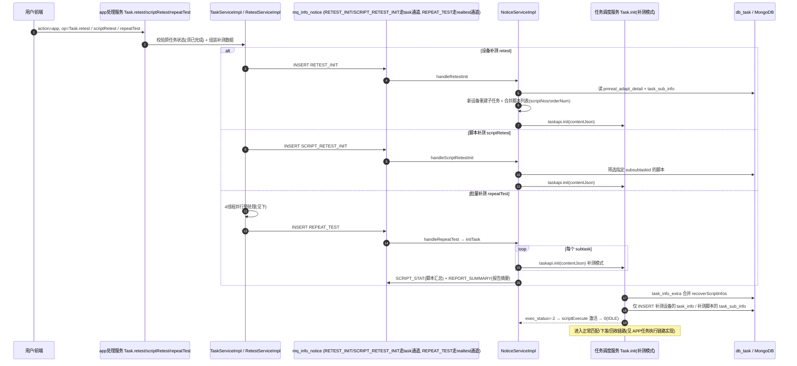

# 补测复测实现

> 本文串联补测复测的主干代码：retest / scriptRetest / repeatTest 三形态入口 → 通知链（RETEST_INIT / SCRIPT_RETEST_INIT / REPEAT_TEST）→ 复用任务调度服务 Task.init（补测模式）→ recoverScriptInfos 合并 + retestMark 标记 → 激活进入调度。每种形态的 handler 级细节见专题 [核心链路-补测复测](../04-复杂功能细节/核心链路-补测复测.md) 与 [通知系统-NoticeServiceImpl详细流程](../04-复杂功能细节/通知系统-NoticeServiceImpl详细流程.md)。

## 三形态对比

| 形态 | 入口 op | 业务层 | 通知类型 | 补测粒度 |
|---|---|---|---|---|
| 设备补测 | `Task.retest`（`real-test/src/main/java/cn/testin/service/app/Task.java`） | `TaskServiceImpl.retest`（`real-test/src/main/java/cn/testin/business/impl/TaskServiceImpl.java`） | RETEST_INIT | 换设备，原脚本重跑 |
| 脚本补测 | `Task.scriptRetest` | `RetestServiceImpl.scriptRetest`（`real-test/src/main/java/cn/testin/business/impl/RetestServiceImpl.java`） | SCRIPT_RETEST_INIT | 指定子子任务（脚本）重跑 |
| 批量补测 | `Task.repeatTest` | `TaskServiceImpl.repeatTest`（`real-test/src/main/java/cn/testin/business/impl/TaskServiceImpl.java`） | REPEAT_TEST | 设备 + 脚本任意组合 |

共同设计：**三种形态都不新建任务**，只往原任务上补增量子任务；调度侧入库复用 `TaskApi.init`（taskType=2 补测模式走合并分支），原任务数据保留不变。

## 主干流程

## 分段说明

### 1. 入口与校验

- 设备补测 `TaskServiceImpl.retest`（TaskServiceImpl.java）：查 `preal_user_adapt` + `pmreal_adapt_detail`，**要求子任务已到终态**才能补测，然后构建"新设备 + 原脚本"的补测数据。
- 脚本补测 `RetestServiceImpl.scriptRetest`（RetestServiceImpl.java）：按入参 `subsubtasks[]` 过滤出要重跑的子子任务，构建只含选中脚本的 reqJson。
- 批量补测 `TaskServiceImpl.repeatTest`（TaskServiceImpl.java）：逐个 subtask 调 `taskapi.list` 查执行状态，校验所有 deviceRunInfo/scriptRunInfo 均为终态，`analysisRetestDevices()` 分析补测设备；用 `LOCK(TaskRepeatTest, taskid)` 业务锁串行化同一任务的批量补测。

### 2. repeatTest 的 4 线程并行预处理

`execMaintainAndRunRetestPreproccess` 内用 `Executors.newFixedThreadPool(4)` 并行执行 4 个 FutureTask（**TaskServiceImpl.java**）：

| 线程任务 | 作用 | 位置 |
|---|---|---|
| `addRetestMark` | 给被补测的 reportDetail/runInfo 打 `retestMark=1` 标记 | TaskServiceImpl.java |
| `maintainTestParams` | 参数来源中新旧设备 ID 替换，更新 `pmreal_adapt_detail.params` | TaskServiceImpl.java |
| `maintainTestDevice` | 原设备标记 retest、已补测设备去标记、新设备追加，更新 devices | TaskServiceImpl.java |
| `runningMark2Runinfo` | 子任务级标注执行中（retestMark=1 写 taskRunInfo） |  |

四个任务全部 `get()` 阻塞等齐后才 `maintain()` 维护报告数据，并插入 `REPEAT_TEST` 通知。**并行的是 DB 写，整体仍是同步阻塞**，补测接口响应不慢的前提是这 4 个写不超时。

### 3. 通知 handler 与调度入库

| 通知 | handler | 调 taskapi.init 位置 |
|---|---|---|
| RETEST_INIT | `handleRetestInit`（NoticeServiceImpl.java） | real-test/.../NoticeServiceImpl.java |
| SCRIPT_RETEST_INIT | `handleScriptRetestInit` |  |
| REPEAT_TEST | `handleRepeatTest`→ `initTask` | （initTask 内逐 subtask 同步 RPC） |

三者最终都把 `contentJson`（含 newDevices/newScripts/retestMark 等）交给 `scheduling.TaskApi` bean 的 `init`。`handleRepeatTest` 走 `initTask` 全链路：逐 subtask 同步调 init，每个补测脚本发 `SCRIPT_STAT` 重新统计 `pmreal_script_summary`，全部完成后发 `REPORT_SUMMARY` 生成报告摘要并推门户。

### 4. recoverScriptInfos 合并（调度侧）

补测模式（taskType=2）下任务调度服务的 `Task.init` 不重建 `task_info_extra`，而是**合并自愈脚本信息**：

- 读取已有 `task_info_extra.recoverScriptInfos` 并解析（`real-scheduling/src/main/java/cn/testin/business/impl/TaskServiceImpl.java`）；
- 新 init 请求带的 `recoverScriptInfos` 写入 extra；
- 正常创建是 DELETE+INSERT extra，补测是**合并更新**，`task_info`/`task_sub_info` 也只 INSERT 补测增量。字段定义见 `real-scheduling/src/main/java/cn/testin/pojo/task/DbTaskInfoExtra.java`。

### 5. retestMark 标记

`retestMark` 是补测贯穿报告与运行态的标记位（常量在 `real-test/src/main/java/cn/testin/common/ReportDetailConstant.java`）：

- 打标：repeatTest 预处理把被补测的明细行/运行信息置 `retestMark=1`（见上表），补测入口 contentJson 也带 retestMark 传给调度侧；
- 报告展示：`pmreal_report_detail` 按 retestMark 区分原执行与补测结果，`IReportService.resetToRetestMark`（`real-test/src/main/java/cn/testin/business/interfaces/IReportService.java`）支持人工重置标记；
- 补测摘要落 `pmreal_retest_summary`（见 [real-test-mongo-redis-es](../../数据库管理/app处理服务-mongo-redis-es.md)）。

## 关键代码位置表

| 环节 | 类 / 方法 | 位置 |
|---|---|---|
| 设备补测入口 | Task.retest | real-test/src/main/java/cn/testin/service/app/Task.java |
| 脚本补测入口 | Task.scriptRetest | real-test/src/main/java/cn/testin/service/app/Task.java |
| 批量补测入口 | Task.repeatTest | real-test/src/main/java/cn/testin/service/app/Task.java |
| 设备补测业务 | TaskServiceImpl.retest | real-test/src/main/java/cn/testin/business/impl/TaskServiceImpl.java |
| 脚本补测业务 | RetestServiceImpl.scriptRetest | real-test/src/main/java/cn/testin/business/impl/RetestServiceImpl.java |
| 批量补测业务 | TaskServiceImpl.repeatTest | real-test/src/main/java/cn/testin/business/impl/TaskServiceImpl.java |
| 4线程预处理 | newFixedThreadPool(4) + 4 FutureTask | real-test/.../TaskServiceImpl.java |
| REPEAT_TEST 通知插入 | addNotice(REPEAT_TEST) | real-test/.../TaskServiceImpl.java |
| RETEST_INIT handler | handleRetestInit → taskapi.init | real-test/.../NoticeServiceImpl.java |
| SCRIPT_RETEST_INIT handler | handleScriptRetestInit → taskapi.init |  |
| REPEAT_TEST handler | handleRepeatTest → initTask → taskapi.init |  /  /  |
| recoverScriptInfos 合并 | scheduling TaskServiceImpl | real-scheduling/src/main/java/cn/testin/business/impl/TaskServiceImpl.java |
| retestMark 常量 | ReportDetailConstant.RE_TEST_MARK | real-test/src/main/java/cn/testin/common/ReportDetailConstant.java |
| 通知分发注册 | task 通道 6 种类型 | real-test/src/main/java/cn/testin/config/StartRunner.java |

## 注意事项与坑

1. **补测是"增量入库"不是"重跑任务"**：只 INSERT 补测设备/脚本的新子任务，原 `task_info`/`task_sub_info` 不动；taskType=2 走合并分支，误按正常创建（taskType=1）会 DELETE 掉 extra。
2. **换设备必须换参数来源**：`maintainTestParams` 把参数分配策略里的旧 deviceid 替换成新 deviceid（TaskServiceImpl.java），漏掉会导致数据源参数发不到新设备。
3. **补测通知分属两条通道**（StartRunner.java）：`RETEST_INIT`、`SCRIPT_RETEST_INIT` 挂在 task 通道（与 TASKINIT 共用 30 线程分发池），而 `REPEAT_TEST`（批量补测）挂在 realtest 通道（100 线程）。设备/脚本补测风暴才可能阻塞正常任务初始化，批量补测不会。
4. **SCRIPT_STAT 去重**：仅对未统计过的 subtask 发脚本汇总通知，已完成统计的不重复发（见专题 [核心链路-补测复测](../04-复杂功能细节/核心链路-补测复测.md) 核心发现）。
5. **补测后的回收链路完全复用正常链路**：补测子任务激活后与正常任务一样走 match → 下发 → reportResult → TestResult.report，报告侧靠 retestMark 区分批次。

## 延伸阅读

- [APP任务执行链路实现](APP任务执行链路实现.md) — 正常创建与执行主干
- [核心链路-补测复测](../04-复杂功能细节/核心链路-补测复测.md) — handler 级流程图、4 异步通知明细
- [通知系统-NoticeServiceImpl详细流程](../04-复杂功能细节/通知系统-NoticeServiceImpl详细流程.md) — handleRetestInit / handleScriptRetestInit / handleRepeatTest 详图
- [核心链路-任务状态机](../04-复杂功能细节/核心链路-任务状态机.md) — 补测子任务状态流转
- [端到端-补测](../../跨模块链路/端到端-补测.md) — 跨模块视角
