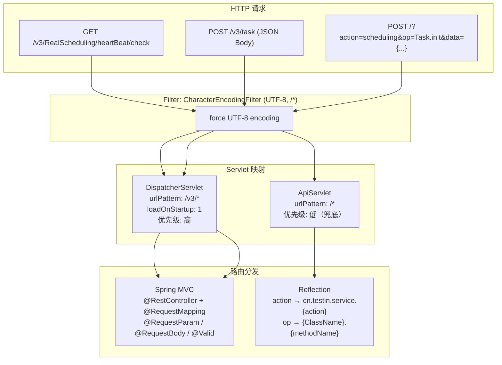
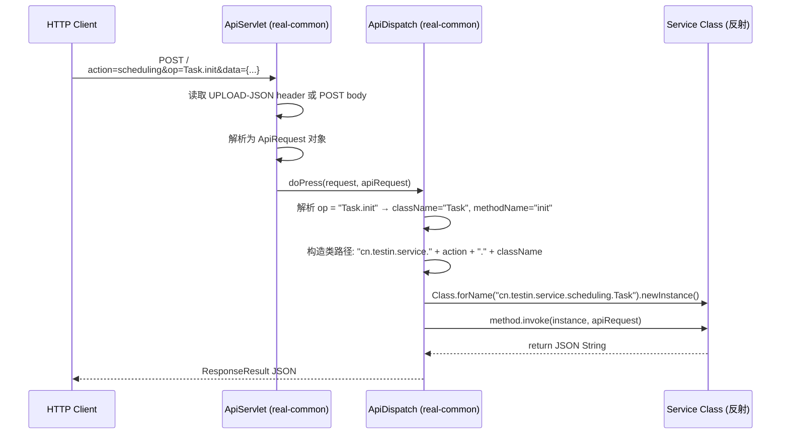

# 基础设施-双入口路由

> real 项目 4 个模块同时暴露两套 HTTP 入口：传统的 `ApiServlet` action/op 反射路由（`/*`）和标准的 Spring MVC `DispatcherServlet`（`/v3/*`）。双入口在同一进程内并存，但路由规则完全不同。

## 总览



## 四模块双入口对比

| 维度 | 平台配置 | 设备控制中心 | 任务调度服务 | app处理服务 |
|------|----------|-------------------|-----------------|-----------|
| DispatcherServlet 注册 | inject Bean + 改 mappings | inject Bean + 改 mappings | new ServletRegistrationBean | new ServletRegistrationBean |
| ApiServlet Bean 名 | `dispatcherV1Servlet` | `openapiServlet` | `openapiServlet` | `openapiServlet` |
| `@EnableWebMvc` | 无 | 无 | 有 | 有 |
| `@MapperScan` | 无 | 有 | 有 | 无 |
| WebConfig | 无 | 有 | 无 | 有 |
| 额外入口 | — | TCP MINA (port 8000) | — | — |

> real-portal 仅注册 ApiServlet，无 `/v3/*` DispatcherServlet。

## 入口一：ApiServlet（/* 反射路由）

### 注册方式

4 个模块的 `Boot.java` 中均通过以下方式注册：

```java
@Bean
public ServletRegistrationBean openapiServlet() {
    return new ServletRegistrationBean(new ApiServlet(), "/*");
}
```

`ApiServlet` 类来自公共包 `cn.testin.common.service.ApiServlet`（real-common 模块），通过 `ServletRegistrationBean` 注册到 `/*`，作为兜底路由。

### 路由原理



### action → 包路径映射

基路径：`cn.testin.service.{action}`（可通过 `service.path` 配置覆盖）

| 模块 | action 值 | 包路径 | 服务类数量 |
|------|-----------|--------|-----------|
| 平台配置 | cfg, group, mcfg, portal, scfg | cn.testin.service.{cfg, group, mcfg, portal, scfg} | 32 |
| 设备控制中心 | app, appointment, bean, cabinet, client, control, db, device, deviceGroup, monitor, pc, pcap | cn.testin.service.{app, ...} | 32 |
| 任务调度服务 | cross, scheduling | cn.testin.service.{cross, scheduling} | 3 |
| app处理服务 | analysis, app, free, report, script, utils | cn.testin.service.{analysis, ...} | 22 |

特殊映射：`action=pc` → `cn.testin.pc.service`（硬编码在 `ApiDispatch.servicePathMap` 中）

### 关键约定

| 规则 | 说明 |
|------|------|
| op 格式 | `ClassName.methodName`，用 `.` 分隔 |
| 方法签名 | `public String xxx(ApiRequest)` 或 `public String xxx(HttpServletRequest, ApiRequest)` |
| 类实例化 | `Class.forName().newInstance()`（非 Spring Bean） |
| 转发机制 | `ForwardConfigUtil` 检查 `forward.data.json`，可改写 action/op 或转发到外部 OpenAPI |
| 拦截器 | `@ServiceInterceptor(names={...})` 注解，通过 `service.interceptor.<name>` 配置 |
| 内置 action | `common.HeartBeat.keepalive` 和 `common.System.currentTimeMillis` 直接返回 |

### 实际请求示例

```
POST / HTTP/1.1
Content-Type: application/x-www-form-urlencoded
UPLOAD-JSON: {"action":"scheduling","op":"Task.init","data":{"taskid":"xxx",...}}

或直接 POST body:
{"action":"scheduling","op":"Task.init","timestamp","data":{...}}
```

## 入口二：DispatcherServlet（/v3/* Spring MVC）

### 注册方式

4 个模块使用两种略有不同的注册方式：

**方式A（平台配置 / 设备控制中心）**—— 注入 Boot 自动配置的 Bean 并修改映射：
```java
@Bean
public ServletRegistrationBean dispatcherMvcServlet(
        ServletRegistrationBean dispatcherServletRegistration) {
    List<String> urlMappings = new ArrayList<>();
    urlMappings.add("/v3/*");
    dispatcherServletRegistration.setUrlMappings(urlMappings);
    dispatcherServletRegistration.setLoadOnStartup(1);
    return dispatcherServletRegistration;
}
```

**方式B（任务调度服务 / app处理服务）**—— 注入 DispatcherServlet 新建注册：
```java
@Bean
public ServletRegistrationBean<DispatcherServlet> dispatcherMvcServlet(
        DispatcherServlet dispatcherServlet) {
    ServletRegistrationBean<DispatcherServlet> servletRegistrationBean =
        new ServletRegistrationBean<>(dispatcherServlet, "/v3/*");
    servletRegistrationBean.setLoadOnStartup(1);
    return servletRegistrationBean;
}
```

两种方式等效，`loadOnStartup=1` 确保 DispatcherServlet 优先于 ApiServlet 初始化。

### Controller 分布

| 模块 | Controller 数量 | 路径前缀示例 |
|------|----------------|-------------|
| 平台配置 | ~12 | `/env`, `/network`, `/ucomId`, `/errorCause` |
| 设备控制中心 | ~20 | `/ControlCenter`, `/device`, `/task`, `/pc`, `/client` |
| 任务调度服务 | 3 | `/RealScheduling/task`, `/RealScheduling/deviceTask` |
| app处理服务 | ~8 | `/task`, `/report`, `/realtest`, `/quartz_job_statement` |

### 统一异常处理

每个模块都有 `@RestControllerAdvice` 全局异常处理器：

| 模块 | 文件 |
|------|------|
| 平台配置 | `controller/exception/GlobalExceptionHandler.java` |
| 设备控制中心 | `mvc/exception/GlobalExceptionHandler.java` |
| 任务调度服务 | `config/exception/GlobalExceptionHandler.java` |
| app处理服务 | `controller/exception/GlobalExceptionHandler.java` |

## 两套入口对比

| 维度 | ApiServlet (/*) | DispatcherServlet (/v3/*) |
|------|----------------|--------------------------|
| **技术栈** | 原始 Servlet + Java Reflection | Spring MVC |
| **路由方式** | `action`+`op` 参数 → 包.类.方法 | `@RequestMapping` 注解 |
| **URL 格式** | `/?action=xxx&op=xxx` 或 `/` + JSON body | `/v3/{controller-mapping}/{path}` |
| **参数绑定** | 手动从 ApiRequest.data 取参 | `@RequestParam`、`@RequestBody`、`@Valid` |
| **对象管理** | `newInstance()` 每次新建 | Spring IoC 单例 Bean |
| **AOP 支持** | `@ServiceInterceptor` 自定义注解 | Spring `@Aspect` / `Interceptor` |
| **异常处理** | try-catch + ResponseResult.error | `@RestControllerAdvice` |
| **优先级** | 低（`/*` 兜底） | 高（`/v3/*` 精确 + loadOnStartup=1） |
| **典型场景** | 内部模块间 RPC 调用、旧接口 | 对外 REST API、Web 前端调用 |

## 路由优先级

Servlet 容器匹配规则：**路径最精确匹配优先**。

```
请求: GET /v3/RealScheduling/heartBeat/check
→ /v3/* 精确匹配 DispatcherServlet → Spring MVC 处理
→ @RestController HeartBeatController.heartBeat()

请求: POST /v3/task
→ /v3/* 精确匹配 DispatcherServlet → Spring MVC 处理
→ @RestController TaskController.taskAdd()

请求: POST / (JSON body: {action:"scheduling", op:"Task.init"})
→ 无 /v3/* 匹配 → 回退到 /* → ApiServlet 处理
→ ApiDispatch: action=scheduling → cn.testin.service.scheduling.Task.init()

请求: GET /realtest/heartbeat/check (real-test)
→ 无 /v3/* 匹配 → 回退到 /* 但 ApiServlet 只处理 POST
→ 404 或 DispatcherServlet 兜底
```

## Filter 层

两个入口共享 `CharacterEncodingFilter`（UTF-8）：

```java
// 各模块 Boot.java
@Bean
public FilterRegistrationBean filterRegistrationBean() {
    FilterRegistrationBean registrationBean = new FilterRegistrationBean();
    CharacterEncodingFilter characterEncodingFilter = new CharacterEncodingFilter();
    characterEncodingFilter.setForceEncoding(true);
    characterEncodingFilter.setEncoding("UTF-8");
    registrationBean.setFilter(characterEncodingFilter);
    registrationBean.addUrlPatterns("/*");
    return registrationBean;
}
```

## 核心发现

- **双入口共存原因**：`ApiServlet` 是历史遗留的内部 RPC 通道（模块间调用），`/v3/*` 是标准 REST API（对外暴露），新功能优先走 `/v3/*`
- **ApiServlet 无 Spring 管理**：反射 `newInstance()` 实例化，不经过 Spring IoC，需要自行处理依赖注入（通常通过静态 DAO 引用）
- **ForwardConfigUtil**：`ApiDispatch` 内置转发机制，支持改写 action/op 重路由到其他模块，也支持通过 OpenAPI 签名转发到外部服务
- **realtest 的 DispatcherServlet 注册差异**：app处理服务 和 任务调度服务 使用 `new ServletRegistrationBean` 创建新实例，而 平台配置 和 设备控制中心 修改自动配置的 Bean，但效果等价
- **TCP 作为第三入口**：设备控制中心 除了 HTTP 双入口，还通过 MINA NioSocketAcceptor 提供 TCP 长连接入口（端口 8000），三入口并存

## 相关文档

- [核心链路-上位机长连接](../../设备控制中心（real-controlcenter）/04-复杂功能细节/核心链路-上位机长连接.md) — TCP 第三入口
- [基础设施-模块间通信](基础设施-模块间通信.md) — ApiServlet 作为模块间 REST RPC 通道
- [基础设施-后台线程全景](基础设施-后台线程全景.md) — 各模块 StartRunner 启动的线程
- [real 平台总览](公共-real仓总览.md) — 模块架构总览
