# 基础设施-后台线程全景

> 汇总 real 平台 4 个模块的全部后台线程，按模块分节，展示线程间数据流。

## 线程间数据流向总览

```mermaid
flowchart LR
    subgraph Scheduling["real-scheduling（调度核心）"]
        DDT[DeviceDispatchThread] --> DHT[DeviceHandlerThread]
        CDT[ClientDispatchThread] --> CHT[ClientHandlerThread]
        BDT[BrowserDispatchThread] --> BHT[BrowserHandlerThread]
        ADDT[AbnormalDeviceDispatchThread] --> ADHT[AbnormalDeviceHandlerThread]
        RDT[ResultDispatchThread] --> RHT[ResultHandlerThread]
        TDT[TaskDispatchThread] --> THT[TaskHandlerThread]
        EST[EsTaskDispatchThread] --> ESHT[EsTaskHandlerThread]
        TTES[TaskToEsThread]
        MDT[MessageDispatchThread] --> MWT[MessageWorkerThread]
    end

    subgraph Test["real-test（入口/报告）"]
        MDT2[MessageDispatchThread]
        RT2[RealcfgDataThread]
        QT[QuartzListenerThread]
        PT[PDFThread]
        OS[OemStartThread]
    end

    subgraph CC["real-controlcenter（设备层）"]
        PDD[ProtocolDispatchThread] --> PWT[ProtocolWorkerThread] --> PHT[ProtocolHandlerThread]
        DDT2[DeviceDispatchThread] --> DHT2[DeviceHandlerThread]
        CDT2[ClientHandlerThread]
        PCHT[PcHandlerThread]
        MDD[MonitorDispatchThread] --> MHT[MonitorHandlerThread]
    end

    CC -- 心跳/匹配请求 --> Scheduling
    Scheduling -- 结果回收 --> Test
    Scheduling -- 通知回调 --> Test
```



## 一、任务调度服务 模块（~22 个线程）

模块路径：`real-scheduling/.../cn/testin/schedule/`，启动器：`StartRunner.java`

### 1.1 MQ 消息组

| 线程名 | 触发方式 | 间隔 | 职责 |
|--------|----------|------|------|
| MessageDispatchThread | new Thread 即时启动 | 持续轮询 | 从 Redis BlockingPool 取消息，分发给 MessageWorkerThread 池 |
| MessageWorkerThread | 线程池并发 | 按需 | 处理具体的 MQ 消息（任务命令、设备状态变更等） |

### 1.2 设备调度组

| 线程名 | 触发方式 | 间隔 | 职责 |
|--------|----------|------|------|
| DeviceDispatchThread | new Thread 即时启动 | 持续轮询 | 从 Redis 设备队列取 APP 设备匹配请求，分发给 DeviceHandlerThread |
| DeviceHandlerThread | 线程池并发（Config 控制） | 按需 | 执行 APP 设备匹配逻辑（按设备/型号/OS/全匹配策略） |
| ClientDispatchThread | new Thread 即时启动 | 持续轮询 | 从 Redis 客户端队列取 PC 机器匹配请求 |
| ClientHandlerThread | 线程池并发 | 按需 | 执行 PC 机器匹配逻辑 |
| BrowserDispatchThread | new Thread 即时启动 | 持续轮询 | 从 Redis 浏览器队列取 Web 任务匹配请求 |
| BrowserHandlerThread | 线程池并发 | 按需 | 执行 Web 浏览器匹配逻辑 |

### 1.3 异常设备组

| 线程名 | 触发方式 | 间隔 | 职责 |
|--------|----------|------|------|
| AbnormalDeviceDispatchThread | new Thread 即时启动 | 持续轮询 | 从 Redis 异常设备队列取处理请求 |
| AbnormalDeviceHandlerThread | 线程池并发 | 按需 | 处理异常设备：取消设备上任务、回收资源、通知 app处理服务 |
| AbnormalDeviceLoadThread | ScheduledExecutorService | 30秒 | 定期扫描数据库，加载异常设备到处理队列 |

### 1.4 结果回收组

| 线程名 | 触发方式 | 间隔 | 职责 |
|--------|----------|------|------|
| ResultDispatchThread | new Thread 即时启动 | 持续轮询 | 从 Redis 结果队列取结果上报请求 |
| ResultHandlerThread | 线程池并发 | 按需 | 解析测试结果 JSON、更新 task_sub_info 报告状态、触发汇总通知 |

### 1.5 任务管理组

| 线程名 | 触发方式 | 间隔 | 职责 |
|--------|----------|------|------|
| TaskDispatchThread | new Thread 即时启动 | 持续轮询 | 从 Redis 任务队列取任务级操作请求 |
| TaskHandlerThread | 线程池并发 | 按需 | 处理任务清理、任务超时重入队等操作 |
| EsTaskDispatchThread | new Thread 即时启动 | 持续轮询 | ES 任务操作队列分发 |
| EsTaskHandlerThread | 线程池并发 | 按需 | 处理 ES 索引创建、文档写入 |
| TaskToEsThread | new Thread 即时启动 | 持续轮询 | 批量将 MySQL 任务数据同步到 ES |

### 1.6 统计与通知组

| 线程名 | 触发方式 | 间隔 | 职责 |
|--------|----------|------|------|
| DeviceTaskCountThread | ScheduledExecutorService | 60秒 | 统计每台设备的任务数量，更新 device_task_count 表 |
| MqNoticeDataThread | ScheduledExecutorService | 200ms | 按通知类型批量从 DB 加载待处理通知到 NoticeDispatchThread 队列 |
| NoticeDispatchThread | new Thread 即时启动 | 持续轮询 | 通知分发线程，将通知分配给 NoticeHandlerThread 执行 |

## 二、app处理服务 模块（~12 个线程）

模块路径：`real-test/.../cn/testin/schedule/`，启动器：`StartRunner.java`

| 线程名 | 触发方式 | 间隔 | 职责 |
|--------|----------|------|------|
| MessageDispatchThread | new Thread(daemon) 即时启动 | 持续轮询 | 从 Redis BlockingPool 取 app处理服务 通道消息 |
| RealcfgDataThread | new Thread 即时启动 | 持续轮询 | 从 Redis 加载 平台配置 配置数据并本地缓存 |
| QuartzListenerThread | new Thread 即时启动 | 持续轮询 | 恢复因重启中断的定时任务（Quartz job） |
| PDFThread | new Thread 即时启动 | 持续轮询 | 异步生成 PDF 报告（HtmlToPdf） |
| OemStartThread | ScheduledExecutorService | 300秒 | 定时加载 OEM 系统参数配置 |
| ScriptCollectDispatchThread | 按需 | 按需 | 脚本采集队列分发 |
| ScriptCollectHandlerThread | 按需 | 按需 | 执行脚本采集处理 |
| ScriptCollectCleanThread | 按需 | 按需 | 清理过期脚本采集数据 |
| MqNoticeDataThread(realtest) | ScheduledExecutorService | 200ms | realtest 通道通知加载（34种通知类型，批量 50） |
| MqNoticeDataThread(task) | ScheduledExecutorService | 200ms | task 通道通知加载（6种通知类型，批量 50） |
| NoticeDispatchThread(realtest) | new Thread 即时启动 | 持续轮询 | realtest 通道通知分发（100/10/100 线程池） |
| NoticeDispatchThread(task) | new Thread 即时启动 | 持续轮询 | task 通道通知分发（30/5/30 线程池） |

## 三、设备控制中心 模块（~42 个线程）

模块路径：`real-controlcenter/.../cn/testin/schedule/`

### 3.1 协议通信组

| 线程名 | 触发方式 | 间隔 | 职责 |
|--------|----------|------|------|
| ProtocolDispatchThread | 长期运行 | 持续轮询 | 从队列分发上位机协议消息 |
| ProtocolWorkerThread | 线程池 | 按需 | 协议消息预处理（解包、路由） |
| ProtocolHandlerThread | 线程池 | 按需 | 具体协议消息处理（心跳/注册/状态上报等） |

### 3.2 设备管理组

| 线程名 | 触发方式 | 间隔 | 职责 |
|--------|----------|------|------|
| DeviceDispatchThread | 长期运行 | 持续轮询 | 设备任务分发 |
| DeviceHandlerThread | 线程池 | 按需 | 设备任务执行（安装/卸载/执行脚本） |
| DeviceWorkerThread | 线程池 | 按需 | 设备工作线程（处理设备状态变更） |
| DeviceDataThread | 长期运行 | 持续轮询 | 设备数据同步（info/状态更新） |
| DeviceCountThread | 定时 | 持续轮询 | 统计在线设备数量 |
| AbnormalDeviceWorkerThread | 线程池 | 按需 | 异常设备检测与处理 |
| ExtendDeviceWorkerThread | 线程池 | 按需 | 扩展设备（外接设备）管理 |
| RaspiWorkerThread | 线程池 | 按需 | 树莓派设备管理 |
| DeviceLicencesWorkerThread | 线程池 | 按需 | 设备许可证校验 |

### 3.3 客户端与PC管理组

| 线程名 | 触发方式 | 间隔 | 职责 |
|--------|----------|------|------|
| ClientHandlerThread | 线程池 | 按需 | 客户端任务处理 |
| ClientWorkerThread | 线程池 | 按需 | 客户端工作线程 |
| ClientDataThread | 长期运行 | 持续轮询 | 客户端数据同步 |
| ClientLicencesWorkerThread | 线程池 | 按需 | 客户端许可证校验 |
| PcHandlerThread | 线程池 | 按需 | PC 任务处理 |
| PcWorkerThread | 线程池 | 按需 | PC 工作线程 |
| PcDataThread | 长期运行 | 持续轮询 | PC 数据同步 |
| PcLicencesWorkerThread | 线程池 | 按需 | PC 许可证校验 |
| PcAccountWorkerThread | 线程池 | 按需 | PC 账号管理 |

### 3.4 配置同步组

| 线程名 | 触发方式 | 间隔 | 职责 |
|--------|----------|------|------|
| DbConfigWorkerThread | 定时 | 按需 | 数据库配置同步 |
| MonitorConfigWorkerThread | 定时 | 按需 | 监控配置同步 |
| DeviceModelWorkerThread | 定时 | 按需 | 设备型号配置同步 |
| ModelWorkerThread | 定时 | 按需 | 型号配置同步 |
| DeviceCfgWorkerThread | 定时 | 按需 | 设备配置同步 |
| DeviceSourceWorkerThread | 定时 | 按需 | 设备来源配置同步 |
| PcCfgWorkerThread | 定时 | 按需 | PC 配置同步 |

### 3.5 其他线程

| 线程名 | 触发方式 | 间隔 | 职责 |
|--------|----------|------|------|
| MessageDispatchThread | 长期运行 | 持续 | MQ 消息分发 |
| MessageWorkerThread | 线程池 | 按需 | MQ 消息处理 |
| MessageHandlerThread | 线程池 | 按需 | MQ 业务消息回调 |
| MonitorDispatchThread | 长期运行 | 持续 | 监控任务分发 |
| MonitorHandlerThread | 线程池 | 按需 | 监控任务执行 |
| TaskGroupDispatchThread | 长期运行 | 持续 | 任务组发布分发 |
| DeviceGroupHandlerThread | 线程池 | 按需 | 设备组任务处理 |
| DeviceGroupStatusThread | 定时 | 按需 | 设备组状态更新 |
| AppointmentConfigInitThread | 定时 | 按需 | 预约配置初始化 |
| AppointmentWorkerThread | 线程池 | 按需 | 预约调度处理 |
| TaskDeviceDisconnectMessengerThread | 线程池 | 按需 | 设备断开通知 |
| DisconnectAppThread | 线程池 | 按需 | 设备断开时的应用清理 |
| OemStartThread | 定时 | 按需 | OEM 启动初始化 |
| ServiceInitThread | 定时 | 按需 | 服务初始化 |
| ClientDataThread | 长期运行 | 持续 | 客户端数据同步 |

## 四、平台配置 模块（~5 个线程）

模块路径：`real-cfg/.../cn/testin/schedule/`

| 线程名 | 触发方式 | 间隔 | 职责 |
|--------|----------|------|------|
| LicenseInitThread | 启动时 | 一次性+定时 | 许可证初始化 |
| ResourceInitThread | 启动时 | 一次性+定时 | 资源配置初始化（项目组、设备来源） |
| ResourceInitThread（设备来源） | 定时 | 按需 | 同步设备来源配置 |
| DeviceSourceSyncThread | 定时 | 按需 | 设备来源信息定时同步 |
| NoticeSyncThread | 定时 | 按需 | 平台配置 内部通知同步 |

## 五、关键线程组数据流

### 5.1 设备调度组

```
上位机心跳 → real-controlcenter ProtocolHandlerThread
    → call scheduling Task.match()
        → DeviceDispatchThread 从 Redis 取设备
            → DeviceHandlerThread 执行匹配算法
                → 匹配成功: 更新 task deviceId/status=ING
                    → ES 同步(EsTaskHandlerThread)
                    → 长连接下发给上位机
                → 匹配失败: 回入队列等待下次心跳
```

### 5.2 结果回收组

```
上位机上报结果(preComplete) → real-controlcenter ProtocolHandlerThread
    → call scheduling Task.reportResult()
        → ResultDispatchThread 取结果
            → ResultHandlerThread 解析结果JSON
                → 更新 task_sub_info.report_status
                → 更新 task_info.exec_status → FINISH
                → ES 同步
                → 发送 actionReport 通知给 real-test
```

### 5.3 异常恢复组

```
controlcenter 检测设备离线 → TaskDeviceDisconnectMessengerThread
    → 推送 revokeTask 通知到 scheduling MQ
        → AbnormalDeviceLoadThread(30s) 扫描确认
            → AbnormalDeviceDispatchThread 分发
                → AbnormalDeviceHandlerThread 处理
                    → 取消设备上的任务(cancel)
                    → 释放设备占用
                    → 发送 recoverTask 通知回收资源
```

## 相关双链

- 通知系统：[通知系统-总览](通知系统-总览.md) -- `NoticeDispatchThread`、`MqNoticeDataThread`、`NoticeHandlerThread` 的详细配置
- 任务状态机：[核心链路-任务状态机](核心链路-任务状态机.md) -- 线程驱动的状态转换
- 模块间通信：[基础设施-模块间通信](基础设施-模块间通信.md) -- 线程间通过 Redis 队列通信
- 外部服务文档：[RealScheduling](../../任务调度服务（real-scheduling）/07-开放接口文档/00-模块索引.md) / [RealTest](../07-开放接口文档/00-模块索引.md) / [RealControlCenter](../../设备控制中心（real-controlcenter）/07-开放接口文档/00-模块索引.md) / [RealCfg](../../平台配置（real-cfg）/07-开放接口文档/00-模块索引.md)
