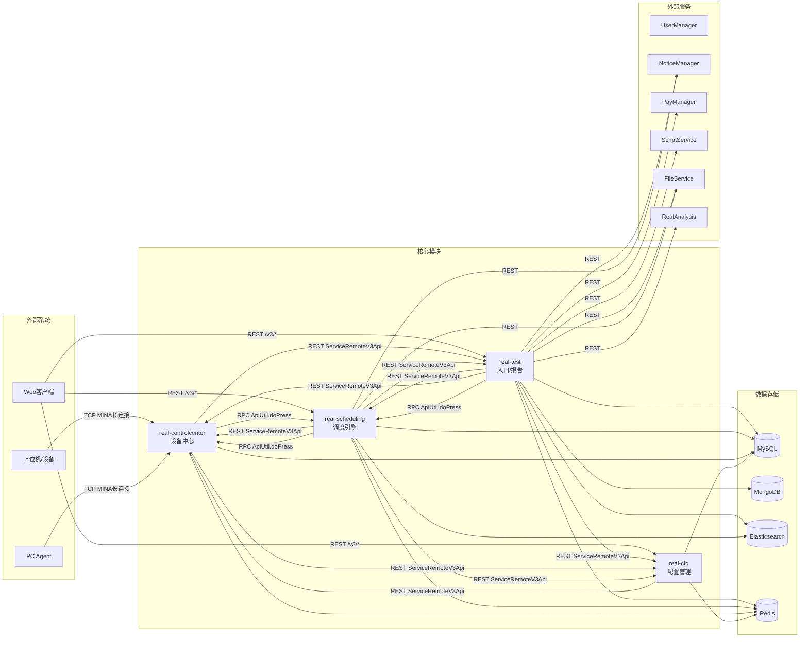
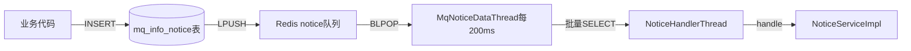

# 基础设施-模块间通信

> 汇总 real 平台 4 个核心模块之间的通信拓扑，包含 REST/RPC/MQ/共享DB/长连接等机制。

## 通信拓扑全景



## 一、REST 调用（ServiceRemoteV3Api）

各模块通过 `ServiceRemoteV3Api` 发起 HTTP REST 调用，目标路径格式为 `/v3/*`。

### 调用关系矩阵

| 调用方 | 被调用方 | 典型接口 | 用途 |
|--------|----------|----------|------|
| app处理服务 | 任务调度服务 | `/v3/scheduling/task/*` | 任务初始化、取消、状态查询 |
| app处理服务 | 设备控制中心 | `/v3/controlcenter/device/*` | 设备查询、设备预约 |
| app处理服务 | 平台配置 | `/v3/cfg/*` | 项目配置、超时配置、错误原因查询 |
| 任务调度服务 | app处理服务 | `/v3/test/task/*` | 任务结果回调、补测上报 |
| 任务调度服务 | 设备控制中心 | `/v3/controlcenter/*` | 设备信息查询、设备错误日志 |
| 任务调度服务 | 平台配置 | `/v3/cfg/device/*` | 设备配置查询、项目组查询 |
| 设备控制中心 | app处理服务 | `/v3/test/*` | 设备任务上报 |
| 设备控制中心 | 平台配置 | `/v3/cfg/device/*` | 设备来源、PC配置查询 |
| 设备控制中心 | 任务调度服务 | `/v3/scheduling/*` | 任务匹配请求、查询 |
| 平台配置 | 设备控制中心 | `/v3/controlcenter/ucom/*` | 上位机管理 |

### REST 客户端封装

源码位置：各模块 `api/ServiceRemoteV3Api.java`

```java
// 示例：real-test 调用 scheduling 的 TaskV3Api
TaskV3Api taskV3Api = SpringUtil.getBean(TaskV3Api.class);
// 内部通过 ServiceRemoteV3Api HTTP 请求到 scheduling 的 /v3/* 端点
```

## 二、RPC/JSON 调用（ApiUtil.doPress）

传统 API 调用方式，通过 `ApiUtil.doPress(action, op, params)` 发起 RPC 风格调用，基于 HTTP POST JSON，目标通常是 `/*` 兜底 Servlet（ApiServlet），通过反射调用 `cn.testin.service.*` 类方法。

### 调用关系

| 调用方 | 目标服务类 | action/op | 用途 |
|--------|-----------|-----------|------|
| app处理服务 | scheduling/Task | action=task, op=init | 任务初始化 |
| app处理服务 | scheduling/Task | action=task, op=match | 任务匹配 |
| app处理服务 | scheduling/Task | action=task, op=cancel | 任务取消 |
| 设备控制中心 | scheduling/Task | action=task, op=match | 设备心跳触发匹配 |
| 设备控制中心 | scheduling/Task | action=task, op=reportResult | 设备上报结果 |
| 设备控制中心 | scheduling/Task | action=task, op=preComplete | 预完成通知 |
| 任务调度服务 | controlcenter/Task | action=control, op=exec | 下发任务到设备 |

### 路由机制

```
ApiUtil.doPress(action, op, jsonParams)
    → HTTP POST to http://{target}:{port}/
    → ApiServlet.service()
        → 反射调用 cn.testin.service.{action}.{op}()
        → 返回 JSON
```

## 三、Redis MQ（Pub/Sub + BlockingPool）

跨模块异步通知的核心机制。

### 机制

```
生产者 → Redis LPUSH(queueKey, messageJson)
     ↓
消费者 ← BlockingPool 线程 → BLPOP → MessageDispatchThread → MessageWorkerThread → 业务处理
```

### 通道

| 通道名 | 生产者 | 消费者 | 用途 |
|--------|--------|--------|------|
| scheduling | 任务调度服务 | 任务调度服务 | 调度内部任务分发 |
| realtest | app处理服务 | app处理服务 | 测试报告/邮件异步处理 |
| task | app处理服务 | app处理服务 | 任务初始化/补测队列 |
| scheduling.mq | 任务调度服务 | 任务调度服务 | MQ 通知队列 |
| controlcenter | 设备控制中心 | 设备控制中心 | 设备管理消息 |

### 通知 MQ（跨模块通知）



详见：[通知系统-总览](通知系统-总览.md)

## 四、共享数据库

所有模块共享以下数据存储：

| 存储 | 共享方式 | 关键共享表/集合 |
|------|----------|----------------|
| MySQL | 同一数据库实例，多模块读写 | task_info, task_sub_info, device_info, device_detail, client_info, quartz_job_info |
| MongoDB | 同一实例 | 测试结果详情、脚本执行记录 |
| Elasticsearch | 同一集群 | task_info 索引（EsTaskInfo）、设备心跳检查 |
| Redis | 同一集群，不同 DB | 队列、缓存、分布式锁、临时状态 |

### 关键共享数据流

```
[real-test] 写 task_info (status=-2) → [real-scheduling] 读 task_info, 更新 status
[real-scheduling] 写 task_sub_info → [real-test] 读 task_sub_info 做报告汇总
[real-controlcenter] 写 device_info → [real-scheduling] 读 device_info 做匹配
[real-scheduling] 写 EsTaskInfo → [real-test] 读 ES 做任务列表查询
```

## 五、长连接（上位机 TCP MINA）

设备控制中心 与上位机/设备之间使用 Apache MINA 框架维持 TCP 长连接。

### 协议栈

```
上位机/设备 ←→ [TCP MINA Server] ←→ ProtocolDispatchThread ←→ ProtocolWorkerThread ←→ ProtocolHandlerThread
```

### 核心消息类型

| 消息 | 方向 | 用途 |
|------|------|------|
| HEARTBEAT | 上位机→CC | 设备心跳，携带设备状态信息 |
| REGISTER | 上位机→CC | 设备注册 |
| TASK_EXEC | CC→上位机 | 下发任务执行命令 |
| TASK_STOP | CC→上位机 | 停止任务 |
| RESULT_REPORT | 上位机→CC | 上报测试结果 |
| DEVICE_STATUS | 上位机→CC | 设备状态变更通知 |

详见：[RealControlCenter 外部服务文档](../../设备控制中心（real-controlcenter）/07-开放接口文档/00-模块索引.md)

## 六、通信方式对比

| 方式 | 同步/异步 | 可靠性 | 适用场景 |
|------|-----------|--------|----------|
| REST /v3/* | 同步 | HTTP 重试 | 任务创建、配置查询、状态更新（需要即时响应） |
| RPC ApiUtil.doPress | 同步 | HTTP 重试 | 传统 action/op 接口调用 |
| Redis MQ | 异步 | at-least-once | 通知分发、结果上报、邮件发送（允许延迟） |
| 共享 DB | 异步 | 事务 | 任务状态、设备信息等核心数据的跨模块共享 |
| TCP MINA | 双向 | 长连接重连 | 与上位机的实时命令下发和状态上报 |

## 相关双链

- 通知系统：[通知系统-总览](通知系统-总览.md) -- Redis MQ 通知机制的详细说明
- 后台线程全景：[基础设施-后台线程全景](基础设施-后台线程全景.md) -- 通信消息的处理线程
- 任务状态机：[核心链路-任务状态机](核心链路-任务状态机.md) -- 跨模块状态同步
- 核心链路：[核心链路-总览](核心链路-总览.md) -- 跨模块核心流程
- 外部服务索引：[外部服务-索引](../../外部服务/外部服务-索引.md)
