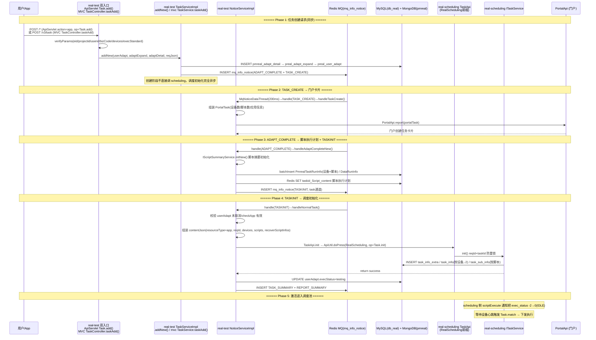

# 核心链路-任务创建

> 用户点击"创建任务" → app处理服务 双入口接收 → 三表入库 + 插 ADAPT_COMPLETE / TASK_CREATE 通知 → NoticeServiceImpl 异步处理（handleTaskCreate 上报门户、handleAdaptCompleteNew 生成脚本执行计划并插 TASKINIT）→ handleNormalTask 调 scheduling Task.init 初始化入库 → scheduling scriptExecute 激活 → 任务进入 IDLE 等待设备匹配

## 端到端序列图



## 阶段拆解

### Phase 1: 任务创建请求 (app处理服务)

```
用户/App POST → 双入口:
  ├─ ApiServlet(action=app, op=Task.add) → Task.add(ApiRequest)
  └─ MVC Controller POST /v3/task → TaskController.taskAdd(TaskAddRequestDTO)
    → verifyParams():
        eid > 0, projectid > 0, userid > 0
        bizCode > 0, taskDescr not blank
        devices[] not empty, execStandard not null
    → 构建 PrealUserAdapt (userAdapt)
        execStatus = waiting, cancelled = normal
        content = {initPwd, quotaCode, crossTaskId, ...}
    → 构建 PmrealAdaptDetail (adaptDetail)
        解析 appinfo/scripts/devices/execStandard
    → TaskServiceImpl.addNew(userAdapt, adaptExpand, adaptDetail, reqJson)
```

| 入参             | 类型         | 必填  | 说明                                          |
| -------------- | ---------- | --- | ------------------------------------------- |
| eid            | Integer    | 是   | 企业ID                                        |
| projectid      | Integer    | 是   | 项目组ID                                       |
| userid         | Integer    | 是   | 用户ID                                        |
| bizCode        | Integer    | 是   | 业务编码                                        |
| taskDescr      | String     | 是   | 任务描述                                        |
| devices        | JSONArray  | 是   | 设备列表                                        |
| execStandard   | JSONObject | 是   | 执行策略(fast/normal/simple/monkey/script/data) |
| serialRun      | Integer    | 否   | 串并行标志                                       |
| appinfo        | JSONObject | 否   | 应用信息                                        |
| taskTemplateId | Integer    | 否   | 任务模板ID                                      |

### Phase 2: 三表入库与通知插入 (app处理服务，同步)

```
TaskServiceImpl.addNew()（老入口） 或 mvc TaskService.taskAdd()（新入口）
  → INSERT pmreal_adapt_detail (MongoDB 适配详情含脚本/设备)
  → INSERT preal_adapt_expand (扩展信息)
  → UPDATE pmreal_adapt_detail (回填 quartz 等)
  → INSERT preal_user_adapt (任务主记录, execStatus=waiting)
  → INSERT mq_info_notice(ADAPT_COMPLETE)   // 完善适配信息
  → INSERT mq_info_notice(TASK_CREATE)      // 上报门户
  // 注意: 此处不直接调 scheduling，调度初始化由 TASKINIT 通知异步驱动
```

| 表 | 操作 | 说明 |
|------|------|------|
| pmreal_adapt_detail | INSERT | MongoDB，任务明细 |
| preal_adapt_expand | INSERT | 扩展信息 |
| preal_user_adapt | INSERT | waiting (等待) |
| mq_info_notice | INSERT×2 | ADAPT_COMPLETE + TASK_CREATE |

### Phase 3: TASK_CREATE 通知 → 门户卡片

```
MqNoticeDataThread(200ms):
  → SELECT * FROM mq_info_notice WHERE status=PENDING AND delaytime<now LIMIT 50
  → NoticeDispatchThread 分发 → NoticeServiceImpl.handle()

handle(TASK_CREATE) → handleTaskCreate():
  1. 读 expand + adaptDetail + userAdapt
  2. 组装 PortalTask (设备数/脚本数/应用信息/测试类型)
  3. PortalApi.report(portalTask) → 门户创建任务卡片
  4. 拨测 bizCode(SPOT_TEST) 另插 REPORT_STAT 通知
  // 脚本分派/设备分组不在这里做
```

### Phase 4: ADAPT_COMPLETE 通知 → 脚本执行计划 + TASKINIT

```
handle(ADAPT_COMPLETE) → handleAdaptCompleteNew():
  1. IScriptSummaryService.initNew() 脚本摘要初始化
  2. 按"设备×脚本"批量生成 PmrealTaskRunInfo(数据驱动则 DataRunInfo)
  3. 脚本执行计划写 Redis (key=taskid_Script_content)
  4. 插 mq_info_notice(TASKINIT, task通道)
     // 若 checkApp=wait(应用待检测) 则改插 APP_DETECT，检测完成后再插 TASKINIT
```

### Phase 5: TASKINIT 通知 → 调度初始化 (异步)

```
handle(TASKINIT) → handleNormalTask():
  1. 校验 userAdapt 未取消(cancelled/cancelling)且 checkApp 有效，否则 INVALID
  2. 组装 contentJson(resourceType=app, reqId, devices, scripts, recoverScriptInfos 自愈脚本)
  3. TaskApi.init → ApiUtil.doPress(RealScheduling, action=scheduling, op=Task.init)
     → scheduling Task.init(ApiRequest) reqId+taskId 防重锁
       → INSERT task_info_extra
       → batchInsert task_info (按设备, exec_status=-2 PENDING_SCHEDULING)
       → batchInsert task_sub_info (按脚本)
  4. 成功后: userAdapt.execStatus=testing + INSERT TASK_SUMMARY + REPORT_SUMMARY
```

### Phase 6: scriptExecute 激活 (任务调度服务内部)

```
scheduling 侧 scriptExecute 通知（scheduling 通道 type=7）→ TaskServiceImpl.scriptExecute()
  → UPDATE task_info SET exec_status=0(IDLE)
  → 任务正式进入调度池等待匹配
```

### Phase 7: 等待匹配

```
task_info.exec_status = 0 (IDLE)
  → 设备心跳触发 Task.match
  → 策略匹配 → exec_status: 0→1(ING) → 下发执行
```

## 通知链汇总

| 顺序 | 通知类型 | 通道 | 触发点 | 消费者 | 作用 |
|------|----------|------|--------|--------|------|
| 1 | **TASK_CREATE** | realtest | addNew()/taskAdd() 末尾 | handleTaskCreate() | 门户卡片(PortalApi.report) |
| 2 | **ADAPT_COMPLETE** | realtest | addNew()/taskAdd() 末尾 | handleAdaptCompleteNew() | 脚本摘要+执行计划+插 TASKINIT |
| 3 | **TASKINIT** | task | handleAdaptCompleteNew() | handleNormalTask() | 调 scheduling Task.init 初始化 |
| 4 | **scriptExecute** | scheduling | scheduling init 后 | scheduling scriptExecute() | 激活 exec_status -2→0 |

> 注：`TASK_INIT_NOTICE`（realtest 通道，type=115）是"任务初始化完成通知测试计划模块"，由 TaskProcessServiceImpl 插入、`handleTaskInitNotice()` 消费（调 `TestPlanApi.report`），与激活任务的 scheduling `scriptExecute` 通知是两回事，勿混淆。

## 关键代码路径

| 步骤 | 文件 | 方法 |
|------|------|------|
| ApiServlet 入口 | `real-test/.../service/app/Task.java` | `add(ApiRequest)` |
| Spring MVC 入口 | `real-test/.../mvc/controller/TaskController.java` | `taskAdd(TaskAddRequestDTO)` |
| 老入口业务层 | `real-test/.../business/impl/TaskServiceImpl.java` | `addNew()` |
| 新入口业务层 | `real-test/.../mvc/service/TaskService.java` | `taskAdd(TaskAddRequestDTO)` |
| 调度初始化 RPC | `real-test/.../api/scheduling/TaskApi.java` | `init(String)` |
| TASK_CREATE 处理 | `real-test/.../business/impl/NoticeServiceImpl.java` | `handleTaskCreate()` |
| ADAPT_COMPLETE 处理 | `real-test/.../business/impl/NoticeServiceImpl.java` | `handleAdaptCompleteNew()` |
| TASKINIT 处理 | `real-test/.../business/impl/NoticeServiceImpl.java` | `handleNormalTask()` |
| scriptExecute 激活 | `real-scheduling/.../business/impl/TaskServiceImpl.java` | `scriptExecute()` |
| 门户上报 | `cn.testin.api.portal.PortalApi` | `report(PortalTask)` |

## 核心发现

- **两路通知并行**：TASK_CREATE 与 ADAPT_COMPLETE 在创建时同时插入，前者只上报门户卡片（PortalApi.report），后者才生成脚本执行计划并插 TASKINIT 驱动调度初始化。真正激活任务的是 scheduling 侧 scriptExecute 通知（exec_status -2→0），TASK_INIT_NOTICE 只同步测试计划模块，二者勿混淆
- **防重机制**：scheduling init 使用 reqId+taskId 分布式锁，防止重复创建
- **补测兼容**：init 方法判断非补测时 DELETE+INSERT task_info_extra，补测时合并 recoverScriptInfos
- **taskid 格式**：APP 任务以 "tt" 开头，Web/PC 任务以其他前缀区分
- **exec_status=-2 → 0**：PENDING_SCHEDULING 必须经 scriptExecute 通知才能转为 IDLE，防止过早进入调度池
- **门户异步上报**：TASK_CREATE 通知被消费后才调用 PortalApi.report 上报门户任务卡片，不是创建任务时立即同步

## 相关文档

- [核心链路-任务初始化](核心链路-任务初始化.md) — Step1-2 技术细节
- [核心链路-任务执行流程](核心链路-任务执行流程.md) — Step3-9 完整链路
- [核心链路-通知系统拓扑](核心链路-通知系统拓扑.md) — 通知系统的 3 通道 + 3 线程 + 5 目标
- [通知系统-NoticeServiceImpl详细流程](通知系统-NoticeServiceImpl详细流程.md) — handleTaskCreate + handleAdaptCompleteNew 详细流程图
- [核心链路-任务状态机](核心链路-任务状态机.md) — -2→0→1→2→3 状态流转
- [核心链路-补测复测](核心链路-补测复测.md) — 补测流程的 init(补测模式) 分支
- [核心链路-定时任务](../../任务调度服务（real-scheduling）/04-复杂功能细节/核心链路-定时任务.md) — 定时触发创建任务的分支
