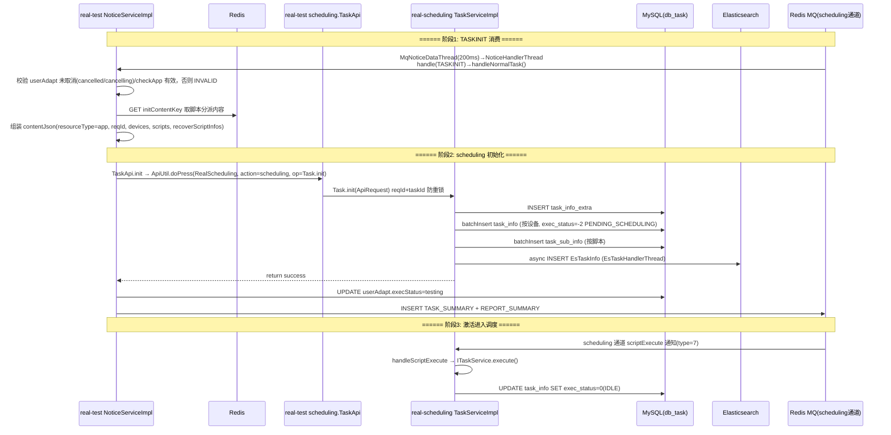

# 核心链路-任务初始化

> 任务初始化不是创建时同步调用，而是由通知链异步驱动：ADAPT_COMPLETE 通知生成脚本执行计划并插 TASKINIT → handleNormalTask 消费 TASKINIT → 组装 contentJson → 调任务调度服务 TaskApi.init（RPC）→ scheduling 拆设备/脚本入库（exec_status=-2）→ scheduling 侧 scriptExecute 通知激活（-2→0）。本文是 [核心链路-任务创建](核心链路-任务创建.md) Phase 4/5 的技术细节展开。

## 完整流程图



## 阶段拆解

### 阶段1: TASKINIT 消费 (app处理服务 NoticeServiceImpl.handleNormalTask)

```
handleNormalTask (NoticeServiceImpl.java):
  1. 解析 content: taskid
  2. 校验 userAdapt 未取消(cancelled/cancelling)且 checkApp 有效，否则 INVALID
  3. Redis GET initContentKey（handleAdaptCompleteNew 写入的脚本执行计划）
  4. 解析:
       scripts(本地参数/账号/设备分配) + accounts(账号匹配) + devices(设备分配)
       recoverScriptInfos(自愈脚本) + dependScriptParams + control infos
  5. 组装 contentJson(resourceType=app, reqId, devices, scripts, recoverScriptInfos)
  6. taskapi.init(contentJson) → ApiUtil.doPress(RealScheduling, action=scheduling, op=Task.init)
  7. 成功后: UPDATE userAdapt.execStatus=testing
  8. DELETE Redis initContentKey
  9. INSERT TASK_SUMMARY + REPORT_SUMMARY（SPOT_TEST 时另插 REPORT_STAT）
```

> init RPC 耗时长，期间用户可能取消任务，所以 handleNormalTask 在 init 前后各校验一次 userAdapt 的 cancelled/checkApp 状态。

### 阶段2: 调度初始化 (任务调度服务 Task.init)

```
Task.init(ApiRequest):
  1. LOCK(KEY("Task.init.DEAL", reqId + "_" + taskid)) 防重锁
  2. 非补测(taskType=1): DELETE+INSERT task_info_extra
     补测(taskType=2): 合并 recoverScriptInfos
  3. batchInsert task_info (按设备, exec_status=-2 PENDING_SCHEDULING)
  4. batchInsert task_sub_info (按脚本)
  5. async INSERT EsTaskInfo (EsTaskHandlerThread 线程池)
  6. INSERT task_release_time_periods (任务允许下发的时段)
```

| 表 | 操作 | 关键字段 |
|------|------|------|
| task_info | batchInsert | task_id, deviceid, exec_status(-2), projectid, eid |
| task_sub_info | batchInsert | subtask_id, task_id, script_id |
| task_info_extra | INSERT | task_id, recoverScriptInfos, taskdetailJson |
| task_release_time_periods | INSERT | task_id, type, begin_time, end_time |
| EsTaskInfo (ES) | async INSERT | EsTaskHandlerThread 写入 |

### 阶段3: 激活 (任务调度服务 scriptExecute)

```
scheduling 侧 scriptExecute 通知(scheduling 通道 type=7)
  → NoticeServiceImpl.handleScriptExecute()
    → ITaskService.execute(taskId, projectId)
      → UPDATE task_info SET exec_status=0(IDLE)
```

`exec_status=-2(PENDING_SCHEDULING)` 必须经 scriptExecute 通知才能转 `0(IDLE)`，防止任务过早进入调度池被匹配。

## 关键代码路径

| 步骤 | 文件 | 方法 |
|------|------|------|
| TASKINIT 消费 | `real-test/.../business/impl/NoticeServiceImpl.java` | `handleNormalTask()` |
| 调度初始化 RPC | `real-test/.../api/scheduling/TaskApi.java` | `init(String)` |
| 调度侧入口 | `real-scheduling/.../service/scheduling/Task.java` | `init(ApiRequest)` |
| 核心业务 | `real-scheduling/.../business/impl/TaskServiceImpl.java` | `init(JSONObject)` |
| 激活执行 | `real-scheduling/.../business/impl/TaskServiceImpl.java` | `execute()` |
| ES 同步 | `real-scheduling/.../schedule/task/EsTaskHandlerThread.java` | `run()` |

## 核心发现

- **初始化是异步的**：taskAdd 返回时 `task_info` 可能还没建，需等 TASK_CREATE→ADAPT_COMPLETE→TASKINIT 通知链消费完才由 handleNormalTask 调 taskapi.init
- **分布式锁**：scheduling init 用 reqId+taskId 锁防止重复初始化
- **初始状态**：子任务初始 `exec_status=-2`(PENDING_SCHEDULING)，需 scriptExecute 通知后转 `0(IDLE)` 进入调度
- **ES 异步**：ES 索引由 EsTaskHandlerThread 异步写，不阻塞主流程
- **脚本分派走 Redis**：TASKINIT 通知 content 只存 redisKey，大 JSON 放 Redis 并按 TASKINIT 有效期过期；Redis 清库会导致初始化拿不到脚本列表
- **补测合并**：taskType=2 时 task_info_extra 合并 recoverScriptInfos，task_info/task_sub_info 只 INSERT 补测增量

## 相关文档

- [核心链路-任务创建](核心链路-任务创建.md) — Phase 1-7 全链路与通知链汇总
- [核心链路-设备匹配与下发](../../设备控制中心（real-controlcenter）/04-复杂功能细节/核心链路-设备匹配与下发.md) — 初始化完成后进入设备匹配
- [核心链路-任务状态机](核心链路-任务状态机.md) — exec_status 状态转换
- [通知系统-总览](通知系统-总览.md) — TASKINIT / scriptExecute 通知类型
- [通知系统-NoticeServiceImpl详细流程](通知系统-NoticeServiceImpl详细流程.md) — handleNormalTask / handleScriptExecute handler 流程图
- [核心链路-补测复测](核心链路-补测复测.md) — 补测模式(taskType=2)的 init 合并分支
