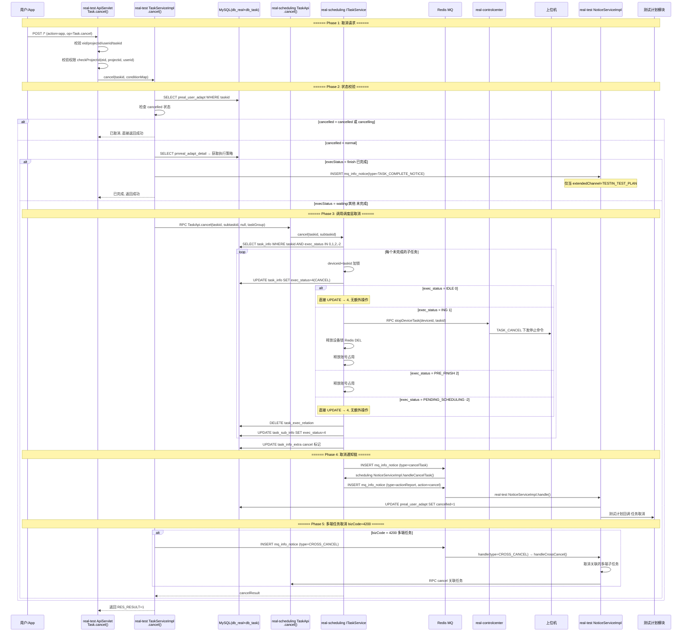
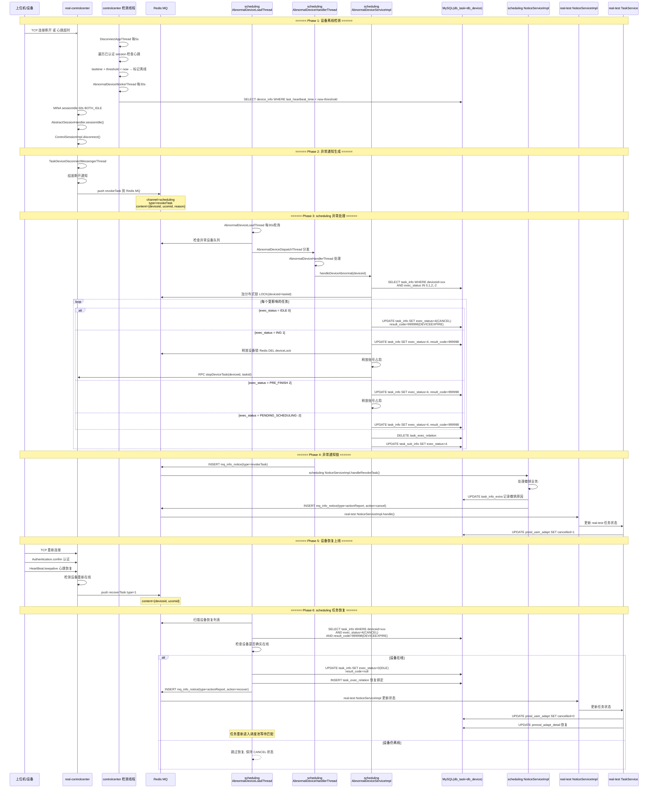

# 核心链路-任务取消与异常恢复

> 两种取消路径的统一视图：**用户主动取消** (app处理服务 Task.cancel() → scheduling → CC stopDeviceTask, resultCode=888888) / **设备异常自动取消** (controlcenter 三级检测 → revokeTask → scheduling 批量取消, resultCode=999998) + 设备恢复 → IDLE

## 取消路径总览

| 路径 | 触发源 | resultCode | 通知入口 | 是否可恢复 |
|------|--------|------------|----------|------------|
| 用户主动取消 | app处理服务 Task.cancel() | 888888 (USER_CANCEL) | scheduling cancelTask → actionReport | 否 |
| 欠费取消 | app处理服务 cancelCode=10337 | 10337 (ARREARS_CANCEL) | scheduling cancelTask → actionReport | 否 |
| 设备异常取消 | controlcenter 设备离线 | 999998 (DEVICEEXPIRE) | controlcenter revokeTask → actionReport | 是, 设备重新上线后恢复 |
| 多端联动取消 | bizCode=4200 + crossTaskId | 888888 | CROSS_CANCEL | 否 |

---

## 一、用户主动取消

> 用户点击"取消任务" → app处理服务 ApiServlet Task.cancel() → 校验任务状态 → scheduling TaskApi.cancel() → controlcenter stopDeviceTask → 释放设备锁+账号 → NoticeServiceImpl 通知链 (cancelTask → actionReport → CROSS_CANCEL) → 门户/测试计划回调

### 端到端序列图



### 阶段拆解

#### Phase 1-2: 取消请求与状态校验 (app处理服务)

```
POST /* (action=app, op=Task.cancel)
  → Task.cancel(ApiRequest)
    → 校验: eid/projectid/userid/taskid
    → 校验: checkProjectId(eid, projectid, userid) 用户权限
    → 可选: subtaskid (取消子任务) / cancelCode (10337欠费)
    → TaskServiceImpl.cancel(taskid, conditionMap)
      → SELECT preal_user_adapt WHERE taskid
      → 状态判断:
         ├─ cancelled/cancelling → 直接返回成功 (幂等)
         ├─ execStatus=finish → 仅当 extendedChannel=TESTIN_TEST_PLAN 时发 TASK_COMPLETE_NOTICE → 返回成功
         └─ 其他状态 → 继续取消流程
```

| 状态 | 处理方式 | 返回值 |
|------|----------|--------|
| cancelled = cancelled | 直接返回 | 1 (成功) |
| cancelled = cancelling | 直接返回 | 1 (成功) |
| execStatus = finish | 发 TASK_COMPLETE_NOTICE (仅测试计划渠道) | 1 (成功) |
| 其他 | 走完整取消流程 | cancelResult |

#### Phase 3: scheduling 取消执行

```
scheduling TaskServiceImpl.cancel(taskid, subtaskid):
  → SELECT task_info WHERE taskid AND exec_status IN (0,1,2,-2)
    覆盖范围: IDLE(0) / ING(1) / PRE_FINISH(2) / PENDING_SCHEDULING(-2)
    不覆盖: FINISH(3) / CANCEL(4) / SKIP(5)

  对每个子任务:
    → 加分布式锁 LOCK(deviceid + taskid)
    → UPDATE task_info SET exec_status=4(CANCEL), result_code=888888(用户取消)
    → 若 exec_status=IDLE(0): 直接 UPDATE → 4
    → 若 exec_status=ING(1):
        → RPC controlcenter.stopDeviceTask(deviceid, taskid)
        → 上位机收到 TASK_CANCEL 命令
        → 释放设备锁 (Redis DEL)
        → 释放账号占用
    → 若 exec_status=PRE_FINISH(2):
        → 释放账号占用
    → 若 exec_status=PENDING_SCHEDULING(-2): 直接 UPDATE → 4
    → DELETE task_exec_relation
    → UPDATE task_sub_info SET exec_status=4
    → UPDATE task_info_extra (cancel标记)
```

| exec_status | 取消操作 | 释放资源 |
|-------------|----------|----------|
| 0 (IDLE) | 直接 UPDATE → 4 | — |
| 1 (ING) | UPDATE → 4 + 通知上位机停止 | 设备锁+账号 |
| 2 (PRE_FINISH) | UPDATE → 4 | 账号 |
| -2 (PENDING_SCHEDULING) | 直接 UPDATE → 4 | — |

#### Phase 4: 取消通知链

```
scheduling 侧:
  → INSERT mq_info_notice (type=cancelTask)
    → scheduling NoticeServiceImpl.handleCancelTask():
      → 清理 task_info_extra 中的 cancel 标记
      → 通知控制中心取消完毕
      → 发送 actionReport(action=cancel) 到 real-test

real-test 侧:
  → actionReport 通知到达
    → 更新 preal_user_adapt.cancelled = 1
    → 更新 pmreal_adapt_detail

  → 测试计划模块回调 (若 extendedChannel=TESTIN_TEST_PLAN):
    → TASK_COMPLETE_NOTICE 通知
```

#### Phase 5: 多端任务联动取消

```
仅当 bizCode = 4200 (多端任务):
  TaskServiceImpl.cancel() 末尾:
    → 检查 userAdapt.content 是否含 crossTaskId
    → 若存在:
        → INSERT mq_info_notice (type=CROSS_CANCEL)
        → content = {crossTaskid, taskid}

  NoticeServiceImpl.handleCrossCancel():
    → SELECT 所有关联的 crossTaskId 子任务
    → 逐个调用 scheduling TaskApi.cancel()
    → 确保多端任务全部取消
```

### 批量取消 (batchCancel)

```
Task.batchCancel(ApiRequest):
  → 校验: eid/projectid/userid/taskids[]
  → 遍历 taskids[]:
      → 每项调用 itaskservice.cancel(taskid, conditionMap)
      → 异常不中断,继续下一项
  → 返回: {RES_RESULT: 成功取消数}
```

### 恒生取消 (cancelWithNoUserId)

```
Task.cancelWithNoUserId(ApiRequest):
  → 无需 userid 校验 (恒生等外部系统调用)
  → 其他流程与 cancel() 完全相同
  → 用于第三方系统通过 API 取消任务
```

### 用户取消关键代码路径

| 步骤 | 文件 | 方法 |
|------|------|------|
| ApiServlet 入口 | `real-test/.../service/app/Task.java` | `cancel(ApiRequest)` |
| 批量取消入口 | `real-test/.../service/app/Task.java` | `batchCancel(ApiRequest)` |
| 恒生取消入口 | `real-test/.../service/app/Task.java` | `cancelWithNoUserId(ApiRequest)` |
| 业务层取消 | `real-test/.../business/impl/TaskServiceImpl.java` | `cancel(String, Map)` |
| 调度层取消 | `real-scheduling/.../business/impl/TaskServiceImpl.java` | `cancel()` |
| scheduling API | `real-scheduling/.../service/scheduling/Task.java` | `cancel(ApiRequest)` |
| 停止设备任务 | `real-controlcenter/.../schedule/task/DeviceHandlerThread.java` | stop task |
| cancelTask 处理 | `real-scheduling/.../business/impl/NoticeServiceImpl.java` | `handleCancelTask()` |
| CROSS_CANCEL 处理 | `real-test/.../business/impl/NoticeServiceImpl.java` | `handleCrossCancel()` |

### 用户取消核心发现

- **幂等取消**：已取消(cancelled/cancelling)和已完成(finish)的任务直接返回成功，不重复取消
- **级联取消**：取消 taskid 会将所有该任务下的子任务(不限状态，除终态)全部取消
- **上位机联动**：ING 状态的子任务取消时会通过 RPC 通知 controlcenter 向上位机发 TASK_CANCEL 命令
- **4种状态全覆盖**：IDLE/ING/PRE_FINISH/PENDING_SCHEDULING 全部覆盖，ING和PRE_FINISH额外释放资源
- **多端任务特殊处理**：bizCode=4200 的多端任务取消时，通过 CROSS_CANCEL 通知联动取消所有关联端
- **欠费取消 (10337)**：使用 cancelCode 字段区分，用于业务统计和追溯
- **批量取消容错**：单个任务取消失败不中断批量操作，只累加成功数

---

## 二、设备异常自动取消与恢复

> 上位机 TCP 断开/心跳超时 → controlcenter 三级检测机制 → push revokeTask 到 Redis MQ → scheduling AbnormalDeviceLoadThread → AbnormalDeviceHandlerThread 批量取消受影响任务 → NoticeServiceImpl 通知链 (revokeTask → actionReport) → 设备重新上线 → push recoverTask → 恢复 CANCEL 任务为 IDLE → 通知 app处理服务 更新状态

### 端到端序列图



### 阶段拆解

#### Phase 1: 三级离线检测

```
第1级: MINA TCP 层 (60s 超时)
  → MINA sessionIdle(60s, BOTH_IDLE)
  → AbstractSessionHandler.sessionIdle()
    → ControlSessionImpl.disconnect()
    → handleDisconnect() 从 AbstractSession.sessions 移除

第2级: 应用层心跳 (每5s)
  → DisconnectAppThread.run()
    → DeviceBound.checkHeartbeat()
      → 遍历所有已认证 session
      → lasttime + threshold < now → 标记离线
      → 清理设备池 (DevicePool) 中的设备信息

第3级: DB 层持久化 (每30s)
  → AbnormalDeviceWorkerThread.run()
    → SELECT * FROM device_info
        WHERE last_heartbeat_time < now() - threshold
    → UPDATE device_info SET status = OFFLINE
```

| 层级 | 频率 | 检测方式 | 作用 |
|------|------|----------|------|
| TCP 层 | 60s 超时 | MINA sessionIdle | 释放连接资源 |
| 应用层 | 每5s | 内存 session.lasttime | 快速感知断开 |
| DB 层 | 每30s | last_heartbeat_time | 持久化离线状态 |

#### Phase 2-3: 异常通知生成与 scheduling 处理

```
TaskDeviceDisconnectMessengerThread 组装断开通知:
  → push revokeTask 到 Redis MQ (channel: scheduling)

scheduling 侧三线程处理链:
  AbnormalDeviceLoadThread (每30s):
    → 检查 Redis 异常设备队列
    → 批量加载受影响设备 ID

  AbnormalDeviceDispatchThread:
    → 从队列取设备 ID
    → 提交到 AbnormalDeviceHandlerThread

  AbnormalDeviceHandlerThread:
    → AbnormalDeviceServiceImpl.handleDeviceAbnormal(deviceid):
        1. SELECT task_info WHERE deviceid=xxx
             AND exec_status IN (0=IDLE, 1=ING, 2=PRE_FINISH, -2=PENDING)
        2. 对每条任务:
            a. LOCK(deviceid + taskid) 加分布式锁
            b. UPDATE task_info SET exec_status=4(CANCEL), result_code=999998
            c. 若 IDLE/PENDING: 直接 UPDATE
            d. 若 ING: 释放设备锁 + 通知 CC 停止上位机 + 释放账号
            e. 若 PRE_FINISH: 释放账号占用
            f. DELETE task_exec_relation
            g. UPDATE task_sub_info SET exec_status=4
```

| 受影响状态 | 处理方式 | result_code | 额外操作 |
|------------|----------|-------------|----------|
| IDLE(0) | → CANCEL(4) | 999998 | — |
| ING(1) | → CANCEL(4) | 999998 | 释放设备锁 + stopDeviceTask + 释放账号 |
| PRE_FINISH(2) | → CANCEL(4) | 999998 | 释放账号 |
| PENDING_SCHEDULING(-2) | → CANCEL(4) | 999998 | — |

**不处理**: FINISH(3) / CANCEL(4) / SKIP(5) 等终态

#### Phase 4: 异常通知链 (NoticeServiceImpl)

```
scheduling NoticeServiceImpl:
  → handleRevokeTask(MqInfoNotice):
      1. content → deviceid, ucomid, reason
      2. 补充异常信息到 task_info_extra
      3. 标记撤销原因 (设备断开/心跳超时)
      4. INSERT actionReport(action=cancel) → real-test

real-test NoticeServiceImpl:
  → handle(actionReport):
      → 收到 action=cancel 时:
          → UPDATE preal_user_adapt.cancelled = 1
          → UPDATE pmreal_adapt_detail
          → 通知测试计划模块 (若需要)
```

#### Phase 5-6: 设备恢复与任务恢复

```
设备重新上线:
  → TCP 重连 + Authentication.confim 认证
  → HeartBeat.keepalive 心跳恢复
  → controlcenter 检测设备重新在线
    → push recoverTask (type=1) 到 Redis MQ

AbnormalDeviceLoadThread 扫描恢复列表:
  → SELECT task_info WHERE deviceid=xxx
      AND exec_status=4(CANCEL)
      AND result_code=999998(DEVICEEXPIRE)

  恢复条件:
    1. 设备确实在线 (心跳正常)
    2. exec_status=4 且 result_code=999998
    3. 任务未超过有效时间(5小时)

  恢复操作:
    → UPDATE task_info SET exec_status=0(IDLE), result_code=null
    → INSERT task_exec_relation (重新绑定设备)
    → INSERT actionReport(action=recover) → real-test

real-test 恢复更新:
  → UPDATE preal_user_adapt.cancelled = 0
  → UPDATE pmreal_adapt_detail 恢复状态
```

### NoticeServiceImpl 异常相关 handler

#### scheduling: handleRevokeTask

```
handleRevokeTask(MqInfoNotice):
  1. content → {deviceid, ucomid, reason, taskid}
  2. SELECT task_info_extra WHERE taskid
  3. 记录 revoke 原因:
       - DEVICE_DISCONNECT (设备断开)
       - HEARTBEAT_TIMEOUT (心跳超时)
       - DEVICE_OFFLINE (设备离线)
  4. INSERT actionReport(action=cancel)
       → channel=realtest
  5. return RESULT_SUCCESS
```

#### scheduling: handleRecoverTask

```
handleRecoverTask(MqInfoNotice):
  1. content → {deviceid, ucomid}
  2. SELECT task_info WHERE exec_status=4 AND result_code=999998
  3. 验证设备在线状态
  4. UPDATE task_info SET exec_status=0, result_code=null
  5. INSERT actionReport(action=recover) → real-test
  6. return RESULT_SUCCESS
```

#### app处理服务: handleActionReport (cancel/recover)

```
handleActionReport() 中:
  if action=recover:
    → UPDATE preal_user_adapt SET cancelled=0
    → 恢复门户任务状态

  if action=cancel:
    → UPDATE preal_user_adapt SET cancelled=1
    → 通知测试计划模块 (TASK_COMPLETE_NOTICE)
```

### 设备异常关键代码路径

| 步骤 | 文件 | 方法 |
|------|------|------|
| 心跳检测 | `real-controlcenter/.../schedule/app/DisconnectAppThread.java` | `run()` |
| 离线设备扫描 | `real-controlcenter/.../schedule/device/AbnormalDeviceWorkerThread.java` | `run()` |
| 断开通知组装 | `real-controlcenter/.../schedule/notice/TaskDeviceDisconnectMessengerThread.java` | `run()` |
| MINA 断连回调 | `real-controlcenter/.../trans/session/AbstractSession.java` | `handleDisconnect()` |
| 异常设备加载 | `real-scheduling/.../schedule/device/AbnormalDeviceLoadThread.java` | `run()` |
| 异常设备分发 | `real-scheduling/.../schedule/device/AbnormalDeviceDispatchThread.java` | `run()` |
| 异常设备处理 | `real-scheduling/.../schedule/device/AbnormalDeviceHandlerThread.java` | `run()` |
| 异常处理业务 | `real-scheduling/.../business/impl/AbnormalDeviceServiceImpl.java` | `handleDeviceAbnormal()` |
| revokeTask 处理 | `real-scheduling/.../business/impl/NoticeServiceImpl.java` | `handleRevokeTask()` |
| recoverTask 处理 | `real-scheduling/.../business/impl/NoticeServiceImpl.java` | `handleRecoverTask()` |
| 设备恢复 | `real-scheduling/.../business/impl/TaskServiceImpl.java` | `recover()` |

### 设备异常核心发现

- **三级检测层层递进**：TCP 层(60s)→应用层(5s)→DB 层(30s)，确保离线检测的准确性和及时性
- **Dispatch-Handler 批量异步**：AbnormalDeviceLoadThread → AbnormalDeviceDispatchThread → AbnormalDeviceHandlerThread 三线程解耦，避免瞬时波动误判
- **覆盖所有中间态**：IDLE/ING/PRE_FINISH/PENDING 全部覆盖，FINISH/CANCEL/SKIP 终态不处理
- **与用户取消共享同一底层机制**：都是 UPDATE → CANCEL(4) + DELETE task_exec_relation + UPDATE task_sub_info → 4，区别仅在于触发源和 resultCode
- **精确恢复**：只有标记 DEVICEEXPIRE(999998) 的任务才能在设备重新上线后恢复为 IDLE
- **资源完整释放**：异常处理不仅更新状态，还释放设备锁(Redis)、账号占用、执行关系(MySQL)等多重资源
- **5小时有效期**：通知超过5小时自动失效，防止过期任务恢复

---

## 通知链汇总

### 用户取消通知链

| 顺序 | 通知类型 | 通道 | 消费者 | 作用 |
|------|----------|------|--------|------|
| 1 | **cancelTask** | scheduling | scheduling NoticeServiceImpl | 清理 cancel 标记+通知 CC |
| 2 | **actionReport(action=cancel)** | scheduling → realtest | app处理服务 NoticeServiceImpl | 更新 app处理服务 状态 |
| 3 | **CROSS_CANCEL** | realtest | app处理服务 NoticeServiceImpl | 联动取消多端任务 |
| 4 | **TASK_COMPLETE_NOTICE** | realtest | scheduling NoticeServiceImpl | 已完成任务的测试计划回调 |

### 设备异常通知链

| 顺序 | 通知类型 | 通道 | 触发点 | 消费者 | 作用 |
|------|----------|------|--------|--------|------|
| 1 | **revokeTask** | controlcenter→scheduling | 设备离线 | scheduling NoticeServiceImpl | 触发异常任务取消 |
| 2 | **actionReport(action=cancel)** | scheduling→realtest | handleRevokeTask | app处理服务 NoticeServiceImpl | 更新 app处理服务 取消状态 |
| 3 | **recoverTask** | controlcenter→scheduling | 设备重新上线 | AbnormalDeviceLoadThread | 触发任务恢复 |
| 4 | **actionReport(action=recover)** | scheduling→realtest | handleRecoverTask | app处理服务 NoticeServiceImpl | 更新 app处理服务 恢复状态 |

---

## resultCode 区分

| resultCode | 含义 | 触发源 | 场景 | 可恢复 |
|------------|------|--------|------|--------|
| 888888 | USER_CANCEL | app处理服务 Task.cancel() | 用户主动取消 | 否 |
| 10337 | ARREARS_CANCEL | app处理服务 cancelCode=10337 | 欠费取消 | 否 |
| 999998 | DEVICEEXPIRE | controlcenter 设备离线 | 设备异常断开 (自动取消) | 是, 设备重新上线后恢复 |

**关键区分**：
- 999998 标记在设备恢复时会被清除并恢复为 IDLE(0)
- 888888 标记的任务不会被自动恢复
- 10337 用于业务统计和追溯，与 888888 走相同取消链路

---

## 两种取消路径对比

| 维度 | 用户主动取消 | 设备异常取消 |
|------|-------------|-------------|
| 触发源 | app处理服务 Task.cancel() | controlcenter 三级检测 |
| resultCode | 888888 / 10337 | 999998 |
| 入口通知 | cancelTask (scheduling内部) | revokeTask (controlcenter→scheduling) |
| 处理线程 | 同步 RPC | AbnormalDeviceHandlerThread (异步) |
| 资源释放 | ING: 设备锁+账号 / PRE_FINISH: 账号 | 同用户取消 |
| 是否通知上位机 | ING 时 stopDeviceTask | ING 时 stopDeviceTask |
| app处理服务 更新 | cancelled=1 | cancelled=1 |
| 可恢复 | 否 | 是 (设备重新上线后) |
| 批量支持 | batchCancel | 按设备批量 (一个设备离线影响该设备所有任务) |
| 多端联动 | bizCode=4200 → CROSS_CANCEL | — |

---

## 相关文档

- [核心链路-任务创建](核心链路-任务创建.md) — 创建流程 (取消的逆操作)
- [核心链路-设备异常恢复](../../设备控制中心（real-controlcenter）/04-复杂功能细节/核心链路-设备异常恢复.md) — 异常检测+恢复的技术细节
- [核心链路-设备匹配与下发](../../设备控制中心（real-controlcenter）/04-复杂功能细节/核心链路-设备匹配与下发.md) — 取消后重新匹配流程
- [核心链路-上位机长连接](../../设备控制中心（real-controlcenter）/04-复杂功能细节/核心链路-上位机长连接.md) — TCP 连接生命周期与 TASK_CANCEL 下发
- [通知系统-NoticeServiceImpl详细流程](通知系统-NoticeServiceImpl详细流程.md) — scheduling: handleCancelTask + handleRevokeTask + handleRecoverTask + app处理服务: handleCrossCancel 详细流程图
- [核心链路-通知系统拓扑](核心链路-通知系统拓扑.md) — cancelTask/revokeTask/recoverTask 的投递通道
- [核心链路-任务状态机](核心链路-任务状态机.md) — CANCEL(4) 状态 + IDLE(0) 恢复 + resultCode 枚举
- [基础设施-后台线程全景](基础设施-后台线程全景.md) — AbnormalDeviceLoadThread / DispatchThread / HandlerThread
