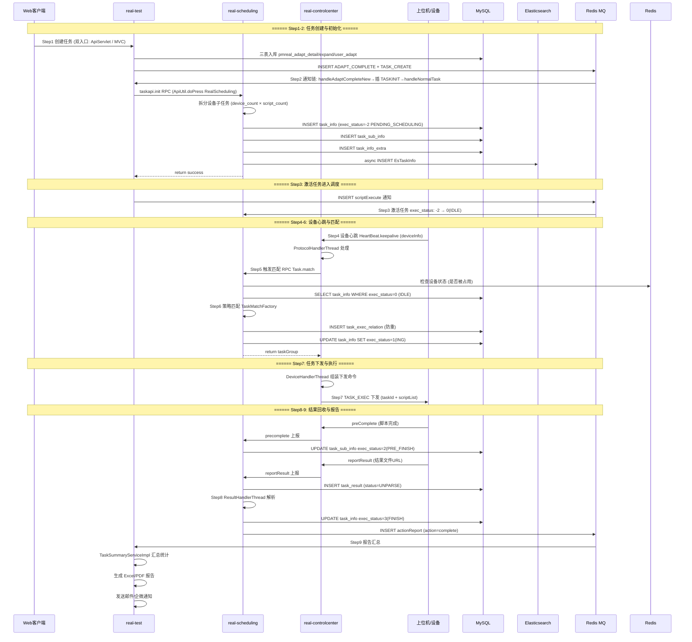

# 核心链路-任务执行流程

> 端到端泳道图：从 Web 客户端提交任务 → app处理服务 接收 → scheduling 初始化与匹配 → controlcenter 下发 → 上位机执行 → 结果回收 → app处理服务 报告汇总，共 9 个阶段。

## 端到端泳道图

## 9 阶段速查

| 阶段 | 模块 | 关键操作 | 状态变更 |
|------|------|----------|----------|
| Step1 创建任务 | app处理服务 | TaskController.taskAdd() 三表入库+插通知 | — |
| Step2 任务初始化 | 任务调度服务 | 通知链异步触发 Task.init() 拆分入库 | exec_status=-2 (PENDING_SCHEDULING) |
| Step3 激活任务 | 任务调度服务 | scriptExecute 通知 | -2 → 0 (IDLE) |
| Step4 设备心跳 | 设备控制中心 | HeartBeat.keepalive | 设备池更新 |
| Step5 触发匹配 | 设备控制中心 | DeviceDispatchThread | — |
| Step6 策略匹配 | 任务调度服务 | TaskMatchFactory.match() | 0 → 1 (ING) |
| Step7 任务下发 | 设备控制中心 | DeviceHandlerThread → TCP | — |
| Step8 结果解析 | 任务调度服务 | ResultHandlerThread | 1 → 2 → 3 (FINISH) |
| Step9 报告汇总 | app处理服务 | TaskSummaryServiceImpl | 通知 → 邮件 |

## 关键代码路径

| 阶段 | 文件 | 方法 |
|------|------|------|
| Step1 | `real-test/.../mvc/controller/TaskController.java` | `taskAdd(TaskAddRequestDTO)` |
| Step2 | `real-scheduling/.../service/scheduling/Task.java` | `init(ApiRequest)` |
| Step3 | `real-scheduling/.../business/impl/TaskServiceImpl.java` | `scriptExecute()` |
| Step4 | `real-controlcenter/.../trans/controller/req/script/HeartBeat.java` | `keepalive()` |
| Step5 | `real-controlcenter/.../schedule/task/DeviceDispatchThread.java` | `run()` |
| Step6 | `real-scheduling/.../business/util/TaskMatchFactory.java` | `match()` |
| Step7 | `real-controlcenter/.../schedule/task/DeviceHandlerThread.java` | exec task |
| Step8 | `real-scheduling/.../business/impl/ResultServiceImpl.java` | `handle()` |
| Step9 | `real-test/.../business/impl/TaskSummaryServiceImpl.java` | `stat()` |

## 相关文档

- [核心链路-任务初始化](核心链路-任务初始化.md) — Step1-2 详解
- [核心链路-设备匹配与下发](../../设备控制中心（real-controlcenter）/04-复杂功能细节/核心链路-设备匹配与下发.md) — Step4-7 详解
- [核心链路-结果回收与报告](核心链路-结果回收与报告.md) — Step8-9 详解
- [核心链路-定时任务调度](../../任务调度服务（real-scheduling）/04-复杂功能细节/核心链路-定时任务调度.md) — 定时触发的任务创建链路
- [核心链路-设备异常恢复](../../设备控制中心（real-controlcenter）/04-复杂功能细节/核心链路-设备异常恢复.md) — 异常中断后的恢复链路
- [核心链路-任务状态机](核心链路-任务状态机.md) — 完整状态枚举
- [通知系统-NoticeServiceImpl详细流程](通知系统-NoticeServiceImpl详细流程.md) — Step8→Step9 的通知串联链: actionReport → TASK_SUMMARY → REPORT_SUMMARY → FINISH_EMAIL
