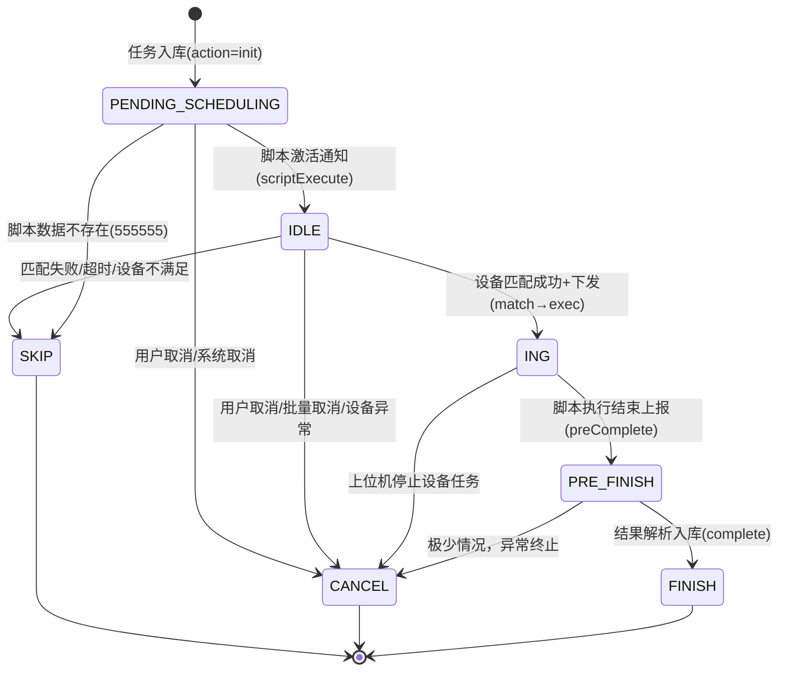

# 核心链路-任务状态机

> 基于 任务调度服务 模块 `TaskConfigEnum.TaskExecStatus` 枚举，覆盖从任务创建到终止的完整生命周期。

## 状态枚举定义

源码位置：`real-scheduling/.../cn/testin/pojo/task/TaskConfigEnum.java` -- `TaskExecStatus`

| 状态值 | 状态名 | 中文描述 | 一句话说明 |
|--------|--------|----------|------------|
| -2 | PENDING_SCHEDULING | 待调度执行状态 | 任务已入库但尚未进入调度队列 |
| -1 | TMP | 任务入库临时数据 | 批量入库时的中间态，很快转为正式状态 |
| 0 | IDLE | 待执行 | 等待设备匹配和下发 |
| 1 | ING | 执行中 | 设备已接单，正在执行脚本 |
| 2 | PRE_FINISH | 预完成 | 脚本执行完毕，结果已上报但尚未解析/汇总 |
| 3 | FINISH | 执行完成 | 结果解析完毕，报告已生成 |
| 4 | CANCEL | 取消测试 | 用户主动取消或系统触发取消 |
| 5 | SKIP | 跳过执行 | 匹配不成功或条件不满足时跳过 |

## 完整状态转换图

## 各状态详解

### PENDING_SCHEDULING（-2，待调度执行）

- **触发条件**：任务通过 app处理服务 入口创建后，scheduling 模块 `Task.init()` 将子任务批量 INSERT 到 `task_info` 表，`exec_status = -2`
- **转换动作**：等待 `scriptExecute` 通知（通知类型 7），由 scheduling 的 `MqNoticeDataThread` 每 200ms 轮询加载，`NoticeHandlerThread` 消费后调用 `ITaskService.execute()`，批量将同 taskId 任务状态更新为 `IDLE(0)` 并写入 ES
- **涉及模块**：
  - **app处理服务** -- 任务入口，调用 scheduling 的 `Task.init` 完成初始持久化
  - **任务调度服务** -- 执行状态判定和流转

### IDLE（0，待执行）

- **触发条件**：从 PENDING_SCHEDULING 经 `scriptExecute` 激活而来；或被回收（recover）的设备任务重置为 IDLE
- **转换动作**：
  - 设备 heartbeat 到达时，scheduling 通过 `Task.match()` 进行匹配（按设备/型号/OS/全匹配策略），匹配成功将状态更新为 `ING(1)` 并下发给 controlcenter
  - 超时未匹配或设备不可用，转入 SKIP(5) 或保持 IDLE 等待
- **涉及模块**：
  - **设备控制中心** -- 上位机心跳触发匹配请求
  - **任务调度服务** -- 执行匹配策略和状态变更

### ING（1，执行中）

- **触发条件**：设备匹配成功，scheduling 更新任务状态为 ING，并通过 controlcenter 长连接将任务脚本下发到上位机
- **转换动作**：
  - 上位机执行完毕上报结果 → scheduling `Task.reportResult()` → PRE_FINISH(2)
  - 用户主动取消 → CANCEL(4)
  - 设备离线/异常 → 通过 AbnormalDevice 流程回收(recover)或取消(cancel)
- **涉及模块**：
  - **任务调度服务** -- 状态管理与结果接收
  - **设备控制中心** -- 与上位机 TCP MINA 长连接，下发任务指令

### PRE_FINISH（2，预完成）

- **触发条件**：设备完成脚本执行，通过 controlcenter 长连接上报 "preComplete" 动作
- **转换动作**：
  - scheduling 的 `ResultDispatchThread` 将结果投递到 `ResultHandlerThread` 进行解析
  - 解析完成（更新 `task_sub_info.report_status`），发送 `complete` 通知，状态转为 FINISH(3)
  - 若解析失败或结果丢失，仍会标记 FINISH 但附带错误码
- **涉及模块**：
  - **任务调度服务** -- `ResultDispatchThread` + `ResultHandlerThread` 结果解析
  - **app处理服务** -- 接收结果汇总通知（`REPORT_SUMMARY`）

### FINISH（3，执行完成）

- **触发条件**：结果解析成功，`reportStatus` 标记为已解析
- **转换动作**：
  - scheduling 发送 `complete` action 通知给 app处理服务
  - app处理服务 触发报告生成（`REPORT_GENERATE`）、结果统计（`TASK_SUMMARY`）、邮件/企微通知（`FINISH_EMAIL`、`FINISH_NOTICE`、`TASK_COMPLETE_NOTICE`）
  - **终态**，不再转换
- **涉及模块**：
  - **任务调度服务** -- 通知生成
  - **app处理服务** -- 报告汇总、邮件通知

### CANCEL（4，取消测试）

- **触发条件**：
  - 用户主动取消：app处理服务 `Task.cancel` → scheduling `ITaskService.cancel()` → 更新所有子任务为 CANCEL
  - 设备异常取消：scheduling `AbnormalDeviceHandlerThread` 检测到设备离线 → 取消该设备上 IDLE/ING/PRE_FINISH 的任务
  - 上位机停止：controlcenter 停止设备任务时通知 scheduling 取消
- **转换动作**：更新 `exec_status = 4`，释放设备占用，释放账号，发送取消通知
- **涉及模块**：
  - **app处理服务** -- 用户发起取消
  - **任务调度服务** -- 执行取消、回收资源
  - **设备控制中心** -- 停止设备端任务

### SKIP（5，跳过执行）

- **触发条件**：
  - 匹配失败：无可匹配设备，超时后标记 SKIP（resultCode=444444）
  - 数据不存在：脚本/测试数据缺失（resultCode=555555）
- **转换动作**：直接标记为终态，记录跳过原因，不计入正常完成统计
- **涉及模块**：
  - **任务调度服务** -- 匹配超时判定

## 状态流转与模块职责矩阵

| 状态转换 | 触发模块 | 执行模块 | 通知通道 |
|----------|----------|----------|----------|
| -2→0 | app处理服务 | 任务调度服务 | scriptExecute(7) |
| 0→1 | 设备控制中心 | 任务调度服务 | Redis MQ |
| 1→2 | 设备控制中心 | 任务调度服务 | preComplete action |
| 2→3 | 任务调度服务 | 任务调度服务 | complete action |
| 任意→4 | real-test/controlcenter | 任务调度服务 | cancelTask(0) |
| 0→5 | 任务调度服务 | 任务调度服务 | 本地判定 |

## 相关双链

- 通知系统：[通知系统-总览](通知系统-总览.md) -- `cancelTask`、`scriptExecute`、`revokeTask` 通知类型驱动状态转换
- 后台线程全景：[基础设施-后台线程全景](基础设施-后台线程全景.md) -- `TaskHandleThread`、`DeviceHandlerThread`、`ResultDispatchThread` 负责各阶段的调度执行
- 核心链路：[核心链路-总览](核心链路-总览.md) -- 任务创建全链路、Quartz 定时调度流程
- 外部服务：[RealScheduling](../../任务调度服务（real-scheduling）/07-开放接口文档/00-模块索引.md) / [RealTest](../07-开放接口文档/00-模块索引.md) / [RealControlCenter](../../设备控制中心（real-controlcenter）/07-开放接口文档/00-模块索引.md)
- scheduling 接口文档：[scheduling-Task](../../任务调度服务（real-scheduling）/07-开放接口文档/任务调度/scheduling-Task.md)
