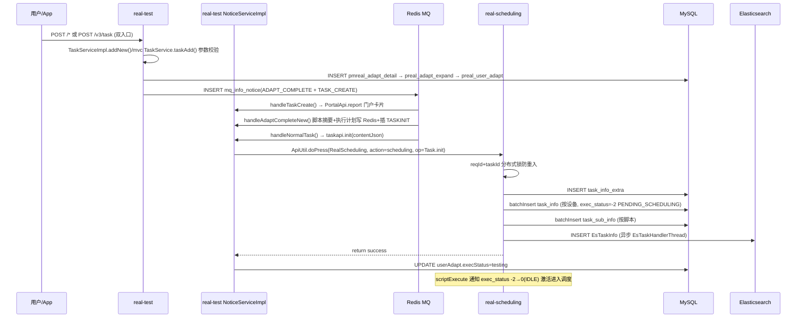
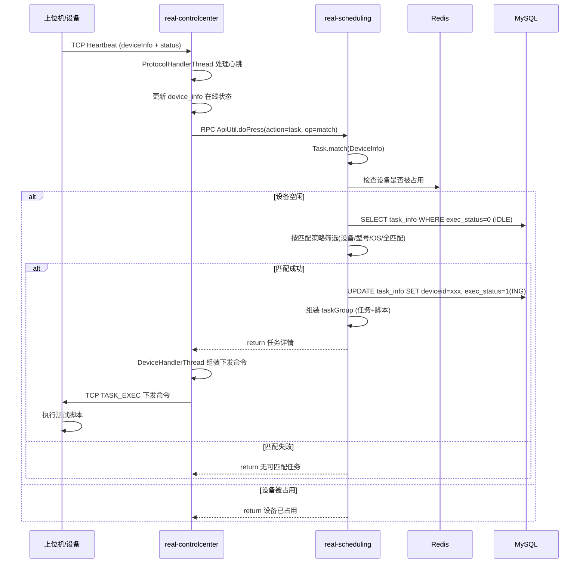
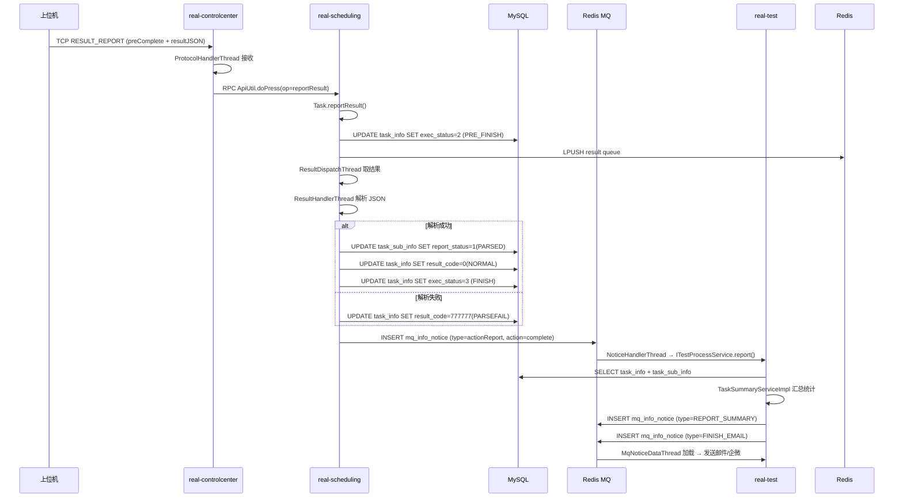
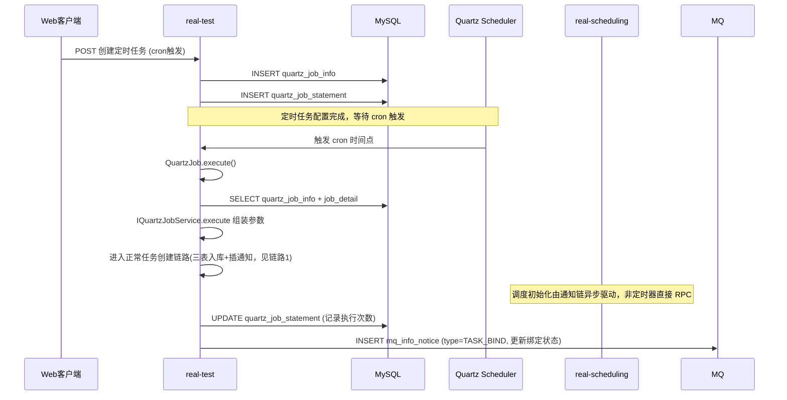
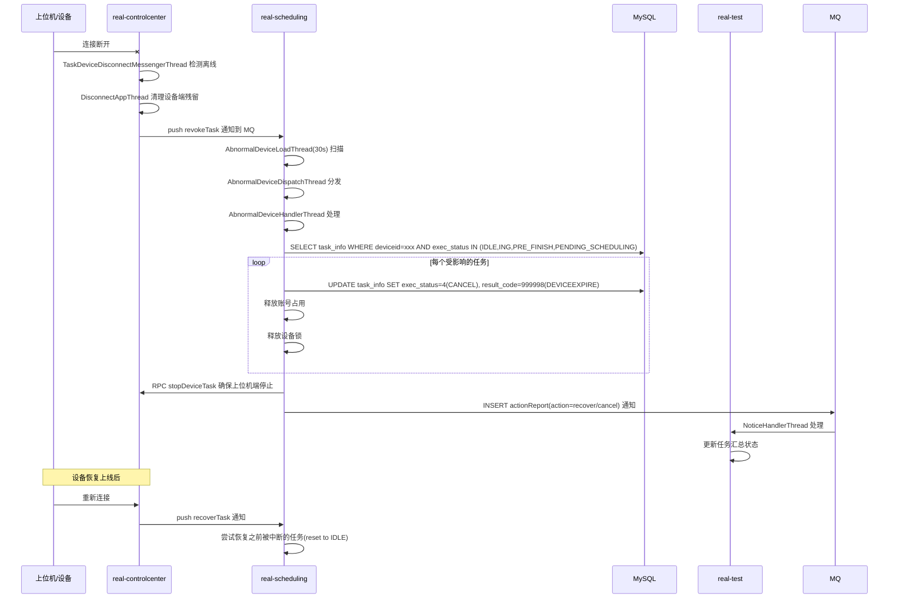

# 核心链路-总览

> 5 条跨模块核心流程，展示从任务创建到结果回收的完整数据流。

## 1. 任务创建全链路

### 简述

用户提交提测请求（双入口）→ app处理服务 三表入库（`pmreal_adapt_detail`/`preal_adapt_expand`/`preal_user_adapt`）+ 插 `ADAPT_COMPLETE`/`TASK_CREATE` 通知 → 通知链异步驱动：`handleAdaptCompleteNew` 生成脚本执行计划并插 `TASKINIT` → `handleNormalTask` 调 scheduling `TaskApi.init` → scheduling 拆分设备子任务并持久化 → ES 索引建立 → scheduling `scriptExecute` 通知激活任务（-2→0）进入调度。

### Mermaid 序列图

### 关键代码路径

| 步骤 | 文件 | 方法 |
|------|------|------|
| MVC 入口 | `real-test/.../mvc/controller/TaskController.java` | `taskAdd(TaskAddRequestDTO)` |
| ApiServlet 入口 | `real-test/.../service/app/Task.java` | `add(ApiRequest)` |
| 业务层创建 | `real-test/.../business/impl/TaskServiceImpl.java` | `addNew()` |
| TASKINIT 消费 | `real-test/.../business/impl/NoticeServiceImpl.java` | `handleNormalTask()` |
| 调度初始化 RPC | `real-test/.../api/scheduling/TaskApi.java` | `init(String)` |
| 调度侧入口 | `real-scheduling/.../service/scheduling/Task.java` | `init(ApiRequest)` |
| 业务实现 | `real-scheduling/.../business/impl/TaskServiceImpl.java` | `init(JSONObject)` |
| 激活执行 | `real-scheduling/.../business/impl/TaskServiceImpl.java` | `execute()` |
| ES 同步 | `real-scheduling/.../schedule/task/EsTaskHandlerThread.java` | `run()` |

### 核心发现

- 创建与调度初始化是**异步解耦**的：taskAdd 返回时 `task_info` 可能还没建，需等通知链消费完才由 handleNormalTask 调 taskapi.init
- 任务创建使用 Redis 分布式锁 `KEY("Task.init.DEAL", reqId + "_" + taskid)` 防止重复初始化
- 子任务初始状态为 `PENDING_SCHEDULING(-2)`，需要 `scriptExecute` 通知后才能转为 `IDLE(0)` 进入调度
- ES 索引写入是异步的，由 `EsTaskHandlerThread` 线程池处理，不影响主流程返回
- 跨服务调用走 `ApiUtil.doPress(RealScheduling, action=scheduling, op=Task.init)` RPC，不是 REST `/v3/scheduling/task/init`

## 2. 设备匹配与任务下发

### 简述

上位机通过 TCP 长连接发送心跳 → 设备控制中心 触发匹配请求 → 任务调度服务 根据设备信息匹配待执行任务 → 匹配成功下发任务命令 → 上位机开始执行脚本。

### Mermaid 序列图

### 匹配策略

源码：`real-scheduling/.../business/impl/AppTaskMatchBy*.java`

| 策略 | 类 | 匹配规则 |
|------|-----|----------|
| 按设备匹配 | AppTaskMatchByDeviceServiceImpl | 精确匹配 task_info.allow_deviceids 包含该 deviceId |
| 按型号匹配 | AppTaskMatchByModelServiceImpl | 匹配 task_info 中的手机型号要求 |
| 按OS匹配 | AppTaskMatchByOsServiceImpl | 匹配 task_info 中的 Android/iOS 版本 |
| 全匹配 | AppTaskMatchByAllServiceImpl | 综合所有条件匹配 |

### 关键代码路径

| 步骤 | 文件 | 方法 |
|------|------|------|
| 心跳处理 | `real-controlcenter/.../schedule/protocol/ProtocolHandlerThread.java` | handler heartbeat |
| 匹配入口 | `real-scheduling/.../service/scheduling/Task.java` | `match(ApiRequest)` |
| 匹配逻辑 | `real-scheduling/.../business/impl/TaskServiceImpl.java` | `matchDevice()` |
| 任务下发 | `real-controlcenter/.../schedule/task/DeviceHandlerThread.java` | exec task |

### 核心发现

- 设备匹配使用 Redis 队列（`scheduling:device:*`）缓存空闲设备信息，由 `DeviceDispatchThread` 轮询分发
- 匹配时有分布式锁 `KEY("taskMatch")` 防止同一任务被多设备同时匹配
- 任务下发是异步的，scheduling 只负责匹配和状态更新，不下发命令；下发由 controlcenter 的 `DeviceHandlerThread` 通过长连接完成
- Web/PC 测试使用独立的匹配策略类（`WebTaskMatch*`、`ClientTaskMatch*`），对应 `BrowserDispatchThread` 和 `ClientDispatchThread`

## 3. 结果回收

### 简述

上位机脚本执行完毕 → 通过长连接上报结果(preComplete) → 设备控制中心 转交 scheduling → scheduling 解析结果 JSON → 更新数据库 → 触发报告生成和通知 → app处理服务 汇总并发送邮件。

### Mermaid 序列图

### 关键代码路径

| 步骤 | 文件 | 方法 |
|------|------|------|
| 结果上报 | `real-scheduling/.../service/scheduling/Task.java` | `reportResult(ApiRequest)` |
| 结果分发 | `real-scheduling/.../schedule/result/ResultDispatchThread.java` | `run()` |
| 结果解析 | `real-scheduling/.../schedule/result/ResultHandlerThread.java` | `run()` |
| 结果业务 | `real-scheduling/.../business/impl/ResultServiceImpl.java` | `processResult()` |
| 通知 app处理服务 | `real-scheduling/.../business/impl/NoticeServiceImpl.java` | `handleActionReport()` |
| 报告汇总 | `real-test/.../business/impl/TaskSummaryServiceImpl.java` | 汇总入口 |

### 核心发现

- `ResultDispatchThread` 和 `ResultHandlerThread` 是成对的 Dispatch-Handler 模式，通过 Redis 队列解耦
- 解析失败的结果也会标记为 FINISH，但 resultCode 记录错误码（如 777777 解析失败、777778 结果丢失）
- `actionReport` 通知是 scheduling 向 app处理服务 传递状态变更的主要通道
- app处理服务 收到 `complete` action 后，会触发连锁反应：`TASK_SUMMARY` → `REPORT_SUMMARY` → `FINISH_EMAIL`

## 4. Quartz 定时调度

### 简述

用户在 app处理服务 配置定时任务 → Quartz Scheduler 到点触发 → app处理服务 QuartzJob.execute() → 调用 app处理服务 TaskService 创建真实任务 → 任务进入正常调度流程。

### Mermaid 序列图

### 关键代码路径

| 步骤 | 文件 | 方法 |
|------|------|------|
| Quartz 触发 | `real-test/.../quartz/QuartzJob.java` | `execute()` |
| 任务数据组装 | `real-test/.../business/impl/QuartzJobServiceImpl.java` | `buildTaskDetail()` |
| 真实任务创建 | `real-test/.../business/impl/TaskServiceImpl.java` | `addNew()` |
| 调度初始化 | `real-scheduling/.../service/scheduling/Task.java` | `init()` |
| 定时恢复 | `real-test/.../quartz/QuartzListenerThread.java` | 恢复中断的 job |

### 核心发现

- app处理服务 的 `QuartzListenerThread` 在启动时恢复因服务重启而中断的 Quartz Job
- 定时任务配置存储在 `quartz_job_info` 表（cron 表达式、任务参数等），执行记录在 `quartz_job_statement`
- 定时任务创建的真实任务与手动创建的任务走完全相同的初始化流程，不做特殊处理
- 任务绑定完成后通过 `TASK_BIND` 通知更新定时任务与真实 taskId 的关联

## 5. 设备异常恢复

### 简述

设备控制中心 检测到设备离线 → 触发异常处理流程 → scheduling 取消受影响的任务 → 释放设备占用 → 任务回收或标记为异常 → 通知 app处理服务 更新状态。

### Mermaid 序列图

### 关键代码路径

| 步骤 | 文件 | 方法 |
|------|------|------|
| 离线检测 | `real-controlcenter/.../schedule/device/AbnormalDeviceWorkerThread.java` | `run()` |
| 断开通知 | `real-controlcenter/.../schedule/notice/TaskDeviceDisconnectMessengerThread.java` | `run()` |
| 异常扫描 | `real-scheduling/.../schedule/device/AbnormalDeviceLoadThread.java` | `run()` (每30秒) |
| 异常处理 | `real-scheduling/.../business/impl/AbnormalDeviceServiceImpl.java` | `handleDeviceAbnormal()` |
| 任务取消 | `real-scheduling/.../business/impl/TaskServiceImpl.java` | `cancel()` |
| 状态通知 | `real-scheduling/.../business/impl/NoticeServiceImpl.java` | `handleRevokeTask()` / `handleRecoverTask()` |

### 核心发现

- 设备异常分为两级处理：controlcenter 负责离线检测和断开通知，scheduling 负责受影响任务的清理和恢复
- `AbnormalDeviceLoadThread` 每 30 秒扫描一次，批量处理而非实时，避免瞬时波动导致误判
- 取消范围覆盖所有中间态任务（IDLE、ING、PRE_FINISH、PENDING_SCHEDULING），不包括已 FINISH/CANCEL/SKIP
- 设备恢复后通过 `recoverTask` 通知（类型 1）将之前被标记 CANCEL 的任务恢复为 IDLE 继续等待匹配
- resultCode 用 999998(DEVICEEXPIRE) 区分设备异常取消和用户主动取消(888888)

## 相关双链

- 任务状态机：[核心链路-任务状态机](核心链路-任务状态机.md) -- 各链路中的状态转换细节
- 通知系统：[通知系统-总览](通知系统-总览.md) -- 链路中使用的通知类型
- 后台线程全景：[基础设施-后台线程全景](基础设施-后台线程全景.md) -- 各链路涉及的调度线程
- 模块间通信：[基础设施-模块间通信](基础设施-模块间通信.md) -- 链路中的 REST/RPC/MQ 调用
- 外部服务：[RealScheduling](../../任务调度服务（real-scheduling）/07-开放接口文档/00-模块索引.md) / [RealTest](../07-开放接口文档/00-模块索引.md) / [RealControlCenter](../../设备控制中心（real-controlcenter）/07-开放接口文档/00-模块索引.md)
