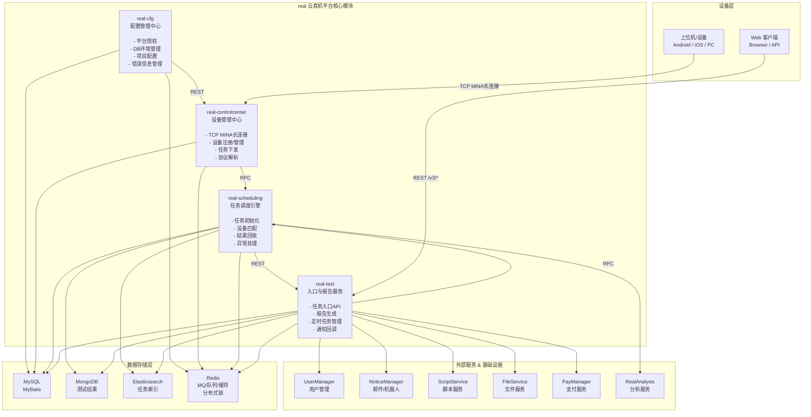

# 核心链路-架构全景

> real 云真机平台 4 模块 + 外部服务 + 存储层的架构关系总图。

## 架构全景图

## 模块职责

| 模块 | 职责 | 入口 | 存储 |
|------|------|------|------|
| 平台配置 | 平台授权、DB环境管理、项目配置、错误信息管理 | /* + /v3/* | MySQL + Redis |
| 设备控制中心 | TCP MINA 长连接、设备注册/管理、任务下发、协议解析 | /* + /v3/* + TCP:8000 | MySQL + Redis |
| 任务调度服务 | 任务初始化、设备匹配策略、结果回收解析、异常设备处理 | /* + /v3/* | MySQL + MongoDB + ES + Redis |
| app处理服务 | 任务入口API、报告生成(PDF/Excel)、定时任务管理、通知回调 | /* + /v3/* | MySQL + MongoDB + ES + Redis |

## 通信方式图例

| 方式 | 说明 | 使用场景 |
|------|------|----------|
| REST /v3/* | Spring MVC DispatcherServlet | Web 前端调用、模块间标准 REST |
| RPC | ApiServlet action/op 反射 | 模块间内部 RPC 调用 |
| TCP MINA | 自定义 4B header + JSON body | 上位机长连接 |
| Redis MQ | LPUSH/BLPOP 队列 | 通知系统、协议队列、匹配队列 |

## 相关文档

- [基础设施-双入口路由](基础设施-双入口路由.md) — HTTP 双入口详解
- [核心链路-上位机长连接](../../设备控制中心（real-controlcenter）/04-复杂功能细节/核心链路-上位机长连接.md) — TCP 入口详解
- [基础设施-模块间通信](基础设施-模块间通信.md) — 五种通信方式对比
- [核心链路-任务初始化](核心链路-任务初始化.md) — 完整任务创建流程
- [real 平台总览](公共-real仓总览.md) — 模块架构总览
