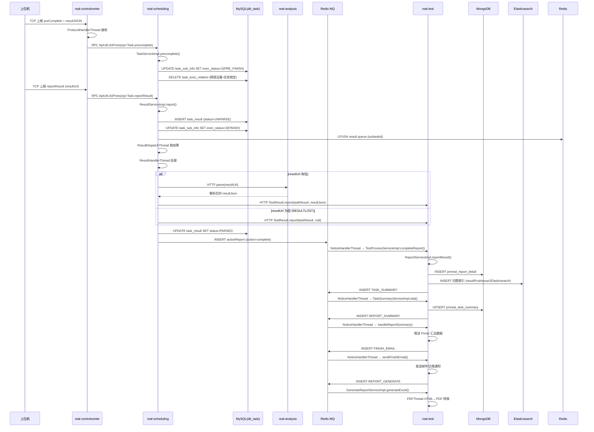

# 核心链路-结果回收与报告

> 上位机脚本执行完毕 → 通过长连接上报结果 → 设备控制中心 转交 scheduling → scheduling 解析结果 JSON → 更新数据库 → 触发报告生成和通知 → app处理服务 汇总统计 → 生成 Excel/PDF 报告 → 发送邮件/企微通知。

## 完整流程图



## 阶段拆解

### 阶段1: 脚本预完成 (任务调度服务 Task.precomplete)

```
TCP preComplete JSON → real-controlcenter ProtocolHandlerThread
  → ApiUtil.doPress(op=Task.precomplete, data={subtaskid, subsubtaskid, deviceid, inputParams, outputParams})
    → TaskServiceImpl.precomplete()
      → 加载 DbTaskInfo / DbTaskSubInfo
      → UPDATE task_sub_info SET exec_status=2(PRE_FINISH)
      → 存储 inputParams/outputParams/runinfo
      → 若所有 subsubtask 都 PRE_FINISH → clearRelation (释放设备-任务绑定)
      → 若有 accountId → 释放账号占用
      → 设置 publishtime = now + delayperiod (防止重新分发)
```

| 数据 | 来源 | 说明 |
|------|------|------|
| subtaskid / subsubtaskid | 上位机上报 | 定位子任务和脚本 |
| runinfo | 上位机上报 | 运行时长、内存等性能数据 |
| inputParams / outputParams | 脚本执行产出 | 参数化测试的输入输出变量 |

### 阶段2: 结果上报与解析 (任务调度服务 ResultService)

```
Task.reportResult(ApiRequest{resultUrl, subtaskid, subsubtaskid, retryNum, standard})
  → ResultServiceImpl.report()
    → 校验参数，加载 DbTaskInfo + DbTaskSubInfo
    → 构建 DbTaskResult:
        resultCode  = NORMAL / RESULTLOST (resultUrl为空) / DEVICEEXCEPTION (异常)
        status      = UNPARSE
        parseNum    = 0
    → cleanData() 清理重复上报 + 过期复测行
    → INSERT task_result
    → 若 retryNum==0: UPDATE task_sub_info SET exec_status=3(FINISH)
    → ResultDispatchThread 轮询 → ResultHandlerThread 处理
      → ResultServiceImpl.handle()
        → 防重: HANDLING_MAP.put(subSubtaskid, 5min)
        → HTTP real-analysis parse(resultUrl) 解析结果文件
        → 解析成功 → HTTP real-test TestResult.report(resultJson)
        → 解析失败 → 递增 parseNum，指数退避重试 (15s→30s→60s)
        → parseNum >= 30 → PARSEFAIL
        → 所有 subsubtask 完成 → actionReportNotice(COMPLETE)
        → UPDATE task_result SET status=PARSED
```

| 重试策略 | 延迟 | 触发条件 |
|----------|------|----------|
| 第 1-3 次 | 15s | 网络超时/解析服务繁忙 |
| 第 4-6 次 | 30s | 持续失败 |
| 第 7-29 次 | 60s | 长时间不可用 |
| 第 30 次 | — | 标记 PARSEFAIL (777777) |

### 阶段3: 报告汇总与通知 (app处理服务)

```
scheduling actionReport(action=complete) → Redis MQ
  → real-test NoticeHandlerThread
    → TestProcessServiceImpl.completeReport()
      → 若 unexecutedNum==0: 标记任务完成
      → 若 subtaskNum==0: modifyTaskRunInfo → modifyUserAdapt (execStatus=finish)
      → 发布 FINISH_EMAIL 通知

scheduling TestResult.report(resultJson) → real-test
  → ReportServiceImpl.reportResult()
    → parseNormalResult() / parseIllegalResult() → PmrealReportDetail
    → INSERT pmreal_report_detail (MongoDB)
    → resultPushIssue2Elasticsearch (ES 问题索引)
    → tasksummaries2Notice() → 发布 TASK_SUMMARY 通知

TASK_SUMMARY → NoticeHandlerThread
  → TaskSummaryServiceImpl.stat()
    → 聚合 pmreal_report_detail → pmreal_task_summary (MongoDB)
    → notice2portal() → 发布 REPORT_SUMMARY

REPORT_SUMMARY → NoticeHandlerThread
  → handleReportSummary()
    → 汇总设备数/脚本分类统计
    → 推送 Portal 汇总数据到 real-portal / testin-core

FINISH_EMAIL → NoticeHandlerThread
  → handleEmailNotice()
    → Redis 防重: taskid_handleEmailNotice
    → sendFinishEmail() 发送邮件
    → 企微通知 (如配置)

REPORT_GENERATE → NoticeHandlerThread
  → GenerateReportServiceImpl.generateExcel(taskid)
  → PDFThread: Html2PdfUtils.htmlToFile → 上传 FileService
```

| 通知类型 | 生产者 | 消费者 | 触发时机 |
|----------|--------|--------|----------|
| actionReport(complete) | scheduling | app处理服务 | 所有脚本结果解析完成 |
| TASK_SUMMARY | app处理服务 | app处理服务 | 每条结果写入 MongoDB 后 |
| REPORT_SUMMARY | app处理服务 | app处理服务 | 汇总统计完成后 |
| FINISH_EMAIL | app处理服务 | app处理服务 | 任务完全结束后 |
| REPORT_GENERATE | app处理服务 | app处理服务 | 需要生成 Excel/PDF |

## 关键代码路径

| 步骤 | 文件 | 方法 |
|------|------|------|
| 预完成入口 | `real-scheduling/.../service/scheduling/Task.java` | `precomplete(ApiRequest)` |
| 预完成业务 | `real-scheduling/.../business/impl/TaskServiceImpl.java` | `precomplete()` |
| 结果上报入口 | `real-scheduling/.../service/scheduling/Task.java` | `reportResult(ApiRequest)` |
| 结果存储 | `real-scheduling/.../business/impl/ResultServiceImpl.java` | `report()` |
| 结果分发 | `real-scheduling/.../schedule/result/ResultDispatchThread.java` | `run()` |
| 结果解析 | `real-scheduling/.../schedule/result/ResultHandlerThread.java` | `run()` |
| 结果处理 | `real-scheduling/.../business/impl/ResultServiceImpl.java` | `handle()` |
| 完成通知 | `real-scheduling/.../business/impl/NoticeServiceImpl.java` | `handleActionReport()` |
| 结果接收 | `real-test/.../service/app/TestResult.java` | `report(ApiRequest)` |
| 结果写入 | `real-test/.../business/impl/ReportServiceImpl.java` | `reportResult()` |
| 完成回调 | `real-test/.../business/impl/TaskProcessServiceImpl.java` | `completeReport()` |
| 任务汇总 | `real-test/.../business/impl/TaskSummaryServiceImpl.java` | `stat()` |
| 通知处理 | `real-test/.../business/impl/NoticeServiceImpl.java` | `handle()` 分发 |
| Excel 生成 | `real-test/.../business/impl/GenerateReportServiceImpl.java` | `generateExcel()` |
| PDF 生成 | `real-test/.../schedule/pdf/PDFThread.java` | `run()` |

## 核心发现

- **两段式上报**：上位机先发 `preComplete`（标记脚本完成、释放设备），再发 `reportResult`（上传结果文件 URL），分离状态变更和数据传输
- **Dispatch-Handler 模式**：`ResultDispatchThread` 从 Redis 队列取结果 ID，提交 `ResultHandlerThread` 到线程池（core=10, max=50），通过 `processmap` 防并发
- **指数退避重试**：解析失败最多重试 30 次，延迟从 15s 逐步增长到 60s，约 7-8 小时后标记 `PARSEFAIL`
- **结果码语义**：NORMAL(0) 正常、RESULTLOST(777778) 结果文件丢失、PARSEFAIL(777777) 解析失败、DEVICEEXCEPTION(999998) 设备异常
- **通知链串联**：`actionReport(complete)` → `TASK_SUMMARY` → `REPORT_SUMMARY` → `FINISH_EMAIL`，每个通知触发下一环，形成流水线
- **MongoDB 存结果**：报告明细存 MongoDB (`pmreal_report_detail`)，汇总存 MongoDB (`pmreal_task_summary`)，利用文档模型灵活存储变长结果字段
- **ES 存问题**：脚本错误信息写入 ES 索引，支持全文检索和聚合分析

## 相关文档

- [核心链路-设备匹配与下发](../../设备控制中心（real-controlcenter）/04-复杂功能细节/核心链路-设备匹配与下发.md) — 上游：任务下发后执行
- [核心链路-任务初始化](核心链路-任务初始化.md) — 上游：任务创建
- [核心链路-设备异常恢复](../../设备控制中心（real-controlcenter）/04-复杂功能细节/核心链路-设备异常恢复.md) — 异常场景：设备离线导致结果丢失
- [核心链路-任务状态机](核心链路-任务状态机.md) — exec_status: ING(1) → PRE_FINISH(2) → FINISH(3)
- [通知系统-总览](通知系统-总览.md) — 5 种通知类型的完整生命周期
- [通知系统-NoticeServiceImpl详细流程](通知系统-NoticeServiceImpl详细流程.md) — handleActionReport → handleTaskSummariesNotice → handleReportSummary → handleEmailNotice 通知串联链
- [基础设施-后台线程全景](基础设施-后台线程全景.md) — ResultDispatchThread, ResultHandlerThread, PDFThread
- [基础设施-模块间通信](基础设施-模块间通信.md) — REST RPC + Redis MQ 通信方式
