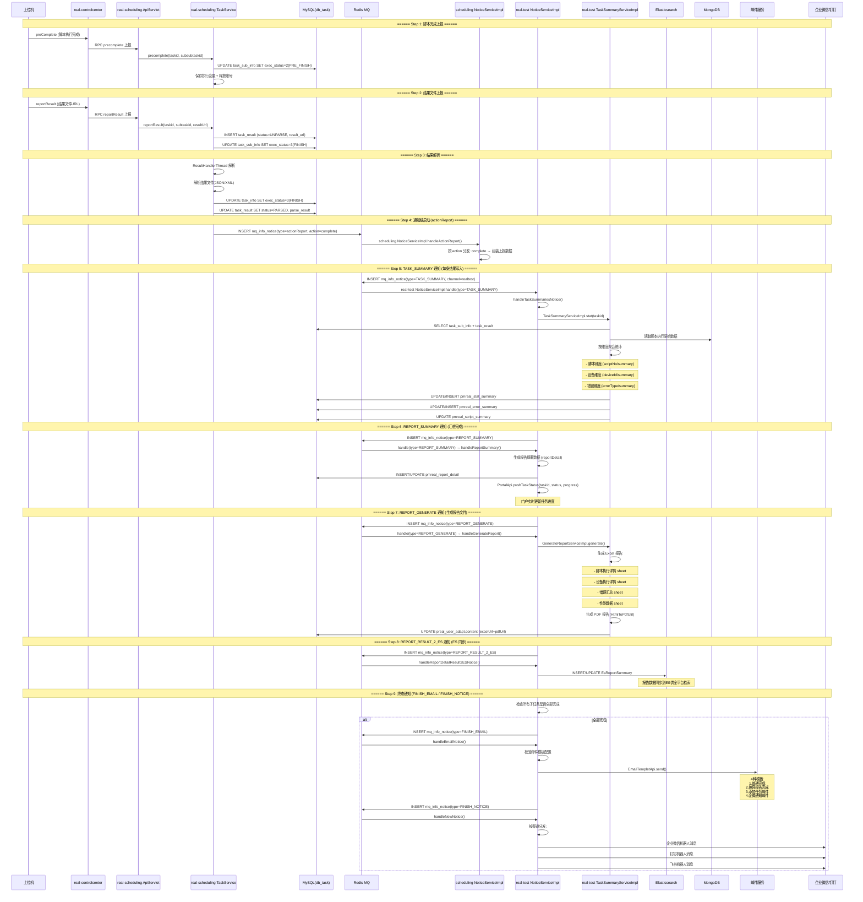
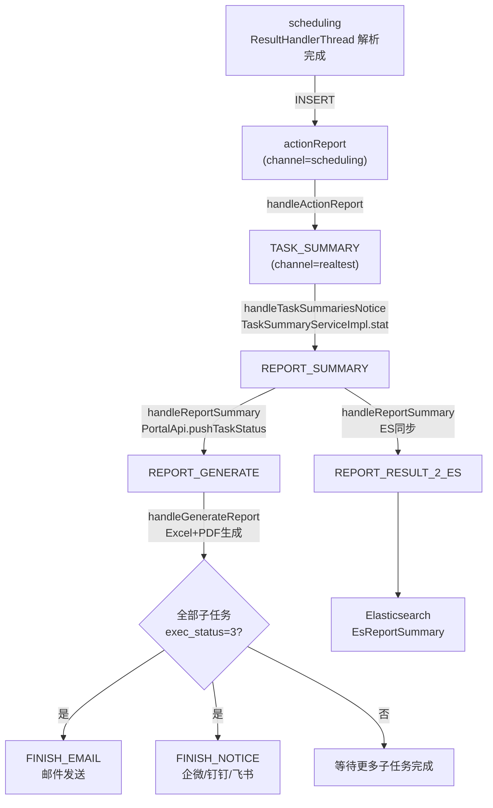

# 核心链路-结果回收与报告通知

> 上位机完成脚本执行 → controlcenter 上报 preComplete → scheduling reportResult 入库 → ResultHandlerThread 解析 → NoticeServiceImpl **6 条串联通知链** (actionReport → TASK_SUMMARY → REPORT_SUMMARY → REPORT_GENERATE → FINISH_EMAIL → REPORT_RESULT_2_ES) → app处理服务 报告汇总 → Excel/PDF 生成 → 邮件/企微/钉钉发送

## 端到端序列图



## 6 条串联通知链详解

### Chain 1: actionReport (scheduling → realtest)

```
scheduling ResultHandlerThread 解析完成:
  → INSERT mq_info_notice(type=actionReport, channel=scheduling)
      action = complete (任务完成) / recover (设备恢复) / cancel (取消)

scheduling NoticeServiceImpl.handleActionReport():
  → 按 action 分发:
      complete → 组装 taskResult 数据
      cancel → 组装 cancelInfo
      recover → 组装 recoverInfo
  → INSERT mq_info_notice(type=TASK_SUMMARY, channel=realtest)
```

### Chain 2: TASK_SUMMARY (realtest 内部)

```
real-test NoticeServiceImpl.handle(type=TASK_SUMMARY):
  → handleTaskSummariesNotice()
    → TaskSummaryServiceImpl.stat(taskid):
        1. SELECT task_sub_info (所有子子任务)
        2. SELECT task_result (所有解析结果)
        3. Mongo 读取脚本执行原始数据
        4. 按维度聚合:
           ├─ 脚本维度 → PmrealScriptSummary (每脚本一条)
           ├─ 设备维度 → PmrealStatSummary (每设备一条)
           ├─ 错误维度 → PmrealErrorSummary (每错误类型一条)
           └─ 类别维度 → CategorySummaryInfo (分类汇总)
        5. INSERT/UPDATE pmreal_stat_summary
        6. INSERT/UPDATE pmreal_error_summary
        7. INSERT/UPDATE pmreal_script_summary
```

### Chain 3: REPORT_SUMMARY (门户推送)

```
handleTaskSummariesNotice() 完成后:
  → INSERT mq_info_notice(type=REPORT_SUMMARY)

handleReportSummary():
  1. SELECT pmreal_stat_summary WHERE taskid
  2. SELECT pmreal_script_summary WHERE taskid
  3. 构建 reportDetail JSON (报告前端展示数据)
  4. INSERT pmreal_report_detail
  5. PortalApi.pushTaskStatus(taskid, status, progress):
       → 门户实时显示"已完成 8/10 设备"
```

### Chain 4: REPORT_GENERATE (文件生成)

```
handleReportSummary() 完成后:
  → INSERT mq_info_notice(type=REPORT_GENERATE)

handleGenerateReport():
  → GenerateReportServiceImpl.generate(taskid):
      1. 读取统计汇总数据
      2. 生成 Excel:
         - ScriptDetailSheet (脚本详情)
         - DeviceDetailSheet (设备详情)
         - ErrorSummarySheet (错误汇总)
         - PerformanceSheet (性能数据)
      3. 上传到文件服务 → excelUrl
      4. 生成 PDF (HtmlToPdfUtil + 模板):
         - 读 Excel 数据 → HTML → PDF
         - 上传文件服务 → pdfUrl
      5. UPDATE preal_user_adapt.content {excelUrl, pdfUrl}
```

### Chain 5: REPORT_RESULT_2_ES (ES 同步)

```
handleReportSummary() 完成后:
  → INSERT mq_info_notice(type=REPORT_RESULT_2_ES)

handleReportDetailResult2ESNotice():
  → SELECT pmreal_report_detail
  → 构建 EsReportSummary 文档:
      {taskid, projectid, eid, deviceCount, scriptCount,
       passRate, errorRate, totalTime, createTime}
  → ES.upsert(index=real_report_summary, id=taskid)
  → 供全平台检索和统计分析
```

### Chain 6: FINISH_EMAIL + FINISH_NOTICE (终态通知)

```
所有子任务 exec_status=3(FINISH) 后:
  → INSERT mq_info_notice(type=FINISH_EMAIL)

handleEmailNotice():
  1. SELECT task 汇总数据
  2. 校验邮件配置 (是否启用邮件通知)
  3. 匹配邮件模板 (4种):
     ├─ EmailTypeEnum.FINISH: 任务完成通知
     ├─ EmailTypeEnum.COMPATIBLE: 兼容报告通知
     ├─ EmailTypeEnum.ADD_TASK: 创建任务通知
     └─ EmailTypeEnum.WECHAT: 企微通知
  4. EmailTempletApi.send(emailTask):
       {to, subject, content, attachments: [excelUrl, pdfUrl]}

  → INSERT mq_info_notice(type=FINISH_NOTICE)

handleNewNotice():
  1. SELECT pmreal_robot_channel (用户配置的通知渠道)
  2. 按 channelType 分发:
     ├─ WECOM → WeChatApi.sendRobotMsg()
     ├─ DINGTALK → DingTalkApi.send()
     └─ FEISHU → FeishuApi.send()
  3. 消息内容: {taskid, taskDescr, passRate, totalTime, reportUrl}
```

## 通知链串行依赖



## 通知链汇总

| 顺序 | 通知类型 | 通道 | 触发条件 | 消费者 | 产物 |
|------|----------|------|----------|--------|------|
| 1 | **actionReport** | scheduling→realtest | 结果解析完成 | scheduling NoticeServiceImpl | 组装数据 |
| 2 | **TASK_SUMMARY** | realtest | actionReport到达 | app处理服务 NoticeServiceImpl → TaskSummaryServiceImpl | 统计汇总 DB 记录 |
| 3 | **REPORT_SUMMARY** | realtest | TASK_SUMMARY完成 | app处理服务 NoticeServiceImpl | 门户推送 + reportDetail |
| 4 | **REPORT_GENERATE** | realtest | REPORT_SUMMARY完成 | app处理服务 NoticeServiceImpl | Excel + PDF 文件 |
| 5 | **REPORT_RESULT_2_ES** | realtest | REPORT_SUMMARY完成 | app处理服务 NoticeServiceImpl | ES 同步 |
| 6a | **FINISH_EMAIL** | realtest | 全部子任务完成 | app处理服务 NoticeServiceImpl | 邮件发送 |
| 6b | **FINISH_NOTICE** | realtest | 全部子任务完成 | app处理服务 NoticeServiceImpl | 企微/钉钉/飞书消息 |

## 关键代码路径

| 步骤 | 文件 | 方法 |
|------|------|------|
| 结果上报 | `real-scheduling/.../service/scheduling/Task.java` | `reportResult(ApiRequest)` |
| 结果解析 | `real-scheduling/.../business/impl/ResultServiceImpl.java` | `handle()` |
| actionReport 处理 | `real-scheduling/.../business/impl/NoticeServiceImpl.java` | `handleActionReport()` |
| TASK_SUMMARY 处理 | `real-test/.../business/impl/NoticeServiceImpl.java` | `handleTaskSummariesNotice()` |
| 任务汇总统计 | `real-test/.../business/impl/TaskSummaryServiceImpl.java` | `stat()` |
| REPORT_SUMMARY 处理 | `real-test/.../business/impl/NoticeServiceImpl.java` | `handleReportSummary()` |
| 报告生成 | `real-test/.../business/impl/GenerateReportServiceImpl.java` | `generate()` |
| ES 同步 | `real-test/.../business/impl/NoticeServiceImpl.java` | `handleReportDetailResult2ESNotice()` |
| 邮件处理 | `real-test/.../business/impl/NoticeServiceImpl.java` | `handleEmailNotice()` |
| 新消息通知 | `real-test/.../business/impl/NoticeServiceImpl.java` | `handleNewNotice()` |

## 核心发现

- **6 条通知严格串行**：TASK_SUMMARY 必须等 actionReport 先到达才能开始统计；REPORT_GENERATE 和 REPORT_RESULT_2_ES 都依赖 REPORT_SUMMARY 的输出
- **两阶段上报**：preComplete(脚本级) → reportResult(结果File级)，区分执行状态和结果数据
- **ResultHandlerThread 异步解析**：结果文件 URL → 下载 → 解析 → 入库，不阻塞上报响应
- **TaskSummaryServiceImpl 是多维度聚合中心**：脚本/设备/错误/类别四个维度同时统计
- **邮件4模板分支**：根据 EmailTypeEnum 和用户配置选择不同模板和发送渠道
- **ES 同步用于检索**：报告摘要同步到 ES 后支持全平台按 project/eid/时间范围检索

## 相关文档

- [核心链路-结果回收与报告](核心链路-结果回收与报告.md) — Step8-9 技术细节
- [通知系统-NoticeServiceImpl详细流程](通知系统-NoticeServiceImpl详细流程.md) — Chain A-D 完整 handler 详细流程图
- [核心链路-通知系统拓扑](核心链路-通知系统拓扑.md) — MQ→3线程→5目标 机制
- [核心链路-任务执行流程](核心链路-任务执行流程.md) — 完整 9 阶段端到端
- [核心链路-任务创建](核心链路-任务创建.md) — 前置流程
- [核心链路-任务取消与异常恢复](核心链路-任务取消与异常恢复.md) — 异常中断时的状态处理
