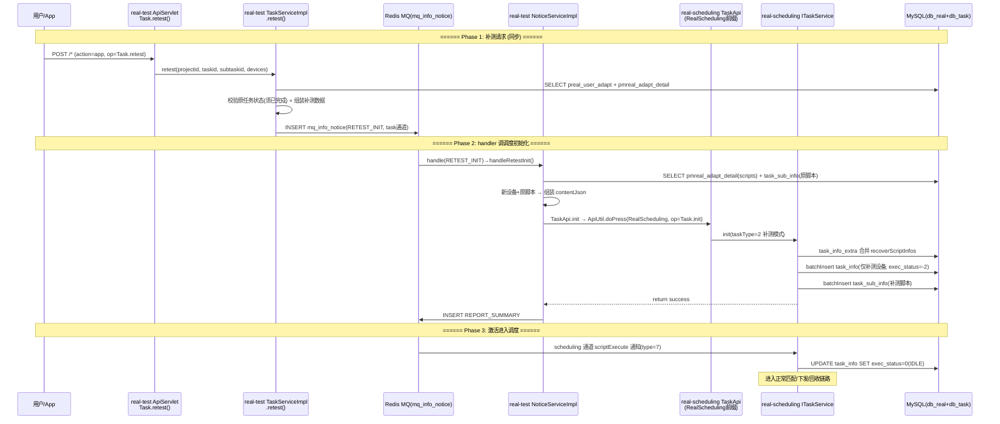
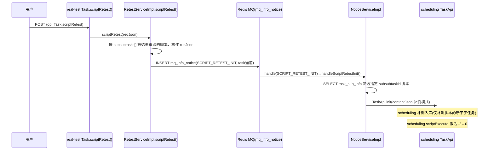
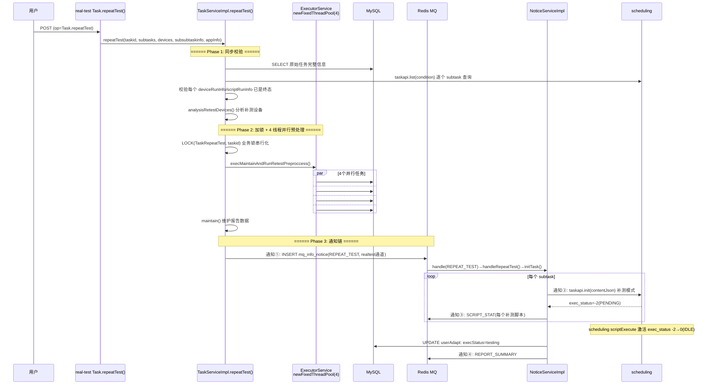

# 核心链路-补测复测

> 三种补测模式：设备补测(retest) / 脚本补测(scriptRetest) / 批量补测(repeatTest) → 业务层组装补测数据插通知 → NoticeServiceImpl handler 组装 contentJson 调 scheduling Task.init(补测模式 taskType=2) → 合并 recoverScriptInfos 增量入库 → scheduling 侧 scriptExecute 通知激活（-2→0）→ 进入调度。

## 补测类型对比

| 补测类型 | ApiServlet op | 触发参数 | 补测粒度 | 通知(通道) |
|----------|--------------|----------|----------|-----------|
| 设备补测 | Task.retest | taskid + subtaskid + devices[] | 换设备，原脚本重跑 | RETEST_INIT(task通道) |
| 脚本补测 | Task.scriptRetest | taskid + subtaskid + subsubtasks[] | 指定子子任务重跑 | SCRIPT_RETEST_INIT(task通道) |
| 批量补测 | Task.repeatTest | taskid + subtasks[] + devices[] + subsubtaskinfo{} | 设备+脚本任意组合 | REPEAT_TEST(realtest通道) |

共同设计：**三种形态都不新建任务**，只往原任务补增量子任务；调度侧入库复用 `Task.init`（taskType=2 补测模式走合并分支），原任务数据保留不变。

## 端到端序列图 (设备补测)



## 脚本补测流程 (scriptRetest)



## 批量补测流程 (repeatTest) — 4 异步任务



### repeatTest 的 4 个异步通知

| # | 通知类型 | 触发位置 | 作用 |
|---|----------|----------|------|
| ① | **REPEAT_TEST** | TaskServiceImpl.repeatTest() 末尾 | 触发 handleRepeatTest → initTask 完整处理 |
| ② | **taskapi.init** | initTask() 每个 subtask 同步 RPC | scheduling 补测模式入库(exec_status=-2) |
| ③ | **SCRIPT_STAT** | initTask() 每个补测脚本 | 重新统计脚本维度汇总 (handleScriptSummary) |
| ④ | **REPORT_SUMMARY** | initTask() 全部 subtask 处理完毕 | 生成报告摘要 + PortalApi 推送门户 |

> 激活任务的是 scheduling 侧 `scriptExecute` 通知（scheduling 通道 type=7），与 `TASK_INIT_NOTICE`（realtest 通道 type=115，仅同步测试计划模块）是两回事，勿混淆。

## NoticeServiceImpl 补测相关 handler

### handleRetestInit (RETEST_INIT)

```
handleRetestInit (NoticeServiceImpl.java):
  1. content → taskid, subtaskid, 新设备列表
  2. SELECT pmreal_adapt_detail (scripts)
  3. SELECT task_sub_info (原脚本列表)
  4. 新设备 + 原脚本 → 组装 contentJson
  5. taskapi.init(contentJson) 补测模式
  6. publish REPORT_SUMMARY
```

### handleScriptRetestInit (SCRIPT_RETEST_INIT)

```
handleScriptRetestInit (NoticeServiceImpl.java):
  1. content → taskid, subtaskid, subsubtasks[]
  2. SELECT task_sub_info WHERE subtaskid
  3. 筛选指定 subsubtaskid 的脚本
  4. 构建 contentJson (仅含选中脚本)
  5. taskapi.init(contentJson) 脚本级别初始化
```

### handleRepeatTest (REPEAT_TEST) → initTask 全链路

```
handleRepeatTest (NoticeServiceImpl.java):
  1. content 反序列化 → taskid + subtasks[] + retestDevices[] + retestDetail{} + retestDataRunInfos[] + appInfo
  2. 校验: adaptDetail.execStandard (DATA 模式必须有 retestDataRunInfos)
  3. 校验: userAdapt 不为空
  4. → initTask(taskid, subtasks, retestDevices, retestDetail, userAdapt, retestDataRunInfos, appInfo)

initTask() 内部:
  ① 组装 init 参数:
     - 获取 adaptDetail (execStandard/scripts/devices/accounts/params/...)
     - 获取 adaptExpand (startupPath/appMd5/...)
     - 对每个 subtask:
         - 构建 deviceArray(补测设备) + scriptArray(补测脚本)
         - 含参数来源(paramSource): 原设备数据 → 替换为新设备ID
         - 补测换包(appInfo): 替换 packageUrl/pkgName/startupPath/appMd5
         - 构建 contentJson (含 newDevices/newScripts/retestMark)
     - UPDATE userAdapt: execStatus=testing, cancelled=normal
  ② 对每个 subtask 调 taskapi.init(contentJson):
     → scheduling 补测模式入库: task_info_extra 合并 recoverScriptInfos, 仅 INSERT 增量
  ③ 对每个补测脚本发 SCRIPT_STAT: handleScriptSummary 重新统计 pmreal_script_summary
  ④ 全部处理完发 REPORT_SUMMARY: handleReportSummary 生成摘要 + PortalApi 推送
  ⑤ return SUCCESS
```

## 通知链汇总

| 顺序 | 通知类型 | 通道 | 场景 | 消费者 | 作用 |
|------|----------|------|------|--------|------|
| 1 | **RETEST_INIT** | task | 设备补测 | handleRetestInit | 组装 contentJson 调 taskapi.init |
| 2 | **SCRIPT_RETEST_INIT** | task | 脚本补测 | handleScriptRetestInit | 组装 contentJson 调 taskapi.init |
| 3 | **REPEAT_TEST** | realtest | 批量补测入口 | handleRepeatTest→initTask | 逐 subtask 调 taskapi.init |
| 4 | **SCRIPT_STAT** | realtest | 批量补测 initTask 内 | handleScriptSummary | 每个补测脚本重算汇总 |
| 5 | **scriptExecute** | scheduling | scheduling init 后 | handleScriptExecute | 激活补测任务 exec_status -2→0 |
| 6 | **REPORT_SUMMARY** | realtest | handler 末尾 | handleReportSummary | 报告摘要+门户推送 |

## 补测初始化与正常创建的区别

| 维度 | 正常创建 | 补测模式 |
|------|----------|----------|
| taskType | 1 | 2 (补测) |
| task_info_extra | DELETE + INSERT | 合并 recoverScriptInfos |
| task_info | 全量 INSERT | 仅 INSERT 补测设备的新子任务 |
| task_sub_info | 全量 INSERT | 仅 INSERT 补测脚本的新子子任务 |
| 通知链 | TASK_CREATE + ADAPT_COMPLETE → TASKINIT | RETEST_INIT/SCRIPT_RETEST_INIT/REPEAT_TEST → taskapi.init |
| 原任务数据 | — | 保留不变 |

## 关键代码路径

| 步骤 | 文件 | 方法 |
|------|------|------|
| 设备补测入口 | `real-test/.../service/app/Task.java` | `retest(ApiRequest)` |
| 脚本补测入口 | `real-test/.../service/app/Task.java` | `scriptRetest(ApiRequest)` |
| 批量补测入口 | `real-test/.../service/app/Task.java` | `repeatTest(ApiRequest)` |
| 补测业务层 | `real-test/.../business/impl/TaskServiceImpl.java` | `retest()` / `repeatTest()` |
| 脚本补测业务 | `real-test/.../business/impl/RetestServiceImpl.java` | `scriptRetest()` |
| RETEST_INIT 处理 | `real-test/.../business/impl/NoticeServiceImpl.java` | `handleRetestInit()` |
| SCRIPT_RETEST_INIT 处理 | `real-test/.../business/impl/NoticeServiceImpl.java` | `handleScriptRetestInit()` |
| REPEAT_TEST 处理 | `real-test/.../business/impl/NoticeServiceImpl.java` | `handleRepeatTest()` |
| 补测初始化 | `real-scheduling/.../business/impl/TaskServiceImpl.java` | `init(补测模式)` |
| 激活任务 | `real-scheduling/.../business/impl/TaskServiceImpl.java` | `execute()` |

## 核心发现

- **复用 init 链路**：所有补测模式都复用 scheduling Task.init，与正常创建走相同的初始化入口，仅在 taskType=2 时走合并分支
- **激活是 scheduling 的 scriptExecute**：补测子任务入库后 exec_status=-2，由 scheduling 通道 scriptExecute 通知(handleScriptExecute→ITaskService.execute)激活为 0(IDLE)；`TASK_INIT_NOTICE`(realtest 通道 115)只同步测试计划模块，不参与激活
- **repeatTest 的 4 异步通知**：`REPEAT_TEST` → `initTask()` 内部逐 subtask 同步 RPC `taskapi.init()` + 每个补测脚本发 `SCRIPT_STAT`(异步) + 全部完成发 `REPORT_SUMMARY`(异步)，保证统计和报告在任务入库后正确生成
- **repeatTest 的 4 线程并行预处理**：`execMaintainAndRunRetestPreproccess` 用 `newFixedThreadPool(4)` 并行执行 `addRetestMark`/`maintainTestParams`/`maintainTestDevice`/`runningMark2Runinfo`，将 DB 写并行化；并行的是 DB 写，整体仍是同步阻塞
- **补测通知分属两条通道**：`RETEST_INIT`、`SCRIPT_RETEST_INIT` 挂 task 通道（30 线程），`REPEAT_TEST` 挂 realtest 通道（100 线程）
- **最小化入库**：补测只在 DB 新增需要补充的子任务/子子任务，不影响已完成的原始任务数据
- **参数来源替换**：补测换设备时必须将原设备参数分配策略(deviceid→新deviceid)替换，否则参数来源发不到新设备
- **SCRIPT_STAT 去重**：仅对未统计过的 subtask 发脚本汇总，已完成统计的不重复发

## 相关文档

- [核心链路-任务创建](核心链路-任务创建.md) — 正常创建流程 (init 的正常模式分支)
- [核心链路-任务初始化](核心链路-任务初始化.md) — scheduling Task.init 技术细节
- [通知系统-NoticeServiceImpl详细流程](通知系统-NoticeServiceImpl详细流程.md) — handleRetestInit + handleScriptRetestInit + handleRepeatTest 详细流程图
- [核心链路-通知系统拓扑](核心链路-通知系统拓扑.md) — 通知投递机制
- [核心链路-任务状态机](核心链路-任务状态机.md) — 补测子任务的状态流转
- [补测复测实现](../03-实现逻辑/补测复测实现.md) — 三形态入口与 4 线程预处理的主干实现
