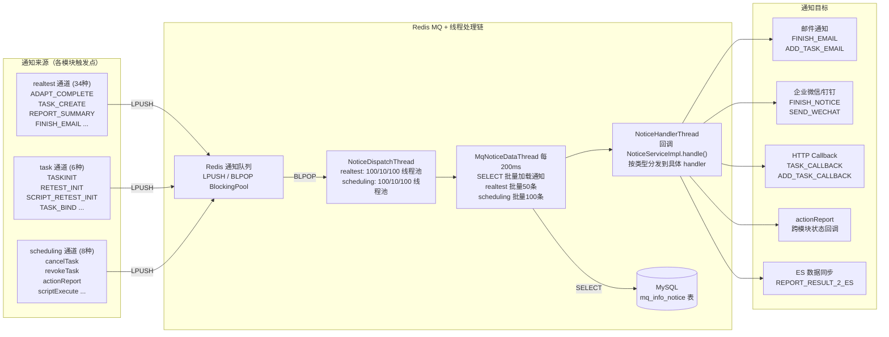
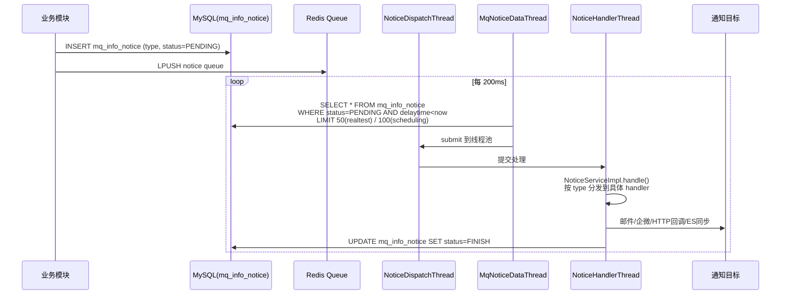

# 核心链路-通知系统拓扑

> 通知来源（3 通道 ~43 种） → Redis MQ → 线程处理链（NoticeDispatchThread → MqNoticeDataThread → NoticeHandlerThread） → 5 类通知目标（邮件/企微/钉钉/HTTP回调/ES同步）的完整拓扑。

## 通知系统拓扑图

## 三线程处理链

## 通知类型详细

| 通道 | 通知类型 | 触发点 | 消费者 | 目标 |
|------|----------|--------|--------|------|
| realtest | ADAPT_COMPLETE | 适配完成后 | NoticeServiceImpl | 门户同步 |
| realtest | TASK_CREATE | 任务创建后 | NoticeServiceImpl | 门户上报 |
| realtest | TASK_SUMMARY | 每条结果写入后 | TaskSummaryServiceImpl | 任务汇总 |
| realtest | REPORT_SUMMARY | 汇总完成后 | NoticeServiceImpl | Portal 推送 |
| realtest | FINISH_EMAIL | 任务全部完成 | NoticeServiceImpl | 邮件发送 |
| realtest | REPORT_GENERATE | 需要生成报告 | GenerateReportServiceImpl | Excel/PDF |
| realtest | SEND_WECHAT | 企微通知 | NoticeServiceImpl | 企业微信 |
| task | TASKINIT | scheduling init完成 | NoticeHandlerThread | app处理服务 收尾 |
| task | RETEST_INIT | 复测初始化 | NoticeHandlerThread | app处理服务 处理 |
| task | TASK_BIND | 定时任务触发后 | NoticeHandlerThread | 绑定 job-task 关系 |
| scheduling | cancelTask | 任务取消 | NoticeServiceImpl | 跨模块同步 |
| scheduling | revokeTask | 设备离线撤销 | AbnormalDeviceService | 异常处理 |
| scheduling | actionReport | 结果解析完成 | TestProcessServiceImpl | app处理服务 回调 |
| scheduling | scriptExecute | 脚本执行授权 | TaskServiceImpl | 激活任务(-2→0) |

## 失败重试策略

| 条件 | 策略 |
|------|------|
| execNum < 3 | 立即重试 |
| 3 ≤ execNum ≤ 10 | 延迟 10 秒重试 |
| execNum > 10 且 > 1小时 | 标记为 INVALID |
| 通知有效期 | 5 小时（超时自动失效） |
| 延迟投递 | delaytime 字段控制 |
| 优先级 | level 字段控制线程池优先级（0=最高） |

## 相关文档

- [通知系统-总览](通知系统-总览.md) — 各通知类型详解与生命周期
- [通知系统-NoticeServiceImpl详细流程](通知系统-NoticeServiceImpl详细流程.md) — 每个 handler 的详细 Mermaid 流程图 + 6 条通知串联链
- [核心链路-结果回收与报告](核心链路-结果回收与报告.md) — 通知链触发流程
- [核心链路-任务初始化](核心链路-任务初始化.md) — TASKINIT 通知流程
- [基础设施-后台线程全景](基础设施-后台线程全景.md) — NoticeDispatchThread, MqNoticeDataThread, NoticeHandlerThread
- [基础设施-模块间通信](基础设施-模块间通信.md) — Redis MQ 通信方式
