# 通知系统-NoticeServiceImpl 详细流程

> 深入 app处理服务 和 任务调度服务 两个 NoticeServiceImpl，展开每条通知从插入 DB → Redis LPUSH → MqNoticeDataThread 轮询 → NoticeDispatchThread 分发 → NoticeHandlerThread 处理 → handle() 按类型分发 → 具体 handler 的完整链路，以及 handler 之间的通知串联。

## 架构总览：插入 → 消费 完整链路

```mermaid
flowchart TD
    subgraph Produce["通知产生（各业务模块）"]
        P1["TaskProcessServiceImpl<br/>completeReport()"]
        P2["ReportServiceImpl<br/>tasksummaries2Notice()"]
        P3["TaskSummaryServiceImpl<br/>notice2portal()"]
        P4["TaskServiceImpl<br/>sendEmail()"]
        P5["AdaptServiceImpl<br/>完善适配"]
        P6["RetestServiceImpl<br/>补测流程"]
    end

    subgraph Insert["入库 + 入队"]
        I1["build MqInfoNotice<br/>type/level/delaytime/expiretime"]
        I2["imqinfonoticedao.insert()<br/>→ MySQL mq_info_notice"]
        I3["Redis LPUSH<br/>queueKey → BlockingPool"]
    end

    subgraph Poll["MqNoticeDataThread 每200ms轮询"]
        Q1["listByPending(vhost, types, 0, batchSize)<br/>realtest: 50条 / scheduling: 100条"]
        Q2["按 publishtime ASC 排序"]
        Q3["pushJobqueue → BlockingPool"]
    end

    subgraph Dispatch["NoticeDispatchThread 分发"]
        D1["pool.take(workerId) → BLOCK"]
        D2["processmap 防重 check"]
        D3["submit NoticeHandlerThread<br/>到线程池 (core=10, max=100)"]
    end

    subgraph Handle["NoticeHandlerThread 处理"]
        H1["noticeService.handle(notice)"]
        H2["按 type 值 if-else 路由"]
        H3["具体 handler() 执行业务逻辑"]
        H4["RESULT_SUCCESS → status=FINISH<br/>RESULT_FAILURE → execNum+1, 延迟重试<br/>RESULT_INVALID → status=INVALID"]
    end

    Produce --> Insert
    Insert --> Poll
    Poll --> Dispatch
    Dispatch --> Handle
```

## 失败重试策略

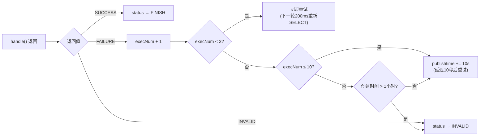

---

## 一、app处理服务 NoticeServiceImpl

源码：`real-test/.../business/impl/NoticeServiceImpl.java`（~13800 行）

### 1.1 handle() 分发机制

采用 **纯 if-else-if 链**（非 switch/枚举/反射），按 `notice.getType()` 字符串值匹配 `NoticeConfig.InfoNoticeType`：

```java
if (InfoNoticeType.ADAPT_COMPLETE.getValue().equals(notice.getType())) {
    result = handleAdaptCompleteNew(mqInfoNotice);
} else if (InfoNoticeType.TASK_CREATE.getValue().equals(notice.getType())) {
    result = handleTaskCreate(mqInfoNotice);
} else if (...) { ... }
```

处理前会重新从 DB 加载通知行，若 `status != STATUS_PROCESS` 则当作已完成跳过（幂等）。

### 1.2 完整分发表（41 条路由）

| type | 枚举 | handler | 行号 | 是否发布后续通知 |
|------|------|---------|------|-----------------|
| 1 | TASKINIT | handleNormalTask | 10504 | → REPORT_STAT, TASK_SUMMARY, REPORT_SUMMARY |
| 2 | ADAPT_COMPLETE | handleAdaptCompleteNew | 2895 | → APP_DETECT 或 TASKINIT |
| 3 | TASK_CREATE | handleTaskCreate | 1730 | → REPORT_STAT(SPOT_TEST时) |
| 4 | REPORT_SUMMARY | handleReportSummary | 7392 | 终端（推送Portal） |
| 5 | APP_DETECT | handleAppDetect | 7954 | 无（处理完后重新走ADAPT_COMPLETE） |
| 6 | TASK_SUMMARY | handleTaskSummariesNotice | 1704 | 无 |
| 10 | REPORT_STAT | handleReportStat | 7718 | → REPORT_SUMMARY |
| 11 | SCRIPT_STAT | handleScriptSummary | 7817 | 无 |
| 12 | SCRIPT_INIT | handleScriptSummaryInit | 7834 | 无 |
| 13 | TASK_ERROR_SUMMARY | handleTaskErrorSummary | 7882 | 无 |
| 15 | REPORT_GENERATE | handleGenerateReport | 11096 | 无 |
| 17 | RETEST_INIT | handleRetestInit | 11375 | → REPORT_SUMMARY |
| 18 | MONITOR_MARKINFOS | handleMonitorMarkinfos | 12107 | 无 |
| 19 | MONITOR_REPORT | handleMonitorReport | 12335 | 无 |
| 20 | REREST_COMPLETE | hanldeRetestComplete | 12356 | → REPORT_STAT, REPORT_SUMMARY, RETEST_INIT |
| 21 | SCRIPT_RETEST_COMPLETE | handleScriptRetestComplete | 13222 | → SCRIPT_RETEST_INIT |
| 22 | SCRIPT_RETEST_INIT | handleScriptRetestInit | 13440 | 无 |
| 23 | CHECK_INFO | handleCheckInfo | 13764 | 无 |
| 24 | GRAPH_REPORT_GENERATE | handleReportGraphExcel | 1633 | 无 |
| 25 | REPORT_GENERATE_PLAN | handleGeneratePlanReport | 11146 | 无 |
| 30 | REPORT_RESULT_2_ES | handleReportDetailResult2ESNotice | 1665 | 无 |
| 31 | TASK_SUMMARY_SUBTASK | handleSubTaskSummary | 1610 | 无 |
| 32 | TASK_QC_2_ES | handleHistoryQCReportES | 1681 | 无 |
| 33 | REPEAT_TEST | handleRepeatTest | 409 | → SCRIPT_STAT, REPORT_SUMMARY |
| 34 | TASK_BIND | handleBindTest | 357 | 无 |
| 77 | CROSS_CANCEL | handleCrossCancel | 3974 | 无 |
| 94 | FINISH_NOTICE | handleNewNotice | 8332 | 无（终端：发送企微/钉钉） |
| 95 | ADD_TASK_EMAIL | handleEmailNotice | 8265 | 无（终端：发送邮件） |
| 96 | SEND_WECHAT | hanldeSendWechat | 12969 | 无（终端：发送微信） |
| 97 | SEND_MSG | handleSendMsg | 8041 | 无（终端：发送短信） |
| 98 | TASKRUNINFO_INIT | handleTaskRunInfoInit | 7924 | 无 |
| 99 | FINISH_EMAIL | handleEmailNotice | 8265 | 无（终端：发送邮件） |
| 110 | TASK_CALLBACK | handleCallback | 13181 | 无（终端：HTTP回调） |
| 112 | ADD_TASK_CALLBACK | handleTaskCreateCallback | 13201 | 无（终端：HTTP回调） |
| 113 | SCRIPT_FAIL_NOTICE | handleScriptFailNotice | 8387 | 无（终端：企微通知） |
| 114 | SCRIPT_RESULT_NOTICE | handleScriptResultNotice | 8550 | 无（通知TestPlan） |
| 115 | TASK_INIT_NOTICE | handleTaskInitNotice | 8683 | 无（通知TestPlan） |
| 116 | TASK_COMPLETE_NOTICE | handleTaskCompleteNotice | 8754 | 无（通知TestPlan） |
| 117 | TASK_MATCH_OR_RECOVER_NOTICE | handleTaskMatchOrRecoverNotice | 8841 | 无（通知TestPlan） |
| 118 | SCRIPT_FAIL_SEND_NOTICE | handleScriptFailSendNotice | 11179 | 无（终端：企微通知） |

> ADD_TASK_EMAIL(95) 和 FINISH_EMAIL(99) 共享 `handleEmailNotice`，内部按 content.emailType 分支。

---

## 二、链A：正常任务生命周期（核心主链）

这是最重要的通知链，覆盖从任务创建到报告的完整流程。

### 2.1 链A总流程图

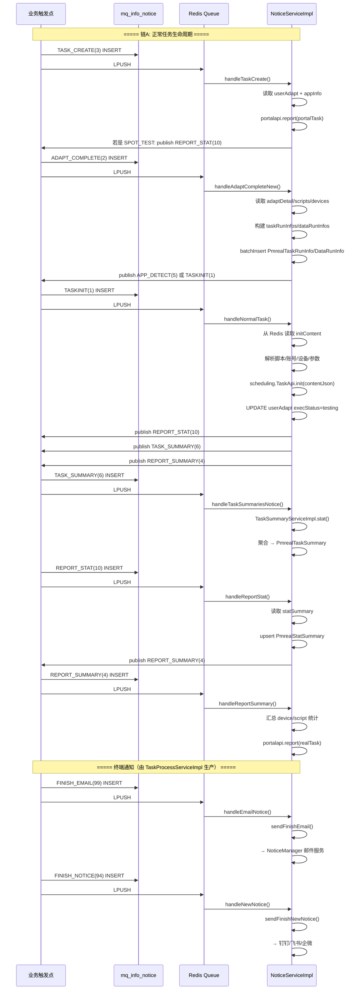

### 2.2 TASK_CREATE(3) → handleTaskCreate

```
handleTaskCreate (line 1730)
  → 解析 content: taskid
  → SELECT PrealUserAdapt, PrealAdaptExpand, PmrealAdaptDetail
  → 构建 AppInfo（应用名/版本/包名）
  → portalapi.report(portalTask)  [上报Portal创建记录]
  → 如果 bizCode==SPOT_TEST:
      → addNotice(REPORT_STAT, taskid)  [发布 REPORT_STAT(10)]
```

### 2.3 ADAPT_COMPLETE(2) → handleAdaptCompleteNew（最大handler）

```
handleAdaptCompleteNew (line 2895)
  → 解析 content: taskid, isInitFinish, isAppDetectFinish
  → SELECT PrealUserAdapt + PrealAdaptExpand + PmrealAdaptDetail
  → SELECT 脚本列表 (ScriptApi.list)
  → SELECT 设备列表 (DeviceApi.list)
  → 构建 taskRunInfoList:
      每个 executeCount: DeviceRunInfo (subtaskid + scriptId 列表)
      每个 executeCount: ScriptRunInfo (subtaskid + 脚本分配方案)
  → 构建 dataRunInfoList (DATA标准):
      每个 round: DeviceRunInfo + ScriptRunInfo
  → batchInsert PmrealTaskRunInfo + PmrealDataRunInfo
  → 更新 PrealAdaptExpand + PmrealAdaptDetail
  → 如果 userAdapt.checkApp==APP_DETECT_WAIT:
      → publish APP_DETECT(5)
  → 如果 isInitFinish:
      → 构建 initContent（脚本/账号/设备/参数/dependScriptParams）
      → Redis SET initContentKey = initContent
      → publish TASKINIT(1)
      → 如果 SPOT_TEST && monitorIds 存在:
          → publish MONITOR_MARKINFOS(18)
```

### 2.4 TASKINIT(1) → handleNormalTask

```
handleNormalTask (line 10504)
  → 解析 content: taskid
  → Redis GET initContentKey
  → SELECT userAdapt + adaptDetail
  → 解析:
      scripts (本地参数/账号/设备分配)
      accounts (账号匹配与锁定)
      devices (设备分配方案)
      recoverScriptInfos (可恢复脚本)
      dependScriptParams (依赖脚本参数)
      control infos (控制信息)
  → scheduling.TaskApi.init(contentJson)  [调用 scheduling 初始化]
  → UPDATE userAdapt.execStatus = testing
  → DELETE Redis initContentKey
  → publish REPORT_STAT(10)     (SPOT_TEST 时)
  → publish TASK_SUMMARY(6)
  → publish REPORT_SUMMARY(4)
```

### 2.5 TASK_SUMMARY(6) → handleTaskSummariesNotice

```
handleTaskSummariesNotice (line 1704)
  → 解析 content: taskid, isall
  → TaskSummaryServiceImpl.stat(taskid, isall):
      → 聚合 pmreal_report_detail
      → 构建/更新 PmrealTaskSummary (MongoDB)
          totalDevices, devicePass, deviceFail, deviceTimeout
          totalScripts, scriptPass/Fail/Timeout/Cancel/Skip
          categorySummary, deviceSessionCount
  → 不发布后续通知
```

### 2.6 REPORT_STAT(10) → handleReportStat

```
handleReportStat (line 7718)
  → 解析 content: taskid
  → SELECT PmrealStatSummary (不存在则创建)
  → SELECT PmrealTaskRunInfo 或 PmrealDataRunInfo
  → statSummarys() 统计:
      totalDevices, deviceFinishCount
      scriptPassCount/FailCount/TimeoutCount...
  → upsert PmrealStatSummary
  → publish REPORT_SUMMARY(4)
```

### 2.7 REPORT_SUMMARY(4) → handleReportSummary

```
handleReportSummary (line 7392)
  → 解析 content: taskid
  → SELECT userAdapt + adaptDetail + portalTask
  → SELECT PmrealStatSummary + PmrealTaskSummary
  → 汇总:
      device: total/pass/fail/timeout/cancel
      script: total/pass/fail/timeout/cancel/skip (按分类)
      scriptTotalExecTime (calculateTotalDuration 合并重叠时间段)
      categorySummary (错误分类统计)
  → portalapi.report(realTask)  [推送到 testin-core/Portal]
  → 终端（不再发布后续通知）
```

---

## 三、链B：终端通知（完成后的外部推送）

这些通知由 `TaskProcessServiceImpl.completeReport()` 生产，`NoticeServiceImpl` 消费。

### 3.1 终端通知生产（TaskProcessServiceImpl）

```
TaskProcessServiceImpl.completeReport() (line 125)
  → 如果 unexecutedNum==0 (子任务全部完成):
      → UPDATE PmrealDataRunInfo (DATA标准)
      → UPDATE PmrealTaskRunInfo.finishTime
      → 如果计费任务: publish PAY(14)
  → 如果 subtaskNum==0 (整个任务完成):
      → modifyTaskRunInfo() + modifyUserAdapt(execStatus=finish)
      → 跨端通知 (bizCode 4200)
      → publish TASK_COMPLETE_NOTICE(116) (TESTIN_TEST_PLAN)
  → 如果用户配置了邮件 && 非取消:
      → publish FINISH_EMAIL(99)      ← 延迟 2 分钟
  → 如果用户配置了机器人:
      → publish FINISH_NOTICE(94)     ← 延迟 2 分钟
  → 如果用户配置了回调:
      → publish TASK_CALLBACK(110)    ← 延迟 2 分钟
```

### 3.2 FINISH_EMAIL(99) / ADD_TASK_EMAIL(95) → handleEmailNotice

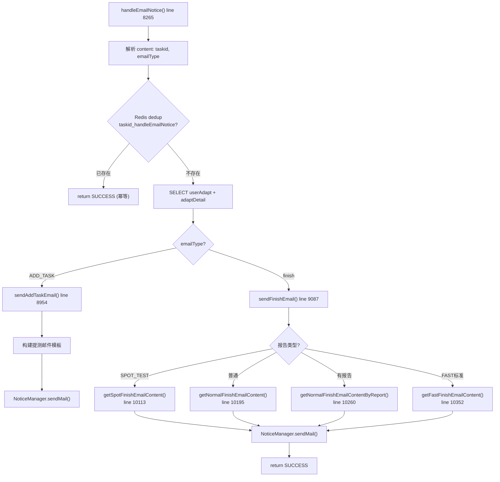

### 3.3 FINISH_NOTICE(94) → handleNewNotice

```
handleNewNotice (line 8332)
  → 解析 content: taskid
  → Redis dedup: taskid_handleNewNotice
  → sendFinishNewNotice() (line 9778):
      → 读取用户通知渠道配置 (钉钉/飞书/企微)
      → 构建消息模板 (任务名/结果概览/耗时)
      → → 钉钉 Robot WebHook
      → → 飞书 Robot WebHook
      → → 企业微信 Robot WebHook
  → return SUCCESS
```

### 3.4 TASK_CALLBACK(110) → handleCallback

```
handleCallback (line 13181)
  → 解析 content: taskid
  → SELECT userAdapt
  → IExtendService.callback(taskid, finishStatus)
      → HTTP POST → 用户配置的回调 URL
      → body: taskId, finishStatus, scriptSummary
```

---

## 四、链C：补测/复测链路

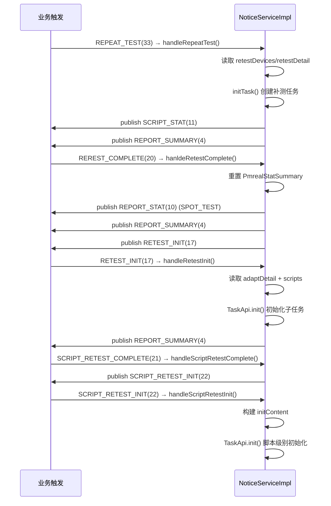

### 4.1 REPEAT_TEST(33) → handleRepeatTest (批量补测入口)

```
handleRepeatTest (line 409)
  → 解析 content: taskid, subtasks, retestDevices, retestDetail, retestDataRunInfo, appInfo
  → 遍历 subtasks:
      → initTask() 为每个补测子任务初始化:
          → build taskdetailJson
          → scheduling.TaskApi.init()
          → addNotice(SCRIPT_STAT, ...)
          → addNotice(REPORT_SUMMARY, ...)
  → return SUCCESS
```

---

## 五、链D：报告生成链

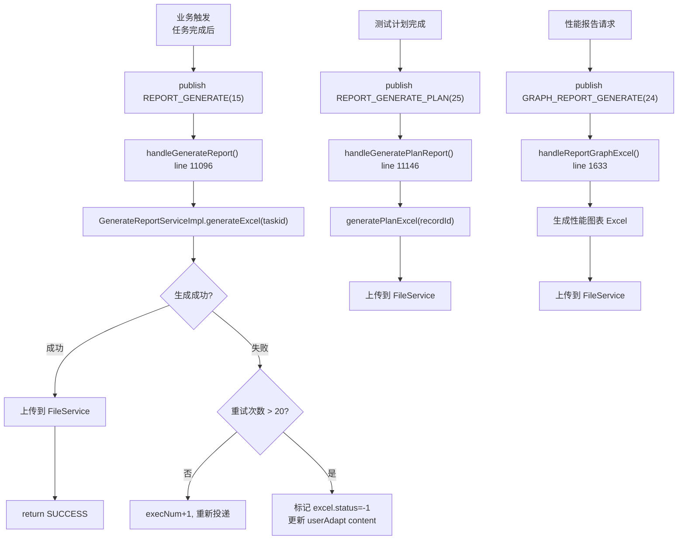

---

## 六、链E：ES 数据同步

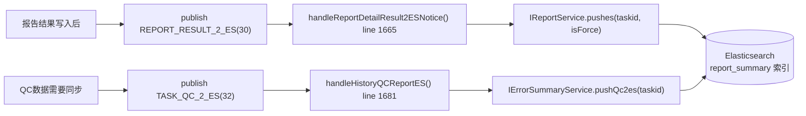

---

## 七、链F：TestPlan 模块通知

4 种通知类型，由 `TaskServiceImpl` 在任务生命周期各节点生产，NotifyServiceImpl 消费后通知 平台基础功能服务 的 TestPlan 模块：

| type | 通知 | 触发时机 | handler |
|------|------|----------|---------|
| 114 | SCRIPT_RESULT_NOTICE | 每条脚本执行完成 | handleScriptResultNotice → TestPlan 记录脚本结果 |
| 115 | TASK_INIT_NOTICE | 任务初始化完成 | handleTaskInitNotice → TestPlan 同步任务信息 |
| 116 | TASK_COMPLETE_NOTICE | 整个任务完成 | handleTaskCompleteNotice → TestPlan 标记任务完成 |
| 117 | TASK_MATCH_OR_RECOVER_NOTICE | 子任务下发/回收 | handleTaskMatchOrRecoverNotice → TestPlan 同步子任务状态 |

---

## 八、任务调度服务 NoticeServiceImpl

源码：`real-scheduling/.../business/impl/NoticeServiceImpl.java`

### 8.1 总览

scheduling 通知链是 **DB-polled** 的：`MqNoticeDataThread` 每 200ms 从 `mq_info_notice` 表批量 SELECT（一次 100 条），推入 `BlockingPool`，由 `NoticeDispatchThread` 分发到 `NoticeHandlerThread`。

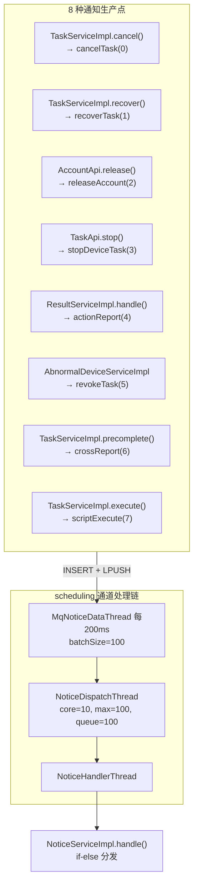

### 8.2 分发逻辑

```java
if ("cancelTask".equals(notice.getType())) {
    result = handleCancelTask(notice);
} else if ("recoverTask".equals(notice.getType())) {
    result = handleRecoverTask(notice);
} else if ("releaseAccount".equals(notice.getType())) {
    result = handleReleaseAccount(notice);
} else if ("stopDeviceTask".equals(notice.getType())) {
    result = handleStopDeviceTask(notice);
} else if ("actionReport".equals(notice.getType())) {
    result = handleActionReport(notice);
} else if ("revokeTask".equals(notice.getType())) {
    result = handleRevokeTask(notice);
} else if ("crossReport".equals(notice.getType())) {
    result = handleCrossReport(notice);
} else if ("scriptExecute".equals(notice.getType())) {
    result = handleScriptExecute(notice);
}
```

### 8.3 逐 handler 流程图

#### cancelTask(0) — 取消任务

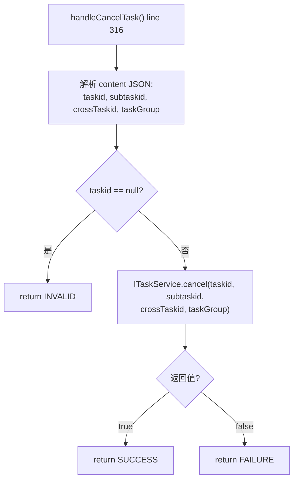

#### recoverTask(1) — 回收任务（设备恢复）

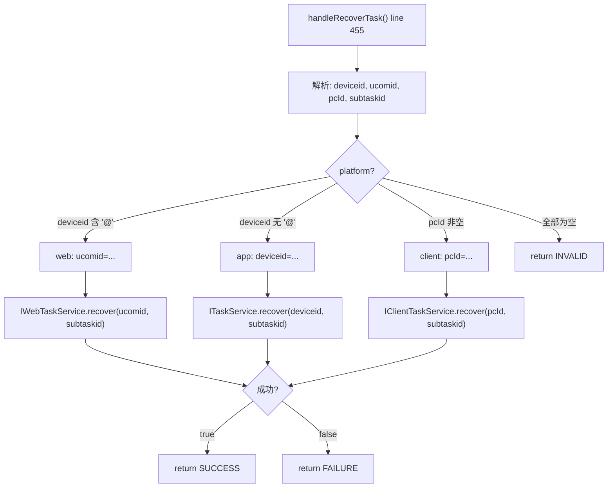

#### releaseAccount(2) — 释放账号

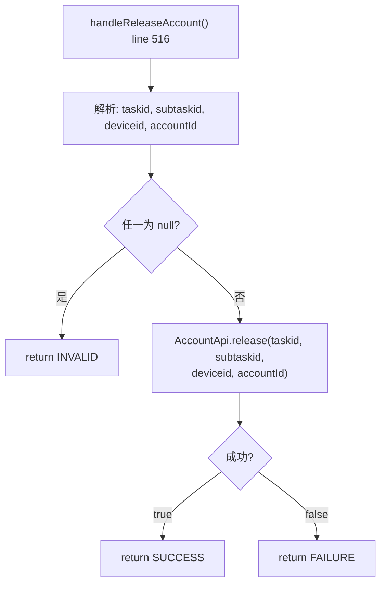

#### stopDeviceTask(3) — 停止设备任务

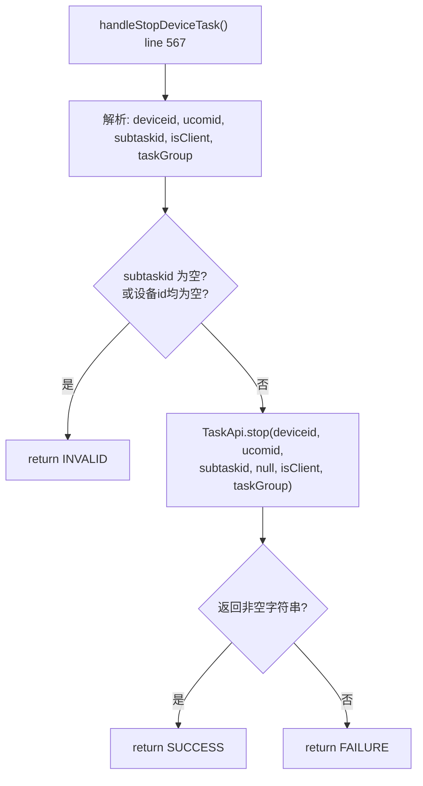

#### actionReport(4) — scheduling 动作上报 app处理服务（关键跨模块回调）

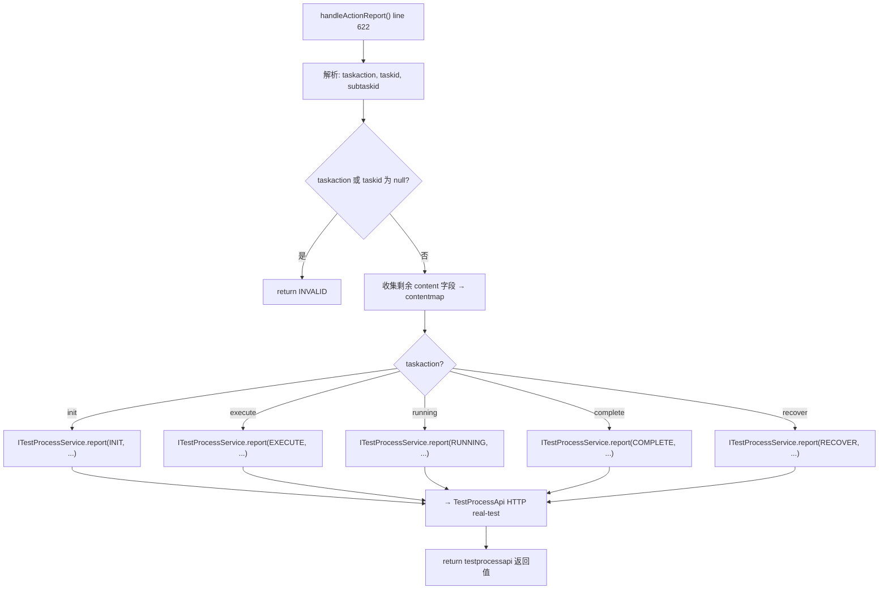

actionReport 是 scheduling 向 app处理服务 传递状态变更的核心通道。complete action 最重要——触发 app处理服务 的 `TaskProcessServiceImpl.completeReport()`，进而连锁发布 FINISH_EMAIL、FINISH_NOTICE、TASK_CALLBACK。

#### revokeTask(5) — 设备异常批量取消

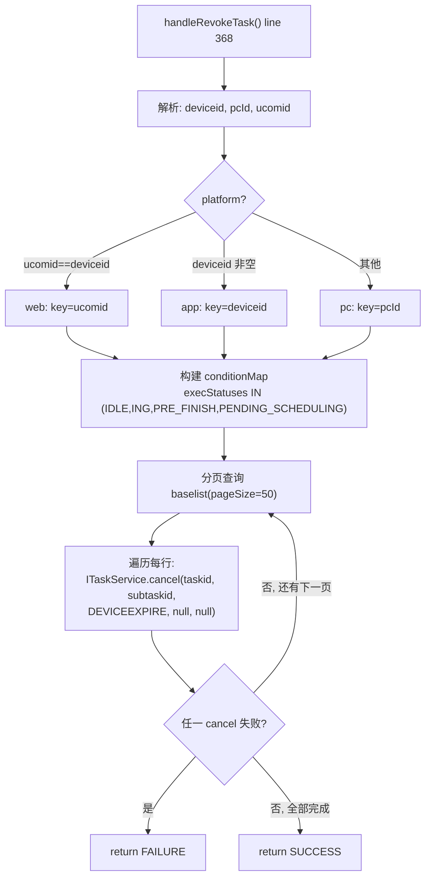

#### crossReport(6) — 跨端上报

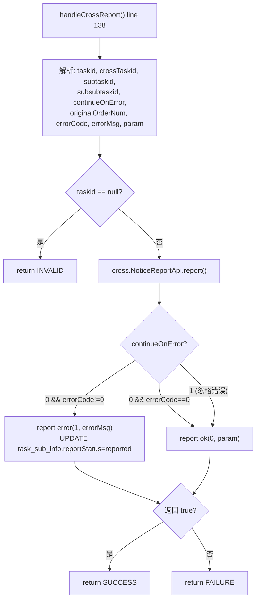

#### scriptExecute(7) — 激活任务至待执行

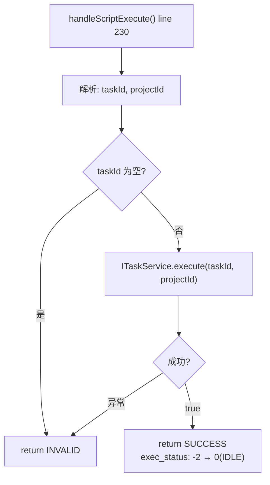

### 8.4 scheduling 通知有效性

| 属性 | 值 | 说明 |
|------|-----|------|
| 有效时长 | 1 小时 | `notice.getExpiretime()`，超时未消费 → INVALID |
| 最大重试 | 10 次 | execNum > 10 且 >1h → INVALID |
| 延迟重试 | +10s | execNum ≥ 3 时推后 publishtime |
| 轮询间隔 | 200ms | MqNoticeDataThread |
| 批量大小 | 100 条 | 每轮至多推送 100 条 |

---

## 九、通知插入流程（公共机制）

两个模块共享 `AbstractNoticeServiceImpl.add()`（real-common）：

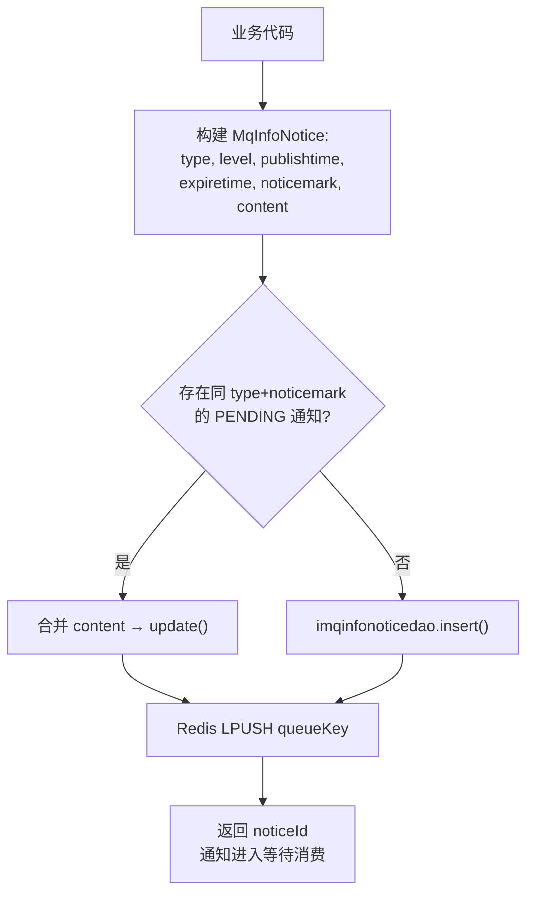

- content JSON 中自动注入 `traceId`（log4j 当前线程 traceId）
- 分表策略：`mq_info_notice_{vhost}_{type}` 或 `mq_info_notice`，由 `MqInfoNoticeDAOImpl.resolveDispatchTable()` 决定

---

## 十、两模块对比

| 维度 | app处理服务 | 任务调度服务 |
|------|-----------|-----------------|
| 通知类型数 | 41 种 | 8 种 |
| 通道 | realtest + task（两条） | scheduling（一条） |
| 批量大小 | 50 条 | 100 条 |
| 线程池 | realtest: 100/10/100 | 100/10/100 |
| 最大 handler | handleAdaptCompleteNew (~1000行) | handleRevokeTask (批量分页) |
| 通知串联 | 多：TASK_CREATE→ADAPT→TASKINIT→SUMMARY→REPORT | 少：各 handler 独立 |
| 终端通知 | FINISH_EMAIL/NOTICE/CALLBACK/WECHAT/SMS | actionReport→app处理服务 继续处理 |
| 有效时长 | 5 小时 | 1 小时 |

## 相关文档

- [通知系统-总览](通知系统-总览.md) — 通知系统概览与类型清单
- [核心链路-通知系统拓扑](核心链路-通知系统拓扑.md) — 拓扑 Mermaid 图
- [核心链路-结果回收与报告](核心链路-结果回收与报告.md) — 链A+链B 的触发源头（actionReport → FINISH_EMAIL）
- [核心链路-任务初始化](核心链路-任务初始化.md) — handleNormalTask (TASKINIT) 触发点
- [核心链路-设备异常恢复](../../设备控制中心（real-controlcenter）/04-复杂功能细节/核心链路-设备异常恢复.md) — handleRevokeTask / handleRecoverTask / handleCancelTask 触发点
- [核心链路-定时任务调度](../../任务调度服务（real-scheduling）/04-复杂功能细节/核心链路-定时任务调度.md) — handleBindTest (TASK_BIND) 触发点
- [核心链路-任务执行流程](核心链路-任务执行流程.md) — 端到端 9 阶段中通知的位置（Step9）
- [基础设施-后台线程全景](基础设施-后台线程全景.md) — NoticeDispatchThread, MqNoticeDataThread, NoticeHandlerThread
- [基础设施-模块间通信](基础设施-模块间通信.md) — Redis MQ 通知通道
