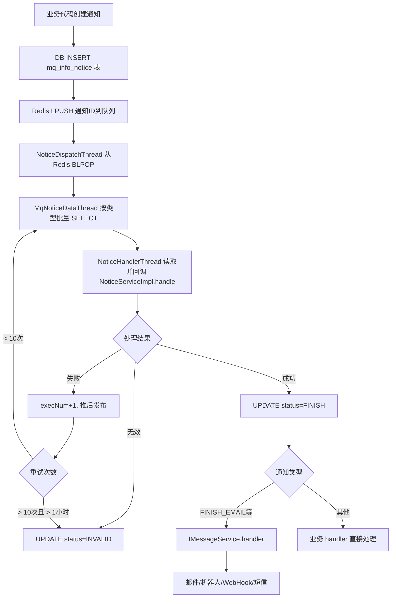

# 通知系统-总览

> 覆盖 app处理服务（realtest/task 通道 ~35 种通知）和 任务调度服务（scheduling 通道 8 种通知）的完整通知拓扑。

## 通知架构总览

```mermaid
flowchart LR
    subgraph Sources["通知来源"]
        RT[real-test 触发点]
        RS[real-scheduling 触发点]
    end

    subgraph MQ["Redis MQ 通道"]
        CH1[realtest 通道]
        CH2[task 通道]
        CH3[scheduling 通道]
    end

    subgraph Threads["线程处理链"]
        NDT[NoticeDispatchThread]
        MNDT[MqNoticeDataThread]
        NHT[NoticeHandlerThread]
    end

    subgraph Targets["通知目标"]
        EMAIL[邮件通知]
        ROBOT[企微/机器人]
        WEBHOOK[WebHook回调]
        DB[MySQL持久化]
        ES[Elasticsearch上报]
        SMS[短信通知]
    end

    Sources --> MQ
    MQ --> NDT
    NDT --> MNDT
    MNDT --> NHT
    NHT --> Targets
```



## 通知流转路径

```
客户端/模块业务代码
    → InfoMqNoticeDAO.insert(MqInfoNotice)     -- 写入 DB 通知表
    → redis.lpush(queueKey, noticeId)           -- 推入 Redis 队列
    → NoticeDispatchThread.pop()                 -- 从 Redis 队列取通知ID
    → MqNoticeDataThread.run()(每200ms)           -- 按类型批量加载通知详情
    → NoticeHandlerThread.run()                   -- 读取通知并调用 INoticeService.handle()
    → NoticeServiceImpl.handle()                  -- 按类型分发到具体 handler
    → IMessageService.handler()                   -- 邮件/机器人/WebHook/actionReport
```

## 一、realtest 通道（app处理服务 模块）

### 通知类型完整列表

源码：`real-test/.../cn/testin/pojo/real/NoticeConfig.java` -- `InfoNoticeType`

通道名称：`realtest`（通用通知）+ `task`（任务初始化专用）

> 统一分发入口：除 PAY(14，外部 PayManager) 外，所有 mq_info_notice 通知都由 `NoticeServiceImpl.handle()` 按 type 值 if-else 分发到下列 handler（handler 内部再调用各业务 Service）。详细 handler 流程图见 [通知系统-NoticeServiceImpl详细流程](通知系统-NoticeServiceImpl详细流程.md)。

| 编号 | 枚举名 | 中文说明 | 级别 | 延迟 | 所属通道 | handler(NoticeServiceImpl) |
|------|--------|----------|------|------|----------|----------------------------|
| 1 | TASKINIT | 正常任务初始化 | 0 | 0 | task | handleNormalTask |
| 2 | ADAPT_COMPLETE | 适配信息完善 | 2 | 0 | realtest | handleAdaptCompleteNew |
| 3 | TASK_CREATE | 新增测试上报 | 0 | 0 | realtest | handleTaskCreate |
| 4 | REPORT_SUMMARY | 结果详情上报 | 0 | 10s | realtest | handleReportSummary |
| 5 | APP_DETECT | 应用检测 | 10 | 10s | realtest | handleAppDetect |
| 6 | TASK_SUMMARY | 任务汇总统计 | 0 | 10s | realtest | handleTaskSummariesNotice |
| 10 | REPORT_STAT | 异步统计测试详情 | 10 | 10s | realtest | handleReportStat |
| 11 | SCRIPT_STAT | 脚本运行概要数据统计 | 10 | 0 | realtest | handleScriptSummary |
| 12 | SCRIPT_INIT | 初始化脚本摘要信息 | 10 | 10s | realtest | handleScriptSummaryInit |
| 13 | TASK_ERROR_SUMMARY | 任务错误详情统计 | 10 | 10s | realtest | handleTaskErrorSummary |
| 14 | PAY | 支付通知 | 10 | 5s | realtest | PayManager(外部) |
| 15 | REPORT_GENERATE | 生成Excel等报告 | 10 | 0 | realtest | handleGenerateReport |
| 17 | RETEST_INIT | 补测任务初始化 | 0 | 0 | task | handleRetestInit |
| 18 | MONITOR_MARKINFOS | 获取监控任务下相关信息 | 0 | 0 | realtest | handleMonitorMarkinfos |
| 19 | MONITOR_REPORT | 上报监控任务下报告信息 | 0 | 2s | realtest | handleMonitorReport |
| 20 | REREST_COMPLETE | 补测相关信息完善 | 0 | 0 | task | hanldeRetestComplete |
| 21 | SCRIPT_RETEST_COMPLETE | 脚本补测完善信息通知 | 0 | 0 | task | handleScriptRetestComplete |
| 22 | SCRIPT_RETEST_INIT | 脚本补测初始化任务通知 | 0 | 0 | task | handleScriptRetestInit |
| 23 | CHECK_INFO | 检查点详情收集 | 0 | 0 | realtest | handleCheckInfo |
| 24 | GRAPH_REPORT_GENERATE | 图表报告生成 | 10 | 0 | realtest | handleReportGraphExcel |
| 25 | REPORT_GENERATE_PLAN | 测试计划Excel报告生成 | 10 | 0 | realtest | handleGeneratePlanReport |
| 30 | REPORT_RESULT_2_ES | 任务老数据上报ES汇总 | 0 | 0 | realtest | handleReportDetailResult2ESNotice |
| 31 | TASK_SUMMARY_SUBTASK | 子任务级别taskSummary汇总 | 20 | 0 | realtest | handleSubTaskSummary |
| 32 | TASK_QC_2_ES | QC老数据上报ES | 10 | 0 | realtest | handleHistoryQCReportES |
| 33 | REPEAT_TEST | 批量补测接口 | 10 | 0 | realtest | handleRepeatTest |
| 34 | TASK_BIND | 新增定时任务绑定 | 0 | 0 | task | handleBindTest |
| 77 | CROSS_CANCEL | 多端未初始化的取消 | 40 | 10s | realtest | handleCrossCancel |
| 95 | ADD_TASK_EMAIL | 任务提测发送邮件 | 3 | 0 | realtest | handleEmailNotice |
| 96 | SEND_WECHAT | 任务完成发送微信通知 | 10 | 30s | realtest | hanldeSendWechat |
| 97 | SEND_MSG | 任务完成发送短信 | 10 | 2min | realtest | handleSendMsg |
| 98 | TASKRUNINFO_INIT | 初始化PmrealTaskRunInfo表 | 10 | 10s | realtest | handleTaskRunInfoInit |
| 99 | FINISH_EMAIL | 任务完成发送邮件通知 | 10 | 2min | realtest | handleEmailNotice |
| 110 | TASK_CALLBACK | 任务完成回调 | 10 | 2min | realtest | handleCallback |
| 112 | ADD_TASK_CALLBACK | 任务提测发送HttpCallBack | 3 | 15s | realtest | handleTaskCreateCallback |
| 113 | SCRIPT_FAIL_NOTICE | 脚本执行失败发送通知 | 10 | 10s | realtest | handleScriptFailNotice |
| 114 | SCRIPT_RESULT_NOTICE | 脚本执行完成通知TestPlan | 0 | 0 | realtest | handleScriptResultNotice |
| 115 | TASK_INIT_NOTICE | 任务初始化完成通知TestPlan | 0 | 0 | realtest | handleTaskInitNotice |
| 116 | TASK_COMPLETE_NOTICE | 任务完成通知TestPlan | 0 | 0 | realtest | handleTaskCompleteNotice |
| 117 | TASK_MATCH_OR_RECOVER_NOTICE | 子任务下发/回收通知TestPlan | 0 | 0 | realtest | handleTaskMatchOrRecoverNotice |
| 118 | SCRIPT_FAIL_SEND_NOTICE | 脚本失败达阈值发送通知 | 10 | 5s | realtest | handleScriptFailSendNotice |

### realtest 通道线程配置

源码：`real-test/.../cn/testin/config/StartRunner.java`

- **realtest 通道**：`NoticeDispatchThread`（100线程池，10核心，100最大），由 `MqNoticeDataThread` 每 200ms 轮询，批量 50 条
- **task 通道**：独立 `NoticeDispatchThread`（30线程池，5核心，30最大），由 `MqNoticeDataThread` 每 200ms 轮询，批量 50 条

### 通知目标分发（IMessageService）

源码：`real-test/.../cn/testin/business/mq/impl/MessageServiceImpl.java`

| 通知类型 | 分发方式 |
|----------|----------|
| FINISH_EMAIL / ADD_TASK_EMAIL | 邮件服务（外部 NoticeManager） |
| SEND_WECHAT / FINISH_NOTICE | 企微/钉钉机器人 WebHook |
| TASK_CALLBACK / ADD_TASK_CALLBACK | HTTP Callback（用户配置的回调URL） |
| SEND_MSG | 短信通知 |
| SCRIPT_FAIL_NOTICE / SCRIPT_FAIL_SEND_NOTICE | 企业微信通知 |

## 二、scheduling 通道（任务调度服务 模块）

### 通知类型完整列表

源码：`real-scheduling/.../cn/testin/pojo/task/TaskConfigEnum.java` -- `NoticeType`

| 编号 | 枚举名 | 中文说明 | 有效时长 | 处理者 |
|------|--------|----------|----------|--------|
| 0 | cancelTask | 取消任务通知 | 1小时 | ITaskService.cancel() |
| 1 | recoverTask | 回收任务（设备释放后重新分配） | 1小时 | ITaskService.recover() |
| 2 | releaseAccount | 释放账号信息 | 1小时 | AccountApi.release() |
| 3 | stopDeviceTask | 停止设备任务（通知controlcenter） | 1小时 | TaskApi.stop() |
| 4 | actionReport | scheduling动作上报real-test | 1小时 | ITestProcessService.report() |
| 5 | revokeTask | 设备异常取消设备对应任务 | 1小时 | ITaskService.cancel()(批量) |
| 6 | crossReport | scheduling动作上报real-cross | 1小时 | NoticeReportApi.report() |
| 7 | scriptExecute | 激活任务至待执行状态（-2→0） | 1小时 | ITaskService.execute() |

### scheduling 通道线程配置

源码：`real-scheduling/.../cn/testin/config/StartRunner.java`

- **scheduling 通道**：`NoticeDispatchThread`（100线程池，10核心，100最大），由 `MqNoticeDataThread` 每 200ms 轮询，批量 100 条
- 通知失败重试：执行次数 < 3 立即重试；3~10 次延迟 10 秒；超过 10 次且超过 1 小时标记为无效

## 三、通知生命周期



## 四、通知异常处理

- **重复通知防护**：处理前检查 `MqInfoNotice.status != STATUS_PROCESS`，已完成或无效的通知直接跳过
- **通知过期**：`validPeriod = 5小时`，超过有效期未消费的通知标记为 INVALID
- **延迟投递**：`delaytime` 字段控制通知发布后的延迟消费时间（如 FINISH_EMAIL 延迟 2 分钟，目的可能为等待报告生成完毕）
- **优先级**：`level` 字段控制线程池优先级（0 = 最高），数值越大优先级越低

## 详细流程文档

每个 handler 的完整流程图、通知串联链、插入→消费全链路见：[通知系统-NoticeServiceImpl详细流程](通知系统-NoticeServiceImpl详细流程.md)

## 相关双链

- [通知系统-NoticeServiceImpl详细流程](通知系统-NoticeServiceImpl详细流程.md) — 每条通知的 handler 级详细流程图
- [核心链路-通知系统拓扑](核心链路-通知系统拓扑.md) — 通知系统拓扑 Mermaid 图
- 任务状态机：[核心链路-任务状态机](核心链路-任务状态机.md) -- 状态转换由通知类型（cancelTask、scriptExecute、revokeTask）驱动
- 后台线程全景：[基础设施-后台线程全景](基础设施-后台线程全景.md) -- `NoticeDispatchThread`、`MqNoticeDataThread`、`NoticeHandlerThread`、`MessageDispatchThread` 的详细说明
- 模块间通信：[基础设施-模块间通信](基础设施-模块间通信.md) -- Redis MQ Pub/Sub 机制
- 外部服务：NoticeManager / [RealTest](../07-开放接口文档/00-模块索引.md) / [RealScheduling](../../任务调度服务（real-scheduling）/07-开放接口文档/00-模块索引.md)
