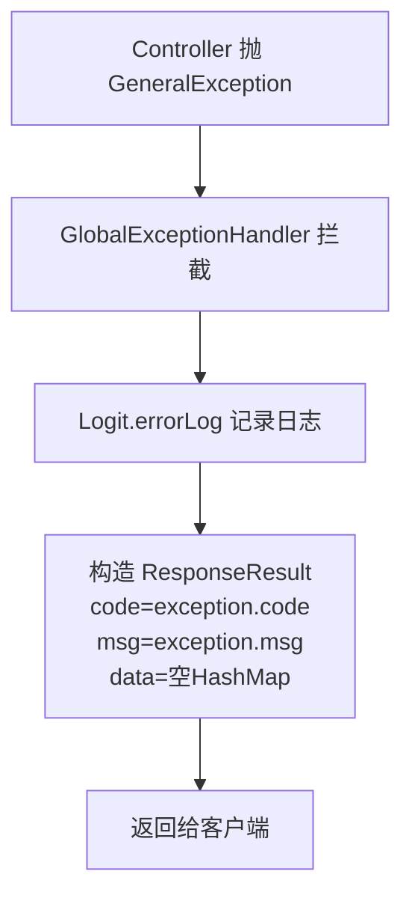
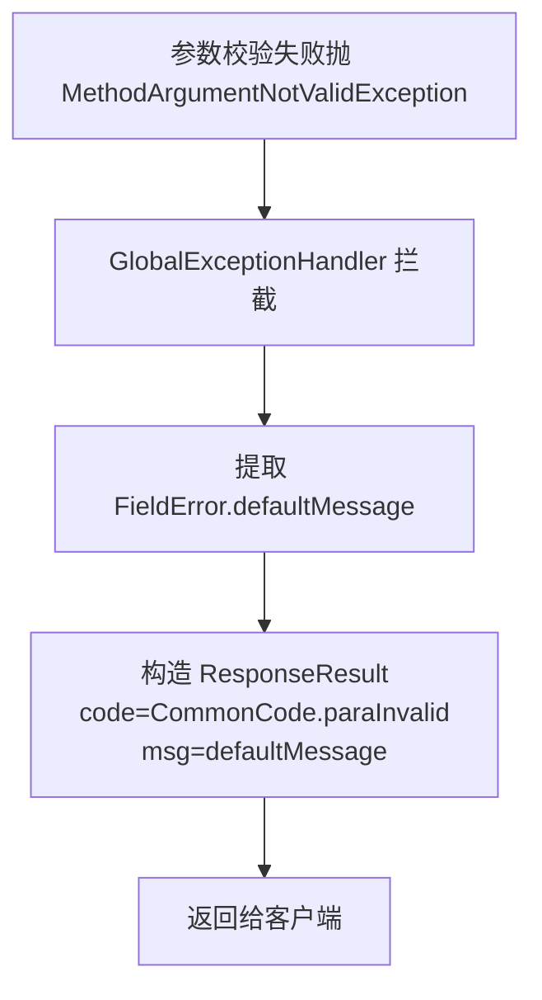

# GlobalExceptionHandler

app处理服务 模块全局异常处理切面，统一拦截 Controller 层抛出的异常并转为标准化 `ResponseResult`。

类路径：`real-test/src/main/java/cn/testin/controller/exception/GlobalExceptionHandler.java`。

## 异常处理一览

| 处理器 | 异常类型 | 响应 |
| --- | --- | --- |
| handleException | GeneralException | `ResponseResult(exception.code, exception.msg)` |
| handleException | MethodArgumentNotValidException | `ResponseResult(CommonCode.paraInvalid, defaultMessage)` |
| handleException | Exception | `ResponseResult(CommonCode.unknown, "发生未知错误，请联系管理员!")`；HttpMessageNotReadableException 额外转为 paraInvalid |
| handleException | Throwable | `ResponseResult(CommonCode.unknown, "发生未知错误，请联系管理员!")` |

## handleException (`GeneralException`)

- **实现意图**：捕获业务层抛出的 `GeneralException`，直接使用异常内的错误码和错误信息构造响应。

- **处理流程**：



## handleException (`MethodArgumentNotValidException`)

- **实现意图**：处理 `@Validated` 参数校验失败（如 `@NotBlank` 等注解校验不通过），提取校验失败信息。

- **处理流程**：



## handleException (`Exception` / `Throwable`)

- **实现意图**：兜底所有未预期的异常，统一返回"发生未知错误"。特殊处理 `HttpMessageNotReadableException`（请求体 JSON 格式错误）转为参数无效错误码。

- **关键代码摘录**：

```java
// real-test/src/main/java/cn/testin/controller/exception/GlobalExceptionHandler.java
@RestControllerAdvice
public class GlobalExceptionHandler {

    @ExceptionHandler(GeneralException.class)
    public ResponseResult<Object> handleException(GeneralException exception) {
        Logit.errorLog("请求处理发生错误:" + exception.getMsg(), exception);
        ResponseResult<Object> result = new ResponseResult<>(exception.getCode(), exception.getMsg());
        result.setData(new HashMap<>());
        return result;
    }

    @ExceptionHandler(MethodArgumentNotValidException.class)
    public ResponseResult<Object> handleException(MethodArgumentNotValidException exception) {
        Logit.errorLog("请求参数不正确:" + exception.getMessage());
        String defaultMessage = exception.getBindingResult().getFieldError() != null
            ? exception.getBindingResult().getFieldError().getDefaultMessage() : "参数错误";
        ResponseResult<Object> result = new ResponseResult<>(CommonCode.paraInvalid.getValue(), defaultMessage);
        result.setData(new HashMap<>());
        return result;
    }

    @ExceptionHandler(Exception.class)
    public ResponseResult<Object> handleException(Exception exception) {
        Logit.errorLog("请求处理未知错误:" + exception.getMessage(), exception);
        ResponseResult<Object> result = new ResponseResult<>(CommonCode.unknown.getValue(),
            "发生未知错误，请联系管理员!");
        result.setData(new HashMap<>());
        if (exception instanceof HttpMessageNotReadableException) {
            result = new ResponseResult<>(CommonCode.paraInvalid.getValue(),
                "请检查参数，存在参数格式错误");
        }
        return result;
    }

    @ExceptionHandler(Throwable.class)
    public ResponseResult<Object> handleException(Throwable throwable) {
        Logit.errorLog("请求处理未知错误: " + throwable.getMessage(), throwable);
        ResponseResult<Object> result = new ResponseResult<>(CommonCode.unknown.getValue(),
            "发生未知错误，请联系管理员!");
        result.setData(new HashMap<>());
        return result;
    }
}
```
