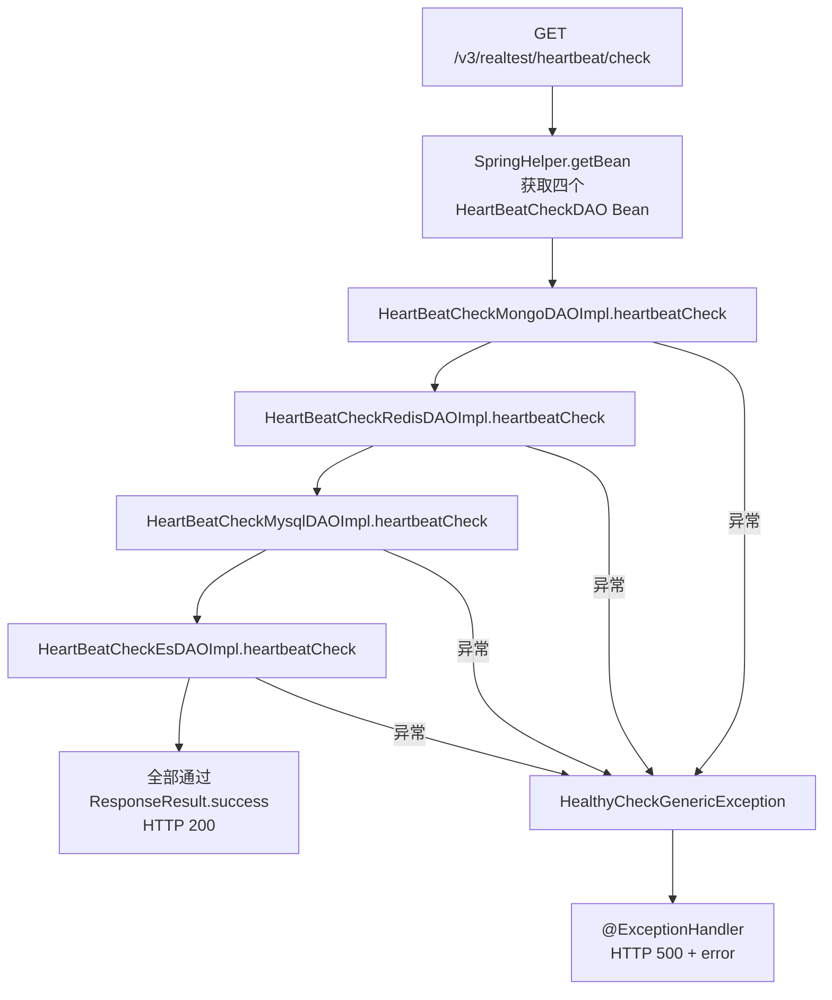

# HeartBeatController

app处理服务 服务的健康检查端点，验证 MySQL、MongoDB、Redis、Elasticsearch 四类存储的连通性。

类路径：`real-test/src/main/java/cn/testin/controller/HeartBeatController.java`，基础路径 `/v3/realtest`。

## 本类接口一览

| 接口 | 方法 | 路径 | 功能 |
| --- | --- | --- | --- |
| check | GET | /v3/realtest/heartbeat/check | 逐一验证 MySQL、MongoDB、Redis、ES 连通性 |

## check (`GET /v3/realtest/heartbeat/check`)

- **实现意图**：全栈探活接口。顺序验证四项存储连接的可用性，任一失败抛 `HealthyCheckGenericException`，由 `@ExceptionHandler` 转为 HTTP 500，供监控/部署系统判定实例健康状态。

- **请求参数**：无。

- **响应结构**：成功返回 `ResponseResult`（data 为空 HashMap），HTTP 200；失败返回 HTTP 500，body 为 `ResponseResult.error(errCode, errMsg)`。

- **处理流程**：



- **调用链**：`HeartBeatController` -> `HeartBeatCheckMongoDAOImpl` / `HeartBeatCheckRedisDAOImpl` / `HeartBeatCheckMysqlDAOImpl` / `HeartBeatCheckEsDAOImpl`。无外部服务调用。

- **涉及表与 SQL**：

| 对象 | 操作 | 说明 |
| --- | --- | --- |
| MySQL | 查询 | `SHOW STATUS` 验证连接 |
| MongoDB | 查询 | 验证连接活性 |
| Redis | 查询 | 验证连接活性 |
| Elasticsearch | 查询 | 验证连接活性 |

- **异常与校验**：`HealthyCheckGenericException` 携带错误码，由类内 `@ExceptionHandler(HealthyCheckGenericException.class)` 统一转为 HTTP 500 + `ResponseResult.error(errCode, errMsg)`。

- **关键代码摘录**：

```java
// real-test/src/main/java/cn/testin/controller/HeartBeatController.java
@RequestMapping(value = "/heartbeat/check", method = RequestMethod.GET)
@ResponseBody
public ResponseResult check() {
    HeartBeatCheckMongoDAOImpl heartBeatCheckMongoDAO =
        (HeartBeatCheckMongoDAOImpl) SpringHelper.getBean("IHeartBeatCheckMongoDAO");
    HeartBeatCheckRedisDAOImpl heartBeatCheckRedisDAO =
        (HeartBeatCheckRedisDAOImpl) SpringHelper.getBean("IHeartBeatCheckRedisDAO");
    HeartBeatCheckMysqlDAOImpl heartBeatCheckMysqlDAO =
        (HeartBeatCheckMysqlDAOImpl) SpringHelper.getBean("IHeartBeatCheckMysqlDAO");
    HeartBeatCheckEsDAOImpl heartBeatCheckEsDAO =
        (HeartBeatCheckEsDAOImpl) SpringHelper.getBean("IHeartBeatCheckEsDAO");

    heartBeatCheckMongoDAO.heartbeatCheck();
    heartBeatCheckRedisDAO.heartbeatCheck();
    heartBeatCheckMysqlDAO.heartbeatCheck();
    heartBeatCheckEsDAO.heartbeatCheck();

    return ResponseResult.success(new HashMap<>());
}
```
