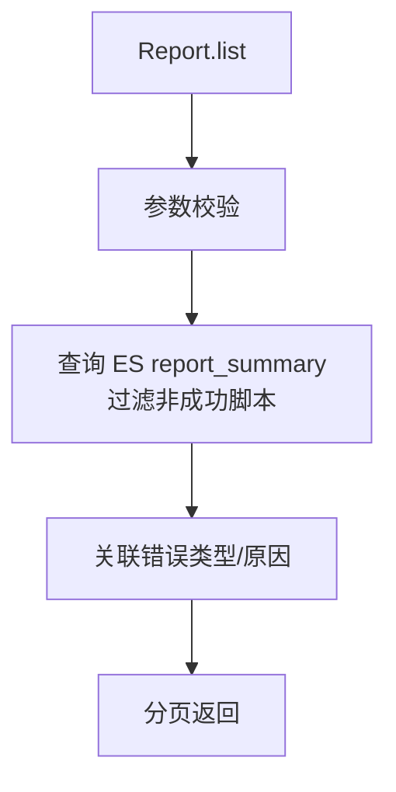

# Report (service/analysis)

报告分析查询的 ApiServlet，提供报告列表、汇总、问题列表和错误信息修改功能。

类路径：`real-test/src/main/java/cn/testin/service/analysis/Report.java`，继承 `GenericBaseService`。

## 本类接口一览

| 接口 | op | 功能 |
| --- | --- | --- |
| list | Report.list | 分页查询报告分析列表 |
| summaries | Report.summaries | 获取报告汇总信息 |
| issues | Report.issues | 获取报告问题列表 |
| modifyErrorMsg | Report.modifyErrorMsg | 修改报告错误信息 |

## list (`Report.list`)

- **实现意图**：分页查询任务的报告分析数据列表，返回脚本维度的问题分析概要。

- **请求参数**：
| 字段 | 类型 | 必填 | 说明 |
| --- | --- | --- | --- |
| taskid | String | 否 | 任务 ID（与 skey 至少一个，均 blank 返回 10007） |
| skey | String | 否 | 分享链接 key |
| projectid | String | 否 | 项目 ID（仅用于错误提示） |
| userid | Integer | 否 | 用户 ID |
| eid | Integer | 否 | 企业 ID |
| userprojectids | JSONArray | 否 | 用户项目组 ID 数组（元素 Integer） |
| page | Integer | 否 | 页码 |
| pageSize | Integer | 否 | 每页条数 |
| subtaskid | String | 否 | 子任务 ID |
| subtaskids | JSONArray | 否 | 子任务 ID 数组 |
| subsubtaskid | String | 否 | 子子任务 ID |
| subSubTaskIds | JSONArray | 否 | 子子任务 ID 数组 |
| keyword | String | 否 | 模糊匹配关键字 |
| resultCategorys | JSONArray | 否 | 结果分类数组（元素 Integer） |
| scriptTags | JSONArray | 否 | 脚本标签数组（元素 String） |
| scriptNos | JSONArray | 否 | 脚本编号数组（元素 Integer） |
| scriptDescrs | JSONArray | 否 | 脚本描述数组（元素 String） |
| deviceNames | JSONArray | 否 | 设备名数组（元素 String） |
| errorMsgs | JSONArray | 否 | 错误信息数组（元素 String） |
| timeConsumings | JSONArray | 否 | 耗时数组（元素 Long） |
| retryNum | Integer | 否 | 重试次数过滤，默认 0 |
| hasSupplementary | Integer | 否 | 是否有补测，默认 0 |
| sortFields | JSONArray | 否 | 排序字段数组，元素 `{"fieldName": String, "desc": Boolean}` |
| keywords | JSONArray | 否 | 返回字段过滤（元素 String，取值见 `EsReportSummaryKeyword`） |

- **返回参数**：
| 字段 | 类型 | 说明 |
| --- | --- | --- |
| code | Integer | 返回码，0 成功，非 0 失败 |
| msg | String | 返回信息 |
| data | JSONObject | 业务数据 |
| data.list | JSONArray | 报告分析列表，元素为 `EsReportSummary`（含 subtaskid/subsubtaskid/scriptNo/errorMsg 及 reportScript/reportDevice/reportRunInfo 子对象，代码未确认全部字段） |
| data.page | Integer | 当前页 |
| data.pageSize | Integer | 每页条数 |
| data.totalRow | Integer | 总记录数 |
| data.totalPage | Integer | 总页数 |

- **处理流程**：

- **调用链**：`Report` -> `IReportAnalysisService` -> `IEsReportSummaryDAO`。外部服务：RealAnalysis（问题分析）。

- **涉及表与 SQL**：ES `report_summary`（查询错误脚本）。

## summaries (`Report.summaries`)

- **实现意图**：获取任务报告的问题汇总统计（错误类型分布、错误Top N脚本、问题设备排行等）。

- **请求参数**：
| 字段 | 类型 | 必填 | 说明 |
| --- | --- | --- | --- |
| taskid | String | 否 | 任务 ID（与 skey 至少一个，均 blank 返回 10007） |
| skey | String | 否 | 分享链接 key |
| userid | Integer | 否 | 用户 ID |
| eid | Integer | 否 | 企业 ID |
| userprojectids | JSONArray | 否 | 用户项目组 ID 数组（元素 Integer） |
| page | Integer | 否 | 页码 |
| pageSize | Integer | 否 | 每页条数 |
| type | String | 否 | 汇总类型，默认 "script" |
| subtaskid | String | 否 | 子任务 ID |
| subtaskids | JSONArray | 否 | 子任务 ID 数组 |
| subsubtaskid | String | 否 | 子子任务 ID |
| subSubTaskIds | JSONArray | 否 | 子子任务 ID 数组 |
| keyword | String | 否 | 模糊匹配关键字 |
| resultCategorys | JSONArray | 否 | 结果分类数组（元素 Integer） |
| scriptTags | JSONArray | 否 | 脚本标签数组（元素 String） |
| scriptNos | JSONArray | 否 | 脚本编号数组（元素 Integer） |
| scriptDescrs | JSONArray | 否 | 脚本描述数组（元素 String） |
| deviceNames | JSONArray | 否 | 设备名数组（元素 String） |
| errorMsgs | JSONArray | 否 | 错误信息数组（元素 String） |
| timeConsumings | JSONArray | 否 | 耗时数组（元素 Long） |
| retryNum | Integer | 否 | 重试次数过滤，默认 0 |
| hasSupplementary | Integer | 否 | 是否有补测，默认 0 |

- **返回参数**：
| 字段 | 类型 | 说明 |
| --- | --- | --- |
| code | Integer | 返回码，0 成功，非 0 失败 |
| msg | String | 返回信息 |
| data | JSONObject | 问题汇总统计 Map（含错误信息与个数统计 list 等，代码未确认具体字段） |

- **调用链**：`IEsReportSummaryDAO`（聚合查询）。

## issues (`Report.issues`)

- **实现意图**：获取指定脚本/设备的详细问题列表，含每步错误原因分析。

- **请求参数**：
| 字段 | 类型 | 必填 | 说明 |
| --- | --- | --- | --- |
| sid | String | 是 | 会话 token（blank 返回 10005） |
| taskid | String | 是 | 任务 ID（blank 返回 10005） |
| page | Integer | 否 | 页码，默认 1 |
| pageSize | Integer | 否 | 每页条数，默认 1000（范围 1~999） |
| eid | Integer | 否 | 企业 ID |
| projectId | Integer | 否 | 项目 ID |

- **返回参数**：
| 字段 | 类型 | 说明 |
| --- | --- | --- |
| code | Integer | 返回码，0 成功，非 0 失败 |
| msg | String | 返回信息 |
| data | JSONObject | 业务数据 |
| data.rows | JSONArray | 问题列表，元素字段见下 |
| data.rows[].id | Integer | 序号 |
| data.rows[].subsubtaskid | String | 子子任务 ID |
| data.rows[].subtaskid | String | 子任务 ID |
| data.rows[].taskid | String | 任务 ID |
| data.rows[].issuesId | Integer | 缺陷 ID（固定 -1） |
| data.rows[].issuesName | String | 缺陷名（脚本描述） |
| data.rows[].reporter | String | 创建人 |
| data.rows[].handler | String | 处理人 |
| data.rows[].severity | String | 严重程度 |
| data.rows[].sourcephase | String | 引入阶段 |
| data.rows[].entId | Integer | 企业 ID |
| data.rows[].projectId | Integer | 项目 ID |
| data.rows[].aliasName | String | 设备别名 |
| data.rows[].errorMsg | String | 错误定位信息 |
| data.rows[].reportUrl | String | 报告详情跳转 URL |
| data.total | Integer | 总记录数 |
| data.page | Integer | 当前页 |
| data.pageSize | Integer | 每页条数 |
| data.totalPage | Integer | 总页数 |

- **调用链**：`IReportAnalysisService` -> MongoDB `pmreal_report_detail`（步骤详情）。

## modifyErrorMsg (`Report.modifyErrorMsg`)

- **实现意图**：手动修改报告中的错误信息（纠偏），更新 ES 和 MongoDB 中的错误描述。

- **请求参数**：
| 字段 | 类型 | 必填 | 说明 |
| --- | --- | --- | --- |
| taskid | String | 是 | 任务 ID（blank 返回 paraInvalid） |
| subtaskid | String | 是 | 子任务 ID（blank 返回 paraInvalid） |
| subsubtaskid | String | 是 | 子子任务 ID（blank 返回 paraInvalid） |
| errorMsg | String | 否 | 修改后的错误信息 |
| skey | String | 否 | 分享链接 key |
| userid | Integer | 否 | 用户 ID |
| eid | Integer | 否 | 企业 ID |
| userprojectids | JSONArray | 否 | 用户项目组 ID 数组（元素 Integer） |

- **返回参数**：
| 字段 | 类型 | 说明 |
| --- | --- | --- |
| code | Integer | 返回码，0 成功，非 0 失败 |
| msg | String | 返回信息 |
| data | JSONObject | 业务数据 |
| data.result | Integer | 修改结果（服务层返回，0/1 等） |

- **涉及表与 SQL**：ES `report_summary`（UPDATE errorMsg）、MongoDB `pmreal_report_detail`（UPDATE 步骤错误信息）。
