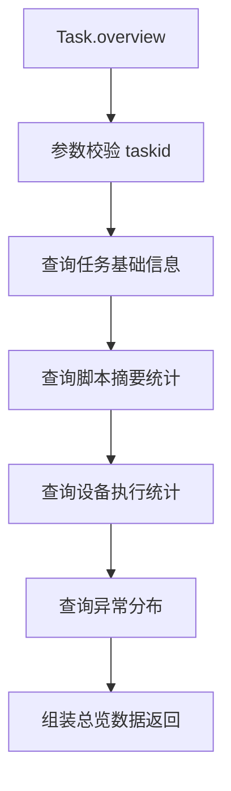

# Task (service/analysis)

任务分析报表的 ApiServlet，提供任务概况、子任务摘要、性能摘要和设备执行状态查询。

类路径：`real-test/src/main/java/cn/testin/service/analysis/Task.java`，继承 `GenericBaseService`。

## 本类接口一览

| 接口 | op | 功能 |
| --- | --- | --- |
| overview | Task.overview | 获取任务分析概况（总览页数据） |
| subSummarys | Task.subSummarys | 获取子任务摘要列表 |
| performanceSummary | Task.performanceSummary | 获取任务级别性能摘要 |
| getDeviceExecStatus | Task.getDeviceExecStatus | 获取设备执行状态分布 |

## overview (`Task.overview`)

- **实现意图**：获取任务分析总览数据，含任务基本信息、执行进度、脚本通过率、设备分布、异常分布等汇总指标。

- **请求参数**：
| 字段 | 类型 | 必填 | 说明 |
| --- | --- | --- | --- |
| taskid | String | 否 | 任务 ID（与 skey 至少一个） |
| skey | String | 否 | 分享链接 key |
| keywords | JSONArray | 否 | 返回关键字过滤（元素 String，取值见 `TaskSummaryKeyword`） |
| userid | Integer | 否 | 用户 ID |
| eid | Integer | 否 | 企业 ID |
| userprojectids | JSONArray | 否 | 用户项目组 ID 数组（元素 Integer） |

- **返回参数**：
| 字段 | 类型 | 说明 |
| --- | --- | --- |
| code | Integer | 返回码，0 成功，非 0 失败 |
| msg | String | 返回信息 |
| data | JSONObject | 业务数据 |
| data.objInfo | JSONObject | 任务概况对象（`PmrealTaskSummary.toJSON()`，含任务/脚本/设备维度统计，代码未确认具体字段） |

- **处理流程**：

- **调用链**：`Task` -> `ITaskAnalysisService` -> `IPrealUserAdaptDAO` / `IPmrealScriptSummaryDAO` / `IPmrealDeviceDetailDAO` / `IPmrealStatExceptionDAO`。

- **涉及表与 SQL**：`preal_user_adapt`、`pmreal_script_summary`（MongoDB）、`pmreal_device_detail`（MongoDB）、`pmreal_stat_exception`（MongoDB）。

## subSummarys (`Task.subSummarys`)

- **实现意图**：获取子任务级别的执行摘要，含各子任务状态、脚本数、通过率。

- **请求参数**：
| 字段 | 类型 | 必填 | 说明 |
| --- | --- | --- | --- |
| taskid | String | 是 | 任务 ID（blank 返回 10005） |
| page | Integer | 否 | 页码，默认 1 |
| pageSize | Integer | 否 | 每页条数，默认 100（范围 1~100） |

- **返回参数**：
| 字段 | 类型 | 说明 |
| --- | --- | --- |
| code | Integer | 返回码，0 成功，非 0 失败 |
| msg | String | 返回信息 |
| data | JSONObject | 业务数据 |
| data.list | JSONArray | 子任务摘要列表，元素为 `SubSummary`（代码未确认字段） |
| data.page | Integer | 当前页 |
| data.pageSize | Integer | 每页条数 |
| data.totalRow | Integer | 总记录数 |
| data.totalPage | Integer | 总页数 |

- **调用链**：`IPmrealScriptSummaryDAO`（按子任务聚合）。

## performanceSummary (`Task.performanceSummary`)

- **实现意图**：获取任务级别的性能摘要（所有设备的 CPU/内存/流量均值/峰值）。

- **请求参数**：
| 字段 | 类型 | 必填 | 说明 |
| --- | --- | --- | --- |
| taskid | String | 是 | 任务 ID（blank 返回 10005） |

- **返回参数**：
| 字段 | 类型 | 说明 |
| --- | --- | --- |
| code | Integer | 返回码，0 成功，非 0 失败 |
| msg | String | 返回信息 |
| data | JSONObject | 业务数据 |
| data.objInfo | JSONObject | 性能分布统计 Map（代码未确认字段） |

- **调用链**：`IPmrealDeviceDetailDAO`（性能字段聚合）。

## getDeviceExecStatus (`Task.getDeviceExecStatus`)

- **实现意图**：获取任务中各设备的执行状态分布（等待中/运行中/成功/失败/超时 数量）。

- **请求参数**：
| 字段 | 类型 | 必填 | 说明 |
| --- | --- | --- | --- |
| taskid | String | 是 | 任务 ID（blank 返回 10005） |

- **返回参数**：
| 字段 | 类型 | 说明 |
| --- | --- | --- |
| code | Integer | 返回码，0 成功，非 0 失败 |
| msg | String | 返回信息 |
| data | JSONObject | 业务数据 |
| data.objInfo | JSONObject | 设备执行状态 Map（key=子任务 ID，value=执行状态） |

- **调用链**：`ITaskRunInfoDAO`（Redis 实时状态）+ `IPmrealDeviceDetailDAO`（历史结果）。
