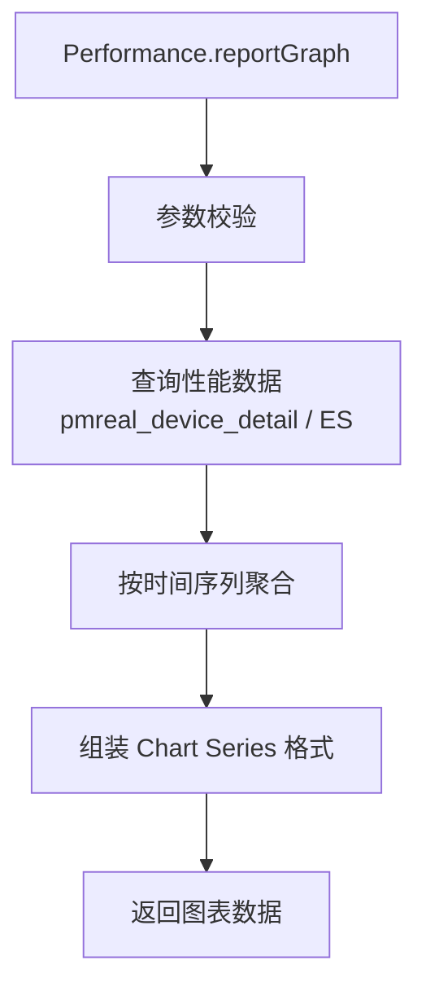

# Performance (service/analysis)

性能分析报表的 ApiServlet，提供性能图表数据和导出功能。

类路径：`real-test/src/main/java/cn/testin/service/analysis/Performance.java`，继承 `GenericBaseService`。

## 本类接口一览

| 接口 | op | 功能 |
| --- | --- | --- |
| reportGraph | Performance.reportGraph | 获取性能报表图表数据 |
| performanceExport | Performance.performanceExport | 导出性能数据 |

## reportGraph (`Performance.reportGraph`)

- **实现意图**：根据 taskId 获取性能报表的图表数据，含 CPU/内存/流量/FPS 等指标的时序数据，用于前端 ECharts 图表渲染。

- **请求参数**：
| 字段 | 类型 | 必填 | 说明 |
| --- | --- | --- | --- |
| taskid | String | 否 | 任务 ID（与 skey 至少一个） |
| skey | String | 否 | 分享链接 key |
| subtaskid | String | 是 | 子任务 ID（blank 返回 10005） |
| subsubtaskid | JSONArray | 否 | 子子任务 ID 数组（元素 String） |
| history | Boolean | 否 | 是否查询重试记录，默认 false |
| containRetest | Boolean | 否 | 是否查询补测记录，默认 false |
| userid | Integer | 否 | 用户 ID |
| eid | Integer | 否 | 企业 ID |
| userprojectids | JSONArray | 否 | 用户项目组 ID 数组（元素 Integer） |

- **返回参数**：
| 字段 | 类型 | 说明 |
| --- | --- | --- |
| code | Integer | 返回码，0 成功，非 0 失败 |
| msg | String | 返回信息 |
| data | JSONObject | 性能图表数据 Map（Series、X 轴时间标签等，结构由服务层生成，代码未确认具体字段） |

- **处理流程**：

- **调用链**：`Performance` -> `IPerformanceService` -> `IPmrealDeviceDetailDAO`（MongoDB/ES）。外部服务：[RealLogfile](../../../平台基础功能服务/00-首页.md)（性能日志文件）。

- **涉及表与 SQL**：`pmreal_device_detail`（MongoDB 性能字段）、ES 性能索引。

## performanceExport (`Performance.performanceExport`)

- **实现意图**：导出性能数据为 Excel/CSV 格式，用于离线分析。

- **请求参数**：
| 字段 | 类型 | 必填 | 说明 |
| --- | --- | --- | --- |
| taskid | String | 否 | 任务 ID（与 skey 至少一个） |
| skey | String | 否 | 分享链接 key |
| subtaskid | String | 是 | 子任务 ID（blank 返回 10005） |
| subsubtaskid | JSONArray | 否 | 子子任务 ID 数组（元素 String） |
| history | Boolean | 否 | 是否查询重试记录，默认 false |
| containRetest | Boolean | 否 | 是否查询补测记录，默认 false |
| userid | Integer | 否 | 用户 ID |
| eid | Integer | 否 | 企业 ID |
| userprojectids | JSONArray | 否 | 用户项目组 ID 数组（元素 Integer） |

- **返回参数**：
| 字段 | 类型 | 说明 |
| --- | --- | --- |
| code | Integer | 返回码，0 成功，非 0 失败 |
| msg | String | 返回信息 |
| data | JSONObject | 业务数据 |
| data.result | Integer/String | 导出结果：当前实现恒为 0（导出 URL 逻辑已注释，代码未确认） |

- **调用链**：`IPerformanceService` -> 聚合性能数据 -> 生成文件 -> [FileService](../../../文件管理服务/00-首页.md)（存储）。
