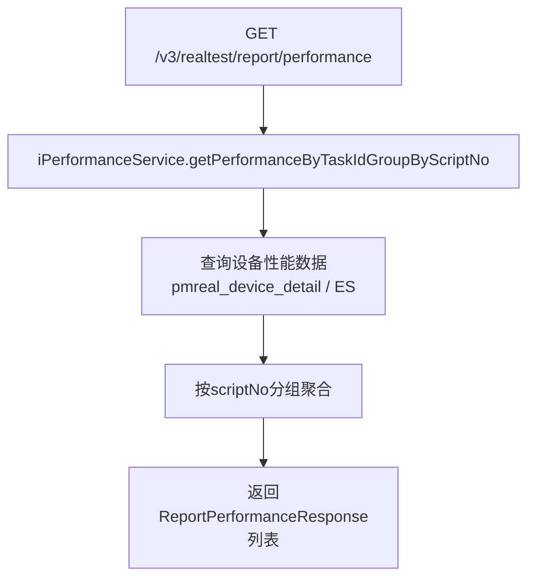

# PerformanceController

性能数据与抽查报告的 MVC 控制器，提供性能统计查询、抽查信息查询和报告输入参数刷新。

类路径：`real-test/src/main/java/cn/testin/mvc/controller/PerformanceController.java`，基础路径 `/v3/realtest`。

## 本类接口一览

| 接口 | 方法 | 路径 | 功能 |
| --- | --- | --- | --- |
| performance | GET | /v3/realtest/report/performance | 按脚本编号分组查询性能数据 |
| testPlanRecordSpot | POST | /v3/realtest/report/spot | 查询测试计划抽查信息 |
| updateReportInputParam | POST | /v3/realtest/report/refresh_report_input_param | 刷新报告输入参数（执行概要数据） |

## performance (`GET /v3/realtest/report/performance`)

- **实现意图**：根据 taskId 查询任务执行过程中采集的性能数据（CPU、内存、流量等），按脚本编号（scriptNo）分组返回。

- **请求参数**：

| 字段 | 类型 | 必填 | 说明 |
| --- | --- | --- | --- |
| task_id | String | 是 | 任务 ID（@RequestParam 必填） |

- **返回参数**：

| 字段 | 类型 | 说明 |
| --- | --- | --- |
| code | Integer | 状态码，0 成功 |
| msg | String | 提示信息 |
| data | JSONArray | 性能数据列表，元素为 `ReportPerformanceResponse` |
| data[].scriptNo | Integer | 脚本编号 |
| data[].deviceId | String | 设备 ID |
| data[].syspfName | String | 系统平台名称 |
| data[].modelName | String | 设备型号名称 |
| data[].releaseVersion | String | 版本 |
| data[].testResult | Integer | 测试结果 |
| data[].reportPerformance | JSONArray | 性能指标数组，元素 `ReportPerformanceDTO` |
| data[].reportPerformance[].name | String | 指标名称（cpu/memory/network 等） |
| data[].reportPerformance[].data | JSONArray | 时序数据数组，元素 `{"timestamp": Long, "value": Double}` |

- **处理流程**：

- **调用链**：`PerformanceController` -> [IPerformanceService](IPerformanceService.md) -> `IPmrealDeviceDetailDAO` / `IDevicePerformanceDAO`。外部服务：[RealControlCenter](../../../设备控制中心（real-controlcenter）/07-开放接口文档/00-模块索引.md)（设备数据）、[RealLogfile](../../../平台基础功能服务/00-首页.md)（性能日志）。

- **涉及表与 SQL**：`pmreal_device_detail`（设备详情含性能字段）；Elasticsearch 性能索引。

## testPlanRecordSpot (`POST /v3/realtest/report/spot`)

- **实现意图**：根据 taskIds 批量查询测试计划的抽查信息（SpotInformation），用于质量抽查报告。

- **请求参数**：

| 字段 | 类型 | 必填 | 说明 |
| --- | --- | --- | --- |
| taskIds | JSONArray | 是 | 任务 ID 数组（元素 String） |

- **返回参数**：

| 字段 | 类型 | 说明 |
| --- | --- | --- |
| code | Integer | 状态码，0 成功 |
| msg | String | 提示信息 |
| data | JSONArray | 抽查信息列表，元素为 `SpotInformation` |
| data[].key | String | 标识 |
| data[].item | String | 抽查项 |
| data[].actionTimeTotal | Double | 耗时达标值 |
| data[].networkUpFlowTotal | Double | 上行流量达标值 |
| data[].networkDownFlowTotal | Double | 下行流量达标值 |
| data[].scriptName | String | 脚本名 |
| data[].subSubTaskId | String | 子子任务 ID |
| data[].modelName | String | 设备型号 |
| data[].deviceVersion | String | 设备系统版本 |
| data[].appVersion | String | 应用版本 |
| data[].netWork | String | 网络 |
| data[].startTime | Long | 开始时间 |
| data[].endTime | Long | 结束时间 |
| data[].link | String | 报告链接 |

- **调用链**：`PerformanceController` -> [IGenerateReportService](IGenerateReportService.md) -> DAO 层。外部服务：RealAnalysis（抽查数据分析）。

## updateReportInputParam (`POST /v3/realtest/report/refresh_report_input_param`)

- **实现意图**：刷新脚本执行列表中的执行概要数据（input param），用于报告数据纠偏/刷新。

- **请求参数**：

| 字段 | 类型 | 必填 | 说明 |
| --- | --- | --- | --- |
| taskId | String | 否 | 任务 ID |
| subTaskId | String | 否 | 子任务 ID |
| subSubTaskId | String | 否 | 子子任务 ID |
| taskIds | JSONArray | 否 | 任务 ID 数组（元素 String） |
| eid | Integer | 否 | 企业 ID（继承 BaseQueryRequestDTO） |
| projectId | Integer | 否 | 项目 ID |
| userId | Integer | 否 | 用户 ID |
| userName | String | 否 | 用户名 |

- **返回参数**：

| 字段 | 类型 | 说明 |
| --- | --- | --- |
| code | Integer | 状态码，0 成功 |
| msg | String | 提示信息 |
| data | JSONObject | 业务数据（`BaseResponseDTO`） |
| data.result | Integer | 操作影响行数 |

- **调用链**：[ReportService](ReportService.md).updateReportInputParam -> DAO 更新。
