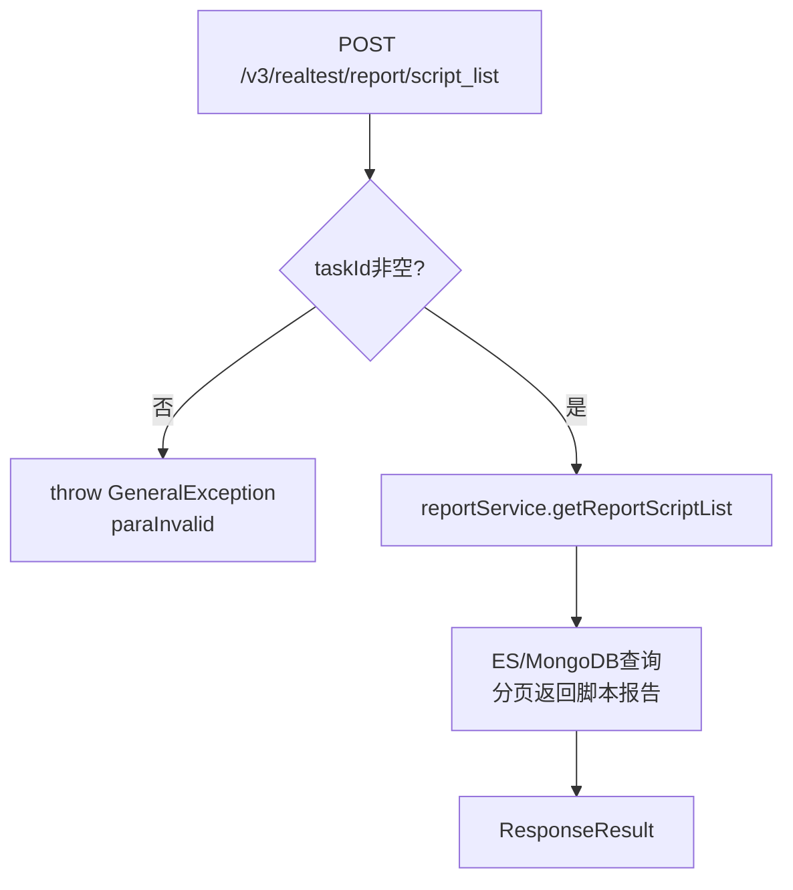

# ProblemAnalysisReportController

问题分析报告控制器，提供脚本问题分析列表、错误步骤详情、任务设备列表查询。

类路径：`real-test/src/main/java/cn/testin/mvc/controller/ProblemAnalysisReportController.java`，基础路径 `/v3/realtest`。

## 本类接口一览

| 接口 | 方法 | 路径 | 功能 |
| --- | --- | --- | --- |
| getReportScriptList | POST | /v3/realtest/report/script_list | 获取需要分析的脚本报告分页列表 |
| getErrorScriptReportDetailList | GET | /v3/realtest/report/error_step_report_detail_list | 获取错误步骤报告详情列表 |
| getDeviceList | GET | /v3/realtest/report/device_list/{task_id} | 根据任务ID获取所用设备列表 |

## getReportScriptList (`POST /v3/realtest/report/script_list`)

- **实现意图**：根据 taskId 分页查询需要错误分析的脚本列表，校验 taskId 非空。

- **请求参数**：

| 字段 | 类型 | 必填 | 说明 |
| --- | --- | --- | --- |
| taskId | String | 是 | 任务 ID（blank 抛 paraInvalid） |
| projectId | Integer | 否 | 项目 ID |
| page | Integer | 否 | 页码，默认 1 |
| pageSize | Integer | 否 | 每页条数，默认 50 |
| scriptNo | Integer | 否 | 脚本编号过滤 |
| scriptName | String | 否 | 脚本名过滤 |
| testResult | Integer | 否 | 测试结果过滤 |
| errorCauseTypeId | Integer | 否 | 错误原因类型 ID |
| customizeErrorMsg | String | 否 | 自定义错误信息过滤 |
| deviceId | String | 否 | 设备 ID |
| systemError | String | 否 | 系统错误过滤 |
| isAnalyze | Integer | 否 | 是否已分析 |
| resultCategory | Integer | 否 | 结果分类 |
| deviceIp | String | 否 | 设备 IP |
| sortFields | JSONArray | 否 | 排序字段数组，默认 ["scriptNo","dataRow"] |

- **返回参数**：

| 字段 | 类型 | 说明 |
| --- | --- | --- |
| code | Integer | 状态码，0 成功 |
| msg | String | 提示信息 |
| data | JSONObject | 分页对象 `PageResponseDTO<ScriptProblemAnalysisDTO>` |
| data.page | Integer | 当前页 |
| data.pageSize | Integer | 每页条数 |
| data.totalPage | Integer | 总页数 |
| data.totalRow | Long | 总记录数 |
| data.list | JSONArray | 脚本问题分析列表，元素为 `ScriptProblemAnalysisDTO` |
| data.list[].taskId | String | 任务 ID |
| data.list[].subTaskId | String | 子任务 ID |
| data.list[].subSubTaskId | String | 子子任务 ID |
| data.list[].scriptNo | Integer | 脚本编号 |
| data.list[].scriptName | String | 脚本名 |
| data.list[].testResult | Integer | 测试结果 |
| data.list[].inputParams | String | 输入参数 |
| data.list[].appReportDevice | JSONObject | 设备信息（`ReportDevice`，代码未确认字段） |
| data.list[].resultCategory | Integer | 结果分类 |
| data.list[].errorCauseTypeId | Integer | 错误原因类型 ID |
| data.list[].errorCauseMessage | String | 错误原因信息 |
| data.list[].customizeErrorCauseMessage | String | 自定义错误原因信息 |

- **处理流程**：

- **调用链**：[ReportService](ReportService.md).getReportScriptList -> `IEsReportSummaryDAO` / `IPmrealReportDetailDAO`。外部服务：RealAnalysis（错误分析）。

## getErrorScriptReportDetailList (`GET /v3/realtest/report/error_step_report_detail_list`)

- **实现意图**：获取指定任务/子子任务的最近 N 条错误步骤详情，用于问题定位。

- **请求参数**：

| 字段 | 类型 | 必填 | 说明 |
| --- | --- | --- | --- |
| task_id | String | 是 | 任务 ID |
| subsubtask_id | String | 是 | 子子任务 ID |
| size | Integer | 否 | 返回条数，默认 5 |

- **返回参数**：

| 字段 | 类型 | 说明 |
| --- | --- | --- |
| code | Integer | 状态码，0 成功 |
| msg | String | 提示信息 |
| data | JSONObject | 业务数据 |
| data.list | JSONArray | 错误步骤详情列表，元素为 `Map<String,Object>`（代码未确认字段） |
| data.totalRow | Integer | 总记录数（=list 大小） |

- **调用链**：[ReportService](ReportService.md).getErrorStepReportDetailList -> MongoDB/ES 查询错误步骤。

## getDeviceList (`GET /v3/realtest/report/device_list/{task_id}`)

- **实现意图**：根据任务 ID 获取当前任务执行所用设备列表。

- **请求参数**：

| 字段 | 类型 | 必填 | 说明 |
| --- | --- | --- | --- |
| task_id | String | 是 | 任务 ID（路径参数） |

- **返回参数**：

| 字段 | 类型 | 说明 |
| --- | --- | --- |
| code | Integer | 状态码，0 成功 |
| msg | String | 提示信息 |
| data | JSONObject | 业务数据 |
| data.list | JSONArray | 设备列表，元素为 `Map<String,Object>`（代码未确认字段） |

- **调用链**：[ReportService](ReportService.md).getDeviceList -> `IPmrealDeviceDetailDAO`。
