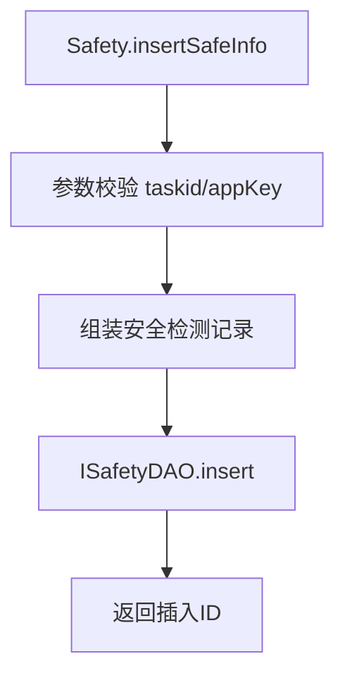

# Safety (service/app)

安全检测信息的 ApiServlet，提供加固安全信息的插入、更新、查询功能。

类路径：`real-test/src/main/java/cn/testin/service/app/Safety.java`，继承 `GenericBaseService`。

## 本类接口一览

| 接口 | op | 功能 |
| --- | --- | --- |
| insertSafeInfo | Safety.insertSafeInfo | 新增安全检测信息 |
| updateSafeInfo | Safety.updateSafeInfo | 更新安全检测信息 |
| selectSafeInfo | Safety.selectSafeInfo | 查询单条安全检测信息 |
| listSafeInfo | Safety.listSafeInfo | 查询安全检测信息列表 |

## insertSafeInfo (`Safety.insertSafeInfo`)

- **实现意图**：插入应用的加固安全检测结果（如梆梆加固检测），含检测状态、风险等级、问题详情。

- **请求参数**：
| 字段 | 类型 | 必填 | 说明 |
| --- | --- | --- | --- |
| eid | Integer | 是 | 企业 ID（<=0 时校验失败） |
| projectId | Integer | 是 | 项目 ID（<=0 时校验失败） |
| taskId | String | 是 | 平台任务 ID（blank 校验失败） |
| subTaskId | String | 是 | 平台子任务 ID（blank 校验失败） |
| bangcleTaskId | String | 否 | 梆梆任务 ID |
| createResponse | String | 否 | 创建接口响应体 |
| createStatus | String | 否 | 创建接口状态码 |
| completeResponse | String | 否 | 完成接口响应体 |
| completeStatus | String | 否 | 完成接口状态码 |
| scripts | String | 否 | 执行过的脚本 |
| createdBy | String | 否 | 创建人 |
| updatedBy | String | 否 | 更新人 |

- **返回参数**：
| 字段 | 类型 | 说明 |
| --- | --- | --- |
| code | Integer | 返回码，0 成功，非 0 失败 |
| msg | String | 返回信息 |
| data | JSONObject | 业务数据 |
| data.result | Integer | 插入记录 ID |

- **处理流程**：

- **调用链**：`Safety` -> `ISafetyDAO` -> MySQL。

- **涉及表与 SQL**：`bangcle_safety`（INSERT）。

## updateSafeInfo (`Safety.updateSafeInfo`)

- **实现意图**：更新已有安全检测记录（如重新检测后更新结果）。

- **请求参数**：
| 字段 | 类型 | 必填 | 说明 |
| --- | --- | --- | --- |
| id | Integer | 是 | 记录 ID（<=0 时校验失败） |
| eid | Integer | 否 | 企业 ID |
| projectId | Integer | 否 | 项目 ID |
| taskId | String | 否 | 平台任务 ID |
| subTaskId | String | 否 | 平台子任务 ID |
| bangcleTaskId | String | 否 | 梆梆任务 ID |
| createResponse | String | 否 | 创建接口响应体 |
| createStatus | String | 否 | 创建接口状态码 |
| completeResponse | String | 否 | 完成接口响应体 |
| completeStatus | String | 否 | 完成接口状态码 |
| scripts | String | 否 | 执行过的脚本 |
| updatedBy | String | 否 | 更新人 |

- **返回参数**：
| 字段 | 类型 | 说明 |
| --- | --- | --- |
| code | Integer | 返回码，0 成功，非 0 失败 |
| msg | String | 返回信息 |
| data | JSONObject | 业务数据 |
| data.result | Integer | 更新记录 ID |

- **涉及表与 SQL**：`bangcle_safety`（UPDATE）。

## selectSafeInfo (`Safety.selectSafeInfo`)

- **实现意图**：根据 ID 查询单条安全检测详情。

- **请求参数**：
| 字段 | 类型 | 必填 | 说明 |
| --- | --- | --- | --- |
| id | Integer | 是 | 记录 ID（<=0 时校验失败） |

- **返回参数**：
| 字段 | 类型 | 说明 |
| --- | --- | --- |
| code | Integer | 返回码，0 成功，非 0 失败 |
| msg | String | 返回信息 |
| data | JSONObject | 业务数据 |
| data.result | JSONObject | 安全检测详情（`BangcleSafety`，含 id/eid/projectId/taskId/subTaskId/bangcleTaskId/createStatus/completeStatus 等） |

## listSafeInfo (`Safety.listSafeInfo`)

- **实现意图**：按条件查询安全检测列表。

- **请求参数**：
| 字段 | 类型 | 必填 | 说明 |
| --- | --- | --- | --- |
| taskId | String | 否 | 平台任务 ID（查询条件透传 reqJson，代码未确认全部字段） |
| subTaskId | String | 否 | 平台子任务 ID |
| eid | Integer | 否 | 企业 ID |
| projectId | Integer | 否 | 项目 ID |

- **返回参数**：
| 字段 | 类型 | 说明 |
| --- | --- | --- |
| code | Integer | 返回码，0 成功，非 0 失败 |
| msg | String | 返回信息 |
| data | JSONObject | 业务数据 |
| data.list | JSONArray | 安全检测列表，元素为 `BangcleSafety`（含 id/eid/projectId/taskId/subTaskId/bangcleTaskId/createStatus/completeStatus 等） |
