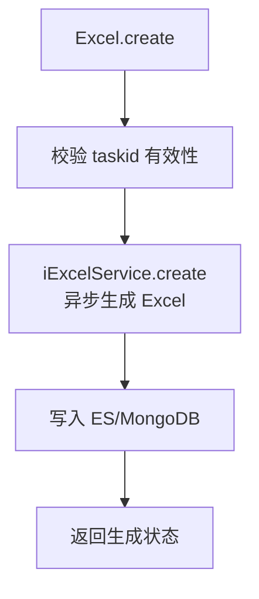

# Excel (service/report)

Excel 报表生成和管理的 ApiServlet，提供创建、生成、获取报告 Excel 功能。

类路径：`real-test/src/main/java/cn/testin/service/report/Excel.java`，继承 `GenericBaseService`。

## 本类接口一览

| 接口 | op | 功能 |
| --- | --- | --- |
| create | Excel.create | 创建 Excel 报告（异步生成） |
| generate | Excel.generate | 生成 Excel 报告数据 |
| reportExcel | Excel.reportExcel | 获取 Excel 报告下载信息 |

## create (`Excel.create`)

- **实现意图**：根据 taskId 触发异步 Excel 报告生成流程，报告数据存入 ES/MongoDB。

- **请求参数**：
| 字段 | 类型 | 必填 | 说明 |
| --- | --- | --- | --- |
| taskid | String | 是 | 任务 ID（blank 返回 10005） |

- **返回参数**：
| 字段 | 类型 | 说明 |
| --- | --- | --- |
| code | Integer | 返回码，0 成功，非 0 失败 |
| msg | String | 返回信息 |
| data | JSONObject | 业务数据 |
| data.result | Integer | 生成通知结果：1 成功，0 失败 |

- **处理流程**：

- **调用链**：`Excel` -> `IExcelService` -> `IEsReportSummaryDAO`、`IPmrealReportDetailDAO`。外部服务：[FileService](../../../文件管理服务/00-首页.md)（文件存储）。

- **涉及表与 SQL**：ES `report_summary` 索引（更新 excel 字段）。

## generate (`Excel.generate`)

- **实现意图**：根据 taskId 查询报告数据并生成 Excel 格式数据（通常由后台 Job 异步调用或通过 MQ 触发）。

- **请求参数**：
| 字段 | 类型 | 必填 | 说明 |
| --- | --- | --- | --- |
| taskid | String | 是 | 任务 ID（blank 返回 10005） |

- **返回参数**：
| 字段 | 类型 | 说明 |
| --- | --- | --- |
| code | Integer | 返回码，0 成功，非 0 失败 |
| msg | String | 返回信息 |
| data | JSONObject | 业务数据 |
| data.result | Integer | 生成结果：1 成功，0 失败 |

- **调用链**：`IExcelService.generate` -> 聚合报告数据 -> 生成 Excel 二进制。

## reportExcel (`Excel.reportExcel`)

- **实现意图**：获取已生成的 Excel 报告下载链接或二进制数据，从 `PrealUserAdapt.content` 中读取 excel 字段。

- **请求参数**：
| 字段 | 类型 | 必填 | 说明 |
| --- | --- | --- | --- |
| taskid | String | 否 | 任务 ID（与 skey 至少一个，均 blank 返回 10005） |
| skey | String | 否 | 分享链接 key（分享报告场景） |
| eid | Integer | 否 | 企业 ID |
| userid | Integer | 否 | 用户 ID |
| userprojectids | JSONArray | 否 | 用户项目组 ID 数组（元素 Integer，鉴权用） |
| lastUpdatetime | Long | 否 | 客户端上次获取的 excel 更新时间戳（判断是否需要重新生成） |

- **返回参数**：
| 字段 | 类型 | 说明 |
| --- | --- | --- |
| code | Integer | 返回码，0 成功，非 0 失败（10005 参数无效/10010 无数据/10016 统计中） |
| msg | String | 返回信息 |
| data | JSONObject | 业务数据 |
| data.result | Integer | Excel 状态：1 成功 / 0 生成中 / -1 生成失败 / -2 待执行 |
| data.excelUrl | String | Excel 下载 URL（result=1 时返回） |

- **调用链**：`IAdaptService.getUserAdapt` -> 读取 content 中 excel 字段 -> [FileService](../../../文件管理服务/00-首页.md)。
