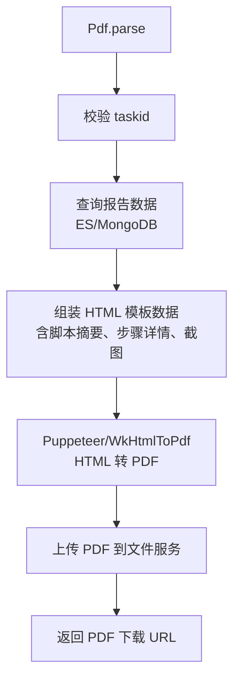

# Pdf (service/report)

PDF 报告解析的 ApiServlet，将任务报告数据解析生成 PDF 格式。

类路径：`real-test/src/main/java/cn/testin/service/report/Pdf.java`，继承 `GenericBaseService`。

## 本类接口一览

| 接口 | op | 功能 |
| --- | --- | --- |
| parse | Pdf.parse | 解析任务报告数据并生成 PDF |

## parse (`Pdf.parse`)

- **实现意图**：根据 taskId 获取报告数据，使用 HTML 模板渲染后调用 Puppeteer/WkHtmlToPdf 等工具转换为 PDF 文件，上传至文件服务并返回下载 URL。

- **请求参数**：

| 字段 | 类型 | 必填 | 说明 |
| --- | --- | --- | --- |
| url | String | 是 | 待转换的目标 URL（blank 返回 10005） |

- **返回参数**：

| 字段 | 类型 | 说明 |
| --- | --- | --- |
| code | Integer | 返回码，0 成功，非 0 失败 |
| msg | String | 返回信息 |
| data | JSONObject | 业务数据 |
| data.objInfo | JSONObject | PDF 转换状态对象（`ResponseBean`） |
| data.objInfo.code | Integer | 转换状态：-1 失败 / 0 等待中 / 1 成功 |
| data.objInfo.msg | String | 描述 |
| data.objInfo.md5Key | String | 唯一 key（由 url 的 MD5 生成） |
| data.objInfo.targetUrl | String | 目标地址 |
| data.objInfo.resultUrl | String | 生成的 PDF 文件地址 |
| data.objInfo.execTime | Long | 开始时间 |
| data.objInfo.totalTime | Long | 总耗时 |

- **处理流程**：

- **调用链**：`Pdf` -> `IPdfService` -> 报告数据查询 -> HTML 渲染 -> PDF 转换。外部服务：[FileService](../../../文件管理服务/00-首页.md)（PDF 文件存储）、[RealLogfile](../../../平台基础功能服务/00-首页.md)（截图数据）。

- **涉及表与 SQL**：ES `report_summary`（报告数据）、MongoDB `pmreal_report_detail`（步骤详情）。

- **异常与校验**：taskId 校验；PDF 生成超时/失败处理。
