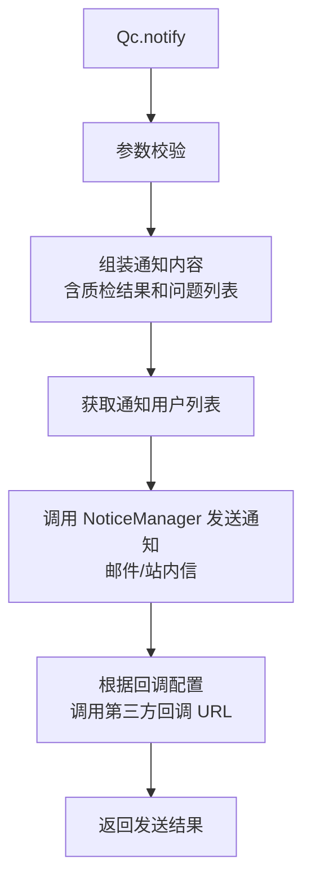

# Qc (service/report)

质检（QC）报告通知与同步的 ApiServlet，提供质检结果通知和同步质检信息两个接口。

类路径：`real-test/src/main/java/cn/testin/service/report/Qc.java`，继承 `GenericBaseService`。

## 本类接口一览

| 接口 | op | 功能 |
| --- | --- | --- |
| notify | Qc.notify | 发送质检结果通知 |
| syncInfo | Qc.syncInfo | 同步质检信息到外部系统 |

## notify (`Qc.notify`)

- **实现意图**：将质检抽查结果通知给相关人员（邮件/站内信/第三方回调），含质检通过/不通过状态及详细问题列表。

- **请求参数**：
| 字段 | 类型 | 必填 | 说明 |
| --- | --- | --- | --- |
| eid | Integer | 否 | 企业 ID |
| projectid | Integer | 否 | 项目组 ID |
| taskid | String | 否 | 任务 ID |
| subtaskid | String | 否 | 子任务 ID |
| subsubtaskid | String | 否 | 子子任务 ID |
| title | String | 否 | 标题（非空时加入通知附加信息） |
| descr | String | 否 | 描述 |
| scriptNo | Integer | 否 | 脚本编号 |
| scriptDescr | String | 否 | 脚本描述 |
| scriptTags | String | 否 | 脚本 tag 信息 |
| stepid | Integer | 否 | 脚本步骤 ID |
| userid | Integer | 否 | 用户 ID（用于鉴权获取项目列表） |

- **返回参数**：
| 字段 | 类型 | 说明 |
| --- | --- | --- |
| code | Integer | 返回码，0 成功，非 0 失败 |
| msg | String | 返回信息 |
| data | JSONObject | 业务数据 |
| data.result | Integer | 通知发送结果：1 成功，0 失败 |

- **处理流程**：

- **调用链**：`Qc` -> `IQcService` -> NoticeManager（邮件/站内信通知）。外部服务：RealAnalysis（质检数据）。

- **涉及表与 SQL**：`pmreal_spot_test_summary`（抽查数据）、`notice_task`（通知记录）。

## syncInfo (`Qc.syncInfo`)

- **实现意图**：将质检结果同步到外部系统（如 JIRA/TAPD 等缺陷管理工具），含质检问题描述、截图、测试环境信息。

- **请求参数**：
| 字段 | 类型 | 必填 | 说明 |
| --- | --- | --- | --- |
| eid | Integer | 否 | 企业 ID |
| projectid | Integer | 否 | 项目组 ID |
| taskid | String | 否 | 任务 ID |
| subtaskid | String | 否 | 子任务 ID |
| subsubtaskid | String | 否 | 子子任务 ID |
| qcid | String | 否 | QC 系统 ID |
| userid | Integer | 否 | 用户 ID（鉴权用） |

- **返回参数**：
| 字段 | 类型 | 说明 |
| --- | --- | --- |
| code | Integer | 返回码，0 成功，非 0 失败 |
| msg | String | 返回信息 |
| data | JSONObject | 业务数据 |
| data.result | Integer | 同步结果：1 成功，0 失败 |

- **调用链**：`Qc` -> NoticeManager（第三方回调 API）。
