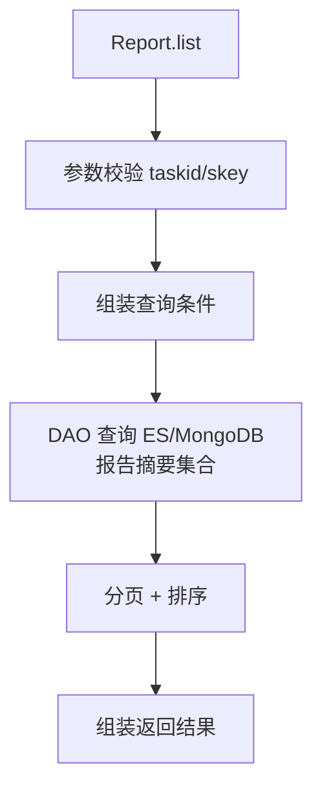

# Report (service/report)

报告查询的核心 ApiServlet，提供报告列表、步骤详情、脚本摘要、设备报告、截图查询、错误忽略/分类修改、设备/脚本恢复、真机录制等 27 个接口。

类路径：`real-test/src/main/java/cn/testin/service/report/Report.java`，继承 `GenericBaseService`。

## 本类接口一览

| 接口 | op | 功能 |
| --- | --- | --- |
| list | Report.list | 分页查询任务报告列表（多维筛选 + 排序） |
| stepExtensionFile | Report.stepExtensionFile | 获取步骤扩展文件信息 |
| url | Report.url | 获取报告查看 URL |
| spots | Report.spots | 获取任务抽查信息列表 |
| conditions | Report.conditions | 获取报告列表的查询条件选项 |
| listDeviceImages | Report.listDeviceImages | 获取设备截图列表 |
| listDeviceReport | Report.listDeviceReport | 分页查询设备级报告列表 |
| adaptDetailRunInfoDetail | Report.adaptDetailRunInfoDetail | 查询适配详情中运行信息细节 |
| stepinfos | Report.stepinfos | 获取步骤执行信息列表 |
| scriptsummaries | Report.scriptsummaries | 获取脚本摘要列表（含脚本状态、错误原因等） |
| scriptSteps | Report.scriptSteps | 获取指定脚本的所有步骤信息 |
| stepdetail | Report.stepdetail | 获取单步执行详情（含日志/screenshot/性能） |
| deviceInfo | Report.deviceInfo | 获取设备基本信息 |
| stepinfoByLine | Report.stepinfoByLine | 按行号查询步骤信息 |
| ignore | Report.ignore | 忽略指定错误步骤（标记为已处理） |
| modifyResultCategory | Report.modifyResultCategory | 修改测试结果分类 |
| deviceRestore | Report.deviceRestore | 设备恢复（重新执行设备级任务） |
| scriptRestore | Report.scriptRestore | 脚本恢复（重新执行脚本级任务） |
| testProcess | Report.testProcess | 查询测试过程信息 |
| adaptResults | Report.adaptResults | 查询适配结果详情 |
| getStatSummary | Report.getStatSummary | 获取统计摘要（设备分布/性能统计/抽查） |
| getErrorSummary | Report.getErrorSummary | 获取错误摘要信息 |
| singleScriptSummary | Report.singleScriptSummary | 获取单个脚本的执行摘要详情 |
| getRealRecordDetail | Report.getRealRecordDetail | 获取真机录制详情 |
| saveRealRecord | Report.saveRealRecord | 保存真机录制信息 |
| getRealRecordList | Report.getRealRecordList | 分页获取真机录制列表 |
| getImages | Report.getImages | 获取设备截图/图片列表 |

> 说明：V1 返回统一为 `{code, msg, data}`，`code=0` 成功；data 下字段常量为 `list`/`result`/`objInfo`/`page`/`pageSize`/`totalPage`/`totalRow`。带 `taskInfoSupplement` 的接口 `taskid` 与 `skey` 二选一。

## list (`Report.list`)

- **实现意图**：多维条件分页查询任务报告列表，支持按 deviceid/scriptno/errorType/appKey 等过滤、按 time/scriptStatus 排序。返回含分页信息的报告列表。

- **请求参数**：

| 字段 | 类型 | 必填 | 说明 |
| --- | --- | --- | --- |
| taskid | String | 是 | 任务 ID（blank 抛 paraInvalid；可用 skey 替代） |
| skey | String | 否 | 分享链接 key（与 taskid 二选一） |
| subtaskid | String | 否 | 子任务 ID |
| subsubtaskids | JSONArray | 否 | 子子任务 ID 列表（元素 String） |
| keywords | JSONArray | 否 | 关键字列表（元素 String） |
| history | Boolean | 否 | 是否查询重试记录，默认 false |
| containRetest | Boolean | 否 | 是否查询补测记录，默认 false |
| page | Integer | 否 | 页码，默认 1 |
| pageSize | Integer | 否 | 每页条数，默认 200（1~200） |
| userid | Integer | 否 | 用户 ID |
| eid | Integer | 否 | 企业 ID |
| userprojectids | JSONArray | 否 | 用户项目组 ID 数组（元素 Integer） |

- **返回参数**：

| 字段 | 类型 | 说明 |
| --- | --- | --- |
| code | Integer | 状态码，0 成功 |
| msg | String | 提示信息 |
| data.list | JSONArray | 报告详情列表，元素为 `PmrealReportDetail` |
| data.page | Integer | 当前页 |
| data.pageSize | Integer | 每页条数 |
| data.totalPage | Integer | 总页数 |
| data.totalRow | Long | 总记录数 |

- **处理流程**：

- **调用链**：`Report` -> `IReportService`（business）-> `IEsReportSummaryDAO` / `IPmrealReportDetailDAO`、`IPmrealScriptSummaryDAO`。外部服务：[RealLogfile](../../../平台基础功能服务/00-首页.md)（日志数据）。

- **涉及表与 SQL**：Elasticsearch `report_summary` 索引、MongoDB `pmreal_report_detail`、MySQL `pmreal_script_summary`。

## stepExtensionFile (`Report.stepExtensionFile`)

- **实现意图**：获取步骤的扩展文件信息。

- **请求参数**：

| 字段 | 类型 | 必填 | 说明 |
| --- | --- | --- | --- |
| taskid | String | 是 | 任务 ID（blank 抛 paraInvalid） |
| subsubtaskid | String | 是 | 子子任务 ID |
| scriptTag | String | 是 | 脚本的 scriptTag |
| stepid | Integer | 是 | 步骤 ID（null 抛 paraInvalid） |
| history | Boolean | 否 | 是否包含重试记录，默认 false |
| conditionKeys | JSONObject | 否 | 条件对象 |

- **返回参数**：

| 字段 | 类型 | 说明 |
| --- | --- | --- |
| code | Integer | 状态码，0 成功 |
| msg | String | 提示信息 |
| data.list | JSONArray | 步骤扩展文件信息列表 |

## url (`Report.url`)

- **实现意图**：获取报告查看 URL。

- **请求参数**：

| 字段 | 类型 | 必填 | 说明 |
| --- | --- | --- | --- |
| taskid | String | 是 | 任务 ID（blank 抛 paraInvalid） |
| projectid | Integer | 是 | 项目组 ID（null 抛 paraInvalid） |
| subtaskid | String | 否 | 子任务 ID |

- **返回参数**：

| 字段 | 类型 | 说明 |
| --- | --- | --- |
| code | Integer | 状态码，0 成功 |
| msg | String | 提示信息 |
| data.result | String | 报告查看 URL |

## spots (`Report.spots`)

- **实现意图**：获取任务抽查（埋点）信息列表。

- **请求参数**：

| 字段 | 类型 | 必填 | 说明 |
| --- | --- | --- | --- |
| taskid | String | 否 | 任务 ID（未做强校验） |
| page | Integer | 否 | 页码 |
| pageSize | Integer | 否 | 每页条数 |
| round | Integer | 否 | 轮数 |
| item | String | 否 | 抽查项 |
| releaseVer | String | 否 | 系统版本 |
| dpiWidth | Integer | 否 | 分辨率宽 |
| dpiHeight | Integer | 否 | 分辨率高 |
| aliasName | String | 否 | 设备名称 |

- **返回参数**：

| 字段 | 类型 | 说明 |
| --- | --- | --- |
| code | Integer | 状态码，0 成功 |
| msg | String | 提示信息 |
| data.list | JSONArray | 抽查信息列表，元素为 `PmrealSpotTestSummary` |
| data.page | Integer | 当前页 |
| data.pageSize | Integer | 每页条数 |
| data.totalPage | Integer | 总页数 |
| data.totalRow | Long | 总记录数 |

## conditions (`Report.conditions`)

- **实现意图**：获取脚本执行概况的查询筛选条件选项（设备品牌、版本、分辨率等）。

- **请求参数**：

| 字段 | 类型 | 必填 | 说明 |
| --- | --- | --- | --- |
| taskid | String | 是 | 任务 ID（taskid 与 skey 二选一，无则返回 infoMatch） |
| skey | String | 否 | 分享链接 key |
| resultCategorys | JSONArray | 否 | 结果分类列表（元素 Integer） |
| userid | Integer | 否 | 用户 ID |
| eid | Integer | 否 | 企业 ID |
| userprojectids | JSONArray | 否 | 用户项目组 ID 数组（元素 Integer） |

- **返回参数**：

| 字段 | 类型 | 说明 |
| --- | --- | --- |
| code | Integer | 状态码，0 成功 |
| msg | String | 提示信息 |
| data | JSONObject | 查询条件 Map（`Map<String, Set<Object>>`），含 brands/releaseVers/resolutions 等（代码未确认全部字段） |

## listDeviceImages (`Report.listDeviceImages`)

- **实现意图**：错误分析接口中设备列表截图展示查询。

- **请求参数**：

| 字段 | 类型 | 必填 | 说明 |
| --- | --- | --- | --- |
| taskid | String | 是 | 任务 ID（taskid 与 skey 二选一） |
| errorMsg | String | 是 | 错误定位（CheckArgs 校验） |
| scriptNo | Integer | 是 | 脚本编号 |
| resultCategory | Integer | 是 | 结果分类 |
| scriptTags | String | 否 | 脚本标签 |
| page | Integer | 否 | 页码，默认 1 |
| pageSize | Integer | 否 | 每页条数，默认 200 |
| skey | String | 否 | 分享链接 key |
| userid | Integer | 否 | 用户 ID |
| eid | Integer | 否 | 企业 ID |
| userprojectids | JSONArray | 否 | 用户项目组 ID 数组 |

- **返回参数**：

| 字段 | 类型 | 说明 |
| --- | --- | --- |
| code | Integer | 状态码，0 成功 |
| msg | String | 提示信息 |
| data.list | JSONArray | 设备截图报告列表，元素为 `EsReportSummary` |
| data.totalRow | Long | 总记录数 |
| data.totalPage | Integer | 总页数 |
| data.page | Integer | 当前页 |
| data.pageSize | Integer | 每页条数 |

## listDeviceReport (`Report.listDeviceReport`)

- **实现意图**：分页查询设备级报告列表，支持按状态/结果分类/品牌/版本/分辨率过滤。

- **请求参数**：

| 字段 | 类型 | 必填 | 说明 |
| --- | --- | --- | --- |
| taskid | String | 是 | 任务 ID（taskid 与 skey 二选一） |
| round | Integer | 否 | 轮数，默认 1 |
| keyword | String | 否 | 关键字（设备名或错误定位） |
| status | JSONArray | 否 | 设备运行状态数组（-1 未通过/-2 待执行/-3 执行中/-4 失效） |
| resultCategorys | JSONArray | 否 | 结果分类数组 |
| brands | JSONArray | 否 | 品牌过滤（元素 String） |
| releaseVers | JSONArray | 否 | 版本过滤（元素 String） |
| resolutions | JSONArray | 否 | 分辨率过滤（元素 `{"dpiWidth":Integer,"dpiHeight":Integer}`） |
| skey | String | 否 | 分享链接 key |
| userid | Integer | 否 | 用户 ID |
| eid | Integer | 否 | 企业 ID |
| userprojectids | JSONArray | 否 | 用户项目组 ID 数组 |

- **返回参数**：

| 字段 | 类型 | 说明 |
| --- | --- | --- |
| code | Integer | 状态码，0 成功 |
| msg | String | 提示信息 |
| data.list | JSONArray | 设备报告列表，元素为 `RealReportDeviceInfo`（含 deviceId/subtaskid/deviceName/dpiHeight/dpiWidth/releaseVer/resultCategory/startExecTime/finishTime/execStatus/errorCauseTypeId/ignoreMark） |

## adaptDetailRunInfoDetail (`Report.adaptDetailRunInfoDetail`)

- **实现意图**：查询适配详情中的运行信息细节。

- **请求参数**：

| 字段 | 类型 | 必填 | 说明 |
| --- | --- | --- | --- |
| taskid | String | 是 | 任务 ID（taskid 与 skey 二选一） |
| subtaskid | String | 否 | 子任务 ID |
| round | Integer | 否 | 轮数，默认 1 |
| skey | String | 否 | 分享链接 key |
| userid | Integer | 否 | 用户 ID |
| eid | Integer | 否 | 企业 ID |
| userprojectids | JSONArray | 否 | 用户项目组 ID 数组 |

- **返回参数**：

| 字段 | 类型 | 说明 |
| --- | --- | --- |
| code | Integer | 状态码，0 成功 |
| msg | String | 提示信息 |
| data.result | JSONObject | 适配运行详情（`RealAdaptDetail`，代码未确认字段） |

## stepinfos (`Report.stepinfos`)

- **实现意图**：获取指定子子任务的所有步骤执行信息，含每步状态、耗时、截图、日志等。

- **请求参数**：

| 字段 | 类型 | 必填 | 说明 |
| --- | --- | --- | --- |
| taskid | String | 是 | 任务 ID（blank 且无 skey 抛 paraInvalid） |
| scriptTag | String | 是 | 脚本标记 |
| subsubtaskidList | JSONArray | 是 | 子子任务 ID 集合（元素 String，空抛 paraInvalid） |
| stepid | Integer | 是 | 步骤 ID（null 或 <0 抛 paraInvalid） |
| skey | String | 否 | 分享链接 key |

- **返回参数**：

| 字段 | 类型 | 说明 |
| --- | --- | --- |
| code | Integer | 状态码，0 成功 |
| msg | String | 提示信息 |
| data.objInfo | JSONObject | 步骤信息 Map（`Map<String, StepInfo>`，key=设备 ID） |

- **调用链**：`iReportService` -> MongoDB `pmreal_report_detail` -> [RealLogfile](../../../平台基础功能服务/00-首页.md)（步骤日志详情）。

## scriptsummaries (`Report.scriptsummaries`)

- **实现意图**：获取任务下所有脚本的执行摘要，含脚本状态、成功/失败步骤数、错误原因、执行时长等。

- **请求参数**：

| 字段 | 类型 | 必填 | 说明 |
| --- | --- | --- | --- |
| taskid | String | 是 | 任务 ID（taskid 与 skey 二选一，blank 抛 paraInvalid） |
| async | Integer | 否 | 是否异步查询（>0 走关键字查询） |
| orderNum | Integer | 否 | 排序号，默认 -1 |
| callTag | String | 否 | 脚本调用标记 |
| scriptid | Integer | 否 | 脚本 ID |
| skey | String | 否 | 分享链接 key |
| userid | Integer | 否 | 用户 ID |
| eid | Integer | 否 | 企业 ID |
| userprojectids | JSONArray | 否 | 用户项目组 ID 数组 |

- **返回参数**：

| 字段 | 类型 | 说明 |
| --- | --- | --- |
| code | Integer | 状态码，0 成功 |
| msg | String | 提示信息 |
| data.list | JSONArray | 脚本摘要列表，元素为 `PmrealScriptSummary` |

- **调用链**：`IPmrealScriptSummaryDAO`。

## scriptSteps (`Report.scriptSteps`)

- **实现意图**：获取指定脚本在指定设备上的所有步骤列表，常用于单脚本调试视图。

- **请求参数**：

| 字段 | 类型 | 必填 | 说明 |
| --- | --- | --- | --- |
| subtaskid | String | 是 | 子任务 ID（CheckArgs 校验） |
| taskid | String | 是 | 任务 ID（taskid 与 skey 二选一） |
| findSubsubtaskid | String | 否 | 指定子子任务 ID |
| findRetryNum | Integer | 否 | 指定重试次数 |
| async | Integer | 否 | 是否异步 |
| orderNum | Integer | 否 | 排序号 |
| callTag | String | 否 | 脚本调用标记 |
| skey | String | 否 | 分享链接 key |
| userid | Integer | 否 | 用户 ID |
| eid | Integer | 否 | 企业 ID |
| userprojectids | JSONArray | 否 | 用户项目组 ID 数组 |

- **返回参数**：

| 字段 | 类型 | 说明 |
| --- | --- | --- |
| code | Integer | 状态码，0 成功 |
| msg | String | 提示信息 |
| data.preResult | Boolean | 预处理结果 |
| data.processMap | JSONObject | 处理流程 Map（`Map<String,Integer>`） |
| data.processArray | JSONArray | 处理流程数组（元素 `TestProcess`） |
| data.list | JSONArray | 脚本步骤摘要列表，元素为 `PmrealScriptSummary` |

## stepdetail (`Report.stepdetail`)

- **实现意图**：获取单个步骤的完整执行详情，含日志输出、截图 URL、性能指标（CPU/内存/流量）。

- **请求参数**：

| 字段 | 类型 | 必填 | 说明 |
| --- | --- | --- | --- |
| subsubtaskid | String | 是 | 子子任务 ID（CheckArgs 校验） |
| scriptTag | String | 是 | 脚本标记 |
| stepid | Integer | 是 | 步骤 ID |
| taskid | String | 否 | 任务 ID（taskid 与 skey 二选一） |
| global | Integer | 否 | 是否全局，默认 0 |
| skey | String | 否 | 分享链接 key |
| userid | Integer | 否 | 用户 ID |
| eid | Integer | 否 | 企业 ID |
| userprojectids | JSONArray | 否 | 用户项目组 ID 数组 |

- **返回参数**：

| 字段 | 类型 | 说明 |
| --- | --- | --- |
| code | Integer | 状态码，0 成功 |
| msg | String | 提示信息 |
| data.result | JSONObject | 步骤执行详情（`Map<String,Object>`，代码未确认字段） |

- **调用链**：`iReportService` -> MongoDB 步骤详情 -> [RealLogfile](../../../平台基础功能服务/00-首页.md)（日志文件）。

## deviceInfo (`Report.deviceInfo`)

- **实现意图**：获取设备基本信息。

- **请求参数**：

| 字段 | 类型 | 必填 | 说明 |
| --- | --- | --- | --- |
| subtaskid | String | 是 | 子任务 ID（CheckArgs 校验） |
| taskid | String | 否 | 任务 ID（taskid 与 skey 二选一） |
| orderNum | Integer | 否 | 排序号 |
| skey | String | 否 | 分享链接 key |
| userid | Integer | 否 | 用户 ID |
| eid | Integer | 否 | 企业 ID |
| userprojectids | JSONArray | 否 | 用户项目组 ID 数组 |

- **返回参数**：

| 字段 | 类型 | 说明 |
| --- | --- | --- |
| code | Integer | 状态码，0 成功 |
| msg | String | 提示信息 |
| data.result | JSONArray | 设备信息列表（`List<Object>`，代码未确认字段） |

## stepinfoByLine (`Report.stepinfoByLine`)

- **实现意图**：按行号查询步骤信息（任务轨迹）。

- **请求参数**：

| 字段 | 类型 | 必填 | 说明 |
| --- | --- | --- | --- |
| subtaskid | String | 是 | 子任务 ID（CheckArgs 校验） |
| subsubtaskid | String | 是 | 子子任务 ID |
| line | Integer | 是 | 行号 |
| taskid | String | 否 | 任务 ID（taskid 与 skey 二选一） |
| skey | String | 否 | 分享链接 key |
| userid | Integer | 否 | 用户 ID |
| eid | Integer | 否 | 企业 ID |
| userprojectids | JSONArray | 否 | 用户项目组 ID 数组 |

- **返回参数**：

| 字段 | 类型 | 说明 |
| --- | --- | --- |
| code | Integer | 状态码，0 成功 |
| msg | String | 提示信息 |
| data.objInfo | JSONObject | 步骤信息（`StepInfo`） |

## ignore (`Report.ignore`)

- **实现意图**：标记错误步骤为"已忽略"，不参与失败率统计。

- **请求参数**：

| 字段 | 类型 | 必填 | 说明 |
| --- | --- | --- | --- |
| taskid | String | 是 | 任务 ID（CheckArgs 校验） |
| subtaskids | JSONArray | 是 | 子任务 ID 列表（元素 String） |
| projectid | Integer | 是 | 项目 ID |
| subsubtaskids | JSONArray | 否 | 子子任务 ID 列表（元素 String） |
| round | Integer | 否 | 轮数，默认 1 |
| userid | Integer | 否 | 用户 ID |
| username | String | 否 | 用户名 |

- **返回参数**：

| 字段 | 类型 | 说明 |
| --- | --- | --- |
| code | Integer | 状态码，0 成功 |
| msg | String | 提示信息 |
| data.result | Integer | 1 成功，0 失败 |

- **调用链**：`iReportService.ignore` -> MongoDB 更新步骤 ignore 标记。

## modifyResultCategory (`Report.modifyResultCategory`)

- **实现意图**：人工修改测试结果分类（如将超时改为设备问题），用于结果纠偏。

- **请求参数**：

| 字段 | 类型 | 必填 | 说明 |
| --- | --- | --- | --- |
| taskid | String | 是 | 任务 ID（has + blank 校验） |
| subtaskid | String | 是 | 子任务 ID |
| subsubtaskid | String | 是 | 子子任务 ID |
| projectid | Integer | 是 | 项目 ID |
| resultCategory | Integer | 是 | 结果分类（非法值抛 paraInvalid） |
| round | Integer | 否 | 轮数，默认 1 |

- **返回参数**：

| 字段 | 类型 | 说明 |
| --- | --- | --- |
| code | Integer | 状态码，0 成功 |
| msg | String | 提示信息 |
| data.result | Integer | 1 成功，0 失败 |

## deviceRestore (`Report.deviceRestore`)

- **实现意图**：设备恢复（对失败设备重新执行），触发补测。

- **请求参数**：

| 字段 | 类型 | 必填 | 说明 |
| --- | --- | --- | --- |
| taskid | String | 是 | 任务 ID（CheckArgs 校验） |
| subtaskid | String | 是 | 子任务 ID |
| projectid | Integer | 是 | 项目 ID |
| round | Integer | 否 | 轮数，默认 1 |
| userid | Integer | 否 | 用户 ID |
| username | String | 否 | 用户名 |

- **返回参数**：

| 字段 | 类型 | 说明 |
| --- | --- | --- |
| code | Integer | 状态码，0 成功 |
| msg | String | 提示信息 |
| data.result | Integer | 1 成功，0 失败 |

- **调用链**：[RealScheduling](../../../任务调度服务（real-scheduling）/07-开放接口文档/00-模块索引.md)（重新调度任务）。

## scriptRestore (`Report.scriptRestore`)

- **实现意图**：脚本恢复（对失败脚本重新执行），触发补测。

- **请求参数**：

| 字段 | 类型 | 必填 | 说明 |
| --- | --- | --- | --- |
| taskid | String | 是 | 任务 ID（CheckArgs 校验） |
| subtaskid | String | 是 | 子任务 ID |
| subsubtaskid | String | 是 | 子子任务 ID |
| projectid | Integer | 是 | 项目 ID |
| round | Integer | 否 | 轮数，默认 1 |
| userid | Integer | 否 | 用户 ID |
| username | String | 否 | 用户名 |

- **返回参数**：

| 字段 | 类型 | 说明 |
| --- | --- | --- |
| code | Integer | 状态码，0 成功 |
| msg | String | 提示信息 |
| data.result | Integer | 1 成功，0 失败 |

- **调用链**：[RealScheduling](../../../任务调度服务（real-scheduling）/07-开放接口文档/00-模块索引.md)（重新调度任务）。

## testProcess (`Report.testProcess`)

- **实现意图**：查询报告 testProcess（测试过程）信息。

- **请求参数**：

| 字段 | 类型 | 必填 | 说明 |
| --- | --- | --- | --- |
| taskid | String | 否 | 任务 ID（与 subsubtaskid 至少一个，taskid 可用 skey 替代） |
| subsubtaskid | String | 否 | 子子任务 ID |
| name | String | 否 | 测试过程名过滤 |
| stage | String | 否 | 阶段过滤 |
| skey | String | 否 | 分享链接 key |
| userid | Integer | 否 | 用户 ID |
| eid | Integer | 否 | 企业 ID |
| userprojectids | JSONArray | 否 | 用户项目组 ID 数组 |

- **返回参数**：

| 字段 | 类型 | 说明 |
| --- | --- | --- |
| code | Integer | 状态码，0 成功 |
| msg | String | 提示信息 |
| data.list | JSONArray | 测试过程列表，元素为 `TestProcess` |

## adaptResults (`Report.adaptResults`)

- **实现意图**：查询适配结果详情（含设备执行列表与脚本执行列表）。

- **请求参数**：

| 字段 | 类型 | 必填 | 说明 |
| --- | --- | --- | --- |
| taskid | String | 是 | 任务 ID（blank 抛 GeneralException） |
| subtaskid | String | 否 | 子任务 ID |
| round | Integer | 否 | 轮数，默认 1 |
| containRetest | Integer | 否 | 是否包含补测记录，>0 为 true |

- **返回参数**：

| 字段 | 类型 | 说明 |
| --- | --- | --- |
| code | Integer | 状态码，0 成功 |
| msg | String | 提示信息 |
| data.list | JSONArray | 适配结果列表，元素为 `PmrealAdaptResult` |

## getStatSummary (`Report.getStatSummary`)

- **实现意图**：获取统计摘要（设备分布、性能统计、抽查信息），支持 keyword 按需查询子项。

- **请求参数**：

| 字段 | 类型 | 必填 | 说明 |
| --- | --- | --- | --- |
| taskid | String | 是 | 任务 ID（blank 抛 GeneralException） |
| keywords | JSONArray | 否 | 返回关键字过滤（元素 String，取值 statSummary/spotTestSummarys/execSummary 等） |
| page | Integer | 是 | 页码（<=0 抛 GeneralException） |
| pageSize | Integer | 是 | 每页条数（<=0 抛 GeneralException） |
| 其他过滤字段 | Object | 否 | 除 taskid/keywords/page/pageSize 外其余字段透传 conditionMap |

- **返回参数**：

| 字段 | 类型 | 说明 |
| --- | --- | --- |
| code | Integer | 状态码，0 成功 |
| msg | String | 提示信息 |
| data.objInfo | JSONObject | 统计摘要（`TestStatSummary`，代码未确认字段） |

- **调用链**：`iStatSummaryService` -> `IPmrealStatSummaryDAO`、`IPmrealSpotTestSummaryDAO`。

## getErrorSummary (`Report.getErrorSummary`)

- **实现意图**：获取错误摘要信息。

- **请求参数**：

| 字段 | 类型 | 必填 | 说明 |
| --- | --- | --- | --- |
| taskid | String | 否 | 任务 ID |
| subtaskid | String | 否 | 子任务 ID |

- **返回参数**：

| 字段 | 类型 | 说明 |
| --- | --- | --- |
| code | Integer | 状态码，0 成功 |
| msg | String | 提示信息 |
| data.objInfo | JSONObject | 错误摘要（`TestErrorSummary`，查询为空时无此字段） |

## singleScriptSummary (`Report.singleScriptSummary`)

- **实现意图**：获取单个脚本的执行摘要详情（切换脚本时调用）。

- **请求参数**：

| 字段 | 类型 | 必填 | 说明 |
| --- | --- | --- | --- |
| taskid | String | 是 | 任务 ID（blank 抛 GeneralException） |
| scriptNo | Integer | 是 | 脚本编号（<=0 抛 GeneralException） |
| scriptid | Integer | 是 | 脚本 ID（<=0 抛 GeneralException） |
| orderNum | Integer | 是 | 排序号（<=0 抛 GeneralException） |

- **返回参数**：

| 字段 | 类型 | 说明 |
| --- | --- | --- |
| code | Integer | 状态码，0 成功 |
| msg | String | 提示信息 |
| data.objInfo | JSONObject | 脚本摘要（`PmrealScriptSummary`，为空时返回空对象） |

## getRealRecordDetail (`Report.getRealRecordDetail`)

- **实现意图**：获取真机录制（真机调试）报告详情，支持分享 skey 查询。

- **请求参数**：

| 字段 | 类型 | 必填 | 说明 |
| --- | --- | --- | --- |
| taskid | String | 否 | 任务 ID（`RealRecordDetailDTO` 字段，skey 与 taskid 二选一） |
| skey | String | 否 | 分享链接 key |

- **返回参数**：

| 字段 | 类型 | 说明 |
| --- | --- | --- |
| code | Integer | 状态码，0 成功 |
| msg | String | 提示信息 |
| data | JSONObject | 真机录制详情（`RealRecordDetailDTO`，含 id/taskid/taskName/sessionId/uniqueId/deviceId/brandName/modelName/startTime/endTime/useTime/videoUrl/images 等） |

- **调用链**：`RealRecordDetailDAOImpl`（`trueAgent` 包）。
- **涉及表与 SQL**：MySQL/MongoDB `real_record_detail`。

## saveRealRecord (`Report.saveRealRecord`)

- **实现意图**：保存真机录制信息。

- **请求参数**：body 透传 reqJson（含设备数组等，`RealRecordDTO`/`RealRecordDetailDTO` 字段，代码未确认全部字段）。

- **返回参数**：

| 字段 | 类型 | 说明 |
| --- | --- | --- |
| code | Integer | 状态码，0 成功 |
| msg | String | 提示信息 |

- **调用链**：`RealRecordDAOImpl` / `RealRecordDetailDAOImpl`（`trueAgent` 包）。
- **涉及表与 SQL**：MySQL/MongoDB `real_record`、`real_record_detail`。

## getRealRecordList (`Report.getRealRecordList`)

- **实现意图**：分页获取真机录制列表。

- **请求参数**：body `RealRecordListRequestDTO`。

| 字段 | 类型 | 必填 | 说明 |
| --- | --- | --- | --- |
| page | Integer | 是 | 起始页（<=0 抛 GeneralException） |
| pageSize | Integer | 是 | 页数大小（<=0 抛 GeneralException） |
| eid | Integer | 否 | 企业 ID |
| projectId | Integer | 否 | 项目 ID |
| userId | Integer | 否 | 用户 ID |
| userName | String | 否 | 用户名 |
| startTime | Long | 否 | 开始时间 |
| endTime | Long | 否 | 结束时间 |

- **返回参数**：

| 字段 | 类型 | 说明 |
| --- | --- | --- |
| code | Integer | 状态码，0 成功 |
| msg | String | 提示信息 |
| data.page | Integer | 当前页 |
| data.pageSize | Integer | 每页条数 |
| data.totalPage | Long | 总页数 |
| data.totalRow | Long | 总记录数 |
| data.list | JSONArray | 真机录制列表，元素为 `RealRecordDTO` |

- **调用链**：`RealRecordDAOImpl`（`trueAgent` 包）。
- **涉及表与 SQL**：MySQL/MongoDB `real_record`。

## getImages (`Report.getImages`)

- **实现意图**：获取设备截图/图片列表（真机录制图片）。

- **请求参数**：

| 字段 | 类型 | 必填 | 说明 |
| --- | --- | --- | --- |
| taskid | String | 是 | 任务 ID（null 抛 GeneralException；可用 skey 替代） |
| type | String | 是 | 图片类型（null 抛 GeneralException） |
| pkgName | String | 否 | 包名 |
| times | Integer | 否 | 次数 |
| time | String | 否 | 时间 |
| skey | String | 否 | 分享链接 key |

- **返回参数**：

| 字段 | 类型 | 说明 |
| --- | --- | --- |
| code | Integer | 状态码，0 成功 |
| msg | String | 提示信息 |
| data | JSONArray | 图片列表（元素为图片信息 JSONObject，无图片时返回空数组） |

- **调用链**：`RealRecordDetailDAOImpl`（`trueAgent` 包）。
