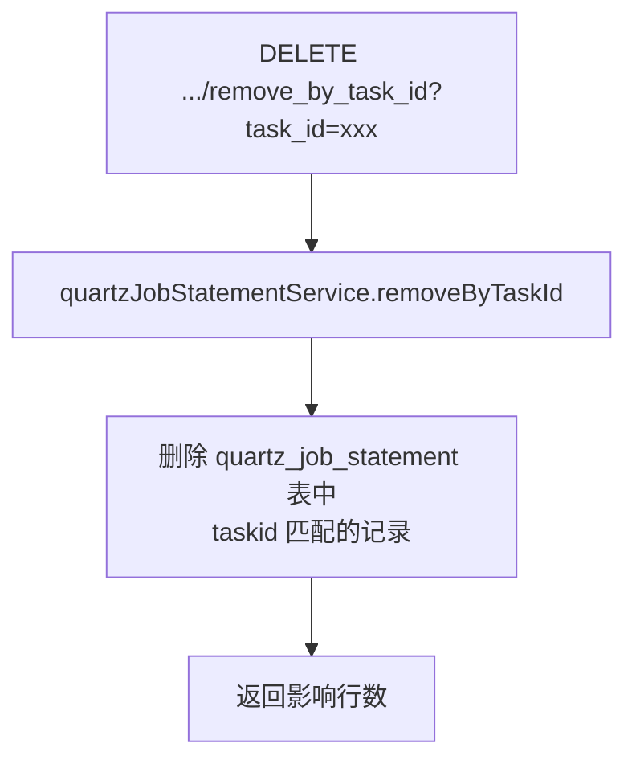

# QuartzJobStatementController

定时任务记录清理的 MVC 控制器，按 taskId 删除关联的定时任务记录。

类路径：`real-test/src/main/java/cn/testin/mvc/controller/QuartzJobStatementController.java`，基础路径 `/v3/quartz_job_statement`。

## 本类接口一览

| 接口 | 方法 | 路径 | 功能 |
| --- | --- | --- | --- |
| removeByTaskId | DELETE | /v3/quartz_job_statement/quartz_job_statement/remove_by_task_id | 根据 taskId 删除定时任务记录 |

## removeByTaskId (`DELETE /v3/quartz_job_statement/quartz_job_statement/remove_by_task_id`)

- **实现意图**：删除指定 taskId 关联的定时任务执行记录（`quartz_job_statement` 表）。通常用于取消任务或任务完成后清理调度记录。

- **请求参数**：

| 字段 | 类型 | 必填 | 说明 |
|---|---|---|---|
| task_id | String | 是 | 任务 ID |

- **返回参数**：`ResponseResult<Integer>`，data 为删除影响行数。

| 字段 | 类型 | 说明 |
|---|---|---|
| code | Integer | 状态码 0 成功 |
| msg | String | 提示信息 |
| data | Integer | 删除结果 |

- **处理流程**：



- **调用链**：`QuartzJobStatementController` -> [QuartzJobStatementService](QuartzJobStatementService.md) -> `IQuartzJobStatementDAO` -> `QuartzJobStatementMapper.xml`。

- **涉及表与 SQL**：

| 表 | 操作 | 说明 |
| --- | --- | --- |
| quartz_job_statement | DELETE | 按 task_id 删除定时任务执行记录 |

- **异常与校验**：无显式参数校验，异常由 GlobalExceptionHandler 兜底。

- **关键代码摘录**：

```java
// real-test/src/main/java/cn/testin/mvc/controller/QuartzJobStatementController.java
@DeleteMapping("/quartz_job_statement/remove_by_task_id")
public ResponseResult<Integer> removeByTaskId(@RequestParam("task_id") String taskId) {
    Integer result = quartzJobStatementService.removeByTaskId(taskId);
    return ResponseResult.success(result);
}
```
