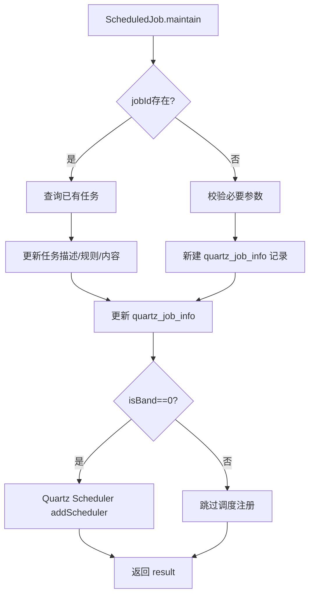

# ScheduledJob (service/app)

定时任务管理的 ApiServlet，提供任务的创建/更新/列表/执行控制（单条+批量）。

类路径：`real-test/src/main/java/cn/testin/service/app/ScheduledJob.java`，继承 `GenericBaseService`。

## 本类接口一览

| 接口 | op | 功能 |
| --- | --- | --- |
| get | ScheduledJob.get | 获取单个定时任务详情（含 jobInfo + jobStatement + 关联 taskIds） |
| list | ScheduledJob.list | 分页条件查询定时任务列表 |
| execute | ScheduledJob.execute | 立即触发定时任务执行 |
| batchExecute | ScheduledJob.batchExecute | 批量触发定时任务执行 |
| pause | ScheduledJob.pause | 暂停定时任务调度 |
| batchPause | ScheduledJob.batchPause | 批量暂停定时任务 |
| stop | ScheduledJob.stop | 停止定时任务 |
| batchStop | ScheduledJob.batchStop | 批量停止定时任务 |
| resume | ScheduledJob.resume | 恢复定时任务调度 |
| batchResume | ScheduledJob.batchResume | 批量恢复定时任务 |
| maintain | ScheduledJob.maintain | 更新定时任务（描述/规则/内容） |
| getScheduleTaskScriptIds | ScheduledJob.getScheduleTaskScriptIds | 获取待执行定时任务的脚本 ID |
| listTaskIdByJobId | ScheduledJob.listTaskIdByJobId | 根据 jobId 获取最近任务 ID 列表（分页） |
| listAllTaskIdByJobId | ScheduledJob.listAllTaskIdByJobId | 获取 jobId 所有关联 taskId |
| delTaskScheduledJob | ScheduledJob.delTaskScheduledJob | 删除定时任务关联流水 |

## get (`ScheduledJob.get`)

- **实现意图**：获取单个定时任务详情，含基本 jobInfo（`DbQuartzJobInfo`）及关联关系。

- **请求参数**：

| 字段 | 类型 | 必填 | 说明 |
| --- | --- | --- | --- |
| projectid | Integer | 是 | 项目组 ID（null → GeneralException） |
| jobId | Integer | 是 | 任务计划 ID（null → GeneralException；不存在或不属于该项目 → GeneralException） |

- **返回参数**：`{code, msg, data}`，data 含 `objInfo`。

| 字段 | 类型 | 说明 |
| --- | --- | --- |
| code | Integer | 状态码，0 成功 |
| msg | String | 提示信息 |
| data.objInfo | JSONObject | 定时任务详情（`DbQuartzJobInfo`，字段见下表） |

`DbQuartzJobInfo` 关键字段：

| 字段 | 类型 | 说明 |
| --- | --- | --- |
| jobId | Long | 定时任务 ID |
| jobName | String | 定时任务名称 |
| jobRule | String | 定时任务规则 |
| jobStatus | String | 定时任务状态 |
| jobRemark | String | 备注 |
| userId | Integer | 用户 ID |
| userName | String | 用户名 |
| eid | Integer | 企业 ID |
| projectId | Integer | 项目组 ID |
| taskContent | String | 老版提测内容 |
| newTaskContent | String | 新版提测内容 |
| taskDesc | String | 任务描述 |
| appId | Integer | appId |
| appName | String | 应用名称 |
| appVersion | String | 应用版本 |
| pkgId | Integer | 包 ID |
| packageName | String | 包名称 |
| bizCode | Integer | 业务类型 |
| syspfId | Integer | 平台类型 |
| channelId | String | 应用渠道 ID |
| suiteId | Integer | 应用 ID（跨平台） |
| jobType | Integer | 任务类型 |
| dirId | Integer | 目录 ID |
| updateUserId | Integer | 修改人 ID |
| customJobRule | String | jobType=3 时的任务规则 |
| createTime | Long | 创建时间 |
| updateTime | Long | 修改时间 |

- **调用链**：`IQuartzJobInfoService.get` -> `DbQuartzJobInfo`。

## list (`ScheduledJob.list`)

- **实现意图**：分页条件查询定时任务列表，支持按项目/业务/应用/状态等过滤，并回填关联的测试计划关系与有效设备数。

- **请求参数**：

| 字段 | 类型 | 必填 | 说明 |
| --- | --- | --- | --- |
| projectid | Integer | 是 | 项目组 ID（null 或 <=0 → paraInvalid） |
| page | Integer | 是 | 页码（null 或 <=0 → paraInvalid） |
| pageSize | Integer | 是 | 每页条数（null 或 <=0 → paraInvalid） |
| bizCode | Integer | 否 | 业务编码 |
| appName | String | 否 | 应用名称 |
| appVersion | String | 否 | 应用版本 |
| taskDesc | String | 否 | 任务描述 |
| userName | String | 否 | 用户名称 |
| syspfId | Integer | 否 | 系统平台（传值须为合法 SyspfType） |
| appId | Integer | 否 | 应用 ID（传值须 >0） |
| channelId | String | 否 | 渠道 ID |
| suiteId | Integer | 否 | 应用 ID（跨平台） |
| jobStatus | String | 否 | 作业状态 |
| userId | Integer | 否 | 用户 ID |
| pkgId | Integer | 否 | 包 ID |
| packageName | String | 否 | 包名 |
| jobType | Integer | 否 | 定时类型 |
| dirId | Integer | 否 | 目录 ID |
| jobIds | JSONArray | 否 | 需查询的定时任务 ID 列表（元素 Integer） |
| jobStatuses | JSONArray | 否 | 状态列表（元素 Integer） |
| noJobIds | JSONArray | 否 | 需排除的定时任务 ID 列表（元素 Integer） |
| orderByCol | String | 否 | 排序列 |
| orderByType | String | 否 | 排序方式 |
| startTime | Long | 否 | 创建开始时间 |
| endTime | Long | 否 | 创建结束时间 |

- **返回参数**：`{code, msg, data}`，分页结构。

| 字段 | 类型 | 说明 |
| --- | --- | --- |
| code | Integer | 状态码，0 成功 |
| msg | String | 提示信息 |
| data.list | JSONArray | 定时任务列表，元素为 `DbQuartzJobInfo`（字段同 get） |
| data.list[].relations | JSONArray | 关联测试计划信息（元素 `TaskRecordsDTO`） |
| data.list[].effectiveDeviceTotal | Integer | 有效设备数量 |
| data.page | Integer | 当前页 |
| data.pageSize | Integer | 每页条数 |
| data.totalRow | Long | 总记录数 |
| data.totalPage | Integer | 总页数 |

- **调用链**：`IQuartzJobInfoService.listByPending` + `TestPlanV3Api.taskRelation`（关联关系）+ `DeviceV3Api.getDeviceInfo`（有效设备计算）。

## execute (`ScheduledJob.execute`)

- **实现意图**：手动触发定时任务立即执行，走完整任务下发流程并记录流水。

- **请求参数**：

| 字段 | 类型 | 必填 | 说明 |
| --- | --- | --- | --- |
| projectid | Integer | 否 | 项目组 ID（代码未显式校验，实际执行需传入） |
| jobId | Integer | 否 | 任务计划 ID（代码未显式校验，实际执行需传入） |
| share | Integer | 否 | 是否分享报告（默认 0） |
| extendedChannel | String | 否 | 扩展渠道信息 |
| extendedChannelUrl | String | 否 | 扩展渠道 URL |
| callbackUrl | String | 否 | 回调 URL |
| additionalInfo | String | 否 | 附加信息 |
| userOnline | JSONObject | 否 | 在线执行用户信息（exeUser） |
| isManualExecution | Integer | 否 | 是否手动执行 |
| taskDescr | String | 否 | 任务描述（替换） |
| userid | Integer | 否 | 用户 ID |
| appinfo | JSONObject | 否 | 应用信息 |

- **返回参数**：`{code, msg, data}`，data 含 `result`。

| 字段 | 类型 | 说明 |
| --- | --- | --- |
| code | Integer | 状态码，0 成功 |
| msg | String | 提示信息 |
| data.result | String | 生成的 taskId（执行结果标识） |

- **调用链**：`IQuartzJobService.execute` -> [RealScheduling](../../../任务调度服务（real-scheduling）/07-开放接口文档/00-模块索引.md)（创建 Trigger 立即触发）-> 走完整任务下发流程。

## batchExecute (`ScheduledJob.batchExecute`)

- **实现意图**：批量触发定时任务执行。

- **请求参数**：

| 字段 | 类型 | 必填 | 说明 |
| --- | --- | --- | --- |
| jobIds | JSONArray | 是 | 任务计划 ID 列表（元素 Integer，null 或空 → GeneralException） |
| projectid | Integer | 否 | 项目组 ID |
| share | Integer | 否 | 是否分享报告（默认 0） |
| extendedChannel | String | 否 | 扩展渠道信息 |
| extendedChannelUrl | String | 否 | 扩展渠道 URL |
| callbackUrl | String | 否 | 回调 URL |
| additionalInfo | String | 否 | 附加信息 |
| userOnline | JSONObject | 否 | 在线执行用户信息 |
| isManualExecution | Integer | 否 | 是否手动执行 |
| taskDescr | String | 否 | 任务描述（替换） |
| userid | Integer | 否 | 用户 ID |
| appinfo | JSONObject | 否 | 应用信息 |

- **返回参数**：`{code, msg, data}`，data 含 `result`。

| 字段 | 类型 | 说明 |
| --- | --- | --- |
| code | Integer | 状态码，0 成功 |
| msg | String | 提示信息 |
| data.result | JSONArray | 各任务执行结果 taskId 列表，元素 String |

- **调用链**：`IQuartzJobService.execute`（循环）。

## pause (`ScheduledJob.pause`)

- **实现意图**：暂停定时任务调度（Quartz pauseJob + 更新状态为 pause）。

- **请求参数**：

| 字段 | 类型 | 必填 | 说明 |
| --- | --- | --- | --- |
| projectid | Integer | 是 | 项目组 ID（null → GeneralException） |
| jobId | Integer | 是 | 任务计划 ID（null → GeneralException） |
| userid | Integer | 否 | 用户 ID（记录修改人） |

- **返回参数**：`{code, msg, data}`，data 含 `result`。

| 字段 | 类型 | 说明 |
| --- | --- | --- |
| code | Integer | 状态码，0 成功 |
| msg | String | 提示信息 |
| data.result | Integer | 1 成功 / 0 失败 |

- **调用链**：`SchedulerHelper.pauseJob` + `IQuartzJobInfoService.update`。

## batchPause (`ScheduledJob.batchPause`)

- **实现意图**：批量暂停定时任务。

- **请求参数**：

| 字段 | 类型 | 必填 | 说明 |
| --- | --- | --- | --- |
| projectid | Integer | 是 | 项目组 ID（null → GeneralException） |
| jobIds | JSONArray | 是 | 任务计划 ID 列表（元素 Integer，null 或空 → GeneralException） |
| userid | Integer | 否 | 用户 ID |

- **返回参数**：`{code, msg, data}`，data 含 `result`。

| 字段 | 类型 | 说明 |
| --- | --- | --- |
| code | Integer | 状态码，0 成功 |
| msg | String | 提示信息 |
| data.result | Integer | 成功暂停数量 |

- **调用链**：`SchedulerHelper.pauseJob` + `IQuartzJobInfoService.update`（循环）。

## stop (`ScheduledJob.stop`)

- **实现意图**：停止定时任务（删除 Quartz Trigger，任务配置保留；关联测试计划时不可删除）。

- **请求参数**：

| 字段 | 类型 | 必填 | 说明 |
| --- | --- | --- | --- |
| projectid | Integer | 是 | 项目组 ID（null → GeneralException） |
| jobId | Integer | 是 | 任务计划 ID（null → GeneralException） |
| eid | Integer | 否 | 企业 ID |
| userid | Integer | 否 | 用户 ID |
| username | String | 否 | 用户名 |
| deleteRecords | Integer | 否 | 是否同时删除所有执行记录（默认 0） |

- **返回参数**：`{code, msg, data}`，data 含 `result`。

| 字段 | 类型 | 说明 |
| --- | --- | --- |
| code | Integer | 状态码，0 成功 |
| msg | String | 提示信息 |
| data.result | Integer | 1 成功 / 0 失败 |

- **处理流程**：`Quartz Scheduler.unscheduleJob` -> 更新 `quartz_job_info.status`。

## batchStop (`ScheduledJob.batchStop`)

- **实现意图**：批量停止定时任务。

- **请求参数**：

| 字段 | 类型 | 必填 | 说明 |
| --- | --- | --- | --- |
| projectid | Integer | 是 | 项目组 ID（null → GeneralException） |
| jobIds | JSONArray | 是 | 任务计划 ID 列表（元素 Integer，null 或空 → GeneralException） |
| eid | Integer | 否 | 企业 ID |
| userid | Integer | 否 | 用户 ID |
| username | String | 否 | 用户名 |
| deleteRecords | Integer | 否 | 是否同时删除所有执行记录（默认 0） |

- **返回参数**：`{code, msg, data}`，data 含 `result`。

| 字段 | 类型 | 说明 |
| --- | --- | --- |
| code | Integer | 状态码，0 成功 |
| msg | String | 提示信息 |
| data.result | Integer | 成功停止数量 |

## resume (`ScheduledJob.resume`)

- **实现意图**：恢复定时任务调度（resumeJob 或重建 Trigger，校验 cron 格式与过期）。

- **请求参数**：

| 字段 | 类型 | 必填 | 说明 |
| --- | --- | --- | --- |
| projectid | Integer | 是 | 项目组 ID（null → GeneralException） |
| jobId | Integer | 是 | 任务计划 ID（null → GeneralException） |
| userid | Integer | 否 | 用户 ID |

- **返回参数**：`{code, msg, data}`，data 含 `result`。

| 字段 | 类型 | 说明 |
| --- | --- | --- |
| code | Integer | 状态码，0 成功 |
| msg | String | 提示信息 |
| data.result | Integer | 1 成功 / 0 失败 |

- **调用链**：`SchedulerHelper.resumeJob` / `IQuartzJobInfoService.addScheduler` + `update`。

## batchResume (`ScheduledJob.batchResume`)

- **实现意图**：批量恢复定时任务调度。

- **请求参数**：

| 字段 | 类型 | 必填 | 说明 |
| --- | --- | --- | --- |
| projectid | Integer | 是 | 项目组 ID（null → GeneralException） |
| jobIds | JSONArray | 是 | 任务计划 ID 列表（元素 Integer，null 或空 → GeneralException） |
| userid | Integer | 否 | 用户 ID |

- **返回参数**：`{code, msg, data}`，data 含 `result`。

| 字段 | 类型 | 说明 |
| --- | --- | --- |
| code | Integer | 状态码，0 成功 |
| msg | String | 提示信息 |
| data.result | Integer | 成功恢复数量 |

## maintain (`ScheduledJob.maintain`)

- **实现意图**：更新定时任务（任务描述、jobRule 规则、taskContent 内容），并重新注册调度。isBand 用于绑定任务场景跳过调度注册。

- **请求参数**：

| 字段 | 类型 | 必填 | 说明 |
| --- | --- | --- | --- |
| projectid | Integer | 是 | 项目组 ID（null → GeneralException） |
| jobId | Integer | 是 | 任务计划 ID（null → GeneralException） |
| taskDesc | String | 否 | 任务描述 |
| taskContent | String | 否 | 提测内容 |
| jobRule | String | 否 | 定时任务规则（JSON 字符串，见下方子字段） |
| isBand | Integer | 否 | 是否为绑定任务操作（默认 0） |

jobRule（JSON 字符串）子字段：

| 字段 | 类型 | 说明 |
| --- | --- | --- |
| endTime | String | 结束时间 |
| intervalInHours | Integer | 间隔小时数 |
| intervalMin | Integer | 间隔分钟数 |
| isStartNow | Boolean | 是否立即开始 |
| repeatCount | Integer | 重复次数 |
| startTime | String | 开始时间（格式 `yyyy-MM-dd HH:mm:ss`） |

- **返回参数**：`{code, msg, data}`，data 含 `result`。

| 字段 | 类型 | 说明 |
| --- | --- | --- |
| code | Integer | 状态码，0 成功 |
| msg | String | 提示信息 |
| data.result | Integer | 1 成功 / 0 失败 |

- **处理流程**：

- **调用链**：`IQuartzJobInfoService.update` / `addScheduler`。外部服务：[RealScheduling](../../../任务调度服务（real-scheduling）/07-开放接口文档/00-模块索引.md)（Quartz 调度注册）。

- **涉及表与 SQL**：`quartz_job_info`（UPDATE）。

## getScheduleTaskScriptIds (`ScheduledJob.getScheduleTaskScriptIds`)

- **实现意图**：获取所有待执行（pending）定时任务关联的脚本 ID 列表。

- **请求参数**：无。

- **返回参数**：`{code, msg, data}`，data 含 `list`。

| 字段 | 类型 | 说明 |
| --- | --- | --- |
| code | Integer | 状态码，0 成功 |
| msg | String | 提示信息 |
| data.list | JSONArray | 脚本 ID 列表，元素 Integer |

- **调用链**：`IQuartzJobInfoService.listJobScriptIdByPending`。

## listTaskIdByJobId (`ScheduledJob.listTaskIdByJobId`)

- **实现意图**：根据 jobId 分页获取最近的关联任务 ID 列表（流水记录）。

- **请求参数**：

| 字段 | 类型 | 必填 | 说明 |
| --- | --- | --- | --- |
| jobId | Long | 否 | 定时任务 ID（代码未校验 null） |
| pageNo | Integer | 否 | 页码（默认 1） |
| pageSize | Integer | 否 | 每页条数（默认 15） |

- **返回参数**：`{code, msg, data}`。

| 字段 | 类型 | 说明 |
| --- | --- | --- |
| code | Integer | 状态码，0 成功 |
| msg | String | 提示信息 |
| data.list | JSONArray | 任务 ID 列表 |
| data.totalRow | Long | 总记录数 |

- **调用链**：`IQuartzJobStatementService.listTaskIdByJobId`。

## listAllTaskIdByJobId (`ScheduledJob.listAllTaskIdByJobId`)

- **实现意图**：获取 jobId 全部关联任务 ID。

- **请求参数**：

| 字段 | 类型 | 必填 | 说明 |
| --- | --- | --- | --- |
| jobId | Long | 否 | 定时任务 ID（代码未校验 null） |

- **返回参数**：`{code, msg, data}`。

| 字段 | 类型 | 说明 |
| --- | --- | --- |
| code | Integer | 状态码，0 成功 |
| msg | String | 提示信息 |
| data.list | JSONArray | 任务 ID 列表 |
| data.totalRow | Long | 总记录数 |

- **调用链**：`IQuartzJobStatementService.listAllTaskIdByJobId`。

## delTaskScheduledJob (`ScheduledJob.delTaskScheduledJob`)

- **实现意图**：删除定时任务关联流水记录。

- **请求参数**：

| 字段 | 类型 | 必填 | 说明 |
| --- | --- | --- | --- |
| taskid | String | 否 | 任务 ID（代码未校验 null） |

- **返回参数**：`{code, msg, data}`，data 含 `result`。

| 字段 | 类型 | 说明 |
| --- | --- | --- |
| code | Integer | 状态码，0 成功 |
| msg | String | 提示信息 |
| data.result | Integer | 删除影响行数 |

- **调用链**：`IQuartzJobStatementService.del`。
