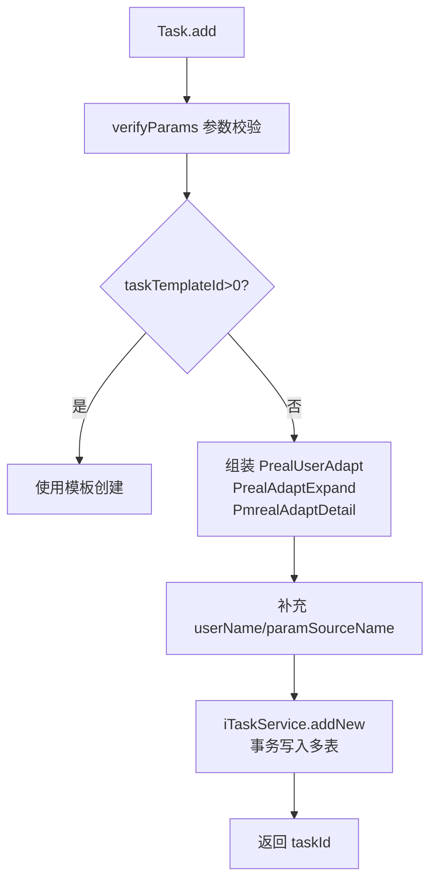
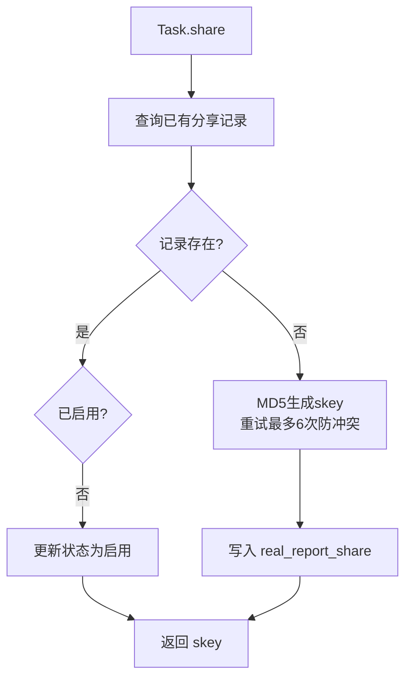

# Task (service/app)

任务管理的核心 ApiServlet，提供任务的完整生命周期管理：创建、取消、详情查询、补测、分享、邮件发送、执行控制等。

类路径：`real-test/src/main/java/cn/testin/service/app/Task.java`，继承 `GenericBaseService`。

## 本类接口一览

| 接口 | op | 功能 |
| --- | --- | --- |
| add | Task.add | 新增测试任务（含参数校验、用户适配、设备适配） |
| cancel | Task.cancel | 取消测试任务 |
| batchCancel | Task.batchCancel | 批量取消测试任务 |
| cancelWithNoUserId | Task.cancelWithNoUserId | 无 userId 取消（恒生专用） |
| details | Task.details | 获取任务详情（含 eid/projectid/userid 校验 + skey 分享支持） |
| overview | Task.overview | 获取任务概况信息 |
| complete | Task.complete | 完善任务应用信息（应用检测回调） |
| getUserAdapt / userAdapt | Task.getUserAdapt | 获取任务用户适配信息 |
| reportVideo | Task.reportVideo | 同步视频信息到报告 |
| retest | Task.retest | 设备级任务补测 |
| monitorTaskMaintain | Task.monitorTaskMaintain | 监控任务变更上报 |
| detail | Task.detail | 获取任务详情（AppPrx.get 替代，支持 keywords 过滤） |
| scriptRetest | Task.scriptRetest | 脚本级补测 |
| getRealStatSummaryDetail | Task.getRealStatSummaryDetail | 获取任务统计摘要详情（设备分布/性能统计，含分页） |
| share | Task.share | 报告分享（生成/更新 skey） |
| shareInfo | Task.shareInfo | 获取任务分享信息 |
| maintainReportSummary | Task.maintainReportSummary | 维护报告总结（清除旧 Excel 连接后更新报告摘要） |
| verification | Task.verification | 验证 taskid/skey 有效性 |
| getScriptParams | Task.getScriptParams | 获取脚本参数（AppPrx.getScriptParams 替代） |
| repeatTest | Task.repeatTest | 批量补测（支持设备补测 + 脚本补测） |
| initData | Task.initData | 初始化提测数据（无 App 快速提测） |
| getInitData | Task.getInitData | 获取初始化提测结果 |
| getSubTestMenu | Task.getSubTestMenu | 获取子测试菜单配置 |
| sendEmail | Task.sendEmail | 重新发送结果邮件 |
| execute | Task.execute | 触发任务执行 |
| pause | Task.pause | 暂停任务下发 |
| resume | Task.resume | 恢复任务下发 |

## add (`Task.add`)

- **实现意图**：接收完整任务配置（企业、项目、用户、应用、设备、执行标准），校验必要参数后创建测试任务。支持通过 taskTemplateId 使用模板创建（存在有效 taskTemplateId 时跳过其余必填校验）。

- **请求参数**：

| 参数 | 类型 | 必填 | 说明 |
| --- | --- | --- | --- |
| eid | Integer | 是 | 企业 ID（<=0 → paraInvalid） |
| projectid | Integer | 是 | 项目组 ID（<=0 → paraInvalid） |
| userid | Integer | 是 | 用户 ID（<=0 → paraInvalid） |
| bizCode | Integer | 是 | 业务编码（<=0 → paraInvalid） |
| taskDescr | String | 是 | 任务描述（blank → paraInvalid） |
| devices | JSONArray | 是 | 设备列表（null 或空 → paraInvalid） |
| execStandard | JSONObject | 是 | 执行标准（null → paraInvalid） |
| taskTemplateId | Integer | 否 | 任务模板 ID（>0 时跳过其它必填校验） |
| serialRun | Integer | 否 | 串并行标志 |
| appinfo | JSONObject | 否 | 应用信息 |
| initPwd | String | 否 | 快速提测用户密码 |
| quotaCode | Integer | 否 | 第三方接入提测业务编码 |
| showCompatibleReportUrl | String | 否 | 是否显示报告邮件中的在线报告 URL |
| testChannel | String | 否 | 提测渠道 |
| crossTaskId | String | 否 | 多端任务 ID |
| userName | String | 否 | 用户名（未传时按 userid 回查填充） |
| paramSourceName | String | 否 | 参数来源名称（未传时按 paramSource 回查填充） |

- **返回参数**：`{code, msg, data}`，data 含 `result`。

| 字段 | 类型 | 说明 |
| --- | --- | --- |
| code | Integer | 状态码，0 成功 |
| msg | String | 提示信息 |
| data.result | String | 创建的任务 ID（taskId） |

- **处理流程**：



- **调用链**：`Task` -> `ITaskService`（business 层）-> `IPrealUserAdaptDAO`、`IPrealAdaptExpandDAO`、`IPmrealAdaptDetailDAO`。外部服务：[RealScheduling](../../../任务调度服务（real-scheduling）/07-开放接口文档/00-模块索引.md)（任务分发）、[RealControlCenter](../../../设备控制中心（real-controlcenter）/07-开放接口文档/00-模块索引.md)（设备锁定）、[UserManager](../../../平台基础功能服务/00-首页.md)（用户查询）。

- **涉及表与 SQL**：`preal_user_adapt`（INSERT）、`preal_adapt_expand`（INSERT）、`pmreal_adapt_detail`（INSERT）、`pmreal_task_summary`（INSERT）。

- **关键代码摘录**：

```java
// real-test/src/main/java/cn/testin/service/app/Task.java
public String add(ApiRequest apirequest) throws Exception {
    JSONObject reqJson = apirequest.getReqjson();
    String errorMsg = verifyParams(reqJson);
    if (StringUtils.isNotBlank(errorMsg)) {
        return ApiUtil.getResult(apirequest, CommonCode.paraInvalid.getValue(),
                CommonCode.paraInvalid.getDescr() + errorMsg);
    }
    // ... 组装 PrealUserAdapt、PrealAdaptExpand、PmrealAdaptDetail
    try {
        taskid = itaskservice.addNew(userAdapt, adaptExpand, adaptDetail, reqJson);
        dataMap.put(ApiResponse.RES_RESULT, taskid);
    } catch (GeneralException e) {
        jObj = ApiUtil.getJSONobj(apirequest, e.getCode(), e.getMsg());
    }
    return jObj.toString();
}
```

## cancel (`Task.cancel`)

- **实现意图**：取消指定任务（支持子任务级别取消、欠费取消码区分、恒生任务组取消）。

- **请求参数**：

| 参数 | 类型 | 必填 | 说明 |
| --- | --- | --- | --- |
| eid | Integer | 是 | 企业 ID（null 或 <=0 → paraInvalid） |
| projectid | Integer | 是 | 项目组 ID（null 或 <=0 → paraInvalid） |
| userid | Integer | 是 | 用户 ID（null 或 <=0 → paraInvalid） |
| taskid | String | 是 | 任务 ID（blank → paraInvalid） |
| subtaskid | String | 否 | 子任务 ID |
| cancelCode | Integer | 否 | 取消错误码（区分欠费取消 10337 和普通取消） |
| taskGroup | JSONObject | 否 | 恒生任务组（传值须含非空 id） |

taskGroup 子字段：

| 字段 | 类型 | 说明 |
| --- | --- | --- |
| id | String | 任务组 ID（blank → paraInvalid） |

- **返回参数**：`{code, msg, data}`，data 含 `result`。

| 字段 | 类型 | 说明 |
| --- | --- | --- |
| code | Integer | 状态码，0 成功 |
| msg | String | 提示信息 |
| data.result | Integer | 1 成功 / 0 失败 |

- **处理流程**：参数校验 -> `checkProjectId` 权限校验 -> `iTaskService.cancel(taskid, conditionMap)`。

- **调用链**：`iTaskService` -> 更新任务状态 -> [RealScheduling](../../../任务调度服务（real-scheduling）/07-开放接口文档/00-模块索引.md)（停止调度）、[RealControlCenter](../../../设备控制中心（real-controlcenter）/07-开放接口文档/00-模块索引.md)（释放设备）、NoticeManager（取消通知）。

- **涉及表与 SQL**：`preal_user_adapt`（UPDATE cancelled 状态）。

## batchCancel (`Task.batchCancel`)

- **实现意图**：批量取消多个任务，逐条取消并累计成功数。

- **请求参数**：

| 参数 | 类型 | 必填 | 说明 |
| --- | --- | --- | --- |
| eid | Integer | 是 | 企业 ID（null 或 <=0 → paraInvalid） |
| projectid | Integer | 是 | 项目组 ID（null 或 <=0 → paraInvalid） |
| userid | Integer | 是 | 用户 ID（null 或 <=0 → paraInvalid） |
| taskids | JSONArray | 是 | 任务 ID 列表（元素 String，null 或空 → paraInvalid） |
| cancelCode | Integer | 否 | 取消错误码 |

- **返回参数**：`{code, msg, data}`，data 含 `result`。

| 字段 | 类型 | 说明 |
| --- | --- | --- |
| code | Integer | 状态码，0 成功 |
| msg | String | 提示信息 |
| data.result | Integer | 成功取消的任务数量 |

## cancelWithNoUserId (`Task.cancelWithNoUserId`)

- **实现意图**：无 userId 版本的任务取消（恒生专用），不做 userid 与权限校验。

- **请求参数**：

| 参数 | 类型 | 必填 | 说明 |
| --- | --- | --- | --- |
| eid | Integer | 是 | 企业 ID（null 或 <=0 → paraInvalid） |
| projectid | Integer | 是 | 项目组 ID（null 或 <=0 → paraInvalid） |
| taskid | String | 是 | 任务 ID（blank → paraInvalid） |
| subtaskid | String | 否 | 子任务 ID |
| cancelCode | Integer | 否 | 取消错误码 |

- **返回参数**：`{code, msg, data}`，data 含 `result`。

| 字段 | 类型 | 说明 |
| --- | --- | --- |
| code | Integer | 状态码，0 成功 |
| msg | String | 提示信息 |
| data.result | Integer | 1 成功 / 0 失败 |

## details (`Task.details`)

- **实现意图**：获取任务完整详情，支持通过 skey（分享密钥）或 taskid 查询，自动补充 eid/projectid/userid。

- **请求参数**：

| 参数 | 类型 | 必填 | 说明 |
| --- | --- | --- | --- |
| taskid | String | 否 | 任务 ID（与 skey 二选一，最终须解析出 taskid） |
| skey | String | 否 | 分享密钥（与 taskid 二选一） |
| eid | Integer | 是 | 企业 ID（补充后仍 null/<=0 → paraInvalid） |
| projectid | Integer | 是 | 项目组 ID（补充后仍 null/<=0 → paraInvalid） |
| userid | Integer | 是 | 用户 ID（补充后仍 null/<=0 → paraInvalid） |
| userprojectids | JSONArray | 否 | 用户项目 ID 列表（分享场景权限补充） |
| subtaskid | String | 否 | 子任务 ID |

- **返回参数**：`{code, msg, data}`，data 含 `objInfo`。

| 字段 | 类型 | 说明 |
| --- | --- | --- |
| code | Integer | 状态码，0 成功 |
| msg | String | 提示信息 |
| data.objInfo | JSONObject | 任务详情（`PmrealAdaptDetail` 等扩展信息，代码未逐字段确认） |

- **处理流程**：`taskInfoSupplement` 补充 skey 信息 -> `iExtendService.details(conditionMap)` -> 返回 `ApiResponse.RES_OBJECT`。

## overview (`Task.overview`)

- **实现意图**：获取任务概况信息（完成数、通过数等汇总）。

- **请求参数**：

| 参数 | 类型 | 必填 | 说明 |
| --- | --- | --- | --- |
| eid | Integer | 是 | 企业 ID（null 或 <=0 → paraInvalid） |
| projectid | Integer | 是 | 项目组 ID（null 或 <=0 → paraInvalid） |
| userid | Integer | 是 | 用户 ID（null 或 <=0 → paraInvalid） |
| taskid | String | 是 | 任务 ID（blank → paraInvalid） |

- **返回参数**：`{code, msg, data}`，data 含 `objInfo`。

| 字段 | 类型 | 说明 |
| --- | --- | --- |
| code | Integer | 状态码，0 成功 |
| msg | String | 提示信息 |
| data.objInfo | JSONObject | 任务概况信息 |

- **调用链**：`iExtendService.overview(conditionMap)`。

## complete (`Task.complete`)

- **实现意图**：完善任务应用信息（应用检测回调），检测失败时携带 msg/errorCode。

- **请求参数**：

| 参数 | 类型 | 必填 | 说明 |
| --- | --- | --- | --- |
| eid | Integer | 是 | 企业 ID（null → paraInvalid） |
| projectid | Integer | 是 | 项目组 ID（null → paraInvalid） |
| taskid | String | 是 | 任务 ID（blank → paraInvalid） |
| errorCode | Integer | 是 | 错误码（null → paraInvalid） |
| suiteId | Integer | 否 | 应用 ID（跨平台） |
| msg | String | 否 | 错误信息（检测失败原因） |
| appinfos | JSONArray | 否 | 应用信息列表（msg 为空时必填，null 或空 → paraInvalid） |

- **返回参数**：`{code, msg, data}`，data 含 `result`。

| 字段 | 类型 | 说明 |
| --- | --- | --- |
| code | Integer | 状态码，0 成功 |
| msg | String | 提示信息 |
| data.result | Integer | 1 成功 / 0 失败 |

- **调用链**：`iTaskService.appComplete(eid, projectid, taskid, appinfoArray, msg, errorCode, suiteId)`。

## getUserAdapt / userAdapt (`Task.getUserAdapt`)

- **实现意图**：获取任务用户适配信息（提测用户、企业、项目关联）。getUserAdapt 为 userAdapt 的别名。

- **请求参数**：

| 参数 | 类型 | 必填 | 说明 |
| --- | --- | --- | --- |
| taskid | String | 否 | 任务 ID（与 skey 二选一，最终须解析出 taskid） |
| skey | String | 否 | 分享密钥（与 taskid 二选一） |
| projectid | Integer | 否 | 项目组 ID |
| userid | Integer | 否 | 用户 ID |
| eid | Integer | 否 | 企业 ID |
| userprojectids | JSONArray | 否 | 用户项目 ID 列表 |

- **返回参数**：`{code, msg, data}`，data 含 `objInfo`。

| 字段 | 类型 | 说明 |
| --- | --- | --- |
| code | Integer | 状态码，0 成功 |
| msg | String | 提示信息 |
| data.objInfo | JSONObject | 用户适配信息（`PrealUserAdapt`） |

## reportVideo (`Task.reportVideo`)

- **实现意图**：同步视频信息到报告。

- **请求参数**：

| 参数 | 类型 | 必填 | 说明 |
| --- | --- | --- | --- |
| taskid | String | 否 | 任务 ID（代码未校验） |
| subtaskid | String | 否 | 子任务 ID |
| subsubtaskid | String | 否 | 子子任务 ID |
| videoUrl | String | 否 | 视频 URL |

- **返回参数**：`{code, msg, data}`，data 含 `result`。

| 字段 | 类型 | 说明 |
| --- | --- | --- |
| code | Integer | 状态码，0 成功 |
| msg | String | 提示信息 |
| data.result | Integer | 1 成功 / 0 失败 |

- **调用链**：`iReportService.reportVideo`。

## retest (`Task.retest`)

- **实现意图**：设备级补测，需提供 projectid、taskid、subtaskid 和新设备列表。

- **请求参数**：

| 参数 | 类型 | 必填 | 说明 |
| --- | --- | --- | --- |
| projectid | Integer | 是 | 项目组 ID（null → paraInvalid） |
| taskid | String | 是 | 任务 ID（blank → paraInvalid） |
| subtaskid | String | 是 | 子任务 ID（blank → paraInvalid） |
| devices | JSONArray | 是 | 补测设备列表（null 或空 → paraInvalid） |

- **返回参数**：`{code, msg, data}`，data 含 `result`。

| 字段 | 类型 | 说明 |
| --- | --- | --- |
| code | Integer | 状态码，0 成功 |
| msg | String | 提示信息 |
| data.result | Integer | 1 成功 / 0 失败 |

- **调用链**：`iTaskService.retest` -> 重新创建子任务执行记录 -> [RealScheduling](../../../任务调度服务（real-scheduling）/07-开放接口文档/00-模块索引.md)（重新调度）。

## monitorTaskMaintain (`Task.monitorTaskMaintain`)

- **实现意图**：监控任务变更上报，将任务/定时计划名称关联到监控。

- **请求参数**：

| 参数 | 类型 | 必填 | 说明 |
| --- | --- | --- | --- |
| monitorId | Long | 是 | 监控 ID（null → paraInvalid） |
| tasks | JSONArray | 否 | 任务 ID 列表（元素 String） |
| jobNames | JSONArray | 否 | 定时计划名称列表（元素 String） |

- **返回参数**：`{code, msg, data}`，data 含 `result`。

| 字段 | 类型 | 说明 |
| --- | --- | --- |
| code | Integer | 状态码，0 成功 |
| msg | String | 提示信息 |
| data.result | Integer | 1 成功 / 0 失败 |

- **调用链**：`iMonitorService.monitorAddTask(monitorId, taskList, jobNameList)`。

## detail (`Task.detail`)

- **实现意图**：获取任务详情（AppPrx.get 替代），支持 keywords 过滤脚本详情。

- **请求参数**：

| 参数 | 类型 | 必填 | 说明 |
| --- | --- | --- | --- |
| taskid | String | 否 | 任务 ID（与 skey 二选一，最终须解析出 taskid） |
| skey | String | 否 | 分享密钥（与 taskid 二选一） |
| projectid | Integer | 否 | 项目组 ID |
| userid | Integer | 否 | 用户 ID |
| eid | Integer | 否 | 企业 ID |
| userprojectids | JSONArray | 否 | 用户项目 ID 列表 |
| keywords | JSONArray | 否 | 需返回的字段关键字（元素 String，自动追加 scriptTotal/scriptNewTotal） |
| scriptStatuses | JSONArray | 否 | 脚本状态过滤（元素 Integer） |

- **返回参数**：`{code, msg, data}`，data 含 `objInfo`。

| 字段 | 类型 | 说明 |
| --- | --- | --- |
| code | Integer | 状态码，0 成功 |
| msg | String | 提示信息 |
| data.objInfo | JSONObject | 任务适配详情（`PmrealAdaptDetail`） |

- **调用链**：`iTaskService.getAdaptDetail(taskid, keywords, scriptStatuses)`。

## scriptRetest (`Task.scriptRetest`)

- **实现意图**：脚本级补测，需提供 projectid、taskid、subtaskid 和子子任务 ID 列表。

- **请求参数**：

| 参数 | 类型 | 必填 | 说明 |
| --- | --- | --- | --- |
| projectid | Integer | 是 | 项目组 ID（null → paraInvalid） |
| taskid | String | 是 | 任务 ID（blank → paraInvalid） |
| subtaskid | String | 是 | 子任务 ID（blank → paraInvalid） |
| subsubtasks | JSONArray | 是 | 子子任务 ID 列表（null 或空 → paraInvalid） |

- **返回参数**：`{code, msg, data}`，data 含 `result`。

| 字段 | 类型 | 说明 |
| --- | --- | --- |
| code | Integer | 状态码，0 成功 |
| msg | String | 提示信息 |
| data.result | Integer | 补测结果（`iRetestService.scriptRetest` 返回值） |

- **调用链**：`iRetestService.scriptRetest`。

## getRealStatSummaryDetail (`Task.getRealStatSummaryDetail`)

- **实现意图**：获取任务统计摘要，支持按 keyword 筛选（设备分布、性能统计、抽查摘要、执行详情含分页）。

- **请求参数**：

| 参数 | 类型 | 必填 | 说明 |
| --- | --- | --- | --- |
| taskid | String | 是 | 任务 ID（blank → paraInvalid） |
| conditions | String | 否 | 查询条件（JSON 字符串，子字段见下表） |
| keywords | JSONArray | 否 | 关键字列表（元素 String，如 spotTestSummarys/execSummary） |

conditions（JSON 字符串）子字段：

| 字段 | 类型 | 说明 |
| --- | --- | --- |
| round | Integer | 拨测轮数 |
| item | String | 统计项 |
| releaseVer | String | 系统版本 |
| dpiWidth | Integer | 分辨率宽 |
| dpiHeight | Integer | 分辨率高 |
| aliasName | String | 设备名称 |

- **返回参数**：`{code, msg, data}`，data 含 `objInfo`。

| 字段 | 类型 | 说明 |
| --- | --- | --- |
| code | Integer | 状态码，0 成功 |
| msg | String | 提示信息 |
| data.objInfo | JSONObject | 任务统计摘要（`PmrealStatSummary`） |
| data.objInfo.spotTestSummarys | JSONArray | 抽查摘要列表（元素 `PmrealSpotTestSummary`，代码未确认字段） |
| data.objInfo.deviceExecInfos | JSONArray | 设备执行详情（元素 `DeviceExecInfo`，分页后，代码未确认字段） |

- **调用链**：`iStatSummaryService.get` -> `iSpotTestSummaryService.list`（抽查）-> 分页处理 DeviceExecInfo。

## share (`Task.share`)

- **实现意图**：生成或获取任务分享密钥（skey）。支持报告分享、测试计划分享、Web PC 报告分享三种类型。skey 基于 MD5 生成，保证唯一性。

- **请求参数**：

| 参数 | 类型 | 必填 | 说明 |
| --- | --- | --- | --- |
| taskid | String | 是 | 任务 ID（blank → paraInvalid） |
| userid | Integer | 是 | 用户 ID（null → paraInvalid） |
| eid | Integer | 是 | 企业 ID（null → paraInvalid） |
| type | Integer | 否 | 分享类型（ShareConfig 枚举，默认 REPORT_SHARE） |
| projectid | Integer | 否 | 项目 ID（测试计划/Web PC 分享时用于 content） |
| userprojectids | JSONArray | 否 | 用户项目 ID 列表 |

- **返回参数**：`{code, msg, data}`，data 含 `result`。

| 字段 | 类型 | 说明 |
| --- | --- | --- |
| code | Integer | 状态码，0 成功 |
| msg | String | 提示信息 |
| data.result | String | 分享密钥（skey） |

- **处理流程**：



- **涉及表与 SQL**：`real_report_share`（INSERT/UPDATE）。

## shareInfo (`Task.shareInfo`)

- **实现意图**：获取任务分享信息（按 skey 或 taskid 查询）。

- **请求参数**：

| 参数 | 类型 | 必填 | 说明 |
| --- | --- | --- | --- |
| taskid | String | 否 | 任务 ID（与 skey 至少传其一） |
| skey | String | 否 | 分享密钥（与 taskid 至少传其一） |

- **返回参数**：`{code, msg, data}`，data 含 `objInfo`。

| 字段 | 类型 | 说明 |
| --- | --- | --- |
| code | Integer | 状态码，0 成功 |
| msg | String | 提示信息 |
| data.objInfo | JSONObject | 分享信息（`RealReportShare`） |
| data.objInfo.skey | String | 短地址密钥 |
| data.objInfo.taskid | String | 任务 ID |
| data.objInfo.reportKey | String | 查看报告 key |
| data.objInfo.status | Integer | 状态 |
| data.objInfo.createtime | Long | 创建时间 |
| data.objInfo.updatetime | Long | 更新时间 |
| data.objInfo.content | JSONObject | 分享内容 |

## maintainReportSummary (`Task.maintainReportSummary`)

- **实现意图**：维护报告总结（清除旧 Excel 连接后更新报告摘要）。

- **请求参数**：

| 参数 | 类型 | 必填 | 说明 |
| --- | --- | --- | --- |
| taskid | String | 是 | 任务 ID（blank → paraInvalid） |
| userid | Integer | 是 | 用户 ID（null 或 0 → paraInvalid） |
| context | String | 否 | 报告总结内容（默认空串） |

- **返回参数**：`{code, msg, data}`。

| 字段 | 类型 | 说明 |
| --- | --- | --- |
| code | Integer | 状态码，0 成功 |
| msg | String | 提示信息 |
| data.result | Integer | 更新影响行数（0 或 1） |
| data.userName | String | 用户名（更新成功时返回） |

## verification (`Task.verification`)

- **实现意图**：验证 taskid/skey 有效性。

- **请求参数**：

| 参数 | 类型 | 必填 | 说明 |
| --- | --- | --- | --- |
| taskid | String | 否 | 任务 ID（与 skey 二选一，最终须解析出 taskid） |
| skey | String | 否 | 分享密钥（与 taskid 二选一） |
| userid | Integer | 否 | 用户 ID |
| eid | Integer | 否 | 企业 ID |
| userprojectids | JSONArray | 否 | 用户项目 ID 列表 |

- **返回参数**：`{code, msg, data}`，data 含 `result`。

| 字段 | 类型 | 说明 |
| --- | --- | --- |
| code | Integer | 状态码，0 成功 |
| msg | String | 提示信息 |
| data.result | Integer | 固定返回 1（验证通过） |

## getScriptParams (`Task.getScriptParams`)

- **实现意图**：获取脚本收集参数（AppPrx.getScriptParams 替代）。

- **请求参数**：

| 参数 | 类型 | 必填 | 说明 |
| --- | --- | --- | --- |
| reqid | String | 是 | 脚本收集请求 ID（blank → GeneralException paraInvalid） |

- **返回参数**：本接口**直接返回 dataJson（无 `{code,msg,data}` 外层包装）**，结构如下：

| 字段 | 类型 | 说明 |
| --- | --- | --- |
| code | Integer | 收集结果码 |
| status | Integer | 状态 |
| msg | String | 提示信息 |
| createtime | Long | 创建时间 |
| updatetime | Long | 更新时间 |
| resContent | JSONObject | 结果内容（已移除 scriptsummary 节点） |

- **调用链**：`iScriptCollectService.get(reqid)`。

## repeatTest (`Task.repeatTest`)

- **实现意图**：统一批量补测入口，支持同时设备补测（devices）和脚本补测（subsubtaskinfo）。

- **请求参数**：

| 参数 | 类型 | 必填 | 说明 |
| --- | --- | --- | --- |
| taskid | String | 是 | 任务 ID（Assert.hasText） |
| subtasks | JSONArray | 是 | 子任务 ID 列表（Assert.hasLength，元素 String） |
| devices | JSONArray | 否 | 补测设备列表（元素对象含 deviceid/cloud） |
| subsubtaskinfo | JSONObject | 否 | 脚本补测信息（key 为 subtaskid，value 为子子任务列表） |
| appInfo | JSONObject | 否 | 应用信息 |

devices 元素字段：

| 字段 | 类型 | 说明 |
| --- | --- | --- |
| deviceid | String | 设备 ID |
| cloud | String | 云 ID |

subsubtaskinfo 子结构（`Map<String, List<Map<String,String>>>`）：

| 字段 | 类型 | 说明 |
| --- | --- | --- |
| subsubtaskid | String | 子子任务 ID |
| scriptid | String | 脚本 ID |
| scriptNo | String | 脚本编号 |
| orderNum | String | 执行序号 |

- **返回参数**：`{code, msg, data}`，data 含 `result`。

| 字段 | 类型 | 说明 |
| --- | --- | --- |
| code | Integer | 状态码，0 成功 |
| msg | String | 提示信息 |
| data.result | Integer | 1 成功 / 0 失败 |

- **调用链**：`iTaskService.repeatTest(taskid, subtasks, devices, subsubtaskinfo, appInfo)`。

## initData (`Task.initData`)

- **实现意图**：无 App 快速提测 -- 初始化提测请求。

- **请求参数**：

| 参数 | 类型 | 必填 | 说明 |
| --- | --- | --- | --- |
| eid | Integer | 是 | 企业 ID（<=0 → paraInvalid） |
| bizCode | Integer | 是 | 业务编码（<=0 → paraInvalid） |
| scripts | JSONArray | 是 | 脚本列表（null 或空 → paraInvalid） |
| taskDescr | String | 否 | 任务描述 |
| additionalInfo | String | 否 | 附加信息 |
| callbackUrl | String | 否 | 回调地址 |
| extendedChannel | String | 否 | 扩展渠道 |
| noApp | Integer | 否 | 无 App 标志 |

- **返回参数**：`{code, msg, data}`，data 含 `result`。

| 字段 | 类型 | 说明 |
| --- | --- | --- |
| code | Integer | 状态码，0 成功 |
| msg | String | 提示信息 |
| data.result | String | 提测请求 ID（reqid） |

- **调用链**：`iTaskService.initData` -> Redis（`InitTask` key）。外部服务：[ScriptService](../../../脚本服务/00-首页.md)（脚本收集）。

## getInitData (`Task.getInitData`)

- **实现意图**：从 Redis 查询无 App 提测初始化结果。

- **请求参数**：

| 参数 | 类型 | 必填 | 说明 |
| --- | --- | --- | --- |
| eid | Integer | 是 | 企业 ID（<=0 → paraInvalid） |
| reqId | String | 是 | 提测请求 ID（blank → paraInvalid） |

- **返回参数**：`{code, msg, data}`，data 含 `result`。

| 字段 | 类型 | 说明 |
| --- | --- | --- |
| code | Integer | 状态码，0 成功 |
| msg | String | 提示信息 |
| data.result | JSONObject | 初始化结果（`InitTask`） |
| data.result.taskDescr | String | 任务描述 |
| data.result.additionalInfo | String | 附加信息 |
| data.result.callbackUrl | String | 回调地址 |
| data.result.extendedChannel | String | 扩展渠道 |
| data.result.noApp | Integer | 无 App 标志 |
| data.result.bizCode | Integer | 业务编码 |
| data.result.scripts | JSONArray | 脚本列表（元素 `PmrealAdaptScript`） |

## getSubTestMenu (`Task.getSubTestMenu`)

- **实现意图**：获取子测试菜单配置（快速提测流程步骤开关）。

- **请求参数**：

| 参数 | 类型 | 必填 | 说明 |
| --- | --- | --- | --- |
| eid | Integer | 是 | 企业 ID（<=0 → paraInvalid） |
| extendedChannel | String | 否 | 扩展渠道（`yiqiMS` 时返回不同脚本选择状态） |

- **返回参数**：`{code, msg, data}`，data 含 `result`。

| 字段 | 类型 | 说明 |
| --- | --- | --- |
| code | Integer | 状态码，0 成功 |
| msg | String | 提示信息 |
| data.result | JSONObject | 菜单配置 |
| data.result.eid | Integer | 企业 ID |
| data.result.config | JSONArray | 步骤配置列表，元素见下表 |

config 元素字段：

| 字段 | 类型 | 说明 |
| --- | --- | --- |
| key | String | 步骤标识（suiteSelect/appSelect/scriptSelect/deviceSelect/perfectInfo） |
| name | String | 步骤名称 |
| status | Integer | 是否启用（1 启用 / 0 关闭） |

## sendEmail (`Task.sendEmail`)

- **实现意图**：手动重新发送任务结果邮件通知。

- **请求参数**：

| 参数 | 类型 | 必填 | 说明 |
| --- | --- | --- | --- |
| taskid | String | 是 | 任务 ID（blank → paraInvalid） |

- **返回参数**：`{code, msg, data}`，data 含 `result`。

| 字段 | 类型 | 说明 |
| --- | --- | --- |
| code | Integer | 状态码，0 成功 |
| msg | String | 提示信息 |
| data.result | Integer | 发送结果（`iTaskService.sendEmail` 返回值） |

- **调用链**：`iTaskService.sendEmail` -> NoticeManager。

## execute / pause / resume (`Task.execute / pause / resume`)

- **实现意图**：任务执行控制三连 -- execute 触发执行、pause 暂停下发、resume 恢复下发。

- **请求参数**：

| 参数 | 类型 | 必填 | 说明 |
| --- | --- | --- | --- |
| taskid | String | 是 | 任务 ID（blank → paraInvalid） |

- **返回参数**：`{code, msg, data}`，data 含 `result`。

| 字段 | 类型 | 说明 |
| --- | --- | --- |
| code | Integer | 状态码，0 成功 |
| msg | String | 提示信息 |
| data.result | Integer | 操作结果（`iTaskService.execute/pause/resume` 返回值） |

- **调用链**：`iTaskService.execute/pause/resume` -> [RealScheduling](../../../任务调度服务（real-scheduling）/07-开放接口文档/00-模块索引.md)（调度控制）。
