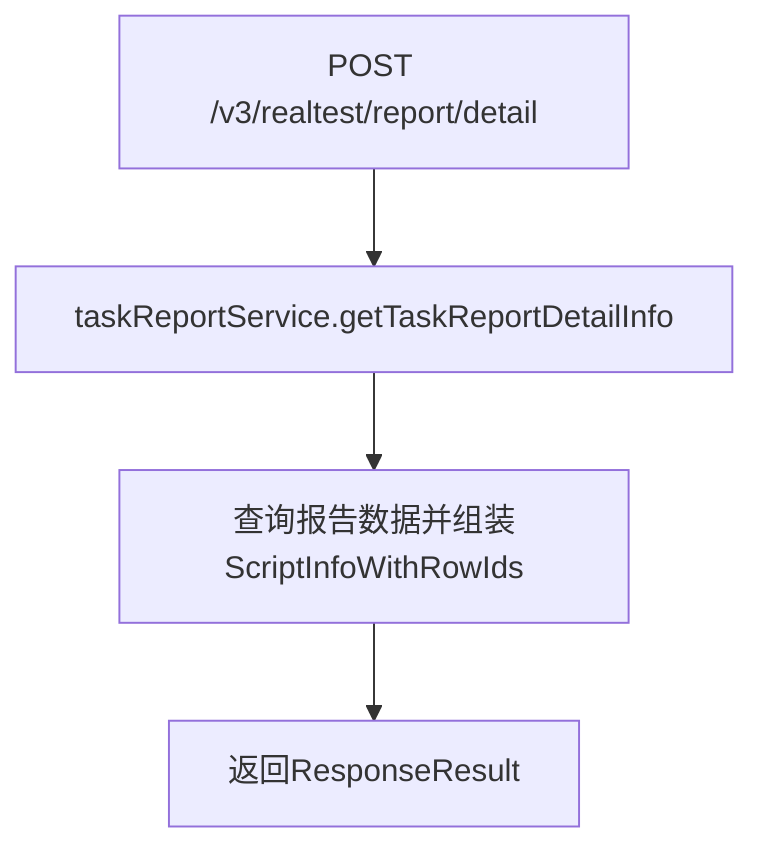
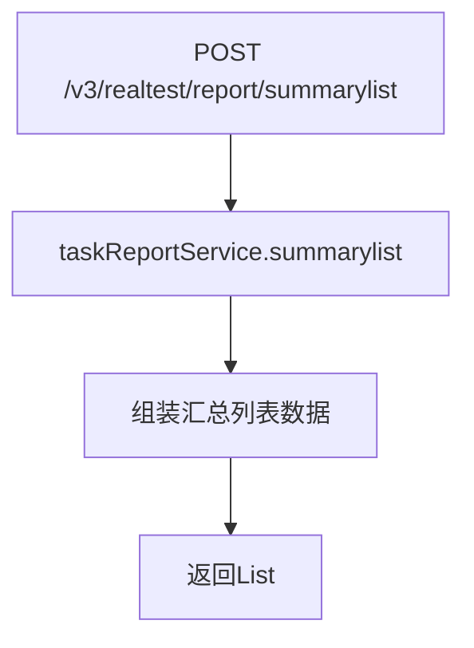

# TaskReportController

任务报告相关信息查询、报表汇总（含东北证券定制接口）。

类路径：`real-test/src/main/java/cn/testin/controller/TaskReportController.java`，基础路径 `/v3/realtest`。

## 本类接口一览

| 接口 | 方法 | 路径 | 功能 |
| --- | --- | --- | --- |
| getTaskReportDetailInfo | POST | /v3/realtest/report/detail | 获取任务报告详情（含脚本信息与行号映射） |
| summarylist | POST | /v3/realtest/report/summarylist | 东北证券定制：报告汇总列表查询 |
| updateAdaptUser | POST | /v3/realtest/update | 占位接口，固定返回成功 |

## getTaskReportDetailInfo (`POST /v3/realtest/report/detail`)

- **实现意图**：根据 `TaskReportRequestDTO` 条件查询任务报告详情，返回脚本信息及对应行号映射。

- **请求参数**：body `TaskReportRequestDTO`。

| 字段 | 类型 | 必填 | 说明 |
|---|---|---|---|
| taskId | String | 否 | 任务id |
| scriptStatus | JSONArray | 否 | 脚本状态数组（元素 Integer） |
| paramSource | String | 否 | 参数来源 |
| newTagList | JSONArray | 否 | 新标签列表（元素 Integer） |
| keyWord | String | 否 | 关键字 |

- **返回参数**：`ResponseResult<ScriptInfoWithRowIds>`，含脚本执行详情及行号映射。

| 字段 | 类型 | 说明 |
|---|---|---|
| code | Integer | 状态码 0 成功 |
| msg | String | 提示信息 |
| data | JSONObject | 业务数据（`ScriptInfoWithRowIds`） |
| data.scriptDataDetailUuidWithRowIds | JSONObject | 脚本数据详情 UUID 与行 ID 映射（Map<String, Set<Integer>>） |
| data.scriptNoWithRowIds | JSONObject | 脚本编号与行 ID 映射（Map<Integer, Set<Integer>>） |
| data.normalScriptNoDeviceIdRowId | JSONObject | 普通脚本编号-设备ID-行ID 映射（Map<Integer, Map<String,Integer>>） |
| data.deviceIds | JSONArray | 设备 ID 列表（Set<String>） |
| data.reportDetailMap | JSONObject | 报告详情映射（Map<String, PmrealReportDetail>） |

- **处理流程**：



- **调用链**：`TaskReportController` -> [ITaskReportService](ITaskReportService.md) -> DAO 层。外部服务：[RealLogfile](../../../平台基础功能服务/00-首页.md)（日志数据）。

- **涉及表与 SQL**：`pmreal_report_detail`、`pmreal_task_run_info` 等报告相关表。

- **异常与校验**：Service 层内部处理，异常由 GlobalExceptionHandler 统一兜底。

## summarylist (`POST /v3/realtest/report/summarylist`)

- **实现意图**：东北证券定制接口，返回报告汇总数据列表。仅东北证券调用。

- **请求参数**：body `TaskReportRequestDTO`（同 report/detail）。

| 字段 | 类型 | 必填 | 说明 |
|---|---|---|---|
| taskId | String | 否 | 任务id |
| scriptStatus | JSONArray | 否 | 脚本状态数组（元素 Integer） |
| paramSource | String | 否 | 参数来源 |
| newTagList | JSONArray | 否 | 新标签列表（元素 Integer） |
| keyWord | String | 否 | 关键字 |

- **返回参数**：`ResponseResult<List<Map<String, Object>>>`，Map 列表形式的汇总数据。

| 字段 | 类型 | 说明 |
|---|---|---|
| code | Integer | 状态码 0 成功 |
| msg | String | 提示信息 |
| data | JSONArray | 汇总数据（List<Map<String,Object>>） |

- **处理流程**：



- **调用链**：`TaskReportController` -> [ITaskReportService](ITaskReportService.md)。

- **涉及表与 SQL**：报告汇总相关表。

## updateAdaptUser (`POST /v3/realtest/update`)

- **实现意图**：占位接口，固定返回 `ResponseResult.success(1)`。

- **请求参数**：无。

- **返回参数**：`ResponseResult<Integer>`，固定返回 data=1。

| 字段 | 类型 | 说明 |
|---|---|---|
| code | Integer | 状态码 0 成功 |
| msg | String | 提示信息 |
| data | Integer | 固定返回 1 |

- **处理流程**：直接返回成功，无实际业务逻辑。

- **关键代码摘录**：

```java
// real-test/src/main/java/cn/testin/controller/TaskReportController.java
@PostMapping("/update")
public ResponseResult<Integer> updateAdaptUser() {
    return ResponseResult.success(1);
}
```
