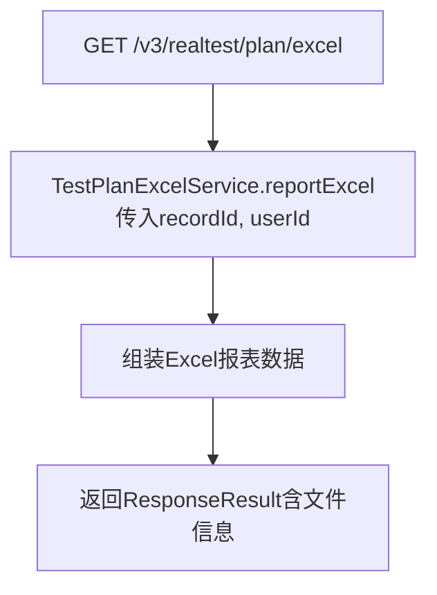
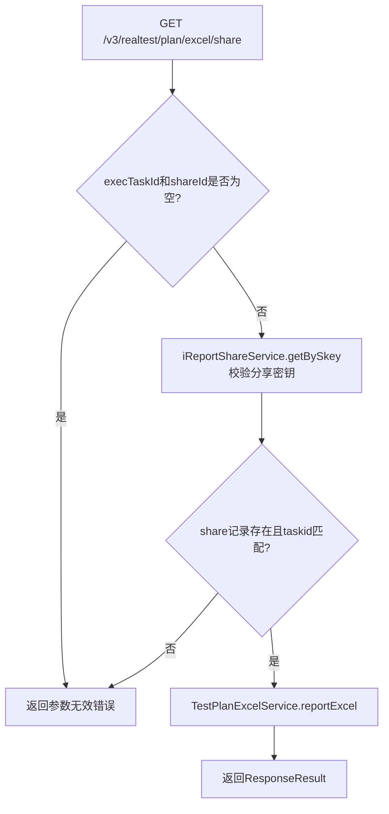

# TestPlanController

测试计划 Excel 报表导出控制器，支持普通导出和分享链接导出。

类路径：`real-test/src/main/java/cn/testin/controller/TestPlanController.java`，基础路径 `/v3/realtest`。

## 本类接口一览

| 接口 | 方法 | 路径 | 功能 |
| --- | --- | --- | --- |
| excel | GET | /v3/realtest/plan/excel | 导出测试计划 Excel 报表 |
| shareExcel | GET | /v3/realtest/plan/excel/share | 通过分享链接导出测试计划 Excel |

## excel (`GET /v3/realtest/plan/excel`)

- **实现意图**：根据 recordId 生成测试计划的 Excel 报表并返回下载链接/文件。

- **请求参数**：

| 参数 | 类型 | 必填 | 说明 |
| --- | --- | --- | --- |
| record_id | Long | 否 | 测试计划执行记录 ID |
| user_id | Integer | 否 | 用户 ID |

- **返回参数**：`ResponseResult`，由 `TestPlanExcelService.reportExcel()` 组装返回，含 Excel 文件信息。

| 字段 | 类型 | 说明 |
|---|---|---|
| code | Integer | 状态码 0 成功 |
| msg | String | 提示信息 |
| data | Object | Excel 导出结果（代码未确认） |

- **处理流程**：



- **调用链**：`TestPlanController` -> [TestPlanExcelService](TestPlanExcelService.md) -> `TestPlanV3Api` / DAO 层。外部服务：[RealPortal](../../../平台基础功能服务/00-首页.md)（测试计划数据）。

- **涉及表与 SQL**：关联测试计划执行记录表。

- **异常与校验**：通过 `throws Exception` 上抛，由 `GlobalExceptionHandler` 统一处理。

- **关键代码摘录**：

```java
// real-test/src/main/java/cn/testin/controller/TestPlanController.java
@GetMapping("/plan/excel")
public ResponseResult excel(
    @RequestParam(value = "record_id", required = false) Long recordId,
    @RequestParam(value = "user_id", required = false) Integer userId) throws Exception {
    ResponseResult responseResult = testPlanExcelService.reportExcel(recordId, userId);
    return responseResult;
}
```

## shareExcel (`GET /v3/realtest/plan/excel/share`)

- **实现意图**：通过分享链接（shareId）验证权限后导出测试计划 Excel 报表。

- **请求参数**：

| 参数 | 类型 | 必填 | 说明 |
| --- | --- | --- | --- |
| exec_task_id | String | 是 | 执行任务 ID |
| share_id | String | 是 | 分享密钥 |
| record_id | Long | 是 | 测试计划执行记录 ID |
| user_id | Integer | 否 | 用户 ID |

- **返回参数**：`ResponseResult`；参数无效时返回 `ResponseResult.error(500, "无效的参数！")`。

| 字段 | 类型 | 说明 |
|---|---|---|
| code | Integer | 状态码 0 成功 / 500 参数无效 |
| msg | String | 提示信息 |
| data | Object | Excel 导出结果（代码未确认） |

- **处理流程**：



- **调用链**：`TestPlanController` -> [IReportShareService](IReportShareService.md)（校验分享密钥）-> [TestPlanExcelService](TestPlanExcelService.md)（生成 Excel）。外部服务：[RealPortal](../../../平台基础功能服务/00-首页.md)。

- **涉及表与 SQL**：`real_report_share`（读取分享记录）；测试计划执行记录表。

- **异常与校验**：校验 `execTaskId` 和 `shareId` 非空，且 shareId 对应的分享记录存在且 taskid 匹配，否则返回 error 500。

- **关键代码摘录**：

```java
// real-test/src/main/java/cn/testin/controller/TestPlanController.java
@GetMapping("/plan/excel/share")
public ResponseResult shareExcel(
    @RequestParam("exec_task_id") String execTaskId,
    @RequestParam("share_id") String shareId,
    @RequestParam("record_id") Long recordId,
    @RequestParam(value = "user_id", required = false) Integer userId) throws Exception {
    if (StringUtils.isBlank(execTaskId) || StringUtils.isBlank(shareId)) {
        return ResponseResult.error(500, "无效的参数！");
    }
    RealReportShare realReportShare = iReportShareService.getBySkey(shareId);
    if (realReportShare == null || StringUtils.isBlank(realReportShare.getTaskid())
        || !realReportShare.getTaskid().equals(execTaskId)) {
        return ResponseResult.error(500, "无效的参数！");
    }
    return testPlanExcelService.reportExcel(recordId, userId);
}
```
