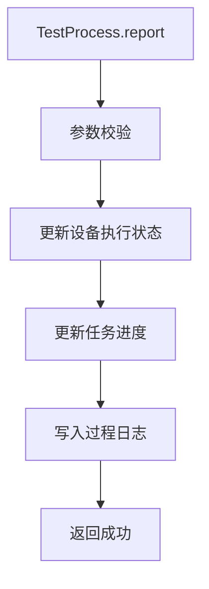

# TestProcess (service/app)

测试过程数据上报的 ApiServlet，接收设备端执行过程中的中间状态上报。

类路径：`real-test/src/main/java/cn/testin/service/app/TestProcess.java`，继承 `GenericBaseService`。

## 本类接口一览

| 接口 | op | 功能 |
| --- | --- | --- |
| report | TestProcess.report | 上报测试执行过程信息 |

## report (`TestProcess.report`)

- **实现意图**：接收设备端上报的测试执行过程数据（如安装中、运行中、截图中等中间状态），用于实时展示测试进度。区别于 TestResult.report 的最终结果上报。

- **请求参数**：
| 字段 | 类型 | 必填 | 说明 |
| --- | --- | --- | --- |
| taskAction | String | 是 | 任务扭转动作：init/prematch/match/running/preComplete/report/complete/recover/cancel/expire/execNumError |
| content | JSONObject | 否 | 过程内容，内部结构随 taskAction 变化；taskAction=report 时必填（服务层对内容做二次校验） |

- **返回参数**：
| 字段 | 类型 | 说明 |
| --- | --- | --- |
| code | Integer | 返回码，0 成功，非 0 失败（10005 参数无效等） |
| msg | String | 返回信息 |
| data | JSONObject | 业务数据 |
| data.result | Integer | 上报处理结果：1 成功，0 失败 |

- **处理流程**：

- **调用链**：`TestProcess` -> `ITaskRunInfoDAO`（Redis）-> 实时状态更新。

- **涉及表与 SQL**：Redis `task_run_info`（实时状态缓存）。
