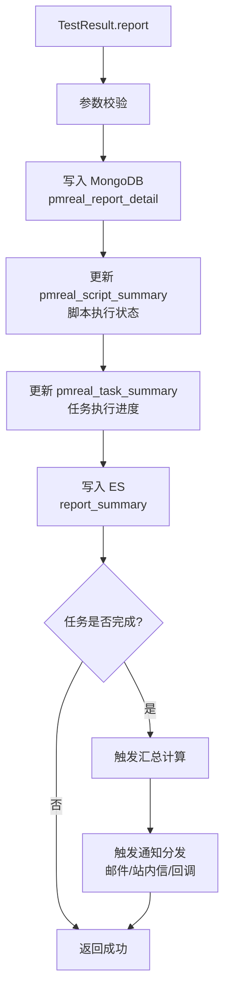

# TestResult (service/app)

测试结果上报的 ApiServlet，接收设备端执行完毕后上报的测试结果数据。

类路径：`real-test/src/main/java/cn/testin/service/app/TestResult.java`，继承 `GenericBaseService`。

## 本类接口一览

| 接口 | op | 功能 |
| --- | --- | --- |
| report | TestResult.report | 上报测试执行结果 |

## report (`TestResult.report`)

- **实现意图**：接收真机端上报的测试执行结果，含脚本执行状态、步骤详情、日志、截图、性能数据等。写入报告存储（MongoDB/ES）并触发后续流程（通知、汇总）。

- **请求参数**：
| 字段 | 类型 | 必填 | 说明 |
| --- | --- | --- | --- |
| taskResult | JSONObject | 是 | 任务结果对象，反序列化为 `TaskResult` |
| taskResult.taskid | String | 否 | 任务 ID |
| taskResult.subtaskid | String | 否 | 子任务 ID |
| taskResult.subSubtaskid | String | 否 | 子子任务 ID |
| taskResult.userId | Integer | 否 | 用户 ID |
| taskResult.deviceid | String | 否 | 设备 ID |
| taskResult.resultUrl | String | 否 | 测试结果原始未解析地址 |
| taskResult.summaryUrl | String | 否 | 结果解析后汇总地址 |
| taskResult.resultCode | Integer | 否 | 结果明细编码 |
| taskResult.resultMsg | String | 否 | 测试结果说明 |
| taskResult.execNum | Integer | 否 | 任务执行次数 |
| taskResult.parseNum | Integer | 否 | 结果解析次数 |
| taskResult.parseTime | Long | 否 | 结果解析时间 |
| taskResult.initTasktime | Long | 否 | 初始化任务时间 |
| taskResult.matchTasktime | Long | 否 | 匹配任务时间 |
| taskResult.execStandard | String | 否 | 任务执行策略 |
| taskResult.uniqueKey | String | 否 | 任务全局唯一标识（reqid_deviceid 或 reqid_scriptno_ordernum） |
| taskResult.orderNum | Integer | 否 | 脚本顺序 |
| taskResult.round | Integer | 否 | 任务执行轮数 |
| taskResult.retryNum | Integer | 否 | 出错重试顺序（0=未重试/最后一次） |
| taskResult.precompletetime | Long | 否 | 任务预完成时间 |
| taskResult.taskReqId | String | 否 | 任务级请求 ID |
| taskResult.outputParams | String | 否 | 子子任务运行后全局变量信息 |
| taskResult.inputParams | String | 否 | 子子任务运行前全局变量信息 |
| taskResult.standard | String | 否 | 脚本执行策略 |
| taskResult.rowId | Integer | 否 | 数据源中对应的 rowId |
| taskResult.uuid | String | 否 | 唯一标识 |
| resultFiles | JSONObject | 否 | 各结果文件 JSON 数据（内部结构由结果解析逻辑决定） |
| appMd5 | String | 否 | 应用包 MD5 |

- **返回参数**：
| 字段 | 类型 | 说明 |
| --- | --- | --- |
| code | Integer | 返回码，0 成功，非 0 失败（10005 参数无效等） |
| msg | String | 返回信息 |
| data | JSONObject | 业务数据 |
| data.result | Integer | 上报结果：1 成功，0 失败 |

- **处理流程**：

- **调用链**：`TestResult` -> `ITestResultService` -> `IPmrealReportDetailDAO` / `IPmrealScriptSummaryDAO` / `IPmrealTaskSummaryDAO` / `IEsReportSummaryDAO`。外部服务：[RealLogfile](../../../平台基础功能服务/00-首页.md)（日志存储）、NoticeManager（结果通知）、RealAnalysis（结果分析）。

- **涉及表与 SQL**：`pmreal_report_detail`（MongoDB INSERT）、`pmreal_script_summary`（MongoDB UPDATE）、`pmreal_task_summary`（MongoDB UPDATE）、ES `report_summary`（INSERT/UPDATE）。
