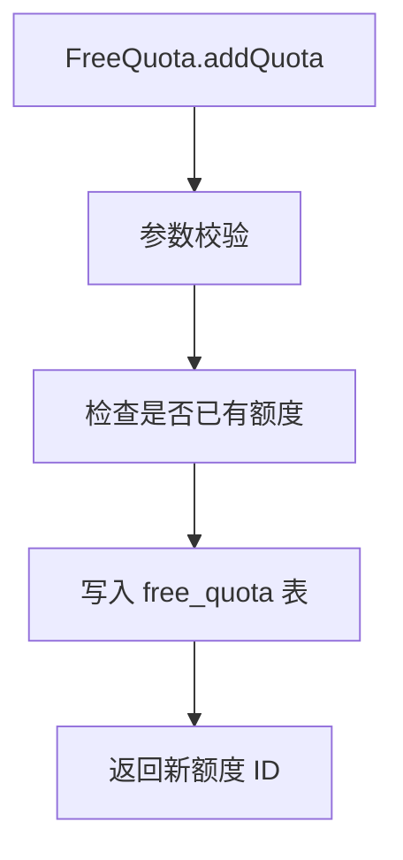

# FreeQuota (service/free)

免费额度管理的 ApiServlet，提供额度的新增、修改、查询和扣减功能。

类路径：`real-test/src/main/java/cn/testin/service/free/FreeQuota.java`，继承 `GenericBaseService`。

## 本类接口一览

| 接口 | op | 功能 |
| --- | --- | --- |
| addQuota | FreeQuota.addQuota | 新增免费测试额度 |
| modifyQuota | FreeQuota.modifyQuota | 修改免费测试额度 |
| get | FreeQuota.get | 查询免费测试额度 |
| deduction | FreeQuota.deduction | 扣减免费测试额度 |

## addQuota (`FreeQuota.addQuota`)

- **实现意图**：为企业/项目新增免费测试额度配置，含额度总量、有效期、适用项目范围等。

- **请求参数**：
| 字段 | 类型 | 必填 | 说明 |
| --- | --- | --- | --- |
| bizCode | Integer | 否 | 业务编码（代码未做空校验） |
| eid | Integer | 否 | 企业 ID |
| pid | Integer | 否 | 项目 ID |
| totalNum | Integer | 否 | 可用总数 |
| num | Integer | 否 | 可用数量 |

- **返回参数**：
| 字段 | 类型 | 说明 |
| --- | --- | --- |
| code | Integer | 返回码，0 成功，非 0 失败 |
| msg | String | 返回信息 |
| data | JSONObject | 业务数据 |
| data.result | Integer | 新增结果（服务层返回） |

- **处理流程**：

- **调用链**：`FreeQuota` -> `IFreeQuotaDAO`（MySQL）。

- **涉及表与 SQL**：`real_free_quota`（INSERT）。

## modifyQuota (`FreeQuota.modifyQuota`)

- **实现意图**：修改已有免费额度（增加/减少额度、调整有效期）。

- **请求参数**：
| 字段 | 类型 | 必填 | 说明 |
| --- | --- | --- | --- |
| bizCode | Integer | 否 | 业务编码 |
| eid | Integer | 否 | 企业 ID |
| pid | Integer | 否 | 项目 ID |
| totalNum | Integer | 否 | 可用总数 |
| num | Integer | 否 | 可用数量 |

- **返回参数**：
| 字段 | 类型 | 说明 |
| --- | --- | --- |
| code | Integer | 返回码，0 成功，非 0 失败 |
| msg | String | 返回信息 |
| data | JSONObject | 业务数据 |
| data.result | Integer | 修改结果（服务层返回） |

- **涉及表与 SQL**：`real_free_quota`（UPDATE）。

## get (`FreeQuota.get`)

- **实现意图**：根据企业/项目查询当前有效的免费额度。

- **请求参数**：
| 字段 | 类型 | 必填 | 说明 |
| --- | --- | --- | --- |
| eid | Integer | 是 | 企业 ID（null 或 <=0 返回 10005） |
| bizCode | Integer | 是 | 业务类型（null 或 <=0 返回 10005） |

- **返回参数**：
| 字段 | 类型 | 说明 |
| --- | --- | --- |
| code | Integer | 返回码，0 成功，非 0 失败 |
| msg | String | 返回信息 |
| data | JSONObject | 业务数据 |
| data.objInfo | JSONObject | 额度信息（`DBFreeQuota`，未查到为空对象） |
| data.objInfo.id | Integer | 自增主键 |
| data.objInfo.bizCode | Integer | 业务编码 |
| data.objInfo.eid | Integer | 企业 ID |
| data.objInfo.pid | Integer | 项目 ID |
| data.objInfo.totalNum | Integer | 可用总数 |
| data.objInfo.num | Integer | 可用数量 |
| data.objInfo.createtime | Long | 创建时间 |
| data.objInfo.updatetime | Long | 更新时间 |

## deduction (`FreeQuota.deduction`)

- **实现意图**：测试任务完成后扣减免费额度（按执行时长或次数扣减）。

- **请求参数**：
| 字段 | 类型 | 必填 | 说明 |
| --- | --- | --- | --- |
| eid | Integer | 是 | 企业 ID（null 或 <=0 返回 10005） |
| bizCode | Integer | 是 | 业务类型（null 或 <=0 返回 10005） |
| num | Integer | 是 | 扣减数量（null 或 <=0 返回 10005） |

- **返回参数**：
| 字段 | 类型 | 说明 |
| --- | --- | --- |
| code | Integer | 返回码：0 成功；10003 配额不足；10000 未知错误 |
| msg | String | 返回信息 |

- **处理流程**：检查剩余额度 -> 若充足则扣减 -> 更新 `real_free_quota` -> 若额度耗尽则返回提示。

- **涉及表与 SQL**：`real_free_quota`（UPDATE num）。
