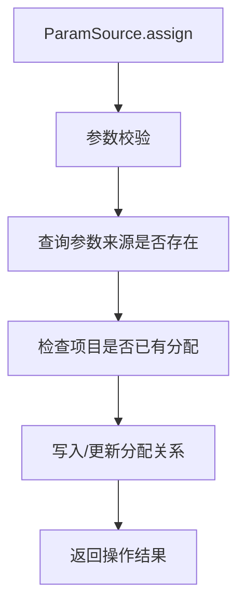

# ParamSource (service/app)

参数来源分配的 ApiServlet，负责将参数来源配置绑定到项目。

类路径：`real-test/src/main/java/cn/testin/service/app/ParamSource.java`，继承 `GenericBaseService`。

## 本类接口一览

| 接口 | op | 功能 |
| --- | --- | --- |
| assign | ParamSource.assign | 为项目分配参数来源 |

## assign (`ParamSource.assign`)

- **实现意图**：将指定的参数来源配置分配给项目，使测试任务可以使用该参数来源中的动态参数（如登录 token、设备 ID 等）。

- **请求参数**：

| 字段 | 类型 | 必填 | 说明 |
| --- | --- | --- | --- |
| projectid | Integer | 是 | 项目组 ID（null 直接返回 10005） |
| paramSource | String | 是 | 参数来源标识（blank 返回 10005） |
| devices | JSONArray | 是 | 设备 ID 数组，元素为设备 ID 字符串（空数组返回 10005） |
| scripts | JSONArray | 是 | 脚本信息数组，首元素为脚本 JSONObject（含 scriptParamIndex：脚本参数行索引，scriptNo→rowIndex），空数组返回 10005 |
| type | Integer | 否 | 分配类型：1=local 局部变量分配，2=global 全局参数分配（缺省则全局+局部都分配） |
| globalParamIndex | Integer | 否 | 全局参数起始索引（缺省 0） |
| tagList | JSONArray | 否 | 标签 ID 数组（元素 Integer） |
| noHasTagList | JSONArray | 否 | 排除标签 ID 数组（元素 Integer） |
| oldTaskId | String | 否 | 旧任务 ID（复测时用于取脚本行索引） |
| scriptStatus | JSONArray | 否 | 脚本状态数组（元素 Integer） |

- **返回参数**：

| 字段 | 类型 | 说明 |
| --- | --- | --- |
| code | Integer | 返回码，0 成功，非 0 失败（10005 参数无效等） |
| msg | String | 返回信息 |
| data | JSONObject | 业务数据 |
| data.list | JSONArray | 分配结果数组；type=global 时元素为 `{"global": JSONArray, "content": JSONObject}`；type=local 时元素为 `{"<scriptNo>": JSONArray, "content": JSONObject}` |
| data.list[].global | JSONArray | 全局分配数组，元素 `{"deviceid": String, "row": Integer, "rowId": Integer}`（代码未确认全部字段） |
| data.list[].content | JSONObject | 参数内容，key 为行号，value 为参数键值 JSONObject |

- **处理流程**：

- **调用链**：`ParamSource` -> `IParamSourceService` -> 参数来源分配表。

- **涉及表与 SQL**：参数来源-项目关联表。

- **外部服务**：[ScriptService](../../../脚本服务/00-首页.md)（参数来源配置查询）。
