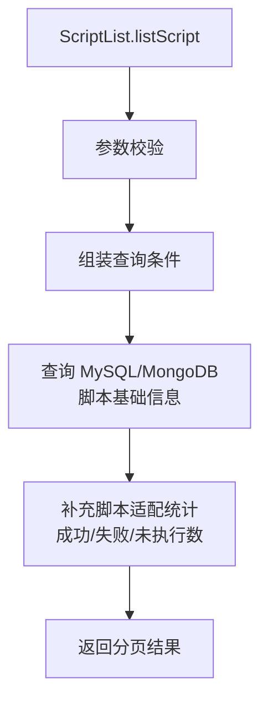

# ScriptList (service/script)

脚本列表与管理的 ApiServlet，提供脚本查询、应用版本、脚本组、收藏等功能。

类路径：`real-test/src/main/java/cn/testin/service/script/ScriptList.java`，继承 `GenericBaseService`。

## 本类接口一览

| 接口 | op | 功能 |
| --- | --- | --- |
| getAppVersions | ScriptList.getAppVersions | 获取应用的版本列表 |
| projectSuiteListInfo | ScriptList.projectSuiteListInfo | 获取项目 Suite 列表信息 |
| projectSuiteApps | ScriptList.projectSuiteApps | 获取项目 Suite 下的 App 列表 |
| collectionsScriptList | ScriptList.collectionsScriptList | 获取收藏夹中的脚本列表 |
| listScript | ScriptList.listScript | 条件分页查询脚本列表（核心接口） |
| collectionsList | ScriptList.collectionsList | 获取脚本收藏夹列表 |
| scriptGroupList | ScriptList.scriptGroupList | 获取脚本分组列表 |

## getAppVersions (`ScriptList.getAppVersions`)

- **实现意图**：根据应用 appid 查询对应的版本号列表（提测选择应用 App 时）。

- **请求参数**：
| 字段 | 类型 | 必填 | 说明 |
| --- | --- | --- | --- |
| projectid | Integer | 是 | 项目 ID（null 时直接返回空字符串） |
| appId | Integer | 否 | 应用 ID |
| suiteId | Integer | 否 | Suite ID |

- **返回参数**：
| 字段 | 类型 | 说明 |
| --- | --- | --- |
| code | Integer | 返回码，0 成功，非 0 失败 |
| msg | String | 返回信息 |
| data | JSONObject | 业务数据 |
| data.result | JSONArray | 应用版本列表，元素为 `PackageFile`（含 pkgId、versionName 等） |

- **调用链**：`ScriptList` -> `AppPackageApi.listAppVersion` -> [ScriptService](../../../脚本服务/00-首页.md)（应用版本）。

## projectSuiteListInfo (`ScriptList.projectSuiteListInfo`)

- **实现意图**：分页查询项目下的 Suite 列表信息。

- **请求参数**：
| 字段 | 类型 | 必填 | 说明 |
| --- | --- | --- | --- |
| projectid | Integer | 是 | 项目 ID（null 时返回「请输入正确项目id」字符串） |
| suiteId | Integer | 否 | Suite ID（suiteId 与 suiteid 等价） |

- **返回参数**：
| 字段 | 类型 | 说明 |
| --- | --- | --- |
| code | Integer | 返回码，0 成功，非 0 失败 |
| msg | String | 返回信息 |
| data | JSONObject | 业务数据 |
| data.objInfo | JSONObject | 分页对象 `PageList<SuiteInfo>`，含 list（Suite 列表）与分页字段（page/pageSize/totalRow 等，代码未确认具体键名） |

## projectSuiteApps (`ScriptList.projectSuiteApps`)

- **实现意图**：查询 Suite 下的 App 列表。

- **请求参数**：
| 字段 | 类型 | 必填 | 说明 |
| --- | --- | --- | --- |
| suiteId | Integer | 是 | Suite ID（空时返回空列表） |
| syspfId | Integer | 否 | 系统类型（1 Android / 2 iOS） |

- **返回参数**：
| 字段 | 类型 | 说明 |
| --- | --- | --- |
| code | Integer | 返回码，0 成功，非 0 失败 |
| msg | String | 返回信息 |
| data | JSONObject | 业务数据 |
| data.result | JSONArray | App 列表，元素为 `SuiteAppCondition`（代码未确认字段） |

## collectionsScriptList (`ScriptList.collectionsScriptList`)

- **实现意图**：查询收藏夹目录下的脚本编号数组。

- **请求参数**：
| 字段 | 类型 | 必填 | 说明 |
| --- | --- | --- | --- |
| scriptDirId | Integer | 否 | 脚本目录 ID |
| deep | Integer | 否 | 递归深度，默认 1 |
| eid | Integer | 否 | 企业 ID |
| projectid | Integer | 否 | 项目 ID |

- **返回参数**：
| 字段 | 类型 | 说明 |
| --- | --- | --- |
| code | Integer | 返回码，0 成功，非 0 失败 |
| msg | String | 返回信息 |
| data | JSONObject | 业务数据 |
| data.result | JSONArray | 脚本编号数组（元素 Integer）；出错时为错误信息字符串 |

- **调用链**：`ScriptList` -> `CollectionsApi.scriptList` -> [ScriptService](../../../脚本服务/00-首页.md)（收藏夹）。

## listScript (`ScriptList.listScript`)

- **实现意图**：多条件分页查询脚本列表，支持按 projectId、appId、suiteId、osType、keyword（描述/标签/更新人/脚本编号）等过滤，返回脚本基础信息 + 检查状态 + 按日期分组（今天/昨天/更早）。

- **请求参数**：
| 字段 | 类型 | 必填 | 说明 |
| --- | --- | --- | --- |
| projectid | Integer | 否 | 项目 ID |
| eid | Integer | 否 | 企业 ID |
| appId | Integer | 否 | 过滤应用 ID（>0 有效） |
| suiteId | Integer | 否 | Suite ID |
| appName | String | 否 | 应用名称过滤 |
| suiteName | String | 否 | Suite 名称过滤 |
| appVersion | String | 否 | 应用版本过滤 |
| osType | Integer | 否 | 系统类型：1 Android / 2 iOS，默认 0 |
| keyword | String | 否 | 搜索关键字，默认空 |
| keywordType | Integer | 否 | 搜索类型：1 脚本描述 / 2 标签 / 3 更新人 / 4 脚本编号，默认 1 |
| startPageNo | Integer | 否 | 起始页码，默认 1 |
| scriptType | Integer | 否 | 脚本类型，默认 1 |
| pageSize | Integer | 否 | 每页条数，默认 15 |
| checkStatus | Integer | 否 | 检查状态过滤：1 有效 / 0 无效 |
| scriptNos | JSONArray | 否 | 脚本编号数组（元素 Integer），限定脚本范围 |
| relationScriptNo | Integer | 否 | 已绑定脚本编号（绑定场景使用） |
| thirdPartyUserName | String | 否 | 绑定第三方更新人查询 |
| thirdPartyProjectId | String | 否 | 绑定第三方项目 ID |

- **返回参数**：
| 字段 | 类型 | 说明 |
| --- | --- | --- |
| code | Integer | 返回码，0 成功，非 0 失败 |
| msg | String | 返回信息 |
| data | JSONObject | 业务数据（直接平铺以下字段） |
| data.list | JSONArray | 脚本列表，元素为 `ScriptFile` |
| data.pager | JSONObject | 分页信息（`PageList`，绑定无数据时为空数组） |
| data.todayList | JSONArray | 今天创建的脚本列表 |
| data.yesterdayList | JSONArray | 昨天创建的脚本列表 |
| data.beforeList | JSONArray | 更早创建的脚本列表 |
| data.todayCount | Integer | 今天脚本数 |
| data.yesterdayCount | Integer | 昨天脚本数 |
| data.beforeCount | Integer | 更早脚本数 |
| data.appPackageMap | JSONObject | 脚本与包 ID 映射（scriptid → pkgid） |
| data.checkContentMap | JSONObject | 脚本检查失败内容（scriptid → 失败信息） |
| data.pkgs | JSONArray | 应用版本去重集合（仅 appId>0 时返回，元素含 pkgId、versionName） |

- **处理流程**：

- **调用链**：`ScriptList` -> `IScriptService` -> `IPmrealScriptSummaryDAO`。外部服务：[ScriptService](../../../脚本服务/00-首页.md)（脚本管理）。

- **涉及表与 SQL**：`pmreal_script_summary`（MongoDB）、MySQL 脚本相关表。

## collectionsList (`ScriptList.collectionsList`)

- **实现意图**：查询脚本目录树（收藏夹）列表。

- **请求参数**：
| 字段 | 类型 | 必填 | 说明 |
| --- | --- | --- | --- |
| lazyTree | Integer | 是 | 是否懒加载（0/1，直接 getInt 无默认值） |
| parentDirId | Integer | 是 | 父目录 ID |
| projectid | Integer | 是 | 项目 ID |
| dirType | Integer | 是 | 目录类型 |
| eid | Integer | 是 | 企业 ID |

- **返回参数**：
| 字段 | 类型 | 说明 |
| --- | --- | --- |
| code | Integer | 返回码，0 成功，非 0 失败 |
| msg | String | 返回信息 |
| data | JSONObject | 业务数据 |
| data.result | JSONArray | 目录树列表，元素为 `ScriptDirTree`（含 id、名称、子目录等） |

- **调用链**：`ScriptList` -> `CollectionsApi.list` -> [ScriptService](../../../脚本服务/00-首页.md)（目录树）。

## scriptGroupList (`ScriptList.scriptGroupList`)

- **实现意图**：分页查询项目下的脚本分组列表。

- **请求参数**：
| 字段 | 类型 | 必填 | 说明 |
| --- | --- | --- | --- |
| projectid | Integer | 否 | 项目 ID |
| appid | Integer | 否 | 过滤应用 ID（>0 有效） |
| suiteId | Integer | 否 | Suite ID |
| keyword | String | 否 | 搜索关键字 |
| keywordType | Integer | 否 | 搜索类型：1 脚本组 ID / 2 脚本 ID / 3 创建人 / 4 描述，默认 2 |
| pageNo | Integer | 否 | 起始页码，默认 1 |
| scriptType | Integer | 否 | 脚本类型，默认 1 |
| pageSize | Integer | 否 | 每页条数，默认 15 |

- **返回参数**：
| 字段 | 类型 | 说明 |
| --- | --- | --- |
| code | Integer | 返回码，0 成功，非 0 失败 |
| msg | String | 返回信息 |
| data | JSONObject | 业务数据 |
| data.result | JSONArray | 脚本组列表，元素为 `NewScriptGroup`（含 scriptGroupId、content、contentlist 等） |
| data.pageInfo | JSONObject | 分页信息（`BasePagingHolder.value`，含总数等，代码未确认具体键名） |

- **调用链**：`ScriptList` -> `ScriptGroupOperateApi.findProjectScriptGroup` -> [ScriptService](../../../脚本服务/00-首页.md)（分组管理）。
