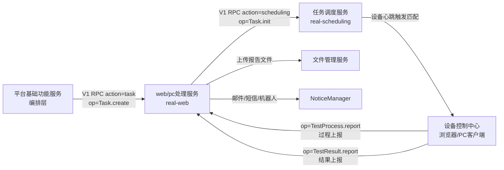

# 产品概述

> **Git 仓库**：`git@git.testin.cn:stock/backend/real-web.git`　**分支**：`syy.release.z7.8.1.0`

## 这是什么

web/pc处理服务（工程名 `real-web`）是 Testin 云真机平台**旧链路**中面向 **Web 浏览器与 PC 桌面客户端**的自动化测试执行服务：承接上游提测请求，把"一批脚本 × 一批浏览器/PC 客户端"组装成测试任务，下发给 任务调度服务 匹配空闲设备执行，回收执行结果并产出报告与通知。它与 app处理服务（App/移动端）互为对等实现，核心流程（任务创建 → 装配 → 下发 → 状态机 → 报告 → 通知）高度同构，区别在于执行目标：本服务的"设备"是浏览器（`WebBrowser`）和 PC 客户端（`PcInfo`），而非手机。

它解决四类问题：

1. **任务管理**：Web/桌面测试任务的创建、取消、暂停/恢复、补测、详情查询。
2. **任务模板与定时调度**：把任务配置固化为模板，用内嵌 Quartz 周期触发自动提测。
3. **报告与结果闭环**：脚本级/设备级结果回收、统计汇总、Excel/PDF 报告生成与分享。
4. **问题分析**：错误原因规则匹配、失败脚本归因、问题分析报告。

## 在旧链路中的位置

- **上游**：平台基础功能服务（门户/测试计划编排层，经 V1 RPC 调本服务 `Task.create`）；定时模板触发（本服务内 Quartz）；跨端任务（RealCross）。
- **下游**：任务调度服务（`Task.init/cancel`，负责设备匹配与子任务派发）、设备控制中心（浏览器/PC 客户端列表与执行）、脚本服务/数据源（脚本与参数数据）、文件管理服务（报告文件上传）、NoticeManager（通知发送）。
- 执行端不直接连本服务之外的存储：任务明细、运行记录、报告明细全部落在本服务的 MongoDB，执行端通过 ApiServlet 回调上报。

## 核心概念

| 概念                                                    | 说明                                                                                                                                                                                                                                               |
| ------------------------------------------------------- | -------------------------------------------------------------------------------------------------------------------------------------------------------------------------------------------------------------------------------------------------- |
| **任务（taskid）**                                | 一次提测的顶层单位。`wt` 前缀 = Web 任务（写 `pmweb_db`），`pt` 前缀 = PC 任务（写 `pmpc_db`），见 `PmTaskDetail.table`（`src/main/java/cn/testin/realweb/pojo/mongo/PmTaskDetail.java`）                                              |
| **子任务 / 子子任务（subtaskid / subsubtaskid）** | 任务调度服务 派发时按设备/脚本切分的执行单元，回传时按此对位                                                                                                                                                                                       |
| **脚本汇总树（PmScriptSummary）**                 | 装配阶段把脚本/脚本组展开成的树，是执行与统计的脚本清单                                                                                                                                                                                            |
| **设备运行信息（PmDeviceRunInfo）**               | 浏览器/PC 客户端维度的运行状态记录                                                                                                                                                                                                                 |
| **脚本运行信息（PmScriptRunInfo）**               | 脚本维度的运行状态记录；补测数据打`repeatTestMark` 标记                                                                                                                                                                                          |
| **执行标准（execStandard）**                      | normal / FAST / DATA 等执行策略，影响设备分配与数据驱动方式                                                                                                                                                                                        |
| **MqInfoNotice**                                  | 本服务的异步总线：所有耗时/解耦操作（装配、下发、统计、邮件、补测）都落成`mq_info_notice` 行，由 `MqNoticeDataThread` 轮询分发，类型枚举见 `NoticeConfig.InfoNoticeType`（`src/main/java/cn/testin/realweb/pojo/other/NoticeConfig.java`） |
| **任务模板（quartz_job）**                        | 存 db_common 的定时任务配置，Quartz 触发后自动走提测链路                                                                                                                                                                                           |

## 双入口架构

| 入口              | 路径           | 说明                                                                                                                    |
| ----------------- | -------------- | ----------------------------------------------------------------------------------------------------------------------- |
| ApiServlet        | `/*`（兜底） | `action=包名, op=类.方法` 反射调用 `cn.testin.realweb.service.{action}.{Class}`，任务创建/上报/导出等旧接口都走这里 |
| DispatcherServlet | `/v3/*`      | Spring MVC，`cn.testin.realweb.mvc.controller.*`，任务/模板/报告/问题分析等新接口                                     |

注册见 `src/main/java/cn/testin/realweb/RealWebApplication.java`，详解见 [横切-双入口路由机制](../04-复杂功能细节/横切-双入口路由机制.md)。

## 用户与使用场景

| 角色          | 典型场景                                               |
| ------------- | ------------------------------------------------------ |
| 测试工程师    | 选脚本 + 选浏览器/PC → 提测 → 看报告 → 失败脚本补测 |
| 测试负责人    | 配任务模板挂定时调度，周期性回归                       |
| CI/第三方系统 | V1 RPC 触发任务创建、查询任务详情、导出 Excel 报告     |
| 平台运营      | 问题分析报告定位高频失败原因                           |

## 延伸阅读

- [功能总览](功能总览.md) — 功能清单与数据模型要点
- [Web任务执行链路实现](../03-实现逻辑/Web任务执行链路实现.md) — 代码级主链路
- [00-首页](../00-首页.md) — 分支无关的技术栈与包结构总览
- [端到端-测试计划执行](../../跨模块链路/端到端-测试计划执行.md) / [端到端-补测](../../跨模块链路/端到端-补测.md) / [端到端-定时任务](../../跨模块链路/端到端-定时任务.md)
