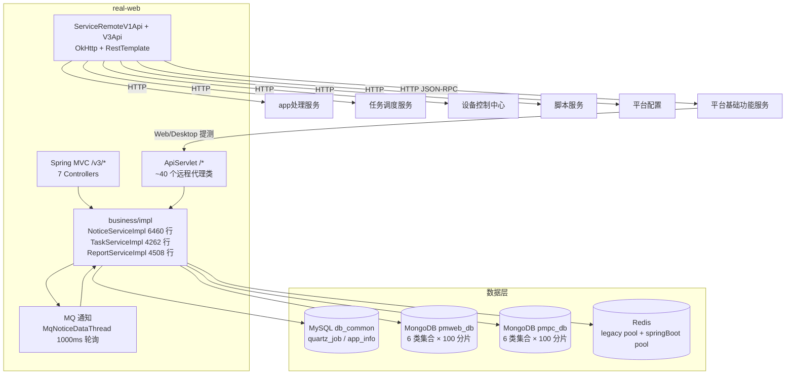

# 总体架构

## 平台定位

web/pc处理服务（real-web）是 Testin 平台**Web 端和 PC 端测试任务的执行入口与调度中心**。它是 app处理服务 的 Web/PC 对等实现——核心业务逻辑高度相似（任务创建→调度→回收→报告→通知），区别在于设备形态：app处理服务 面向手机设备，web/pc处理服务 面向浏览器（Web）和 PC 客户端。

web/pc处理服务同时承担定时模板管理（Quartz，db_common）、报告生成、问题分析、通知分发等职责，是一个"大而全"的服务。

## 系统上下文

## 核心架构决策

### 1. 双入口 + 双 Redis 连接池

`/*` → ApiServlet（~40 个远程服务代理类，调用 10+ 外部微服务）；`/v3/*` → Spring MVC（7 个 Controller，模板/报告/问题分析）。Redis 有两个连接池：legacy pool（`realtestcenter` DB，兼容老代码）和 springBoot pool（DB 0，新代码 `RedisService`）。

### 2. MongoDB 双库 + 100 分片

Web 和 PC 两类任务数据各自独立 MongoDB 库（`pmweb_db` / `pmpc_db`），每库 6 类集合按 taskId 末 2 位数字分 100 个物理集合（如 `pmwebTaskDetail_00` ~ `pmwebTaskDetail_99`）。taskId 以 `pt` 开头走 PC DB，否则走 Web DB。这种分片策略在 MongoDB 3.x 时代规避了单集合性能瓶颈。

### 3. 通知系统：MqNoticeDataThread + 19 种通知类型

`NoticeServiceImpl`（6460 行）为核心分发器，`MqNoticeDataThread` 每 1000ms 轮询 `mq_info_notice` 表。支持 19 种通知类型（TASK_ASSEMBLY、WEB_TASK_INIT、REPORT_STAT、FINISH_EMAIL、SEND_MSG 等），覆盖任务装配到报告推送全流程。

### 4. Quartz 定时模板（SchedulerManager 单例）

Web/PC 端的定时测试模板不走平台基础功能服务的 Quartz，而是本服务通过 `SchedulerManager` 单例自行管理。三种 Job 实现（`WebQuartz` / `McPcQuartz` / `AppQuartz`）分别对应 Web/PC/App 三类定时触发，AppQuartz 实际经 `RealTestApi` 转到 app处理服务。

### 5. 双 DAO 栈（MyBatis Plus + MongoDB DAO）

MySQL db_common 的四张表（quartz_job / quartz_job_log / app_info / job_task_relation）走 MyBatis Plus Mapper。MongoDB 的 6 类集合各有独立 DAO 实现（`impl/mongo/`），按 taskId 动态路由到对应分片集合。

## 代码工程一览

| 工程 | 技术栈 | 产物 | 说明 |
|---|---|---|---|
| `real-web` | Java 1.8 / Spring Boot 2.7.18 / Undertow / MyBatis Plus 3.4.2 / MongoDB / Redis | jar | 独立 Maven 工程，双 Servlet 注册 |

## 延伸阅读

- [存储总览](00-存储总览.md) — db_common + MongoDB + Redis
- [专题索引](../04-复杂功能细节/专题-索引.md)
- [核心链路-定时任务执行](../04-复杂功能细节/核心链路-定时任务执行.md)
- [横切-通知系统](../04-复杂功能细节/横切-通知系统.md)
- [跨模块：定时任务](../../跨模块链路/端到端-定时任务.md) / [补测](../../跨模块链路/端到端-补测.md)
