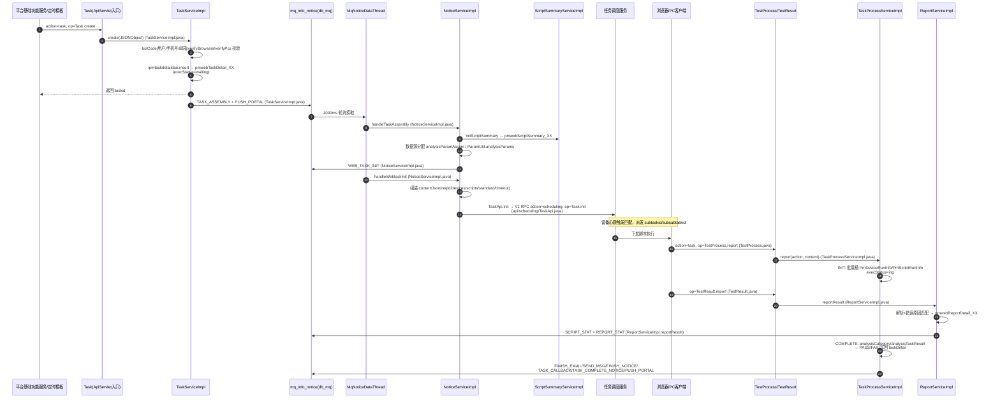

# Web任务执行链路实现

## 概述

本文描述 web/pc处理服务（real-web）最核心的一条链路：平台基础功能服务 通过 **V1 RPC `action=task, op=Task.create`** 创建任务 → 本服务装配后经 **`action=scheduling, op=Task.init`** 下发给 任务调度服务（设备心跳触发匹配）→ 浏览器/PC 客户端执行 → 过程与结果回调 → 汇总报告与完成通知。PC 任务（`pt` 前缀 taskid）同构，差异仅为 browsers→pcs、pmweb_db→pmpc_db。

更细粒度的六阶段数据流（含每一步写哪个集合）见 [核心链路-Web任务执行](../04-复杂功能细节/核心链路-Web任务执行.md)；本文聚焦代码级调用链与关键分支。

链路可概括为 6 步：

1. `Task.create` 入口校验参数（bizCode/用户/设备/脚本），落库 `PmTaskDetail`（`execStatus=waiting`）；
2. 发 MQ `TASK_ASSEMBLY`（异步装配）与 `PUSH_PORTAL`（门户推送）；
3. `NoticeServiceImpl.handleTaskAssembly` 展开脚本汇总树、分配数据源参数，发 `WEB_TASK_INIT`；
4. `NoticeServiceImpl.handleWebtaskInit` 组装下发报文，调 `scheduling.TaskApi.init`（V1 RPC → 任务调度服务）；
5. 任务调度服务 匹配设备后，执行端回调 `TestProcess.report`（INIT→MATCH→RUNNING→RECOVER→COMPLETE 状态机）；
6. 执行结果回调 `TestResult.report` → `ReportServiceImpl.reportResult` 落报告明细，发 `SCRIPT_STAT`/`REPORT_STAT` 汇总，COMPLETE 阶段发完成通知。

## 全链路时序图



## 逻辑详解

### 1. 任务创建入口（Task.create）

平台基础功能服务 / 定时模板 / 跨端任务最终都汇聚到 `Task.create`（`src/main/java/cn/testin/realweb/service/task/Task.java`）→ `TaskServiceImpl.create(JSONObject)`（`src/main/java/cn/testin/realweb/business/impl/TaskServiceImpl.java`）。

校验与解析（`TaskServiceImpl.java`）：

| 校验项 | 说明 |
|---|---|
| `bizCode` | 调 平台配置 的 `BizConfigApi.get` 校验业务配置存在性 |
| 用户信息 | `getUserInfo(eid, projectid, userid)` |
| 手机号/邮箱 | `REGEX_MOBILE` / `REGEX_EMAIL` 正则 |
| 设备 | Web 走 `verifyBrowsers`，PC 走 `verifyPcs` |
| 执行策略 | `PmrealStandard`（continueOnError/video/taskGroup/preCompleteCallBack/projectGlobalTimeOut） |
| 数据源 | paramSource/paramStrategy/dataDistributeType/dataSourceSelf 四要素 |
| 重试上限 | `retryMax`（负数归零） |

### 2. 落库与通知（阶段 2）

封装 `PmTaskDetail`（`execStatus=waiting`、`vhost=Config.MODULE_NODE_ID`），`ipmtaskdetaildao.insert` 按 taskid 末 2 位写入 `pmwebTaskDetail_00~99` 分片（表名计算 `PmTaskDetail.table`，`src/main/java/cn/testin/realweb/pojo/mongo/PmTaskDetail.java`）。随后发两条 MQ（`TaskServiceImpl.java`）：

- `TASK_ASSEMBLY` — 异步装配（带延迟发布时间）；恒生渠道（`hundsun`）走同步 `assembleAndInitTask`直接装配+下发
- `PUSH_PORTAL` — 门户进度推送（`taskCreate=1`）
- 测试计划渠道（`extendedChannel=TESTIN_TEST_PLAN`）跳过 TASK_ASSEMBLY；计划重测（`executeRecordTaskId`）走 `testPlanV3Api.resetTask` 分支直接返回

### 3. 装配（TASK_ASSEMBLY）

`MqNoticeDataThread`（cn.testin.common，1000ms 轮询）捞取通知 → `NoticeServiceImpl` 按 type 分发（`src/main/java/cn/testin/realweb/business/impl/NoticeServiceImpl.java` 起的 if-else 链）→ `handleTaskAssembly`：

1. `ScriptSummaryServiceImpl.initScriptSummary` 展开脚本/脚本组为汇总树，写 `pmwebScriptSummary_XX`；
2. 数据源分配：依赖脚本参数走 `ParamUtil.analysisParams`，数据源走 `analysisParamAssign`，结果回写 `PmTaskDetail`；
3. 发 `WEB_TASK_INIT`。

装配失败靠 MQ 重试（累加 execNum），超次数/超时置非法。

### 4. 下发（WEB_TASK_INIT → 任务调度服务）

`handleWebtaskInit`（`NoticeServiceImpl.java`）组装报文后调 `TaskApi.init`。报文要点：

- `reqId = PmTaskDetail.generateReqId(userid, taskid, createtime)` 防重；
- devices：`wt` → browsers 数组；`pt` → pcs 数组；
- standard：合并业务配置 `execStandards` 与用户自定义，缺省超时取 `TimeoutApi.getTimeoutConfig`；
- `matchSingleDevice`（数据驱动同脚本同机）、`taskReleaseTimePeriodsList`（下发时段控制）。

`TaskApi.init`（`src/main/java/cn/testin/realweb/api/scheduling/TaskApi.java`）是 V1 RPC 封装：

```java
// TaskApi.java
reqJson.put("action", "scheduling");
reqJson.put("op", "Task.init");
reqJson.put(ApiResponse.RES_DATA, contentJson);
ApiJsonResponse apiJsonResponse = ApiUtil.doPress(this.realSchedulingPrefixName, reqJson.toString());
```

同类的 `Task.cancel` 对应 `action=scheduling, op=Task.cancel`（`TaskApi.java`）。返回值 >0 即下发成功，此后设备匹配、子任务派发、心跳超时控制都在 任务调度服务 内完成。

### 5. 过程上报与状态机（TestProcess.report）

执行端/调度侧回调 `action=task, op=TestProcess.report` → `TaskProcessServiceImpl.report(action, content)`（`src/main/java/cn/testin/realweb/business/impl/TaskProcessServiceImpl.java`），按 action 分发五阶段：

```
INIT → MATCH → RUNNING → COMPLETE
              ↘ RECOVER ↗
```

- **INIT**：按 taskDetail 的脚本/设备 map 展开生成 `PmDeviceRunInfo`/`PmScriptRunInfo`；入库前与已有记录按 subtaskid 去重合并（补测场景按 `scriptNo_orderNum` 对位），100 条/批插入，`execStatus=ing`，测试计划渠道发 `TASK_INIT_NOTICE`+ `PUSH_PORTAL`；
- **MATCH**：设备 RUNNING + startExecTime；
- **RUNNING** / **RECOVER**：脚本运行标记 / 设备回等待重匹配；
- **COMPLETE**：`analysisCategory` 设备结果分类 → `analysisTaskResult`算 PASS/FAIL 写回 taskDetail → 批量发完成通知。

状态机全量细节见 [横切-任务状态机](../04-复杂功能细节/横切-任务状态机.md)。

### 6. 结果回收（TestResult.report）

`action=task, op=TestResult.report` → `ReportServiceImpl.reportResult(TaskResult, fileJson)`（`src/main/java/cn/testin/realweb/business/impl/ReportServiceImpl.java`）：

1. 分布式锁 `LockType.ReportResultHandle`：resultCode=0 锁 taskid，否则锁 subsubtaskid；
2. `parseNormalResult` / `parseIllegalResult` 解析；errorMsg/OCR 文本匹配错误原因规则（调 平台配置 `ErrorCauseTypeV3Api.getErrorCauseMathRule`）；
3. 关联 `PmScriptRunInfo` 与 `PmScriptSummary`，写 `pmwebReportDetail_XX`；
4. 发 `SCRIPT_STAT`+ `REPORT_STAT`→ `TaskSummaryServiceImpl.reportStat` 汇总 `pmwebTaskSummary_XX`。

## 异常与边界

| 场景 | 处理 |
|---|---|
| 装配失败 | MQ 重试（execNum 累加，>10 次且超 1 小时置非法） |
| 任务取消 | `Task.cancel`（Task.java）→ `TaskServiceImpl.cancel`，同步调 `TaskApi.cancel`（action=scheduling, op=Task.cancel）；跨端未初始化取消走 `CROSS_CANCEL` |
| 暂停/恢复 | `TaskServiceImpl.pause`/`resume` |
| 继续执行 | `TaskServiceImpl.execute` 仅对测试计划渠道（TESTIN_TEST_PLAN）重发 TASK_ASSEMBLY，普通任务仅翻转暂停/继续状态 |
| 结果重复上报 | `ReportResultHandle` 锁按 taskid 维度串行化；任务不存在直接返回成功（幂等，防调度侧重试） |
| 状态覆盖保护 | `modifyTaskDetail`/`modifyDeviceRunInfo` 用 LockUtil+synchronized 防已完成被中间态覆盖 |
| 任务超时 | `projectGlobalTimeOut` 随下发报文给 任务调度服务 控制 |

## 关键代码位置表

| 环节 | 类 / 方法 | 位置 |
|---|---|---|
| 创建入口 | Task.create | src/main/java/cn/testin/realweb/service/task/Task.java |
| 创建主流程 | TaskServiceImpl.create | src/main/java/cn/testin/realweb/business/impl/TaskServiceImpl.java |
| 装配通知发送 | TaskServiceImpl（TASK_ASSEMBLY/PUSH_PORTAL） | src/main/java/cn/testin/realweb/business/impl/TaskServiceImpl.java |
| MQ 分发 | NoticeServiceImpl（if-else 链） | src/main/java/cn/testin/realweb/business/impl/NoticeServiceImpl.java |
| 装配 | NoticeServiceImpl.handleTaskAssembly | src/main/java/cn/testin/realweb/business/impl/NoticeServiceImpl.java |
| 下发组装 | NoticeServiceImpl.handleWebtaskInit | src/main/java/cn/testin/realweb/business/impl/NoticeServiceImpl.java |
| V1 RPC 下发 | TaskApi.init / cancel | src/main/java/cn/testin/realweb/api/scheduling/TaskApi.java |
| 过程上报入口 | TestProcess.report | src/main/java/cn/testin/realweb/service/task/TestProcess.java |
| 状态机 | TaskProcessServiceImpl.report | src/main/java/cn/testin/realweb/business/impl/TaskProcessServiceImpl.java |
| INIT 阶段 | TaskProcessServiceImpl.init | src/main/java/cn/testin/realweb/business/impl/TaskProcessServiceImpl.java |
| COMPLETE 汇总 | TaskProcessServiceImpl.complete / analysisTaskResult | src/main/java/cn/testin/realweb/business/impl/TaskProcessServiceImpl.java |
| 结果上报入口 | TestResult.report | src/main/java/cn/testin/realweb/service/task/TestResult.java |
| 结果回收 | ReportServiceImpl.reportResult | src/main/java/cn/testin/realweb/business/impl/ReportServiceImpl.java |
| 统计通知 | ReportServiceImpl（SCRIPT_STAT/REPORT_STAT） | src/main/java/cn/testin/realweb/business/impl/ReportServiceImpl.java |
| 分片表名 | PmTaskDetail.table | src/main/java/cn/testin/realweb/pojo/mongo/PmTaskDetail.java |
| MQ 类型枚举 | NoticeConfig.InfoNoticeType | src/main/java/cn/testin/realweb/pojo/other/NoticeConfig.java |

## 注意事项与坑

1. **所有异步环节都是 MQ 表驱动**：装配、下发、统计、邮件、回调全部落 `mq_info_notice`，由 `MqNoticeDataThread` 1000ms 轮询。任何一步失败都表现为"通知状态卡住"，排查先看这张表，见 [横切-通知系统](../04-复杂功能细节/横切-通知系统.md)。
2. **taskid 前缀决定库**：`wt` → pmweb_db、`pt` → pmpc_db；代码里到处是 `taskid.startsWith("wt")/"pt"` 的分叉（如 `TaskServiceImpl.repeatTest`），新增逻辑两个分支都要考虑。
3. **下发成功 ≠ 开始执行**：`TaskApi.init` 返回 >0 只代表 任务调度服务 受理；真正开始执行的标志是执行端回调 `TestProcess.report` 的 INIT 动作。
4. **测试计划渠道跳过装配**：`extendedChannel=TESTIN_TEST_PLAN` 的任务不发 TASK_ASSEMBLY，由计划侧驱动，改装配逻辑时不要漏掉这条旁路（见 [端到端-测试计划执行](../../跨模块链路/端到端-测试计划执行.md)）。
5. **恒生渠道是同步旁路**：带 `hundsun` 字段的任务不走 MQ 装配，在创建请求线程里同步 `assembleAndInitTask`（`TaskServiceImpl.java`），大任务会拉长创建接口耗时。

## 相关文档

- [核心链路-Web任务执行](../04-复杂功能细节/核心链路-Web任务执行.md)
- [批量补测与报告实现](批量补测与报告实现.md)
- [横切-任务状态机](../04-复杂功能细节/横切-任务状态机.md)
- [service-task-Task](../07-开放接口文档/其他ApiServlet/service-task-Task.md)
