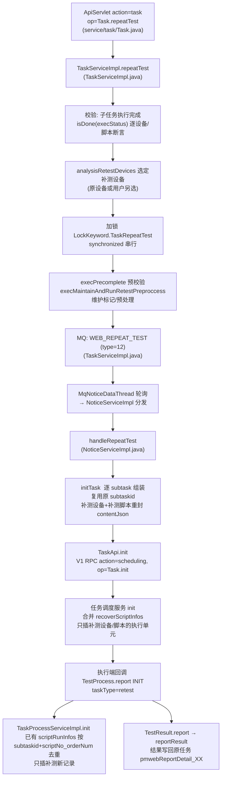
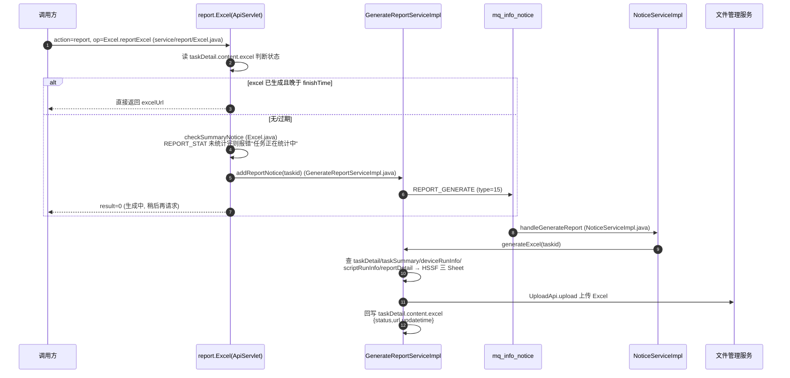

# 批量补测与报告实现

## 概述

本文覆盖 web/pc处理服务（real-web）的两条结果侧链路：

1. **批量补测（repeatTest）**：任务执行完成后，对指定子任务/脚本在原任务上补充执行，结果合并回原任务而非新建任务；
2. **报告实现**：执行结果回收 → 统计汇总 → Excel/PDF 报告生成上传 → 完成通知。

补测的跨模块全景（含 app处理服务 三种形态对比、任务调度服务 侧 `recoverScriptInfos` 合并）见 [端到端-补测](../../跨模块链路/端到端-补测.md)；报告生成的逐阶段数据流见 [核心链路-报告生成](../04-复杂功能细节/核心链路-报告生成.md)。本文聚焦 real-web 内的代码级实现。

## 批量补测链路

## 补测逻辑详解

### 1. 入口与预校验（TaskServiceImpl.repeatTest）

`Task.repeatTest`（`src/main/java/cn/testin/realweb/service/task/Task.java`）→ `TaskServiceImpl.repeatTest(taskid, subtasks, devices, subsubtaskinfo)`（`src/main/java/cn/testin/realweb/business/impl/TaskServiceImpl.java`）：

1. **完成性校验**：逐个 subtask 查 `PmDeviceRunInfo`（设备维度），查不到再查 `PmScriptRunInfo`（脚本维度），逐条断言 `isDone(execStatus)`——**任何一条未执行完直接拒绝补测**；
2. **补测脚本信息**：`subsubtaskinfo` 缺省时按 `subsubtaskinfo(taskDetail, subtaskid)` 自动补齐；
3. **设备选定**：`analysisRetestDevices`按 taskDetail 选定补测设备；非 FAST/DATA 执行标准时要求补测设备数 ≥ 子任务数；
4. **串行化**：`LockKeyword.TaskRepeatTest`（值为 `110:Task.repeatTest`，`src/main/java/cn/testin/realweb/pojo/other/LockKeyword.java`）加锁 + `synchronized`，锁内做 `execPrecomplete`（预校验）与 `execMaintainAndRunRetestPreproccess`（维护操作与标记）；
5. **发 MQ**：`WEB_REPEAT_TEST`（type=12，level=2，有效期 5 小时，`src/main/java/cn/testin/realweb/pojo/other/NoticeConfig.java`），content 带 taskid/subtasks/retestDevices/retestDetail。

### 2. MQ 消费与重新下发（handleRepeatTest → initTask）

`NoticeServiceImpl` 分发链在  命中 `WEB_REPEAT_TEST` → `handleRepeatTest`（`src/main/java/cn/testin/realweb/business/impl/NoticeServiceImpl.java`）：反序列化 content（Gson），按 `wt`/`pt` 前缀分别断言补测设备非空，然后 `initTask`：

- 重新加载 taskDetail，按 `execStandard` 决定设备分配：FAST/DATA 标准把全部补测设备塞进每个子任务，普通标准一个子任务对应一台设备；
- **复用原 subtaskid**（注释"补测任务subtaskid不更改"），脚本信息按 retestDetail 过滤重封；
- 任务类型置 `TestConfigEnum.TaskType.retest`；
- 最终走与首次下发相同的 `TaskApi.init`（V1 RPC `action=scheduling, op=Task.init`）——对 任务调度服务 而言补测与首测是同一个入口，靠 `taskType` 与 recover 信息区分。

### 3. 结果合并：补测不重整任务，只补缺

合并发生在两侧：

- **任务调度服务 侧**：`TaskServiceImpl.init` 合并 `recoverScriptInfos`，只插入补测设备的执行单元与补测脚本的子单元（详见 [端到端-补测](../../跨模块链路/端到端-补测.md) 调用链 #4）；
- **real-web 侧**：执行端回调 INIT 时，`TaskProcessServiceImpl.init` 入库前把待插的 `scriptRunInfos` 与库中已有记录对位去重——补测任务（`taskType=retest`）按 `subtaskid + scriptNo_orderNum` 双重 key 对位（`TaskProcessServiceImpl.java`），普通任务仅按 subtaskid；已在库的记录保留，新记录补插，`PmScriptRunInfo.repeatTestMark` 区分补测数据（`src/main/java/cn/testin/realweb/pojo/mongo/PmScriptRunInfo.java`）；
- **报告侧**：补测结果经 `TestResult.report` → `ReportServiceImpl.reportResult` 写回**原任务**的 `pmwebReportDetail_XX`，汇总统计照常走 `SCRIPT_STAT`/`REPORT_STAT`，报告上呈现为原任务的一部分。

### 4. 补测 vs 重测（McPcQuartz.retest）

注意区分两个词：**补测（repeatTest）复用原任务**；**重测（retest）是新建任务**。`McPcQuartz.retest`（`src/main/java/cn/testin/realweb/business/impl/McPcQuartz.java`）用于定时模板场景的整任务重跑：按 `scriptStatus` 过滤失败状态脚本（failTest=true 时取 FAIL/CANCEL/TIME_OUT），从原 taskDetail 拷贝全部任务配置（标准/通知/数据源/环境/重试上限），重新封装脚本组（同 groupid 去重合并 content）后**走完整的提测链路生成新 taskid**。

## 报告实现

### 1. 结果回收（reportResult）

`TestResult.report`（`src/main/java/cn/testin/realweb/service/task/TestResult.java`）→ `ReportServiceImpl.reportResult(TaskResult, fileJson)`（`src/main/java/cn/testin/realweb/business/impl/ReportServiceImpl.java`）：

1. 分布式锁 `LockType.ReportResultHandle`：正常结果锁 taskid 维度，异常结果锁 subsubtaskid 维度；
2. `parseNormalResult` / `parseIllegalResult` 解析结果，errorMsg/OCR 文本匹配错误原因规则（平台配置 `ErrorCauseTypeV3Api.getErrorCauseMathRule`）；
3. 关联 `PmScriptRunInfo`（scriptNo/数据 UUID）与 `PmScriptSummary`，写 `pmwebReportDetail_XX`；
4. 发 `SCRIPT_STAT`→ `ScriptSummaryServiceImpl.handleScriptSummary`（脚本汇总树统计）；发 `REPORT_STAT`→ `NoticeServiceImpl.handleReportStat`→ `TaskSummaryServiceImpl.reportStat`汇总写 `pmwebTaskSummary_XX`。

### 2. Excel 报告生成（异步 MQ 驱动）

报告导出是"请求-轮询"模式，不在请求线程里生成：

要点：

- **去重**：`Excel.addExcel`（`src/main/java/cn/testin/realweb/service/report/Excel.java`）先查是否有 pending 的 `REPORT_GENERATE` 通知，有则直接返回"生成中"，不重复发 MQ；
- **失败兜底**：`handleGenerateReport` 失败靠 MQ 重试，**超过 20 次**（execNum > 20）把 `content.excel.status` 置 -1 终结（`NoticeServiceImpl.java`）；
- **计划报告**：`REPORT_GENERATE_PLAN`（type=25）→ `handleGeneratePlanReport`→ `generatePlanExcel`（`GenerateReportServiceImpl.java`）；
- **PDF**：ApiServlet `action=report, op=Pdf.parse` → `Html2PdfUtils` 工作队列 → `PDFThread`（StartRunner 启动）异步转换。

### 3. 完成通知（COMPLETE 阶段）

状态机 COMPLETE（`TaskProcessServiceImpl`）在 `analysisTaskResult`算出任务级 PASS/FAIL 后，批量发通知：

| MQ 类型 | 说明 |
|---|---|
| `FINISH_EMAIL` | 完成邮件（`handleFinishEmail`，含 ReportApi 分享链接，Redis setNX 去重） |
| `SEND_MSG` | 短信/渠道消息 |
| `FINISH_NOTICE` | 钉钉/飞书机器人通知 |
| `TASK_CALLBACK` | 用户 HTTP 回调（延迟 2 分钟） |
| `TASK_COMPLETE_NOTICE` | 测试计划完成通知 |
| `PUSH_PORTAL` | 门户完成推送（`taskCreate=0`） |

各 handler 的实现细节见 [横切-通知系统](../04-复杂功能细节/横切-通知系统.md)。

## 关键代码位置表

| 环节 | 类 / 方法 | 位置 |
|---|---|---|
| 补测入口 | Task.repeatTest | src/main/java/cn/testin/realweb/service/task/Task.java |
| 补测主流程 | TaskServiceImpl.repeatTest | src/main/java/cn/testin/realweb/business/impl/TaskServiceImpl.java |
| 补测锁 | LockKeyword.TaskRepeatTest | src/main/java/cn/testin/realweb/pojo/other/LockKeyword.java |
| 补测 MQ 类型 | InfoNoticeType.WEB_REPEAT_TEST | src/main/java/cn/testin/realweb/pojo/other/NoticeConfig.java |
| 补测消费 | NoticeServiceImpl.handleRepeatTest | src/main/java/cn/testin/realweb/business/impl/NoticeServiceImpl.java |
| 补测重封下发 | NoticeServiceImpl.initTask | src/main/java/cn/testin/realweb/business/impl/NoticeServiceImpl.java |
| 补测记录去重 | TaskProcessServiceImpl.init（合并段） | src/main/java/cn/testin/realweb/business/impl/TaskProcessServiceImpl.java |
| 重测（新建任务） | McPcQuartz.retest | src/main/java/cn/testin/realweb/business/impl/McPcQuartz.java |
| 结果回收 | ReportServiceImpl.reportResult | src/main/java/cn/testin/realweb/business/impl/ReportServiceImpl.java |
| 统计通知 | ReportServiceImpl（SCRIPT_STAT/REPORT_STAT） | src/main/java/cn/testin/realweb/business/impl/ReportServiceImpl.java |
| 报告统计分发 | NoticeServiceImpl.handleReportStat | src/main/java/cn/testin/realweb/business/impl/NoticeServiceImpl.java |
| Excel 导出入口 | Excel.reportExcel / addExcel | src/main/java/cn/testin/realweb/service/report/Excel.java |
| Excel 通知 | GenerateReportServiceImpl.addReportNotice | src/main/java/cn/testin/realweb/business/impl/GenerateReportServiceImpl.java |
| Excel 生成 | NoticeServiceImpl.handleGenerateReport → generateExcel | src/main/java/cn/testin/realweb/business/impl/NoticeServiceImpl.java；GenerateReportServiceImpl.java |
| 计划 Excel | handleGeneratePlanReport → generatePlanExcel | src/main/java/cn/testin/realweb/business/impl/NoticeServiceImpl.java；GenerateReportServiceImpl.java |

## 注意事项与坑

1. **补测要求子任务全部执行完**：`repeatTest` 对每个 subtask 逐设备/脚本断言 `isDone`（`TaskServiceImpl.java`），任务还在跑就调补测会直接被 Assert 打回。
2. **补测设备数校验随执行标准变化**：普通标准要求补测设备数 ≥ 子任务数，FAST/DATA 标准不做该校验（设备全量复用）——数据驱动任务补测时设备语义不同。
3. **补测下发复用首测入口**：对 任务调度服务 而言补测/首测都是 `Task.init`，区分靠 content 里的 `taskType=retest` 与 recover 信息；改下发报文结构时两侧（real-web 的 `initTask` 与调度侧 `init`）要一起改。
4. **Excel 报告是异步轮询模式**：`Excel.reportExcel` 首次调用只发 MQ 返回"生成中"，前端/调用方需重复请求直到拿到 `excelUrl`；`REPORT_STAT` 未统计完时直接报错"任务正在统计中"（`Excel.java`）。
5. **Excel 生成重试上限 20 次**：`handleGenerateReport` 超 20 次把 `content.excel.status` 置 -1（`NoticeServiceImpl.java`），此后调用方拿到的是失败状态而非继续重试——生成卡死排查先看 `mq_info_notice` 的 execNum。
6. **重测 ≠ 补测**：`McPcQuartz.retest` 是拷贝配置新建任务（新 taskid、新报告），`repeatTest` 才是合并回原任务的补测；改代码时先确认需求是哪一种，跨模块对比见 [端到端-重测](../../跨模块链路/端到端-重测.md)。

## 相关文档

- [Web任务执行链路实现](Web任务执行链路实现.md)
- [核心链路-报告生成](../04-复杂功能细节/核心链路-报告生成.md)
- [横切-通知系统](../04-复杂功能细节/横切-通知系统.md)
- [端到端-补测](../../跨模块链路/端到端-补测.md)
- [service-task-Task](../07-开放接口文档/其他ApiServlet/service-task-Task.md) / [service-report-Excel](../07-开放接口文档/其他ApiServlet/service-report-Excel.md)
