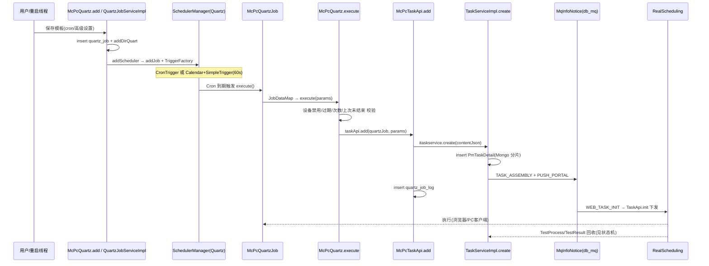

# 核心链路：定时任务执行（Cron 触发 → 创建实时任务 → 调度下发 → 回收）

> 基于 web/pc处理服务 syy.release.z7.8.1.0 代码分析。完整串联从 Quartz Cron 触发到实时任务创建、下发执行、结果回收的数据流向。
>
> - **涉及入口**：`TestTemplateController`（模板保存）/ ApiServlet `action=quartz`（service-quartz-Quartz）/ 手动触发（`isManualExecution=1`）
> - **关键类**：`SchedulerManager`、`TriggerFactory`、`QuartzJobServiceImpl`、`WebQuartzJob`/`McPcQuartzJob`/`AppQuartzJob`、`WebQuartz`/`McPcQuartz`/`AppQuartz`、`McPcTaskApi`/`RealWebApi`、`TaskServiceImpl`
> - **涉及存储**：MySQL `db_common`（`quartz_job`、`job_task_relation`、`quartz_job_log`）→ MongoDB（`pmwebTaskDetail_XX`/`pmpcTaskDetail_XX` 分片）→ MQ（`MqInfoNotice`，db_mq）

## 链路总览



---

## 阶段 1：调度注册（模板保存 → quartz_job → Scheduler）

**入口**：`McPcQuartz.add(JSONObject)`（`business/impl/McPcQuartz.java`，类上 `@Transactional`，三个 IQuartz 实现中唯一带事务）→ `QuartzJobServiceImpl.addScheduler(jobId, delJob, modifyFlag)`（`business/impl/QuartzJobServiceImpl.java`）。

注册动作：

1. 校验 cron 合法性与是否过期（`CronExpression.isValidExpression` / `getNextValidTimeAfter`）
2. 先删除同名旧调度（`deleteScheduleJob`，含 Calendar 清理）
3. 组装 JobDataMap（jobId/cronParams/jobName/eid/projectid/jobType/customJobRule）
4. 按 `businessType` 选择 Job 实现类注册：

```java
// QuartzJobServiceImpl.java
if (quartzJob.getBusinessType().equals(BusinessType.app.getValue())) {
    manager.addJob(jobName, cronExpression, AppQuartzJob.class, params);
} else if (quartzJob.getBusinessType().equals(BusinessType.web.getValue())) {
    manager.addJob(jobName, cronExpression, WebQuartzJob.class, params);
} else if (quartzJob.getBusinessType().equals(BusinessType.mcpc.getValue())) {
    manager.addJob(jobName, cronExpression, McPcQuartzJob.class, params);
}
```

| 数据 | 来源 | 落点 |
|------|------|------|
| cron 表达式 / 高级策略 JSON | 用户输入（jobRule / customJobRule） | `quartz_job.job_rule` / `custom_job_rule` |
| 任务内容快照（脚本/设备/通知配置） | 请求 JSON 整体 | `quartz_job.job_content` |
| Job 名 | `QuartzHelper.genUUID()` | `quartz_job.job_name`（JobKey = jobName + "_job_group"） |
| 目录关联 | dirId（缺省取根目录） | `DirQuartzApi.addDirQuart` → RealLogfile |

**写入表**：`quartz_job`（主表）、目录关联（远程 RealLogfile）。

## 阶段 2：Scheduler 与触发器构造

**SchedulerManager**（`quartz/SchedulerManager.java`）：单例 + 双重检查，`StdSchedulerFactory` 内存调度（RAMJobStore），线程池 20。构造时注册三个监听器（`registerListener`）：

- `MySchedulerListener` — 仅 `schedulerError` 打日志，其余方法为空（扩展点）
- `MyJobListener` / `MyTriggerListener` — 全部空实现（扩展点）

**TriggerFactory**（`quartz/TriggerFactory.java`）按 `jobType` 分两路：

| jobType | 触发器 | 说明 |
|---------|--------|------|
| 1/2/3（指定时间/定点/cron） | `CronTrigger` | `withMisfireHandlingInstructionDoNothing()` — 错过触发直接丢弃 |
| 4 CUSTOM_EXPRESSION（高级设置） | `SimpleTrigger` 60s 重复 + Calendar 排除 | DailyCalendar/WeeklyCalendar/MonthlyCalendar 限定时段与星期/日 |

```java
// TriggerFactory.java（高级设置-每天）
return newTrigger()
        .withIdentity(triggerKey)
        .startAt(DateUtils.convertDate(jobStartTime, startTime))
        .withSchedule(simpleSchedule().withIntervalInSeconds(60).repeatForever()
                .withMisfireHandlingInstructionNextWithExistingCount())
        .modifiedByCalendar(calendarName)
        .build();
```

**重启恢复**：`StartRunner` 启动 `QuartzListenerThread`（`quartz/QuartzListenerThread.java`），扫描 `job_status IN (0,1)` 且未删除的 `quartz_job`，逐条 `rebuildTask`：cron 过期的不删除、只把 `job_status` 置 4（已完成）；暂停中的重建后再 `pauseJob`。

## 阶段 3：Cron 触发 → Job 执行

**入口**：`McPcQuartzJob.execute(JobExecutionContext)`（`quartz/job/McPcQuartzJob.java`）/ `WebQuartzJob`（同构）。Job 非 Spring Bean，通过 `SpringContextUtil.getBean("mcPcQuartz")` 拿业务类：

```java
// McPcQuartzJob.java
JobDetail job = context.getJobDetail();
Map params = (Map) job.getJobDataMap().get(QuartzHelper.JOB_DATA_MAP_DEFAULT_KEY);
String jobId = QuartzHelper.parseJobId(params);
...
params.put("quartz", 1);
String taskId = pcQuartz.execute(params);
```

返回值语义（`JobStatusConstant`）：`FINISH_OR_DELETE`（任务已删/过期）、`OVER_TOTAL_COUNT`（总次数达上限）、`OVER_COUNT`（当日时段次数达上限）、`WAIT_FINISH`（上次任务未结束，等下一拍），其余为真实 taskId。异常仅记日志，不阻塞下次触发。

**业务分发**：`McPcQuartz.execute(Map)`（`business/impl/McPcQuartz.java`）：

1. 按 jobId+eid+projectId 查 `quartz_job`（`delete_status=0`），不存在返回 `FINISH_OR_DELETE`
2. `checkDeviceStatus=CHECK` 时校验 PC 设备禁用状态（`checkDevice`， — 全部禁用抛 `DEVICE_ALL_DISABLED`，部分禁用抛 `DEVICE_DISABLED`）
3. 无 cron（手动触发场景）→ 直接 `taskApi.add`
4. `CUSTOM_EXPRESSION` → `execAdvancedJob`；普通 cron → `execCommonJob`

`execAdvancedJob` 的四道闸门：

```java
// McPcQuartz.java（精简）
if (!isManualExecution && currentDate.after(date) || currentDate.after(afterDate)) {
    stopAndDeleteJob(jobName, jobId); finishQuartzJob(...); return FINISH_OR_DELETE;   // 过期
}
if (!isManualExecution && jobMaxTimes != 0 && execCount >= jobMaxTimes) { ... return OVER_TOTAL_COUNT; } // 总次数
if (!isManualExecution && timeMaxTimes != 0 && dayTaskCount >= timeMaxTimes) { return OVER_COUNT; }      // 当日次数
if (detail != null && (waiting|ing)) { return WAIT_FINISH; }                                             // 上次未结束
```

通过后 `taskApi.add(quartzJob, params)` 创建实时任务；非手动触发时插入 `job_task_relation`（taskId ↔ jobId 关联，`insertToJobTaskRelation`）。`execCommonJob` 额外检查 cron 下一次触发时间，无则 `finishQuartzJob` 自动完结。

## 阶段 4：实时任务创建（McPcTaskApi.add → ITaskService.create）

**McPcTaskApi.add**（`api/task/McPcTaskApi.java`）/ **RealWebApi.add**（`api/task/RealWebApi.java`，Web 端）：

1. 从 `quartz_job.job_content` 还原提测参数，打 `quartz=TASK_FROM_QUARTZ_STATE` 标记、去除旧 `scriptid`（强制取最新脚本版本）
2. `checkCreateParams` 校验 eid/projectid/userid/bizCode/taskDescr/pcs(browsers)/scripts
3. `itaskservice.create(contentJson)` → `TaskServiceImpl.create`（`business/impl/TaskServiceImpl.java`）：完整参数校验 + Mongo `PmTaskDetail` 插入（taskId 末 2 位分片，`wt` 前缀走 pmweb_db / `pt` 前缀走 pmpc_db）+ 发送 `TASK_ASSEMBLY`、`PUSH_PORTAL` 两条 MQ 通知
4. 写执行流水 `quartz_job_log`（jobId/taskId/请求响应内容）

```java
// McPcTaskApi.java
String taskId = itaskservice.create(contentJson);
if (taskId != null) {
    QuartzJobLog quartzJobLog = new QuartzJobLog();
    quartzJobLog.setJobId(quartzJob.getJobId());
    quartzJobLog.setTaskId(taskId);
    quartzJobLog.setRequestContent(contentJson.toString());
    quartzJobLogMapper.insert(quartzJobLog);
}
```

**写入表/集合**：`quartz_job_log`、`job_task_relation`（高级任务）、`pmwebTaskDetail_XX`/`pmpcTaskDetail_XX`、`mq_info_notice`（db_mq）。

## 阶段 5：下发执行与回收

后续链路与普通 Web 任务完全一致（装配 → 初始化 → RealScheduling 下发 → 结果回收 → 状态机 COMPLETE），详见 [核心链路-Web任务执行](核心链路-Web任务执行.md) 与 [横切-任务状态机](横切-任务状态机.md)。定时任务产生的任务在门户列表中以 `quartz` 标记区分（`McPcQuartz.listRealTask`）。

## 异常与边界

| 场景 | 处理 |
|------|------|
| cron 过期 | 注册时抛 `ScheduledJobOverdue`；运行期重建时只置 `job_status=4` 不删除；`execCommonJob` 执行后无下次触发时间则自动完结 |
| 调度注册失败 | 非修改场景回滚删除 `quartz_job` 记录（`QuartzJobServiceImpl.java`），抛 `ScheduledJobAddFailed` |
| 错过触发（misfire） | cron 触发器 `DoNothing` 丢弃；高级触发器 `NextWithExistingCount` 追到下一次 |
| 上次任务未结束 | 高级任务返回 `WAIT_FINISH`，等下一拍（60s）再试 |
| 次数/时段用尽 | 返回 `OVER_TOTAL_COUNT`/`OVER_COUNT` 并自动停删调度、完结任务 |
| 服务重启 | `QuartzListenerThread` 全量重建执行中/暂停中的调度；RAMJobStore 不持久化，DB 为准 |
| 任务创建失败 | `taskApi.add` 抛 `GeneralException`，Job 层 catch 记日志，不影响后续触发 |
| 删除模板 | `McPcQuartz.delete`先校验测试计划占用 → 删目录关联 → 停删调度 → 逻辑删 `quartz_job`（`delete_status=1`），可选级联删门户执行记录 |

## 关键代码位置

| 文件 | 作用 |
|------|------|
| `quartz/SchedulerManager.java` | 调度器单例、监听器注册、addJob |
| `quartz/TriggerFactory.java` | CronTrigger 与 Calendar+SimpleTrigger 构造 |
| `quartz/QuartzListenerThread.java` | 重启重建调度 |
| `quartz/job/McPcQuartzJob.java` | PC 端 Job 触发入口 |
| `business/impl/QuartzJobServiceImpl.java` | addScheduler 注册主逻辑 |
| `business/impl/McPcQuartz.java` | 模板增删改 / execute / 高级任务 / 普通任务 |
| `business/impl/WebQuartz.java` | Web 端 execute（走 RealWebApi.add） |
| `api/task/McPcTaskApi.java` | 定时→实时任务转换 + quartz_job_log |
| `api/task/RealWebApi.java` | Web 端定时→实时任务转换 |
| `business/impl/InitQuartz.java` | QuartzFactory 注册三类 IQuartz |

## 相关文档

- [专题索引](专题-索引.md)
- [核心链路-Web任务执行](核心链路-Web任务执行.md)
- [横切-任务状态机](横切-任务状态机.md)
- [横切-通知系统](横切-通知系统.md)
- [横切-后台线程全景](横切-后台线程全景.md)
- [service-quartz-Quartz](../07-开放接口文档/其他ApiServlet/service-quartz-Quartz.md)
- [service-McPcTaskApi](../07-开放接口文档/其他ApiServlet/service-McPcTaskApi.md)
- [service-RealWebApi](../07-开放接口文档/其他ApiServlet/service-RealWebApi.md)
- [TestTemplateController](../07-开放接口文档/模板管理/TestTemplateController.md)
- [quartz_job](../../数据库管理/db_common/quartz_job.md)
- [job_task_relation](../../数据库管理/db_common/job_task_relation.md)
- [quartz_job_log](../../数据库管理/db_common/quartz_job_log.md)
