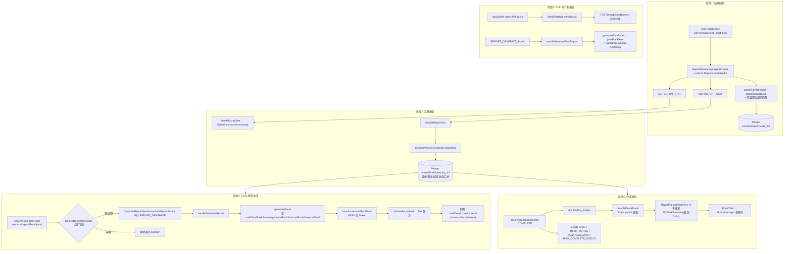

# 核心链路：报告生成（结果回收 → 汇总 → Excel/PDF → 上传 → 完成通知）

> 基于 web/pc处理服务 syy.release.z7.8.1.0 代码分析。串联执行结果回收到 PmTaskSummary 汇总、Excel/PDF 报告生成上传、FINISH_EMAIL 等完成通知的完整链路。
>
> - **涉及入口**：ApiServlet `action=task, op=TestResult.report`（结果回收）、`action=report, op=Excel.*`/`Pdf.parse`/`Report.*`（报告导出与查询）、V3 `ReportController`（/v3/report/*）、`TaskController.sendTestPlanResult`（/v3/task/tasks/send_plan/{task_id}）
> - **关键类**：`ReportServiceImpl`、`TaskSummaryServiceImpl`、`GenerateReportServiceImpl`、`NoticeServiceImpl`（handleReportStat/handleGenerateReport/handleFinishEmail）、`UploadApi`、`Html2PdfUtils`
> - **涉及存储**：MongoDB（`pmwebReportDetail_XX`/`pmwebTaskSummary_XX`/`pmwebTaskDetail_XX`）、MQ `mq_info_notice`、Redis（`realtestcenter` 库去重锁）、File 服务（上传）

## 链路总览



---

## 阶段 1：结果回收（reportResult）

**入口**：ApiServlet `action=task, op=TestResult.report` → `service/task/TestResult.report`（解析 `taskResult` + `resultFiles`）→ `ReportServiceImpl.reportResult(TaskResult, JSONObject)`（`business/impl/ReportServiceImpl.java`）。

关键处理：

1. 参数校验（taskid/subtaskid/subsubtaskid/resultCode 缺一不可）
2. 分布式锁 `LockType.ReportResultHandle`：resultCode=0（正常结果）锁 taskid 维度，异常结果锁 subsubtaskid 维度，`synchronized(LockUtil.getLock(lockKey))` 串行化
3. 任务不存在直接返回成功（幂等，防调度侧重试打爆）
4. 结果解析 + 错误原因匹配：

```java
// ReportServiceImpl.java
if (taskResult.getResultCode().equals(0)) {
    reportDetail = parseNormalResult(taskResult, fileJson);   // 正常结果解析
} else {
    reportDetail = parseIllegalResult(taskResult);            // 异常结果解析
}
```

errorMsg / OCR 文本按项目错误原因规则（`ErrorCauseTypeV3Api.getErrorCauseMathRule`）逐条匹配，命中则替换为标准错误日志名并回填 `errorCauseTypeId`（errorMsg 优先于 OCR）。

5. 关联 `PmScriptRunInfo`（取 scriptNo、rawDataUuid/scriptDataUuid）与 `PmScriptSummary`（uuid → subSubTaskId → orderNum 三级兜底），写 `pmwebReportDetail_XX`
6. 更新设备运行信息后发两条 MQ：`SCRIPT_STAT`（脚本汇总树统计）+ `REPORT_STAT`（报告统计）

**写入集合**：`pmwebReportDetail_XX`、`pmwebDeviceRunInfo_XX`、`mq_info_notice`。

## 阶段 2：汇总统计（REPORT_STAT → PmTaskSummary）

`NoticeServiceImpl.handleReportStat`（`NoticeServiceImpl.java`）→ `TaskSummaryServiceImpl.reportStat(taskid, isAll)`（`business/impl/TaskSummaryServiceImpl.java`）：按设备/脚本/结果分类聚合 ReportDetail，生成/更新 `PmTaskSummary`（`pmwebTaskSummary_XX` 分片）。`taskSummary(taskid)`为查询入口，被邮件、短信、Excel 生成、报告页（`service/report/Report.taskSummary`）共同消费。

REPORT_STAT 也在两处人工操作后重发：修改结果分类 `modifyResultCategory`（ReportServiceImpl.java）、修改错误原因 `modifyErrorCauseType`——保证汇总数据与人工订正一致。

## 阶段 3：Excel 报告生成（REPORT_GENERATE）

**触发**：用户请求 ApiServlet `action=report, op=Excel.*` → `service/report/Excel.java`：

- 读 `taskDetail.content.excel` 状态；不存在 / 缺 url 且非生成中 / 生成时间早于任务 finishTime → 走生成流程
- 生成前先 `checkSummaryNotice`：存在未完成且未达最大重试次数的 REPORT_STAT 通知时，抛"任务正在统计中"
- `addExcel`防重：已有 pending 的 REPORT_GENERATE 通知则直接返回"等待"

**生成**：`GenerateReportServiceImpl.addReportNotice`（`business/impl/GenerateReportServiceImpl.java`）发 `REPORT_GENERATE` 通知并把 `content.excel.status=0`（生成中）→ `NoticeServiceImpl.handleGenerateReport`→ `generateExcel(taskid)`：

1. 依次查询 `PmTaskDetail`、`PmTaskSummary`、`PmDeviceRunInfo` 列表、`PmScriptRunInfo`（retestMark=false）、`PmReportDetail`（retestMark=false & history=false，按错误码排序）
2. `junitTestExcel`→ `transformerJunitTestExcel`：POI HSSF 生成三 Sheet（基本信息/设备维度/链接页）
3. `UploadApi.upload(filePath, dataMap, null)`上传 File 服务，拿 downloadUrl
4. 回写 `taskDetail.content.excel = {status:1, url, updatetime}`

```java
// GenerateReportServiceImpl.java
String downloadUrl = uploadapi.upload(filePath, dataMap, null);
if (StringUtils.isBlank(downloadUrl)) {
    Logit.debugLog("uploadapi.upload(" + filePath + ", xls, null)", "ERROR");
}
```

**测试计划 Excel**：`addPlanReportNotice`发 `REPORT_GENERATE_PLAN` → `handleGeneratePlanReport`（NoticeServiceImpl.java）→ `generatePlanExcel`→ `junitPlanExcel`：按执行记录聚合多任务报告，上传后写 `ActionLog`（开始/成功/失败三条操作日志，带 downloadUrl），供计划导出页轮询。

## 阶段 4：PDF 生成

`service/report/Pdf.parse`（`service/report/Pdf.java`）：以报告页 URL 的 MD5 为 key 查 `Html2PdfUtils.workMap`；未命中则封装 `ResponseBean(code=0)` 入 `workQueue`，由 `StartRunner` 启动的 **PDFThread** 后台消费完成 Html→Pdf 转换。前端轮询同一接口，code：-1 失败 / 0 等待 / 1 成功（终态返回后从 Map 移除）。

## 阶段 5：完成通知（FINISH_EMAIL 等）

状态机 COMPLETE 阶段（`TaskProcessServiceImpl`）批量发送完成通知，邮件链路：

`NoticeServiceImpl.handleFinishEmail`（`NoticeServiceImpl.java`）：

1. **防重**：`IRedisDAO.setNX(realtestcenter, taskid + "_handleNewNotice", 60s)`，抢不到锁直接返回成功
2. 构造 `EmailTask`（HTML 类型，模板 `Config.EMAIL_TASK_FINISH_TEMPLETID`，tradeNo=taskid，retrySend 时加 MD5 后缀）
3. 收件人取自 `taskDetail.newChannelCfg` 中 `id=-1` 的自定义邮箱列表；为空则静默成功
4. 自定义邮件主题：`EmailTempletApi.getEmailTemplet(projectid)` 命中则以 `customSubject_` 前缀替换
5. 报告链接：`ReportApi.getShareKey` 生成分享 key → `Config.OEM_DOMAIN + /web-ts/ 或 /pc-ts/?skey=xxx`
6. 统计数据：`PmTaskSummary` 查不到时 **每 5s 重查、最多 6 次**（汇总滞后容忍），仍无则置非法
7. 关联测试计划名（`TestPlanV3Api.recordRelation`）后提交 NoticeManager 发送

同阶段还有 `SEND_MSG`（钉钉/飞书，`handleSendMsg` ，同样依赖 PmTaskSummary + 5s×6 重查）、`FINISH_NOTICE`（机器人）、`TASK_CALLBACK`（HTTP 回调）、`TASK_COMPLETE_NOTICE`（测试计划）、`PUSH_PORTAL`（门户）。

## 异常与边界

| 场景 | 处理 |
|------|------|
| reportResult 任务不存在 | 返回成功（幂等，消化调度侧重复上报） |
| 结果解析失败 | 返回 false，由调用方/MQ 层重试 |
| REPORT_GENERATE 反复失败 | execNum>20 时把 `content.excel.status=-1` 落库并结束（放弃生成，前端可见失败态） |
| 汇总未完成就导出 Excel | `checkSummaryNotice` 拦截："任务正在统计中" |
| 重复导出请求 | pending 通知存在则返回等待；`content.excel.updatetime >= finishTime` 直接复用旧 URL |
| FINISH_EMAIL 重复发送 | Redis setNX 60s 去重；retrySend 用独立 tradeNo 避免通道侧去重 |
| PmTaskSummary 滞后 | 邮件/短信 handler 内 5s×6 次自旋重查，仍无则置通知非法 |
| MQ 通知失败通用策略 | execNum+1；每次失败都把发布时间推迟 10s（`if (execNum >= 3) ;` 末尾分号导致无条件生效）；>10 次且超 1 小时置非法（NoticeServiceImpl.handle） |
| PDF 转换 | 异步队列 + 轮询，终态后清理 workMap 防内存泄漏 |

## 关键代码位置

| 文件 | 作用 |
|------|------|
| `service/task/TestResult.java` | 结果上报入口 |
| `business/impl/ReportServiceImpl.java` | reportResult / REPORT_STAT / 结果分类订正 / 错误原因订正 |
| `business/impl/TaskSummaryServiceImpl.java` | reportStat 汇总 / taskSummary 查询 |
| `service/report/Excel.java` | Excel 导出状态机 / 统计中拦截 / 防重 |
| `business/impl/GenerateReportServiceImpl.java` | 通知生成 / generateExcel / junitTestExcel / junitPlanExcel / HSSF 渲染 |
| `service/report/Pdf.java` | PDF 异步转换入口 |
| `business/impl/NoticeServiceImpl.java` | handleGenerateReport / handleGeneratePlanReport / handleReportStat / handleFinishEmail |
| `api/file/upload/UploadApi.java` | 文件上传 File 服务 |
| `mvc/controller/ReportController.java` | /v3/report/* 报告查询与错误原因修改 |

## 相关文档

- [专题索引](专题-索引.md)
- [横切-任务状态机](横切-任务状态机.md)
- [横切-通知系统](横切-通知系统.md)
- [核心链路-Web任务执行](核心链路-Web任务执行.md)
- [ReportController](../07-开放接口文档/报告/ReportController.md)
- [ProblemAnalysisReportController](../07-开放接口文档/报告/ProblemAnalysisReportController.md)
- [service-report-Report](../07-开放接口文档/其他ApiServlet/service-report-Report.md)
- [service-report-Excel](../07-开放接口文档/其他ApiServlet/service-report-Excel.md)
- [service-report-Pdf](../07-开放接口文档/其他ApiServlet/service-report-Pdf.md)
- [service-task-TestResult](../07-开放接口文档/其他ApiServlet/service-task-TestResult.md)
- [PmReportDetail](../../数据库管理/web-pc处理服务-mongo/PmReportDetail.md)
- [PmTaskSummary](../../数据库管理/web-pc处理服务-mongo/PmTaskSummary.md)
