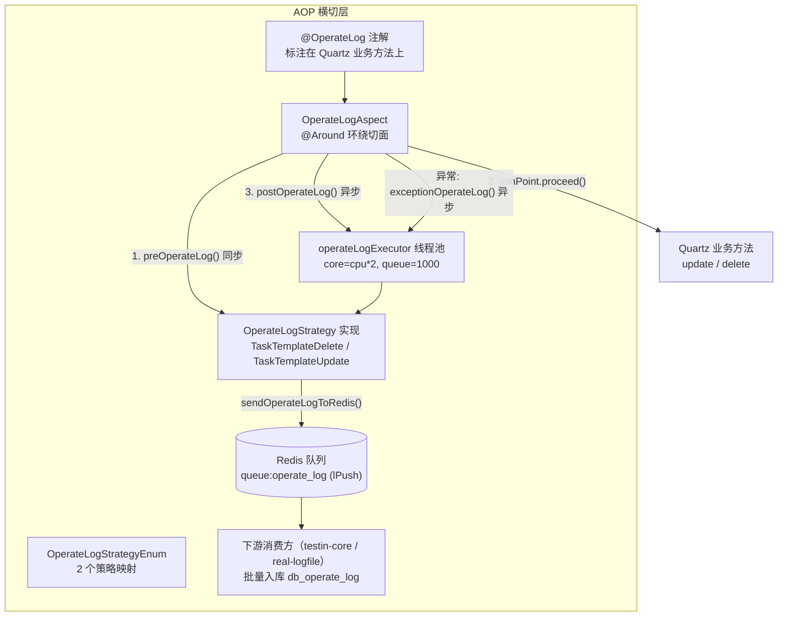

# 横切-AOP与横切关注点

> web/pc处理服务 的 AOP 横切层非常精简：全模块仅一个切面 `OperateLogAspect`，拦截 `@OperateLog` 注解，把任务模板的删除/编辑操作日志异步写入 Redis 队列 `queue:operate_log`，由下游服务消费入库。
>
> **关键类**：`cn.testin.realweb.aop.OperateLog`（注解）、`cn.testin.realweb.aop.OperateLogAspect`（切面）、`cn.testin.realweb.business.strategy.log.OperateLogStrategy`（策略基类）、`cn.testin.realweb.config.AsyncConfig`（线程池）
>
> **涉及配置/开关**：`RealWebApplication` 上 `@EnableAspectJAutoProxy`；Redis key `queue:operate_log`

## 概览



## 一、注解定义

**文件**：`src/main/java/cn/testin/realweb/aop/OperateLog.java`

```java
@Target({ElementType.METHOD})
@Retention(RetentionPolicy.RUNTIME)
public @interface OperateLog {
    OperateLogEnum operateLog();
}
```

唯一必填属性 `operateLog` 指定操作日志枚举。web/pc处理服务 的 `OperateLogEnum`（`cn.testin.realweb.pojo.enums.log`）只有 2 个值：

| 枚举值 | operateObject | operateType | 说明 |
|--------|--------------|-------------|------|
| `TASK_TEMPLATE_DELETE` | TASK_MANAGE | DELETE | 任务模板删除 |
| `TASK_TEMPLATE_UPDATE` | TASK_MANAGE | UPDATE | 任务模板编辑 |

> 对比 平台基础功能服务 有 30+ 枚举，web/pc处理服务 只覆盖了任务模板这两个高频敏感操作。

## 二、切面实现（OperateLogAspect）

**文件**：`src/main/java/cn/testin/realweb/aop/OperateLogAspect.java`

```java
@Around(value = "logPointcut() && @annotation(operateLog)")
public Object onLogPointcutAround(ProceedingJoinPoint joinPoint, OperateLog operateLog) throws Throwable {
    Object[] args = joinPoint.getArgs();
    Date operateTime = new Date();
    Long threadId = Thread.currentThread().getId();
    OperateLogStrategy service = OperateLogStrategyEnum.getStrategyByType(operateLog.operateLog()).getService();
    try {
        if (service != null) {
            service.preOperateLog(args, threadId);            // 前置同步
        }
        Object result = joinPoint.proceed(args);              // 执行业务
        if (service != null) {
            executeTaskExecutor.execute(() -> {               // 后置异步
                service.postOperateLog(args, threadId, operateTime);
            });
        }
        return result;
    } catch (Throwable e) {
        // 异常日志同样异步记录，随后 throw e 原样抛出（不吞异常）
        executeTaskExecutor.execute(() -> service.exceptionOperateLog(args, threadId, operateTime, e));
        throw e;
    }
}
```

**关键设计点**：

| 设计点 | 说明 |
|--------|------|
| 切点 | `@annotation(cn.testin.realweb.aop.OperateLog)`，仅方法级注解生效 |
| 前置同步 | `preOperateLog` 必须同步：业务执行过快时异步取数会不正确（代码注释原文） |
| 后置/异常异步 | 走 `operateLogExecutor` 线程池，防止日志写 Redis 阻塞主流程；异步任务内仅捕获 `GeneralException` 记日志 |
| 异常不吞 | 异常日志记录后 `throw e` 重新抛出，不改变业务异常传播 |
| 策略查找 | `OperateLogStrategyEnum.getStrategyByType(枚举).getService()`，启动时由 `InitOperateLogStrategy` 的 `@PostConstruct` 完成 Spring Bean 绑定 |

**线程池**（`AsyncConfig.java`）：`operateLogExecutor`，core = `cpu*2`，max = `cpu*2+1`，队列容量 1000，线程名前缀 `operate_log_`。

## 三、策略层与日志写入路径

### 策略基类（OperateLogStrategy）

**文件**：`src/main/java/cn/testin/realweb/business/strategy/log/OperateLogStrategy.java`

```java
public final static String OPERATE_LOG_QUEUE = "queue:operate_log";

protected void sendOperateLogToRedis(Integer projectId, Integer moduleType, Integer status,
        String content, String detailContent, Integer userId,
        String userName, Date operateTime, OperateLogEnum operateLogEnum) {
    OperateLogDTO entity = new OperateLogDTO();
    // ... 组装 projectId/moduleType/operateObject/operateType/status/content/操作人/时间
    redisService.lPush(OPERATE_LOG_QUEUE, JsonUtil.toJsonString(entity));
}
```

**写入链路**：

```
业务方法返回
  → postOperateLog()（operateLogExecutor 异步）
    → 组装 OperateLogDTO（内容文案由各策略 String.format 模板生成）
      → redisService.lPush("queue:operate_log", json)
        → 下游服务（testin-core / real-logfile 的 OperateLog 消费线程）brPop 批量消费
          → 入库 db_common.db_operate_log
```

> web/pc处理服务 只**生产**日志，模块内没有 `queue:operate_log` 的消费者；消费与入库在下游服务完成。这是与 平台基础功能服务 的最大差异（平台基础功能服务 自产自销并带 `requestId` 幂等）。

### 策略注册

- `OperateLogStrategyEnum`：`TASK_TEMPLATE_DELETE_STRATEGY`、`TASK_TEMPLATE_UPDATE_STRATEGY` 两个枚举，每个持有一个 `OperateLogStrategy` 引用，`initMap()` 建立 `OperateLogEnum → 策略枚举` 映射
- `InitOperateLogStrategy`（`@Component`）：`@PostConstruct` 注入 `TaskTemplateDeleteStrategyService` / `TaskTemplateUpdateStrategyService` 两个 Spring Bean 并完成绑定
- 基类 `PRE_OPERATE_OBJECT`（`Map<threadId, Object>` 的 ConcurrentHashMap）在 web/pc处理服务 中**声明但未使用**：两个策略均未重写 `preOperateLog`/`cleanOperateLog`，日志内容靠方法参数 + 查库（`QuartzJobMapper`）现场组装
- `getUserNameByUserId(userId)`：通过 `ServiceRemoteV1Api.remoteApi(USER_ACTION, GET_USER_OP, REAL_LOG_FILE, ...)` 远程调 RealLogfile 查用户名（当请求未带 userName 时兜底）

### 策略实现示例（TaskTemplateDeleteStrategyService）

- 支持单个 `Integer jobId` 与批量 `JSONArray jobIds` 两种参数形态，查 `QuartzJobMapper` 拿模板信息
- 按 `BusinessType` 区分 moduleType（WEB / PC）
- 文案模板：`"删除任务模板\n任务模板：%s"` + 明细（操作结果、删除类型、逐任务 ID/名称），异常时追加错误信息
- 最终调 `sendOperateLogToRedis(...)` 入队

## 四、被标注的方法（共 6 处，4 个文件）

| 位置 | 方法 | 枚举 |
|------|------|------|
| `business.interfaces.IQuartz` | `default delete(JSONArray jobIds, ...)` 批量删除 | TASK_TEMPLATE_DELETE |
| `business.impl.WebQuartz` | `update(JSONObject)` | TASK_TEMPLATE_UPDATE |
| `business.impl.WebQuartz` | `delete(Integer jobId, ...)` | TASK_TEMPLATE_DELETE |
| `business.impl.McPcQuartz` | `update(JSONObject)` | TASK_TEMPLATE_UPDATE |
| `business.impl.McPcQuartz` | `delete(Integer jobId, ...)` | TASK_TEMPLATE_DELETE |
| `business.impl.AppQuartz` | `update(JSONObject)` | TASK_TEMPLATE_UPDATE |

**调用链**：这些被拦截的方法不是 Controller，而是 Quartz 业务实现类。入口为 ApiServlet 路由类 `cn.testin.realweb.service.quartz.Quartz`（`action=quartz & op=Quartz.update/delete`），Quartz 路由类按业务类型分派到 `WebQuartz`（Web 任务）/ `McPcQuartz`（PC 任务）/ `AppQuartz`（App 任务），方法被 Spring 代理后触发切面。

## 五、其他横切设施

web/pc处理服务 模块内除 `OperateLogAspect` 外**没有其他 `@Aspect`**，横切设施只有：

| 设施 | 位置 | 说明 |
|------|------|------|
| `CharacterEncodingFilter` | `RealWebApplication.java` | 强制 UTF-8，`/*`，order=Integer.MAX_VALUE，两个入口共享 |
| `ActionWfUtil.checkApiData` | real-common | ApiServlet 入口的参数规则检测（长度/正反向正则），属 V1 链路横切 |
| `@EnableAspectJAutoProxy` | `RealWebApplication.java` | 开启 Spring AOP 代理 |
| `@EnableAsync` | `AsyncConfig.java` | 开启异步支持 |

无自定义 `HandlerInterceptor`、无 `@ControllerAdvice` 全局异常处理、未使用 real-common 的 `@ServiceInterceptor` 机制。

## 相关文件索引

| 文件 | 说明 |
|------|------|
| `src/main/java/cn/testin/realweb/aop/OperateLog.java` | `@OperateLog` 注解定义 |
| `src/main/java/cn/testin/realweb/aop/OperateLogAspect.java` | 环绕切面（pre 同步 / post、exception 异步） |
| `src/main/java/cn/testin/realweb/pojo/enums/log/OperateLogEnum.java` | 2 个操作日志枚举 |
| `src/main/java/cn/testin/realweb/business/strategy/log/OperateLogStrategy.java` | 策略基类 + `queue:operate_log` 写入 |
| `src/main/java/cn/testin/realweb/business/strategy/log/OperateLogStrategyEnum.java` | 枚举→策略映射 |
| `src/main/java/cn/testin/realweb/business/strategy/log/InitOperateLogStrategy.java` | 启动时策略 Bean 绑定 |
| `src/main/java/cn/testin/realweb/business/strategy/log/TaskTemplateDeleteStrategyService.java` | 删除策略实现 |
| `src/main/java/cn/testin/realweb/business/strategy/log/TaskTemplateUpdateStrategyService.java` | 编辑策略实现 |
| `src/main/java/cn/testin/realweb/config/AsyncConfig.java` | `operateLogExecutor` 线程池 |

## 相关文档

- [专题索引](专题-索引.md)
- [横切-双入口路由机制](横切-双入口路由机制.md) — @OperateLog 方法的上游入口（ApiServlet → Quartz 路由类）
- [横切-模块间通信](横切-模块间通信.md) — Redis 队列与 ServiceRemoteV1Api 远程调用
- [平台基础功能服务 横切-AOP与横切关注点](../../平台基础功能服务/04-复杂功能细节/横切-AOP与横切关注点.md) — 对照篇（30+ 策略、自消费入库、requestId 幂等）
