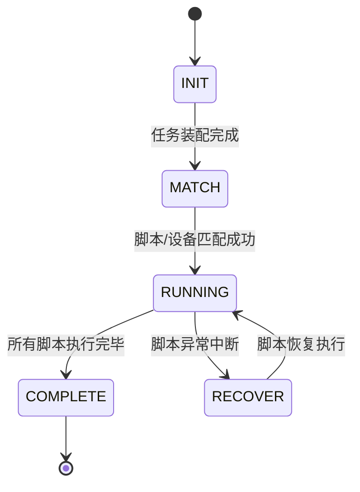

# 横切-任务状态机

## 概述

web/pc处理服务 的任务执行状态机由 `TaskProcessServiceImpl.report(String action, JSONObject content)` 驱动，遵循五阶段有限状态机模型。

## 状态流转

## 各阶段处理

### 1. INIT — 初始化

**触发**：任务首次到达

**操作**：
- 批量插入 `PmDeviceRunInfo`（100条/批）
- 批量插入 `PmScriptRunInfo`（100条/批）
- 按 UUID 关联 `PmScriptSummary` 的 subSubTaskId
- 更新 `PmTaskDetail.execStatus = "ing"`
- 发送 `TASK_INIT_NOTICE` → 测试计划通知
- 发送 `PUSH_PORTAL` → 门户进度推送

**相关 MQ 通知**：`TASK_INIT_NOTICE`, `PUSH_PORTAL`

### 2. MATCH — 匹配

**触发**：设备/脚本匹配完成

**操作**：
- 更新设备状态为 RUNNING（`PmDeviceRunInfo`）
- 设置 `startExecTime`
- CICC 精准测试覆盖率清除（`ciccDyeTaskClearSign`）

### 3. RUNNING — 运行中

**触发**：脚本开始执行

**操作**：
- 标记脚本运行中状态

### 4. RECOVER — 恢复

**触发**：脚本异常中断

**操作**：
- 重置设备状态为等待（waiting）
- 等待调度器重新匹配

### 5. COMPLETE — 完成

**触发**：所有脚本/设备执行完毕

**操作**：
- 调用 `analysisCategory` 汇总设备结果
- 调用 `analysisTaskResult` 计算任务总结果（PASS/FAIL）
- 发送跨端通知 → `NoticeReportApi.reportStatus` → RealCross
- 发送短信通知 → `SEND_MSG`
- 发送完成邮件 → `FINISH_EMAIL`
- 发送机器人通知 → `FINISH_NOTICE`
- 发送 HTTP 回调 → `TASK_CALLBACK`
- 发送计划完成通知 → `TASK_COMPLETE_NOTICE`
- 发送门户通知 → Portal
- CICC 覆盖率生成 → `PreciseTestApi.generateCoverData` / `saveCoverData`

**相关 MQ 通知**：`SEND_MSG`, `FINISH_EMAIL`, `FINISH_NOTICE`, `TASK_CALLBACK`, `TASK_COMPLETE_NOTICE`

## 状态保护

`TaskDetailServiceImpl.modifyTaskDetail` 和 `DeviceRunInfoServiceImpl.modifyDeviceRunInfo` 使用分布式锁（`LockUtil` / `LockType`）+ `synchronized(lock)` 保护：
- 禁止将已完成任务的 `execStatus` 覆盖为中间状态
- 禁止用更早的 `startExecTime` 覆盖已有值

## 相关代码

| 类 | 关键方法 | 说明 |
|-----|---------|------|
| `TaskProcessServiceImpl` | `report` / `init` / `complete` | 状态机实现 |
| `TaskDetailServiceImpl` | `modifyTaskDetail` | 任务详情修改（带锁保护） |
| `DeviceRunInfoServiceImpl` | `modifyDeviceRunInfo` | 设备运行信息修改（带锁保护） |

## 相关文档

- [专题索引](专题-索引.md)
- [核心链路-Web任务执行](核心链路-Web任务执行.md)
